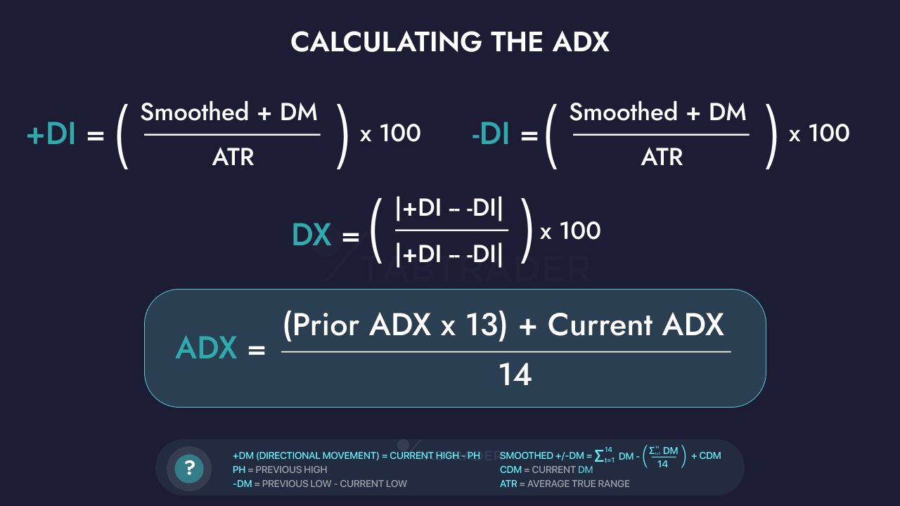

## Table of Contents

## What is the Average Directional Index (ADX)?

The Average Directional Index (ADX) is a technical indicator used in trading to measure the strength of a trend, whether it's up or down. It doesn't tell you the direction of the trend but shows how strong it is. The ADX is shown as a line on a chart, and its value ranges from 0 to 100. A higher ADX value means the trend is stronger, while a lower value means the trend is weaker. Traders often use ADX values above 25 to indicate a strong trend and values below 20 to show a weak trend or no trend at all.

To calculate the ADX, you need to use two other indicators called the Positive Directional Indicator (+DI) and the Negative Directional Indicator (-DI). These help find the difference between two consecutive lows and highs. The ADX is then calculated from these values over a period of time, usually 14 days. Traders watch the ADX to decide when to enter or exit trades. If the ADX is rising, it might be a good time to follow the trend. If it's falling, it might be better to wait for a new trend to start.

## Who developed the ADX and when was it introduced?

The Average Directional Index (ADX) was developed by J. Welles Wilder Jr. He introduced it in his book "New Concepts in Technical Trading Systems" which was published in 1978. Wilder was a mechanical engineer and a real estate developer, but he became well-known in the trading world for creating several important technical indicators.

The ADX is one of the indicators Wilder created to help traders understand market trends better. Before the ADX, traders had fewer tools to measure the strength of a trend. Wilder's work gave traders a new way to see if a trend was strong or weak, which helped them make better trading decisions. Since its introduction, the ADX has become a popular tool among traders around the world.

## What is the purpose of using the ADX in technical analysis?

The main purpose of using the Average Directional Index (ADX) in technical analysis is to measure how strong a trend is in the market. It doesn't tell you if the trend is going up or down, but it shows how powerful the trend is. This helps traders decide if they should follow the trend or not. If the ADX shows a strong trend, traders might feel more confident about making trades in the direction of that trend. On the other hand, if the ADX shows a weak trend, traders might be more cautious or look for other trading opportunities.

Traders use the ADX by looking at its value on a chart. The ADX value goes from 0 to 100. When the ADX is above 25, it usually means the trend is strong. If it's below 20, the trend is weak, and the market might be moving sideways without a clear direction. By watching the ADX, traders can time their trades better. For example, if the ADX starts to rise, it might be a good time to enter a trade. If it starts to fall, it might be a signal to [exit](/wiki/exit-strategy) a trade or wait for a new trend to start.

## How is the ADX calculated?

The ADX is calculated using a few steps that involve other indicators. First, you need to find the Positive Directional Indicator (+DI) and the Negative Directional Indicator (-DI). The +DI measures how much the price is going up, while the -DI measures how much the price is going down. You do this by looking at the difference between two consecutive highs and lows over a set period, usually 14 days. Then, you smooth these values over time to get a smoother line.

Next, you calculate the Directional Movement Index (DX) using the +DI and -DI. The DX shows the difference between the +DI and -DI as a percentage of their sum. After getting the DX, you smooth it over time to get the ADX. The ADX is usually calculated over 14 periods, but traders can change this number to fit their needs. The final ADX value is a number between 0 and 100 that shows how strong the trend is.

## What are the components of the ADX formula?

The ADX formula has three main parts: the Positive Directional Indicator (+DI), the Negative Directional Indicator (-DI), and the Directional Movement Index (DX). To find the +DI and -DI, you look at the price changes over a certain time, usually 14 days. The +DI measures how much the price is going up by finding the difference between the highest price today and the highest price yesterday. The -DI measures how much the price is going down by finding the difference between the lowest price today and the lowest price yesterday. You then smooth these values over time to make the lines smoother and easier to read.

After getting the +DI and -DI, you use them to calculate the DX. The DX shows how different the +DI and -DI are from each other as a percentage of their total. You take the absolute difference between the +DI and -DI and divide it by the sum of the +DI and -DI, then multiply by 100. Once you have the DX, you smooth it over time to get the final ADX value. The ADX ranges from 0 to 100 and tells you how strong the trend is, but not which way it's going.

## What do the values of the ADX indicate about market trends?

The ADX values help traders understand how strong a trend is in the market. The ADX goes from 0 to 100. When the ADX is above 25, it means the trend is strong. This could be a good time for traders to follow the trend because it's likely to keep going in the same direction. If the ADX is between 20 and 25, the trend is getting stronger, and traders might want to watch it closely to see if it gets stronger or weaker.

When the ADX is below 20, it means the trend is weak. The market might be moving sideways, and there's no clear direction. Traders might want to wait for a new trend to start before making any big moves. By watching how the ADX changes over time, traders can decide when to enter or exit trades. If the ADX is rising, it might be a good time to follow the trend. If it's falling, it might be better to wait for a new trend to start.

## How can the ADX be used to identify strong and weak trends?

The ADX helps traders see if a trend is strong or weak. It gives a number from 0 to 100. When the ADX is above 25, it means the trend is strong. This is a good time for traders to follow the trend because it's likely to keep going the same way. If the ADX is between 20 and 25, the trend is getting stronger. Traders should watch it closely to see if it keeps getting stronger or if it starts to get weaker.

When the ADX is below 20, it means the trend is weak. The market might be moving sideways, and there's no clear direction. Traders might want to wait for a new trend to start before making any big moves. By watching how the ADX changes over time, traders can decide when to enter or exit trades. If the ADX is going up, it might be a good time to follow the trend. If it's going down, it might be better to wait for a new trend to start.

## What are the common time periods used for calculating the ADX?

The most common time period used for calculating the ADX is 14 days. This means that traders look at the price changes over the last 14 days to figure out how strong the trend is. Using 14 days helps smooth out the numbers and gives a good idea of the trend's strength over a reasonable amount of time. Some traders might use a shorter time period, like 7 days, if they want to see quicker changes in the trend. Others might use a longer time period, like 20 days, if they want to see a more stable trend over time.

Traders can change the time period to fit their trading style. If someone trades a lot and wants to see fast changes, they might use a shorter time period. If someone trades less often and wants to see a more steady trend, they might use a longer time period. The key is to pick a time period that matches how you trade and what you're looking for in the market.

## How does the ADX interact with other technical indicators?

The ADX works well with other technical indicators to help traders make better decisions. One common way to use the ADX is with the +DI and -DI lines. These lines show if the trend is going up or down. When the ADX is above 25 and the +DI is above the -DI, it means there's a strong uptrend. If the ADX is above 25 and the -DI is above the +DI, it means there's a strong downtrend. By looking at these lines together, traders can see both the strength and direction of the trend.

Another way to use the ADX is with other trend-following indicators like moving averages. For example, if the ADX is rising and a short-term moving average crosses above a long-term moving average, it might be a good time to enter a trade because the trend is getting stronger. On the other hand, if the ADX is falling and the moving averages are flat or moving in different directions, it might be better to wait for a new trend to start. By combining the ADX with other indicators, traders can get a fuller picture of what's happening in the market and make smarter trading choices.

## What are the limitations and potential pitfalls of using the ADX?

The ADX has some limitations that traders should know about. It doesn't tell you which way the trend is going, just how strong it is. This means you have to use other indicators like the +DI and -DI to see if the trend is up or down. Also, the ADX might not work well in markets that don't have clear trends. If the market is moving sideways, the ADX might stay low and not give you much useful information. This can make it hard to decide when to enter or exit trades.

Another potential pitfall is that the ADX can give false signals. Sometimes, the ADX might show a strong trend, but the trend doesn't last long. This can trick traders into making trades that don't work out. Also, the ADX can be slow to react to quick changes in the market. If the market suddenly changes direction, the ADX might not show this right away, which can lead to missed opportunities or losses. Traders need to be careful and use the ADX along with other tools to get a better picture of what's happening in the market.

## Can the ADX be used effectively in different market conditions, such as ranging or trending markets?

The ADX works best in markets that have clear trends. When the market is going up or down steadily, the ADX can help traders see how strong the trend is. If the ADX is above 25, it means the trend is strong, and traders might want to follow it. The ADX also helps traders know when a trend is getting stronger or weaker. This can be useful for deciding when to enter or exit trades. By using the ADX with other indicators like the +DI and -DI, traders can see both the strength and direction of the trend.

However, the ADX has limitations in markets that are moving sideways or ranging. In these conditions, the ADX might stay below 20, showing a weak trend or no trend at all. This can make it hard for traders to make good trading decisions because the ADX doesn't give much useful information. Traders need to be careful and use other tools along with the ADX to understand what's happening in the market. In ranging markets, other indicators like Bollinger Bands or the Relative Strength Index (RSI) might be more helpful for finding good trading opportunities.

## How can traders incorporate the ADX into a comprehensive trading strategy?

Traders can use the ADX as part of a bigger trading plan by looking at it along with other tools. The ADX tells you how strong a trend is, but it doesn't say if the trend is going up or down. So, traders should use the ADX with the +DI and -DI lines. When the ADX is above 25 and the +DI is higher than the -DI, it means there's a strong uptrend. If the ADX is above 25 and the -DI is higher than the +DI, it means there's a strong downtrend. By watching these lines together, traders can see both the strength and direction of the trend. This helps them decide when to buy or sell.

Another way to use the ADX in a trading strategy is with other trend-following indicators like moving averages. If the ADX is going up and a short-term moving average crosses above a long-term moving average, it might be a good time to enter a trade because the trend is getting stronger. But if the ADX is going down and the moving averages are flat or moving in different directions, it might be better to wait for a new trend to start. Traders should also be careful because the ADX can give false signals sometimes. It might show a strong trend that doesn't last long, or it might be slow to react to quick changes in the market. So, it's important to use the ADX with other tools to get a full picture of what's happening in the market.

## What is the Average Directional Index (ADX) and how is it understood?

Developed by J. Welles Wilder, the Average Directional Index (ADX) serves as a critical tool in technical analysis for quantifying the strength of a trend. Typically, the ADX ranges from 0 to 100; values above 25 signify a robust trend, whereas values below 20 indicate a weak trend. It does not provide information about the trend direction—only its intensity.

The ADX is often paired with two other indicators: the Positive Directional Indicator (+DI) and the Negative Directional Indicator (-DI). These three components are part of the Directional Movement System created by Wilder. The +DI value measures upward [momentum](/wiki/momentum), while the -DI assesses downward momentum.

### Calculation of ADX

The calculation of ADX involves several steps:

1. **Calculate the Directional Movement (DM):**
   - If the current high minus the previous high is greater than the previous low minus the current low, then the DM is calculated as the current high minus the previous high. Otherwise, the DM is zero.
   - Similarly, if the previous low minus the current low is greater than the current high minus the previous high, the DM is calculated as the previous low minus the current low. Otherwise, the DM is zero.

2. **Calculate the True Range (TR):**
   - TR is the greatest of the following:
     - Current High minus Current Low
     - Absolute value of Current High minus Previous Close
     - Absolute value of Current Low minus Previous Close

3. **Smooth the values for a fixed period:**
   - A common period is 14 days. Calculate the smoothed values of +DM, -DM, and TR for this period.

4. **Calculate DI values:**
   - +DI = 100 * (Smoothed +DM / Smoothed TR)
   - -DI = 100 * (Smoothed -DM / Smoothed TR)

5. **Calculate the ADX:**
   - First, calculate the Directional Index (DX) using the formula:
$$
     DX = 100 \times \frac{|+DI - -DI|}{|+DI + -DI|}

$$
   - The ADX is the smoothed moving average of the DX, typically over 14 periods.

### Interpretation and Trading Decisions

The ADX assists traders in recognizing the market conditions that can maximize gains and minimize risks. Although ADX does not indicate trend direction, combining it with +DI and -DI can provide comprehensive insights. For instance, when +DI crosses above -DI while ADX is above 25, it suggests a strong bullish trend. Conversely, if -DI crosses above +DI under similar ADX conditions, a strong bearish trend is likely.

Understanding the role of ADX in identifying trend strength enables traders to strategically position themselves in the market by adhering to structured rules, thereby optimizing their trading results and managing risks effectively.

## References & Further Reading

[1]: Wilder, J. W., & Wilder, J. W. (1978). ["New Concepts in Technical Trading Systems."](https://archive.org/details/newconceptsintec00wild) Trend Research.

[2]: Kaufman, P. J. (2013). ["Trading Systems and Methods"](https://onlinelibrary.wiley.com/doi/book/10.1002/9781119202561). Wiley.

[3]: Schwager, J. D. (1993). ["Technical Analysis"](https://archive.org/details/technicalanalysi00schw) in Futures: Strategies and Techniques. Wiley.

[4]: Pring, M. J. (2002). ["Technical Analysis Explained"](https://www.amazon.com/Technical-Analysis-Explained-Fifth-Successful/dp/0071825177). McGraw-Hill.

[5]: Murphy, J. J. (1999). ["Technical Analysis of the Financial Markets"](https://archive.org/details/technicalanalysi0000murp). New York Institute of Finance.