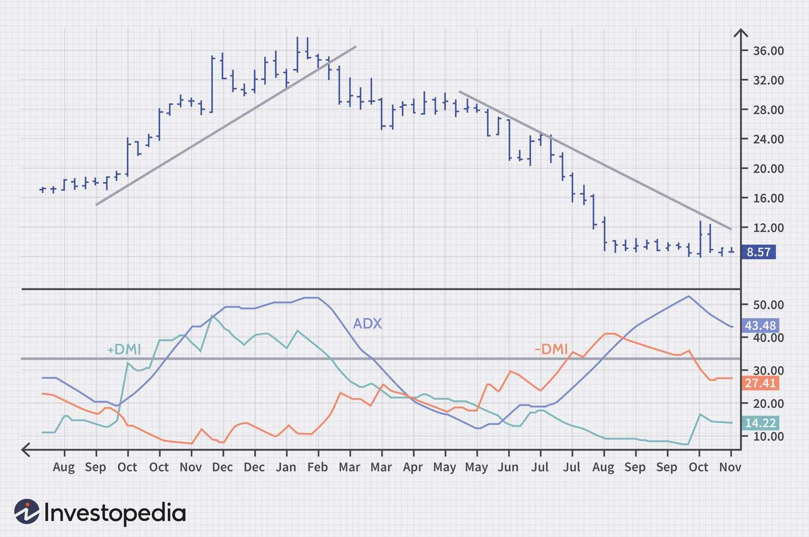

Understanding the dynamics of financial markets is crucial for traders, and technical analysis plays a pivotal role in this. By focusing on historical price and volume data, technical analysis aims to forecast future market movements, thus informing better trading decisions. A key component of technical analysis is trend indicators, which help identify the direction and strength of trends within the market. Among these, the Average Directional Index (ADX) stands out as a popular choice for traders seeking to understand market behavior more deeply.

The ADX, developed by J. Welles Wilder, serves as an important tool in measuring the strength of a market trend. Although it does not specify the direction in which the market is moving, its capacity to quantify trend strength makes it highly valuable. ADX values above 25 typically suggest a strong trend, while values below 20 indicate a weak trend. As such, traders utilize the ADX not just to confirm existing trends, but also to avoid being caught in false signals generated by market noise.



The advent of algorithmic trading has transformed the landscape of financial markets, with algorithms executing trades at speeds and frequencies impossible for human traders alone. Integrating ADX into trading algorithms presents an opportunity to enhance decision-making processes. Such integration allows algorithms to automatically adjust trading strategies based on the strength of market trends detected by the ADX, thus enabling more efficient and effective trading operations.

This article explores the intricacies of how the ADX functions, its application in technical analysis, and its integration into algorithmic trading strategies. By understanding these elements, readers will gain insights into leveraging the ADX for a superior trading experience, whether in manual trading or automated systems. The aim is to equip traders with the knowledge necessary to incorporate this powerful indicator into their trading strategies, thereby potentially improving their market outcomes through informed decision-making.

## Table of Contents

## Understanding Technical Analysis

Technical analysis is a methodology used to evaluate and forecast the future price movements of securities through the examination of statistical trends gathered from historical trading activity. This analysis is predominantly concerned with price movements and [volume](/wiki/volume-trading-strategy) data, focusing on the patterns and behaviors that may indicate future market directions.

One of the primary components of technical analysis is the use of trend indicators. These indicators help traders identify the general direction in which the market is moving. Understanding these trends is crucial as they form the basis for making informed trading decisions. For instance, when markets are trending upwards, traders might decide to buy securities to capitalize on future gains, whereas a downward trend might signal a time to sell.

Trend indicators, like the Moving Average (MA), Relative Strength Index (RSI), and the Average Directional Index (ADX), provide quantitative data that can reveal whether a security is experiencing a sustained upward or downward trajectory. Moving averages, for example, smooth out fluctuations in price data to reveal longer-term trends, providing insights into potential entry and [exit](/wiki/exit-strategy) points. In contrast, the RSI evaluates overbought or oversold conditions within a market, offering signals on the [momentum](/wiki/momentum) of price movements.

An essential part of technical analysis involves recognizing patterns within the data. Chart patterns, such as head and shoulders, triangles, and flags, can be indicative of potential market reversals or continuations. These patterns, alongside candlestick charting methods, help traders visually interpret market trends and make strategic decisions.

To effectively utilize tools like the Average Directional Index (ADX) in trading strategies, it is vital to understand the broader concepts of technical analysis. The ADX, in particular, quantifies the strength of a trend, offering no direction but rather the intensity of market movement, which can be pivotal for traders when determining the viability of a potential trade within current market conditions.

In summary, technical analysis serves as a cornerstone for traders by offering a systematic approach to understanding market dynamics. Its emphasis on patterns, trend indicators, and quantitative data equips traders with the insights needed to make informed trading decisions while minimizing subjective interpretations of market conditions.

 to the Average Directional Index (ADX)

The Average Directional Index (ADX) is a prominent trend indicator in technical analysis, created by J. Welles Wilder. This tool is crucial for assessing the strength of a market trend, though it does not indicate the trend's direction. The ADX is often paired with the Plus Directional Indicator (+DI) and the Minus Directional Indicator (-DI) to provide a comprehensive view of market conditions.

To compute the ADX, one must first calculate the +DI and -DI. These indicators stem from the True Range (TR), which captures market [volatility](/wiki/volatility-trading-strategies). The +DI and -DI are determined by comparing the current highs and lows with previous values, indicating positive and negative price movements, respectively.

The ADX itself is derived from the smoothed moving average of the absolute difference between the +DI and -DI, expressed as:

$$
\text{ADX} = \text{EMA}\left(\frac{|\text{+DI} - \text{-DI}|}{\text{+DI} + \text{-DI}}\right)
$$

where EMA represents the Exponential Moving Average. The ADX values range between 0 and 100. A reading above 25 suggests a strong trend, while values below 20 denote a weak trend.

Utilizing the ADX alongside +DI and -DI enhances analysis by clarifying whether the market is trending and the trend's strength. This combination allows traders to make informed decisions about potential entry and exit points, thereby optimizing trading strategies. Understanding these nuances of the ADX can significantly refine trend analysis and increase the effectiveness of trading practices.

## Applying ADX in Technical Analysis

The Average Directional Index (ADX) is an essential tool in technical analysis for identifying strong market trends. It assists traders in determining optimal entry and exit positions, thereby enhancing the precision of trading strategies. Utilizing ADX involves scrutinizing its values, where readings above 25 typically suggest a strong trend, while values below 20 indicate a weak trend. This threshold-based approach allows traders to focus on significant market movements, bypassing periods of indecisive price action that may lead to less profitable trades.

A strategic approach involves combining ADX with other technical indicators, such as Moving Averages, to gain a more nuanced understanding of market conditions. The Moving Average, a staple in technical analysis, helps smooth out price data to identify the direction of the trend more clearly. When ADX signals a strong trend, confirming this with a Moving Average crossover can provide traders with greater confidence in their trading decisions. For instance, a scenario where the ADX rises above 25 while a short-term Moving Average crosses above a long-term Moving Average can indicate a potential buy opportunity.

Traders often employ ADX to filter trades, executing only those with signals indicative of strong trends. This method reduces the frequency of trades made in volatile, non-trending markets, thus potentially increasing the win rate and optimizing returns. In practice, one might set a trading rule within an automated trading system where a buy or sell signal, corroborated by ADX exceeding a specific threshold, initiates a trade. This systematic approach ensures consistency and removes the emotional bias that can accompany manual trading.

Practical examples and charts serve to demonstrate how ADX offers actionable insights. Consider a daily chart of a stock where the ADX line consistently remains above the 25-mark. This scenario suggests a dominant trend, empowering traders to open positions aligned with the trend direction. In contrast, when the ADX dips below 20, it signals a potential trend weakening, prompting traders to either tighten stop losses or prepare to exit positions to secure profits.

In summary, the application of ADX in technical analysis empowers traders by pinpointing robust market trends, particularly when utilized alongside complementary indicators like Moving Averages. This combination facilitates better timing of trades, consequently improving market performance. Such tactical integration of ADX not only guides the decision-making process but also enhances the execution of well-informed and strategic trading actions.

## Integrating ADX into Algorithmic Trading

Algorithmic trading utilizes computer algorithms to execute trades based on predefined criteria, with an emphasis on efficiency and speed. The integration of the Average Directional Index (ADX) into [algorithmic trading](/wiki/algorithmic-trading) systems can significantly enhance the ability to discern strong market trends and automate trading decisions accordingly.

### ADX in Algorithmic Trading

The Average Directional Index is a valuable trend indicator in identifying the strength of market trends. It does not indicate the direction of the trend but evaluates its intensity. When incorporated into trading algorithms, ADX adds a nuanced layer for determining the market's trend robustness, thus helping to automate buy and sell decisions. Typically, traders seek ADX values above 25 to identify strong trends, and these thresholds can be programmed into trading strategies to optimize performance.

### Automating Decisions with ADX

Incorporating ADX into trading algorithms involves translating conventional trading signals triggered by ADX into executable code within an automated trading platform. Below is a basic example of how one might incorporate ADX in a Python-based algorithmic strategy using a library such as TA-Lib, which is widely used for technical analysis:

```python
import talib
import numpy as np
import pandas as pd

# Example financial data
data = { 
    'high': np.random.random(100), 
    'low': np.random.random(100),
    'close': np.random.random(100)
}
df = pd.DataFrame(data)

# Calculate the ADX 
adx = talib.ADX(df['high'], df['low'], df['close'], timeperiod=14)

# Trading signal based on ADX
def generate_signal(adx_values, threshold=25):
    signals = []
    for adx_value in adx_values:
        if adx_value > threshold:
            signals.append('Buy/Sell Signal')
        else:
            signals.append('No action')
    return signals

signals = generate_signal(adx)
print(signals)
```

### Integrating Coding and Trading Logic

Integrating ADX into algorithmic trading not only requires writing appropriate code but also necessitates a comprehensive understanding of trading logic and market conditions. Trading algorithms must be tested extensively across historical data to ensure their robustness and reliability under different market scenarios. The combination of programming proficiency and market intuition is essential to leverage ADX effectively.

Moreover, the complexity of financial markets means that ADX, like any indicator, should ideally be used in conjunction with other technical indicators and risk management strategies to mitigate market unpredictability. This holistic approach allows traders to dynamically respond to a changing environment, further enhancing the algorithm's capability.

### Conclusion

Integrating the Average Directional Index into algorithmic trading strategies capitalizes on its ability to discern trend strength, thus providing automated systems with an efficient mechanism for decision-making. The intersection of coding acumen and trading expertise is pivotal in crafting algorithms that not only identify robust trends but also act on them to optimize trading outcomes.

## Benefits and Challenges of Using ADX in Algo Trading

Integrating the Average Directional Index (ADX) into algorithmic trading systems can deliver significant advantages, enabling traders to streamline and expedite trading decisions based on market trends. The ADX, by quantifying trend strength, offers a clear signal for traders to capitalize on enduring market movements, thus enhancing the precision and timing of buy or sell orders. 

However, there are several challenges in effectively leveraging ADX within algorithmic frameworks. One primary obstacle is tuning the parameters of the ADX algorithm to align with specific market conditions. For instance, setting the wrong ADX threshold could lead an algorithm to misinterpret noise as a trend, resulting in suboptimal trades. Fine-tuning requires not only a deep understanding of the ADX mechanism but also an acquaintance with the financial instrument in question, as markets behave differently.

Furthermore, another critical challenge is [backtesting](/wiki/backtesting) strategies that incorporate ADX to ensure their efficacy under various market conditions. Backtesting involves simulating the algorithm's trading logic on historical data to predict its performance. It is crucial to verify that the ADX-based strategy consistently identifies strong trends and avoids false signals across different market volatility and [liquidity](/wiki/liquidity-risk-premium) levels. This process requires comprehensive data sets and computational resources to run simulations across numerous scenarios.

Despite these challenges, the advantages of integrating ADX into algorithmic trading systems can be substantial. By automating decision-making processes, traders can react swiftly to market dynamics, potentially improving the accuracy of entry and exit points. ADX’s ability to filter trades and capture significant trends can optimize returns and reduce the likelihood of human error.

Overall, while incorporating ADX into algorithmic trading presents certain challenges related to fine-tuning and backtesting, the potential improvements in transaction efficiency and market effectiveness demonstrate its value in sophisticated trading strategies. Developing robust testing protocols and continuously refining ADX-based algorithms can enhance trading outcomes, offering traders a competitive edge in the marketplace.

## Conclusion

The integration of the Average Directional Index (ADX) into trading strategies offers significant advantages for both manual and algorithmic trading operations. ADX is a valuable trend indicator, and leveraging it effectively demands a comprehensive understanding of both technical analysis and algorithmic strategies. Traders who systematically incorporate ADX into their trading strategies can achieve improved market outcomes by effectively identifying strong trends and making informed trade decisions.

Implementing ADX in trading strategies is not merely about recognizing its value but also about understanding the foundational concepts that allow it to be applied efficiently. This involves grasping the intricacies of technical indicators, mastering algorithmic trading processes, and adapting strategies to suit various market conditions. When traders gain proficiency in these areas, they position themselves to utilize ADX effectively, enhancing their ability to time entry and exit points more accurately.

As markets evolve and technology advances, continuous learning and development in indicator application become vital. The ability to adapt and refine trading strategies over time is crucial for maintaining a competitive edge. By staying updated on the latest trading methodologies and technologies, traders can capitalize on new opportunities and mitigate potential risks.

In conclusion, integrating the ADX indicator into trading strategies offers a pathway to potentially higher trading efficiency and profitability. With a firm grasp of ADX's functionalities and a commitment to ongoing education, traders can enhance their decision-making processes, thereby increasing their chances of achieving consistent trading success.

## References & Further Reading

[1]: Wilder, J. W. (1978). ["New Concepts in Technical Trading Systems"](https://archive.org/details/newconceptsintec00wild) Trend Research.

[2]: Aronson, D. R. (2006). ["Evidence-Based Technical Analysis: Applying the Scientific Method and Statistical Inference to Trading Signals"](https://www.amazon.com/Evidence-Based-Technical-Analysis-Scientific-Statistical/dp/0470008741) Wiley.

[3]: Jansen, S. (2018). ["Machine Learning for Algorithmic Trading"](https://books.google.com/books/about/Hands_On_Machine_Learning_for_Algorithmi.html?id=tx2CDwAAQBAJ) Packt Publishing.

[4]: Chan, E. P. (2009). ["Quantitative Trading: How to Build Your Own Algorithmic Trading Business"](https://github.com/ftvision/quant_trading_echan_book) Wiley.

[5]: Lopez de Prado, M. (2018). ["Advances in Financial Machine Learning"](https://www.amazon.com/Advances-Financial-Machine-Learning-Marcos/dp/1119482089) Wiley.