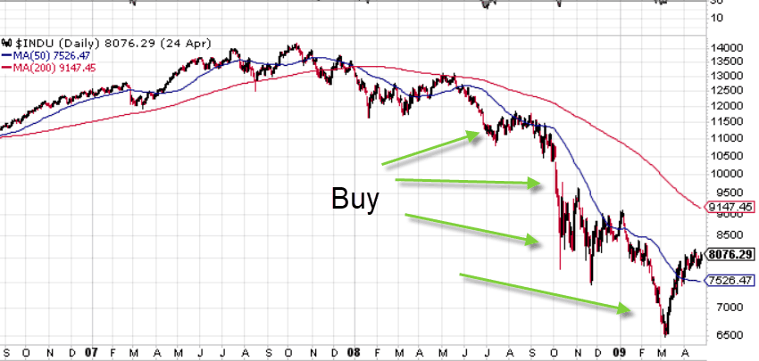

## Table of Contents

## What is the Average Down Strategy?

The Average Down Strategy is a way to invest more money in a stock when its price goes down. When you buy a stock and its price drops, you might buy more of the same stock at the lower price. This can lower the average price you paid for each share. The idea is that if the stock price goes back up, you could make more money because you bought more shares at a lower price.

But, this strategy can be risky. If the stock price keeps going down, you could lose more money. It's important to know why the stock price is falling before you buy more. Sometimes, the price goes down because the company is not doing well. So, it's a good idea to do research and think carefully before using the Average Down Strategy.

## How does the Average Down Strategy work?

The Average Down Strategy is when you buy more of a stock after its price has gone down. Let's say you bought a stock for $10 per share. If the price drops to $5 per share, you might buy more shares at this lower price. By doing this, the average price you paid for all your shares goes down. If you originally bought 100 shares at $10, spending $1,000, and then bought another 100 shares at $5, spending another $500, your total cost for 200 shares would be $1,500. That makes your average cost per share $7.50 instead of $10.

This strategy can be good if the stock price goes back up. Because your average cost per share is lower, you might make more money when you sell the shares. But it's risky too. If the stock keeps going down, you could lose more money because you bought more shares. It's important to understand why the stock price dropped before buying more. If the company is having problems, the stock might not go back up. So, always do your homework and think carefully before using the Average Down Strategy.

## What are the benefits of using the Average Down Strategy?

The Average Down Strategy can help you lower the average price you pay for a stock. If you buy more shares when the price drops, it brings down the total cost of your investment. For example, if you bought a stock at $10 per share and it goes down to $5, buying more at $5 will make your average cost per share lower. This means if the stock price goes back up, you could make more money because you have more shares at a lower average price.

Another benefit is that it can give you a chance to buy more of a stock you believe in at a cheaper price. If you think the company is still good but the stock price went down for other reasons, you might see it as a good deal. This can be a way to increase your investment in a company you like without spending as much money as you would have if the price stayed high. However, it's important to make sure the company is still doing well before buying more shares.

## What are the risks associated with the Average Down Strategy?

Using the Average Down Strategy can be risky. The biggest risk is that the stock price might keep going down. If you buy more shares at a lower price and the stock keeps dropping, you could lose more money than you would have if you didn't buy more. It's like betting more money on something that might not get better. If the company is having real problems, like losing money or having bad management, the stock might not go back up, and you could lose a lot.

Another risk is that you might be too focused on one stock. When you use the Average Down Strategy, you might end up putting more and more money into one company. This can be dangerous because if that company does badly, it can hurt your whole investment plan. It's important to spread your money around in different investments to lower your risk. So, before you decide to buy more of a stock that's going down, make sure you understand why it's dropping and think about how it fits into your overall investment plan.

## In what scenarios is the Average Down Strategy most effective?

The Average Down Strategy works best when the stock price drops for reasons that don't hurt the company's future. For example, if the whole market goes down but the company is still doing well, buying more shares at a lower price can be a good idea. If you believe the company will keep doing well and the stock price will go back up, averaging down can help you make more money when it does.

But, it's really important to know why the stock price went down before you buy more. If the company is having problems, like losing money or having bad management, the stock might not go back up. In these cases, using the Average Down Strategy can be risky because you might lose more money. So, it's best to use this strategy when you're sure the company is still strong and the price drop is just a temporary thing.

## How can one implement the Average Down Strategy in their investment portfolio?

To use the Average Down Strategy in your investment portfolio, start by [picking](/wiki/asset-class-picking) a stock you already own and believe in. If the price of this stock goes down, you can buy more shares at the lower price. For example, if you bought a stock at $10 per share and it drops to $5, you might decide to buy more shares at $5. This will lower your average cost per share, making it less than the original $10. The key is to make sure you understand why the stock price dropped. If it's because the whole market is down or something temporary, it might be a good time to buy more.

But, before you buy more shares, do some research. Make sure the company is still doing well and that the price drop isn't because of problems with the company itself. If the company is losing money or has bad management, buying more shares could be risky. Also, think about how much of your money you want to put into this one stock. Don't put all your money into one stock, even if you believe in it. It's important to have a mix of different investments to lower your risk. Using the Average Down Strategy can be helpful, but it needs to fit into your overall plan for investing.

## What are the key considerations before applying the Average Down Strategy?

Before using the Average Down Strategy, it's important to understand why the stock's price went down. If the price dropped because the whole market is doing badly or for some temporary reason, it might be okay to buy more shares. But if the company itself is having problems, like losing money or bad management, the stock might keep going down. So, do some research to make sure the company is still strong before you decide to buy more shares.

Also, think about how much of your money you want to put into this one stock. Don't put all your eggs in one basket, even if you believe in the company. It's good to have a mix of different investments to lower your risk. Using the Average Down Strategy can help you make more money if the stock goes back up, but it should fit into your overall plan for investing. Make sure you're not betting too much on one stock, and always think carefully before you buy more shares.

## How does the Average Down Strategy compare to other investment strategies?

The Average Down Strategy is different from other investment strategies because it focuses on buying more of a stock when its price goes down. This is different from the Dollar-Cost Averaging strategy, where you invest a fixed amount of money at regular times, no matter what the stock price is. With Dollar-Cost Averaging, you might buy more shares when the price is low and fewer when it's high, but you don't change how much you invest based on the price. The Average Down Strategy is more about trying to lower your average cost per share by buying more when the price drops.

Another strategy is the Buy and Hold strategy, where you buy a stock and keep it for a long time, hoping its value will go up over the years. This is different from the Average Down Strategy because you don't buy more shares just because the price goes down. With Buy and Hold, you might wait for the market to recover without adding more money to the investment. The Average Down Strategy can be riskier than Buy and Hold because you're putting more money into a stock that's already going down, which might not be a good idea if the company is doing badly.

Both the Average Down Strategy and other strategies like Dollar-Cost Averaging and Buy and Hold have their own risks and benefits. The Average Down Strategy can help you make more money if the stock goes back up, but it can also lead to bigger losses if the stock keeps going down. It's important to understand these differences and choose a strategy that fits your goals and how much risk you're willing to take.

## Can you provide examples of successful applications of the Average Down Strategy?

One example of the Average Down Strategy working well happened with Warren Buffett and Coca-Cola. In the late 1980s, Buffett started buying Coca-Cola stock. When the stock price went down in the early 1990s, he bought more shares. This lowered his average cost per share. Over time, Coca-Cola's stock price went back up, and because Buffett bought more at a lower price, he made a lot of money. This shows how the Average Down Strategy can be successful if you believe in the company and the price drop is temporary.

Another example is with an investor who bought shares in Apple during a dip in 2016. The stock price went down because of worries about the company's future, but the investor believed in Apple's long-term success. They bought more shares at the lower price, which lowered their average cost. When Apple's stock price went back up in the following years, the investor made more money because they had more shares at a lower average price. This shows that if you understand why the stock price dropped and still believe in the company, the Average Down Strategy can work well.

## What are the psychological aspects investors should be aware of when using the Average Down Strategy?

When using the Average Down Strategy, investors need to be careful about their feelings. It can be hard to buy more of a stock when its price is going down. You might feel scared or worried that the stock will keep going down. This fear can make you want to sell your shares instead of buying more. But if you believe in the company and think the price drop is just temporary, you need to be strong and stick to your plan. It's important to not let your emotions control your decisions.

Another thing to think about is something called "loss aversion." This means that people feel the pain of losing money more than the happiness of making money. When you use the Average Down Strategy, you might feel this pain more because you're buying more of a stock that's losing value. It can be hard to keep buying when you see your money going down. But if you've done your homework and believe in the company, you need to be ready to deal with these feelings. Remember, the goal is to make more money when the stock goes back up, but you have to be able to handle the stress of seeing your investment go down first.

## How does market volatility affect the Average Down Strategy?

Market [volatility](/wiki/volatility-trading-strategies), which means when stock prices go up and down a lot, can make the Average Down Strategy harder to use. When the market is really moving around, stock prices can drop fast. If you see the price of a stock you own going down, you might want to buy more to lower your average cost. But if the market keeps being volatile, the price could keep dropping, and you might lose more money if you buy more shares at the wrong time. So, you need to be careful and make sure you understand why the stock is going down before you decide to buy more.

On the other hand, if you think the stock will go back up after the market calms down, using the Average Down Strategy during a volatile time can be a good idea. If you believe in the company and think the price drop is just because of the market being wild, buying more shares at a lower price can help you make more money when things get better. But it's really important to know that market volatility can make things unpredictable, so you need to be ready for the stock to go up or down even more before it gets better.

## What advanced techniques can be used to optimize the Average Down Strategy?

One advanced technique to optimize the Average Down Strategy is to use stop-loss orders. A stop-loss order is when you tell your broker to sell your stock if it goes down to a certain price. This can help you limit how much money you lose if the stock keeps going down after you buy more shares. By setting a stop-loss, you can protect yourself from losing too much money while still trying to lower your average cost per share. It's like having a safety net that lets you take advantage of the strategy without risking everything.

Another technique is to use technical analysis to help you decide when to buy more shares. Technical analysis is when you look at charts and patterns to try to guess where the stock price might go next. If you see signs that the stock might go back up soon, it can be a good time to use the Average Down Strategy. But if the charts show the stock might keep going down, it might be better to wait. By using technical analysis, you can make smarter choices about when to buy more shares and increase your chances of making money when the stock price goes back up.

## What is the Average Down Strategy?

The average down strategy is a common investment approach used in the context of stock investments. This strategy involves purchasing additional shares of a stock that an investor already holds when its price declines. The main objective is to lower the average cost per share of the investment. By acquiring more shares at a reduced price, investors aim to decrease the overall cost basis, potentially positioning themselves for larger gains when the stock price rebounds.

To illustrate how averaging down works, consider an investor who buys 100 shares of a company at $50 per share, totaling $5,000. If the stock price falls to $40, the investor can purchase another 100 shares for $4,000 (100 shares x $40). The total investment now amounts to $9,000 for 200 shares. The average cost per share is thus reduced to $45. Should the stock price eventually return to $50, the investor will realize a gain relative to their adjusted cost base, as opposed to merely breaking even.

$$
\text{Average Cost Per Share} = \frac{\text{Total Investment}}{\text{Total Number of Shares}}
$$

$$
= \frac{\$5,000 + \$4,000}{100 \text{ shares} + 100 \text{ shares}} = \frac{\$9,000}{200 \text{ shares}} = \$45 \text{ per share}
$$

Averaging down is often contrasted with the strategy known as averaging up. While averaging down involves buying more shares as the price decreases, averaging up entails purchasing additional shares as the price rises. The primary difference between these strategies lies in their respective premises: averaging down seeks to capitalize on the belief that a declining stock will recover, whereas averaging up bets on the continued upward [momentum](/wiki/momentum) of a rising stock. Each strategy carries its own set of risk profiles and potential for returns and is typically chosen by investors based on their market outlook and risk tolerance. 

It is important for investors to assess the fundamentals of the underlying stock and the broader market conditions before employing the averaging down strategy, as it involves a higher degree of risk if the stock price continues to fall.

## References & Further Reading

[1]: ["Algorithmic Trading: Winning Strategies and Their Rationale"](https://books.google.com/books/about/Algorithmic_Trading.html?id=WAlFDwAAQBAJ) by Ernie Chan

[2]: ["Python for Finance: Mastering Data-Driven Finance"](https://www.amazon.com/Python-Finance-Mastering-Data-Driven/dp/1492024333) by Yves Hilpisch

[3]: ["The Intelligent Investor"](https://www.amazon.com/Intelligent-Investor-3rd-Ed/dp/0063356724) by Benjamin Graham

[4]: ["Machine Learning for Algorithmic Trading"](https://github.com/stefan-jansen/machine-learning-for-trading) by Stefan Jansen

[5]: ["Quantitative Trading: How to Build Your Own Algorithmic Trading Business"](https://www.amazon.com/Quantitative-Trading-Build-Algorithmic-Business/dp/1119800064) by Ernest P. Chan

[6]: [Investopedia - Averaging Down](https://www.investopedia.com/ask/answers/04/052704.asp)

[7]: [QuantConnect Documentation](https://www.quantconnect.com/docs/v2/)

[8]: [Seeking Alpha](https://seekingalpha.com/)

[9]: [StockCharts.com](https://stockcharts.com/)

[10]: [Khan Academy - Introduction to Stocks and Bonds](https://www.youtube.com/watch?v=Qh-M3_L4xYk)