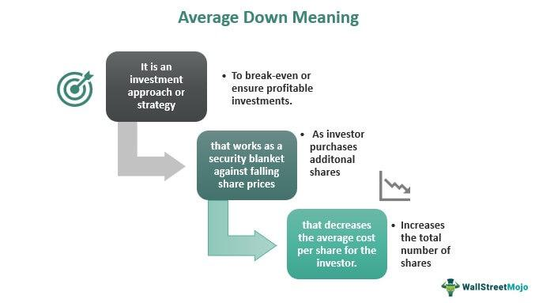

The average down investment strategy involves buying additional shares of a stock as its price declines, thereby reducing the average cost per share in an investor's portfolio. This strategy is considered a value investment approach because it allows investors to acquire more shares at a lower price, positioning them advantageously if the stock's price rebounds in the future. Averaging down is particularly relevant within the broader field of stock market investing, as it provides a counterpoint to strategies that aim to capitalize on rising prices, such as averaging up. 

In the context of algorithmic trading, averaging down holds a distinct place. Algo trading leverages computer programs to execute trades based on predefined criteria, enabling faster decision-making with reduced emotional interference. By integrating the averaging down strategy into algorithmic trading systems, traders can systematically take advantage of price dips in a potentially more disciplined and automated manner. This strategy can be particularly effective in markets characterized by volatility or in stocks with strong fundamentals that are experiencing short-term price declines.



The purpose of this article is to explore the benefits and risks associated with the average down strategy while examining how it can be effectively applied within algorithmic trading frameworks. Through this exploration, the article will provide insights into how investors and traders can utilize this strategy to potentially enhance returns, manage risks, and navigate dynamic market conditions. Additionally, it aims to discuss algorithmic considerations and backtesting, which are crucial for assessing the viability of implementing averaging down in an automated trading environment.

## Table of Contents

## What is the Average Down Strategy?

The average down strategy is a common investment approach used in the context of stock investments. This strategy involves purchasing additional shares of a stock that an investor already holds when its price declines. The main objective is to lower the average cost per share of the investment. By acquiring more shares at a reduced price, investors aim to decrease the overall cost basis, potentially positioning themselves for larger gains when the stock price rebounds.

To illustrate how averaging down works, consider an investor who buys 100 shares of a company at $50 per share, totaling $5,000. If the stock price falls to $40, the investor can purchase another 100 shares for $4,000 (100 shares x $40). The total investment now amounts to $9,000 for 200 shares. The average cost per share is thus reduced to $45. Should the stock price eventually return to $50, the investor will realize a gain relative to their adjusted cost base, as opposed to merely breaking even.

$$
\text{Average Cost Per Share} = \frac{\text{Total Investment}}{\text{Total Number of Shares}}
$$

$$
= \frac{\$5,000 + \$4,000}{100 \text{ shares} + 100 \text{ shares}} = \frac{\$9,000}{200 \text{ shares}} = \$45 \text{ per share}
$$

Averaging down is often contrasted with the strategy known as averaging up. While averaging down involves buying more shares as the price decreases, averaging up entails purchasing additional shares as the price rises. The primary difference between these strategies lies in their respective premises: averaging down seeks to capitalize on the belief that a declining stock will recover, whereas averaging up bets on the continued upward [momentum](/wiki/momentum) of a rising stock. Each strategy carries its own set of risk profiles and potential for returns and is typically chosen by investors based on their market outlook and risk tolerance. 

It is important for investors to assess the fundamentals of the underlying stock and the broader market conditions before employing the averaging down strategy, as it involves a higher degree of risk if the stock price continues to fall.

## Benefits of Averaging Down

Averaging down is a strategy employed by investors aiming to decrease the average cost of acquiring stock shares. This approach is advantageous when an investor anticipates the market will eventually rebound after a decline. One immediate benefit is the reduction in the average cost per share. This occurs because purchasing additional shares at a lower price decreases the overall average cost of the stock. For example, if an investor buys 100 shares of a stock at $10 each and the price declines to $8, purchasing another 100 shares at $8 will result in an average price of $9 per share for the total holding.

This strategy can potentially offer higher returns if the stock's price rises after additional purchases. By securing more shares at reduced prices, any subsequent increase in value yields more significant gains than if the investor had maintained their initial position. For investors willing to commit additional capital amidst price declines, this strategy can amplify the profits as the market corrects itself or enters a growth phase.

Averaging down also provides a mechanism to mitigate the impacts of short-term market [volatility](/wiki/volatility-trading-strategies). Market fluctuations can be driven by temporary factors that do not necessarily reflect a company's long-term performance potential. By averaging down, investors maintain a position that might benefit from long-term performance, despite short-term price variations. However, discerning transient market dips from genuine downturns necessitates robust analysis, thus ensuring that the strategy aligns with the investor's risk tolerance and financial goals.

In summary, averaging down can be a powerful tool for reducing the cost basis, positioning for potential price rebounds, and smoothing the effects of market volatility, proving beneficial if executed with careful consideration of market conditions and stock fundamentals.

## Risks and Considerations

Averaging down, while potentially lucrative, carries several notable risks that investors must consider before implementation. One of the primary concerns is the exposure to increased risk if the stock prices continue to decline beyond expectations. This strategy involves purchasing more shares of a stock as its price decreases, with the hope of reducing the average cost per share. However, if the decline is not temporary and the stock continues its downward trajectory, an investor might face significant losses. The risk is exacerbated because capital is continuously deployed into a falling asset, increasing the concentration and exposure within an investment portfolio.

One of the key challenges is distinguishing between temporary dips and long-term downturns. Temporary dips can occur due to market overreactions, short-term negative news, or broader market volatility. In contrast, long-term downturns may stem from fundamental issues within the company, such as declining revenues, shrinking market share, or broader industry problems. Successfully separating the two requires an in-depth analysis of the company's financial health, industry conditions, and broader economic indicators. This involves reviewing key financial metrics such as earnings per share (EPS), price-to-earnings (P/E) ratio, and debt-to-equity ratio, as well as qualitative factors like management effectiveness and competitive positioning.

Before employing an averaging down strategy, it is crucial to consider the current market conditions and the specific stock fundamentals. Market conditions, such as interest rates, inflation, and geopolitical events, can significantly impact stock valuations and trends. Understanding these elements can provide insights into whether a stock's decline is part of a broader market downturn or an isolated incident. Moreover, assessing the fundamentals of a stock, including financial performance, growth prospects, and industry dynamics, is essential to ascertain if the stock is undervalued or if its decline is justified by deteriorating fundamentals.

In summary, while the averaging down strategy can potentially yield benefits by lowering the average cost per share and capitalizing on rebounds, the risks of further price declines and misinterpretation of market signals are substantial. Investors should conduct thorough due diligence and consider external factors and intrinsic stock value before implementing this strategy.

## Algorithmic Approaches to Averaging Down

Algorithmic trading offers a structured approach to implementing investment strategies, including averaging down. This method leverages technology to make systematic decisions, helping investors achieve more consistent results by removing the emotional biases that often accompany manual trading.

One primary advantage of using algorithms for averaging down is the ability to systematically buy more shares as stock prices drop. This approach helps to lower the average purchase price, potentially increasing returns if the stock rebounds. Algorithms can be programmed to execute these trades based on predefined conditions, such as price thresholds or percentage declines.

### Automating Decision-Making

Automating the decision-making process in averaging down eliminates the emotional aspects that can cloud judgment during volatile market conditions. Algorithms can be tailored to specific investment criteria, executing trades based on strict rules rather than subjective judgment. This ensures that the strategy is consistently applied, regardless of market sentiment.

For instance, an algorithm may be set up to purchase additional shares once a stock's price falls by a certain percentage. The condition to buy more can be tied to other indicators, like relative strength index (RSI) or moving average convergence divergence (MACD), to enhance decision accuracy.

### Algorithmic Strategies

Two popular algorithmic strategies used in conjunction with averaging down are trend reversal and mean reversion.

#### Trend Reversal

Trend reversal strategies attempt to identify points where a stock's price trend is likely to change direction. By analyzing patterns or using indicators, algorithms predict when the downward trend of a stock could reverse, providing a strategic point to increase holdings. The success of this strategy depends on the algorithm's ability to accurately identify potential reversals, leveraging historical data and pattern analysis.

#### Mean Reversion

Mean reversion is based on the idea that stock prices will return to their historical mean or average over time. An algorithm implementing this strategy will buy more shares as prices fall below their historical average, betting on the eventual price correction back to the mean. This approach requires extensive [backtesting](/wiki/backtesting) to determine the historical average price and recognize deviations that are statistically significant.

### Example Python Code for Averaging Down

Below is an example of a simple Python algorithm using a mean reversion strategy to average down.

```python
import pandas as pd
import numpy as np

# Sample historical data
data = pd.DataFrame({'Price': [100, 95, 90, 85, 80, 75, 70, 65]})

# Calculate rolling mean
data['Roll_Mean'] = data['Price'].rolling(window=3).mean()

# Determine buy signals
data['Buy_Signal'] = np.where(data['Price'] < data['Roll_Mean'], 1, 0)

# Print the decisions
print(data)
```

This code checks if the current price is below the rolling mean (of a specified window) and generates a 'Buy Signal' when true. This signal triggers the buying procedure within an automated trading system.

Algorithmic approaches to averaging down provide an attractive alignment of discipline and efficiency, especially in chaotic market environments. By systematically executing strategies like trend reversal and mean reversion, algorithms enhance the potential success of averaging down, positioning it as a viable tool in [algorithmic trading](/wiki/algorithmic-trading) portfolios.

## Backtesting the Strategy

Backtesting is an essential step in validating the effectiveness of the averaging down strategy within stock investments. This process involves simulating the application of the strategy using historical data to evaluate its potential performance before committing actual capital. By backtesting, investors gain insights into how the strategy might perform under various market conditions, allowing for more informed decision-making.

### Example of Backtesting with SPY ETF

To illustrate backtesting for an averaging down strategy, consider using the SPDR S&P 500 [ETF](/wiki/etf-trading-strategies) Trust (SPY), a widely recognized exchange-traded fund that tracks the S&P 500 index. Python, with its robust data handling and analysis capabilities, is suitable for this purpose. Libraries such as `pandas`, `numpy`, `matplotlib`, and `[backtrader](/wiki/backtrader)` can be utilized to conduct the backtest.

```python
import pandas as pd
import numpy as np
import matplotlib.pyplot as plt
import backtrader as bt

# Load historical data for SPY
spy_data = pd.read_csv('SPY.csv', index_col='Date', parse_dates=True)

# Define an Averaging Down strategy
class AverageDownStrategy(bt.Strategy):
    def __init__(self):
        self.buy_price = None

    def next(self):
        if not self.position:
            self.buy_price = self.data.close[0]
            self.buy(size=10)
        elif self.data.close[0] < self.buy_price:
            self.buy(size=10)

# Set up the backtesting environment
cerebro = bt.Cerebro()
spy_data_bt = bt.feeds.PandasData(dataname=spy_data)
cerebro.adddata(spy_data_bt)
cerebro.addstrategy(AverageDownStrategy)

# Run the backtest
cerebro.run()

# Plot the results
cerebro.plot()
```

This basic example defines an averaging down strategy by purchasing additional shares whenever the current price dips below the last purchase price. The `backtrader` library is used to simulate the strategy using historical SPY data.

### Key Performance Metrics

When assessing the results of backtesting, it is crucial to focus on key performance metrics to determine the strategy's viability. These metrics include:

1. **Cumulative Return**: Measures the total return over the investment period, providing insight into the strategy's overall profitability.

2. **Max Drawdown**: Represents the largest peak-to-trough decline during the backtesting period, offering an understanding of the strategy's risk and potential losses.

3. **Sharpe Ratio**: Evaluates risk-adjusted returns by comparing the strategy's excess return to its standard deviation. A higher Sharpe ratio indicates more efficient returns per unit of risk.

4. **Volatility**: Calculated as the standard deviation of returns, it measures the strategy's risk level, with higher volatility indicating greater fluctuations in returns.

5. **Win/Loss Ratio**: The number of winning trades relative to losing trades, providing information on the strategy's consistency and success rate.

Analyzing these metrics allows investors to fine-tune the averaging down strategy, enhancing its alignment with specific risk tolerance and investment objectives. This rigorous examination helps ensure that the strategy is a viable component of a broader investment portfolio or algorithmic trading system.

## Is Averaging Down Worth It in Algo Trading?

Averaging down, while a time-honored strategy in stock market investing, presents unique opportunities and challenges in the field of algorithmic trading. To determine whether averaging down is worth pursuing in algorithmic trading, it is essential to understand the conditions under which it is most effective, align the strategy with market conditions and risk management practices, and explore potential innovations in this domain.

### Effectiveness of Averaging Down

Averaging down is most effective in scenarios where the underlying fundamentals of a stock are strong, and the price decline is attributed to temporary market inefficiencies or short-term volatility. Algorithmic trading can capitalize on these inefficiencies by systematically identifying opportunities where historical data suggest a pattern of rebound after price dips. 

For example, suppose an algorithm identifies stocks that have a history of recovering a certain percentage within a specified timeframe after a dip. In that case, it can automatically execute averaging down on those stocks. This approach helps in deploying capital more efficiently, as it leverages historical performance data to identify potential rebound candidates rather than relying solely on market timing.

### Aligning with Market Conditions and Risk Management

Aligning the averaging down strategy with current market conditions is crucial for its success. In a bull market characterized by overall rising stock prices, averaging down may quickly become profitable as stocks rebound. Conversely, during prolonged bear markets or when stocks are part of sectors in structural decline, the strategy may expose investors to undue risk.

Risk management practices play a critical role in implementing averaging down in algorithmic trading. Algorithms can integrate risk management rules such as stop-loss orders, position size limits, and diversification requirements. These safeguards help mitigate the potential downside of averaging down by ensuring that positions are closed if a stock's price falls beyond a pre-determined threshold, or by limiting the amount of capital allocated to a single stock or sector.

### Innovations and Advancements

Recent advancements in [machine learning](/wiki/machine-learning) and data analytics present new opportunities for enhancing the averaging down strategy in algorithmic trading. By incorporating sentiment analysis of news articles or social media, algorithms can gain insights into market perceptions that may affect stock prices. This enables more informed decision-making regarding the timing and extent of averaging down actions.

Furthermore, developments in real-time data processing allow for the application of complex models to detect market anomalies and execute trades in milliseconds. This ability to rapidly adapt to changing market conditions can enhance the effectiveness of averaging down strategies, particularly in fast-moving markets where opportunities for price recovery are fleeting.

### Conclusion

Averaging down can be a promising strategy in algorithmic trading when applied under the right conditions and with robust risk management practices. The integration of machine learning and real-time data analytics into algorithmic strategies holds the potential to significantly boost the efficacy of averaging down, making it a more dynamic tool in the trading arsenal. However, like all investment strategies, it requires careful consideration of market conditions and a strong foundation of risk management to be successful.

## Conclusion

In summary, the averaging down strategy presents a dual-edged sword in stock market investments. By purchasing additional shares of a declining stock, investors can potentially lower the average cost per share, thereby increasing the potential for gains if the stock's price rebounds. This approach can mitigate the effects of short-term market volatility and offer enhanced upside during recovery phases. However, it also necessitates a careful assessment of market conditions and stock fundamentals, as increased exposure to a declining asset can compound losses if the stock continues on a downward trajectory.

In algorithmic trading, averaging down can be systematically implemented to capitalize on these potential benefits while minimizing emotional bias. Algorithmic models, such as those employing trend reversal or mean reversion strategies, can automate decision-making processes, allowing for disciplined execution of the averaging down strategy. These models can incorporate various indicators and metrics to discern favorable market conditions for averaging down, thus increasing the likelihood of success.

Nonetheless, it is crucial to backtest any averaging down strategy using historical data to evaluate its performance and conduct thorough stress testing under different market scenarios. Effective implementation in algo trading relies on aligning the strategy with robust risk management practices and a clear understanding of its applicability given prevailing market conditions. As algorithmic trading technologies continue to evolve, innovative solutions may further refine the deployment of averaging down, potentially unlocking new opportunities within the landscape of automated investing.

## References and Further Reading

1. **Investopedia - Averaging Down**: 
   A comprehensive resource on the concept of averaging down, covering its advantages, risks, and application scenarios. Find detailed explanations and examples here: [Investopedia](https://www.investopedia.com/terms/a/averagedown.asp)

2. **"Algorithmic Trading: Winning Strategies and Their Rationale" by Ernie Chan**:
   This book offers insights into various algorithmic trading strategies, including those related to risk management and averaging techniques. Useful for understanding the integration of algorithms in trading strategies.

3. **QuantConnect Documentation - Algorithmic Trading and Backtesting**:
   QuantConnect provides a platform for developing and backtesting algorithmic trading strategies. Their documentation and community forums can be highly valuable for those interested in automating averaging down strategies. Visit [QuantConnect Documentation](https://www.quantconnect.com/docs) for more information.

4. **"Python for Finance: Mastering Data-Driven Finance" by Yves Hilpisch**:
   This book includes practical examples of using Python for financial analysis and trading strategy development. It’s particularly useful for those looking to implement averaging down algorithms.

5. **Seeking Alpha - Analysis of Market Strategies**:
   A financial website providing analysis, articles, and opinions on various market strategies, including averaging down. Explore different viewpoints and case studies at [Seeking Alpha](https://seekingalpha.com).

6. **StockCharts.com - Technical Analysis and Trading Strategies**:
   An educational platform that offers resources on technical analysis and trading strategies. It's beneficial for investors wanting to understand market movements and determine when to apply averaging down. Access their resources at [StockCharts](https://school.stockcharts.com).

7. **"The Intelligent Investor" by Benjamin Graham**:
   This classic book provides foundational knowledge on value investing principles, many of which underpin the rationale for averaging down during market dips.

8. **Khan Academy - Introduction to Stocks and Bonds**:
   Hosting a series of educational videos and articles, Khan Academy offers beginner to advanced learning materials on investing topics, which can serve as a preliminary guide for those new to strategies like averaging down. Access this content at [Khan Academy](https://www.khanacademy.org/economics-finance-domain/core-finance).

9. **GitHub Repositories for Financial Analysts**:
   Open-source repositories on GitHub can offer valuable Python code examples for algorithmic trading strategies. These resources are particularly helpful for practical implementation and experimentation.

10. **Yahoo Finance - Real-time Market Analysis and Tools**:
   Provides up-to-date financial news, data, and analytical tools necessary for informed investing decisions, beneficial for implementing and timing averaging down strategies. Visit [Yahoo Finance](https://finance.yahoo.com) for more information.

## References & Further Reading

[1]: ["Algorithmic Trading: Winning Strategies and Their Rationale"](https://books.google.com/books/about/Algorithmic_Trading.html?id=WAlFDwAAQBAJ) by Ernie Chan

[2]: ["Python for Finance: Mastering Data-Driven Finance"](https://www.amazon.com/Python-Finance-Mastering-Data-Driven/dp/1492024333) by Yves Hilpisch

[3]: ["The Intelligent Investor"](https://www.amazon.com/Intelligent-Investor-3rd-Ed/dp/0063356724) by Benjamin Graham

[4]: ["Machine Learning for Algorithmic Trading"](https://github.com/stefan-jansen/machine-learning-for-trading) by Stefan Jansen

[5]: ["Quantitative Trading: How to Build Your Own Algorithmic Trading Business"](https://www.amazon.com/Quantitative-Trading-Build-Algorithmic-Business/dp/1119800064) by Ernest P. Chan

[6]: [Investopedia - Averaging Down](https://www.investopedia.com/ask/answers/04/052704.asp)

[7]: [QuantConnect Documentation](https://www.quantconnect.com/docs/v2/)

[8]: [Seeking Alpha](https://seekingalpha.com/)

[9]: [StockCharts.com](https://stockcharts.com/)

[10]: [Khan Academy - Introduction to Stocks and Bonds](https://www.youtube.com/watch?v=Qh-M3_L4xYk)