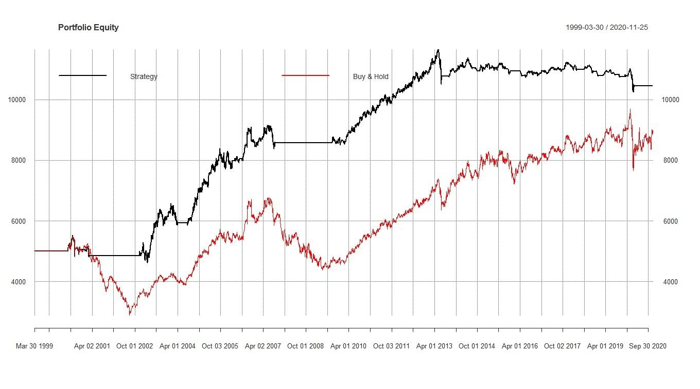

## Table of Contents

## What is the average holding period in backtesting?

The average holding period in backtesting refers to how long, on average, a trading strategy keeps a position open before closing it. This is an important metric because it helps traders understand the time commitment required for their strategy and can affect transaction costs and potential returns. For example, a strategy with a short average holding period might involve more frequent trading, leading to higher transaction costs but potentially quicker profits.

In backtesting, calculating the average holding period involves looking at all the trades executed by the strategy over the test period. You add up the total time each trade was held and then divide by the number of trades. If a strategy holds trades for an average of 5 days, this means that, on average, positions are opened and closed within this timeframe. This information can help traders decide if the strategy fits their investment goals and risk tolerance.

## Why is the average holding period important in trading strategies?

The average holding period is important in trading strategies because it tells you how long you need to keep your money in a trade. This helps you understand if a strategy fits your schedule and how patient you need to be. For example, if you like quick trades, you'll want a strategy with a short holding period. But if you're okay with waiting longer, a strategy with a longer holding period might work better for you.

It also affects how much you might pay in fees and taxes. If you trade a lot and have a short holding period, you'll pay more in transaction fees because you're buying and selling more often. Also, in some places, holding a trade for a shorter time can mean you pay more in taxes. So, knowing the average holding period can help you pick a strategy that not only matches how you like to trade but also keeps your costs down.

## How is the average holding period calculated in a backtest?

To calculate the average holding period in a backtest, you first need to look at all the trades that the trading strategy made. For each trade, you figure out how many days, hours, or minutes the trade was held open. You add up all these times for every trade.

Once you have the total time for all trades, you divide this by the number of trades you made. This gives you the average holding period. For example, if you made 10 trades and the total holding time was 50 days, the average holding period would be 5 days. This helps you understand how long, on average, you need to keep your money in a trade when using that strategy.

## What are the differences between short-term and long-term holding periods in backtesting?

Short-term holding periods in backtesting mean that trades are usually held for a short time, like a few minutes, hours, or days. This can be good if you want to make quick profits and don't mind checking your trades often. But, because you're buying and selling a lot, you might have to pay more in fees and taxes. Also, the market can be more unpredictable in the short term, so there's a bigger chance of losing money if things don't go as planned.

Long-term holding periods mean you keep your trades open for a longer time, like weeks, months, or even years. This can be better if you don't want to check your trades every day and are okay with waiting for bigger profits over time. Long-term strategies often have lower costs because you're not trading as often. But, you need to be patient and believe in your strategy, even if the market goes up and down a lot before you see good results.

## How does the average holding period affect the risk and return of a trading strategy?

The average holding period of a trading strategy can change how much risk you take and how much money you might make. If you hold trades for a short time, you might make quick profits, but you also face more risk because short-term market changes can be hard to predict. You might need to watch the market closely and make decisions fast, which can be stressful. Also, because you're trading a lot, you'll pay more in fees, which can eat into your profits.

On the other hand, if you hold trades for a longer time, you might see bigger profits over time, but you need to be patient. Long-term strategies can be less risky because they're not as affected by daily market ups and downs. You don't have to watch the market all the time, which can be less stressful. But, you still need to be okay with waiting and seeing your investment go up and down before it hopefully grows.

## What are common pitfalls when analyzing the average holding period in backtesting?

One common mistake when looking at the average holding period in backtesting is not considering how often you trade. If your strategy makes a lot of trades in a short time, you might think the holding period is short. But if you only make a few trades that last a long time, the average can be misleading. It's important to look at both how long you hold each trade and how many trades you make.

Another pitfall is not thinking about the costs that come with different holding periods. If you hold trades for a short time, you'll pay more in fees because you're buying and selling more often. These costs can make your profits smaller than you expect. Also, if you hold trades for a longer time, you need to be okay with waiting and seeing the value of your investment go up and down before it grows. Not considering these costs and your own patience can lead to [picking](/wiki/asset-class-picking) the wrong strategy.

## How can the average holding period be optimized in a trading strategy?

To make the average holding period better in your trading strategy, you need to look at how long you hold each trade and how often you trade. If you find that holding trades for a shorter time works better because the market moves fast, you might want to adjust your strategy to trade more often. But remember, trading more means paying more in fees, so you need to balance the time you hold trades with how much it costs to trade.

Also, think about how patient you are and what kind of risk you're okay with. If you like to wait and see bigger profits over time, you might want to hold trades for longer. This can be less stressful because you don't need to watch the market all the time. But you need to be okay with your investment going up and down before it grows. By trying different holding periods in your backtest, you can find the best one that fits your goals and keeps your costs low.

## What role does the average holding period play in different market conditions?

The average holding period can change how well a trading strategy works in different market conditions. In a fast-moving market, where prices go up and down quickly, a short holding period might be better. This means you can buy and sell quickly to make profits from these fast changes. But you need to watch the market closely and be ready to act fast. If the market is not moving much, a short holding period might not be as good because there aren't many chances to make quick profits.

In a slow-moving market, where prices don't change much over time, a longer holding period might work better. This means you can hold onto your trades for weeks or months, waiting for bigger profits over time. This can be less stressful because you don't need to watch the market all the time. But you need to be patient and okay with your investment going up and down before it grows. So, the best holding period can change based on how the market is behaving.

## How do various asset classes influence the average holding period in backtesting?

Different types of assets can change how long you should hold your trades in a backtest. For example, stocks can be held for a short time if you're trading quickly, or a long time if you're investing for the future. If you're trading stocks that move a lot every day, you might want a short holding period to make quick profits. But if you're investing in stable companies that grow slowly over time, a longer holding period might be better. The same goes for other assets like commodities or currencies. If they change a lot in a short time, a short holding period might work better. But if they're more stable, you might want to hold them longer.

Another thing to think about is how different assets react to market changes. For example, bonds are usually more stable than stocks, so you might hold them for a longer time to get steady returns. On the other hand, cryptocurrencies can be very unpredictable, so a short holding period might be better if you want to take advantage of quick price changes. By understanding how each asset class behaves, you can pick the right holding period for your strategy. This helps you make the most of your trades and manage your risk better.

## What advanced statistical methods can be used to analyze the average holding period?

To look at the average holding period in a more detailed way, you can use something called regression analysis. This method helps you see how the holding period affects your profits or losses. You can use regression to find out if holding trades for a longer or shorter time makes a big difference in how much money you make. This can help you decide if you should change your strategy to hold trades for a different amount of time. It's like figuring out if waiting longer or moving quicker is better for your wallet.

Another useful method is time series analysis. This helps you understand how the holding period changes over time and how it's affected by things like market trends or big news events. By looking at past data, you can see patterns and predict what might happen in the future. This can help you adjust your strategy to be ready for different market conditions. Both of these methods give you a deeper look into your trading strategy and help you make smarter choices about how long to hold your trades.

## How does the average holding period interact with other performance metrics in backtesting?

The average holding period works together with other performance metrics like the Sharpe Ratio and the drawdown to give you a full picture of how well your trading strategy is doing. The Sharpe Ratio tells you how much extra return you're getting for the risk you're taking. If you have a short holding period, you might trade more often and see quick profits, but this can also mean higher risk and a lower Sharpe Ratio. On the other hand, a longer holding period might lead to a higher Sharpe Ratio because you're taking less risk over time. So, by looking at both the holding period and the Sharpe Ratio, you can see if your strategy is balancing risk and reward well.

Another important metric is the drawdown, which shows the biggest drop in your investment's value from its highest point. A short holding period might lead to more ups and downs, making the drawdown bigger and scarier. But if you hold trades for a longer time, the drawdown might be smaller because the market's daily ups and downs don't affect your investment as much. By thinking about the average holding period along with the drawdown, you can understand how risky your strategy is and decide if you're okay with those risks. This helps you pick a strategy that fits your comfort level with risk and your investment goals.

## What are the latest research findings on the impact of average holding period on trading strategy performance?

Recent studies have shown that the average holding period can really change how well a trading strategy does. For example, research found that strategies with short holding periods can do well in fast-moving markets where prices change a lot. These strategies let traders make quick profits by buying and selling often. But, they also come with higher risks and costs because of all the trading. On the other hand, strategies with longer holding periods can be better in markets that don't change as much. These strategies help traders wait for bigger profits over time and can be less risky because they don't get affected as much by daily market ups and downs.

Another important finding is that the average holding period can affect other performance metrics like the Sharpe Ratio and drawdown. A study showed that a short holding period might lead to a lower Sharpe Ratio because the strategy is taking on more risk to get quick returns. But a longer holding period could lead to a higher Sharpe Ratio because it balances risk and reward better over time. Also, the drawdown, which is the biggest drop in value, tends to be bigger with short holding periods because of the market's daily changes. With longer holding periods, the drawdown can be smaller, making the strategy feel safer. So, when picking a trading strategy, it's important to think about how the holding period works with these other metrics to find the best fit for your goals and risk comfort level.

## What is Backtesting?

Backtesting is a fundamental process in [algorithmic trading](/wiki/algorithmic-trading), involving the simulation of a trading strategy over a historical dataset to gauge its effectiveness and potential future performance. By applying a strategy to past market data, traders gain insights into how it would have performed in real-world conditions without risking actual capital. This empirical analysis is crucial for validating a trading strategy before its execution in live markets, offering a preliminary assessment of its viability and reliability.

The process begins with the selection of historical price data across various financial instruments and time frames. The trading strategy is then coded into [backtesting](/wiki/backtesting) software, which replicates the trading rules, entry and [exit](/wiki/exit-strategy) signals, and risk management parameters. This simulation generates a range of performance metrics, such as net profit, winning and losing trades, drawdowns, and return on investment.

Mathematically, backtesting often involves calculating key performance metrics. For example, the cumulative return $R$ of a strategy over time is given by:

$$
R = \prod_{i=1}^{n} (1 + r_i) - 1
$$

where $r_i$ is the return of the strategy at time $i$, and $n$ is the total number of trading periods. Additionally, the Sharpe Ratio, a measure of risk-adjusted return, can be calculated as:

$$
\text{Sharpe Ratio} = \frac{\bar{R} - R_f}{\sigma_R}
$$

where $\bar{R}$ is the average return of the strategy, $R_f$ is the risk-free rate, and $\sigma_R$ is the standard deviation of returns.

The insights gained from backtesting help traders identify and rectify potential flaws within a strategy, ensuring that it operates as expected under varying market conditions. Traders can refine strategies by analyzing parameters that impact performance, such as transaction costs, slippage, and market [volatility](/wiki/volatility-trading-strategies). Enhanced by these refinements, strategies are more robust and aligned with their intended objectives when transitioned to live environments.

## What is the Average Holding Period and How Can We Understand It?

The average holding period represents the mean duration for which a position is held within a specified trading strategy. This metric provides crucial insights into the buying and selling frequency of the strategy and helps determine whether the approach is consistent with its intended timeframe, such as intraday, short-term, or long-term. A longer average holding period typically suggests that the strategy is designed to capture significant market trends, relying on extended trends rather than short price swings.

To calculate the average holding period, one can sum the duration of all trades executed within a backtest and divide by the total number of trades. For instance, if a strategy makes trades with holding periods of 2, 5, and 10 days, the average holding period would be calculated as follows:

$$
\text{Average Holding Period} = \frac{2 + 5 + 10}{3} = 5.67 \text{ days}
$$

Understanding whether a strategy maintains positions for hours, days, or weeks provides insight into its alignment with the trader’s goals and the broader market conditions. For example, a strategy with a brief average holding period might focus on high-frequency trading, capitalizing on small price movements within the day. Conversely, a strategy with a longer average holding period may target longer-term trend-following, seeking to benefit from sustained price movements over several weeks or months.

Aligning the average holding period with the strategy's objectives and the trader’s risk tolerance is essential for effective implementation. A discrepancy between the intended and actual holding periods could indicate a need for strategy adjustments. For instance, if a trader intends to employ a long-term strategy but discovers an unexpectedly short average holding period, it might suggest an issue, such as too frequent trades or a response to short-term volatility, requiring reevaluation and potential modification.

In summary, the average holding period serves as a vital indicator of a trading strategy's operational timeframe, contributing to understanding how and when trades are executed, and providing guidance on its strategic alignment and potential market focus.

## How can one calculate and optimize holding periods?

Calculating the average holding period during backtesting involves determining the mean duration a position is maintained within a trading strategy. This metric can be calculated using historical trade data by considering the entry and exit points of each trade. A basic formula for calculating the average holding period is:

$$
\text{Average Holding Period} = \frac{\sum (\text{Exit Date} - \text{Entry Date})}{\text{Number of Trades}}
$$

In practice, this calculation can be executed using computational tools and programming languages such as Python, which allow traders to automate and iterate over large datasets. A simple Python script using pandas, a popular data manipulation library, might appear as follows:

```python
import pandas as pd

# Assume trades_df is a DataFrame with 'entry_date' and 'exit_date' columns in datetime format
trades_df['holding_period'] = (trades_df['exit_date'] - trades_df['entry_date']).dt.days
average_holding_period = trades_df['holding_period'].mean()
print("Average Holding Period:", average_holding_period)
```

Optimization of holding periods involves aligning them with strategy goals and market conditions. Strategies can be modified to shorten or lengthen holding periods based on desired risk-reward profiles and transaction cost considerations. Adjusting parameters, such as stop-loss thresholds, profit targets, or signal triggers, may refine holding periods for optimal strategy performance.

Transaction costs play a critical role in determining the optimal holding period. High transaction costs necessitate longer holding periods to ensure trades remain profitable after accounting for expenses. Conversely, low transaction costs may allow for frequent trading and shorter holding periods. The impact of transaction costs can be evaluated by calculating the breakeven point where profit offsets these costs. This involves factoring in bid-ask spreads, commission fees, and slippage.

Thus, by calculating the average holding period and employing optimization techniques that account for transaction costs, traders can ensure their strategies are aligned with their objectives, ultimately improving performance and profitability.

## What is the impact of holding period on performance metrics?

The holding period critically influences several key performance metrics in backtesting, such as the Compound Annual Growth Rate (CAGR), Sharpe Ratio, and maximum drawdown, by dictating the level of market exposure and transaction frequency.

The Compound Annual Growth Rate (CAGR) measures the mean annual growth rate of an investment over a specified time period longer than one year. A longer holding period might lead to capturing significant uptrends, thereby potentially enhancing CAGR. However, extended durations can also lead to sustained periods of underperformance during downturns, which can dampen CAGR:

$$
\text{CAGR} = \left( \frac{\text{Ending Value}}{\text{Beginning Value}} \right)^{\frac{1}{n}} - 1
$$

where $n$ is the number of years.

The Sharpe Ratio evaluates the risk-adjusted return of a strategy by comparing excess returns (returns above the risk-free rate) to the level of risk taken, typically measured as standard deviation. Variations in the holding period impact both the returns and volatility. Shorter holding periods might result in frequent trading, reducing the Sharpe Ratio due to higher transaction costs and volatility. Conversely, longer periods may help smooth out short-term market fluctuations, potentially improving the Sharpe Ratio:

$$
\text{Sharpe Ratio} = \frac{\overline{R} - R_f}{\sigma_R}
$$

where $\overline{R}$ is the average return of the portfolio, $R_f$ is the risk-free rate, and $\sigma_R$ is the standard deviation of the portfolio returns.

Maximum drawdown, the largest observed loss from a peak to a trough before a new peak is achieved, is another critical metric influenced by holding periods. Longer holding periods may exacerbate the impact of market downturns, increasing the maximum drawdown unless the strategy is adept at capturing only robust market movements. This metric is crucial for assessing the risk exposure related to the investment horizon.

A fundamental trade-off exists between longer holding periods and increased market risk exposure. While long-term strategies might capitalize on major market trends, they simultaneously subject the portfolio to extended periods of potential adverse conditions without modification. This increased risk must be weighed against the possibility of capturing substantial long-term returns. Understanding this balance is key for traders and strategists aiming to harmonize their approaches with their risk tolerance and performance objectives.

## References & Further Reading

[1]: Bergstra, J., Bardenet, R., Bengio, Y., & Kégl, B. (2011). ["Algorithms for Hyper-Parameter Optimization."](https://papers.nips.cc/paper/4443-algorithms-for-hyper-parameter-optimization) Advances in Neural Information Processing Systems 24.

[2]: ["Advances in Financial Machine Learning"](https://www.amazon.com/Advances-Financial-Machine-Learning-Marcos/dp/1119482089) by Marcos Lopez de Prado

[3]: ["Evidence-Based Technical Analysis: Applying the Scientific Method and Statistical Inference to Trading Signals"](https://www.amazon.com/Evidence-Based-Technical-Analysis-Scientific-Statistical/dp/0470008741) by David Aronson

[4]: ["Machine Learning for Algorithmic Trading"](https://github.com/PacktPublishing/Machine-Learning-for-Algorithmic-Trading-Second-Edition) by Stefan Jansen

[5]: ["Quantitative Trading: How to Build Your Own Algorithmic Trading Business"](https://books.google.com/books/about/Quantitative_Trading.html?id=j70yEAAAQBAJ) by Ernest P. Chan