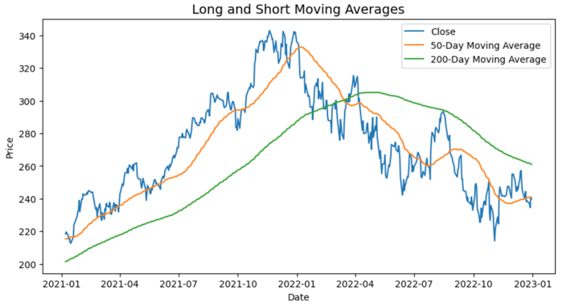

Backtesting serves a critical role in algorithmic trading, functioning as a tool that enables traders to assess the viability of trading strategies through the use of historical data. This step is essential before any strategy is applied to live markets, as it helps traders to understand how their strategies would have performed in different market conditions. Among the many metrics used in backtesting, the 'average holding period' stands out as a crucial indicator. This metric measures the average duration that a position is held in a given trading strategy. By comprehending the average holding period, traders can gain valuable insights into a strategy's inherent timeframe as well as its potential risks.

Understanding the average holding period allows traders to align their strategies with their investment objectives and risk management preferences. For instance, a higher average holding period might suggest that a strategy is oriented towards capturing significant market trends, whereas a shorter holding period may imply frequent buying and selling activities. The importance of this metric extends beyond mere operational metrics; it is instrumental in adapting strategies to specific market environments and trader profiles.



This article aims to explore the significance of the average holding period in the context of backtesting for algorithmic trading. It will cover essential metrics related to holding periods and best practices, providing a comprehensive guide for traders looking to optimize their strategies for better performance and reliability.

## Table of Contents

## What is Backtesting?

Backtesting is a fundamental process in [algorithmic trading](/wiki/algorithmic-trading), involving the simulation of a trading strategy over a historical dataset to gauge its effectiveness and potential future performance. By applying a strategy to past market data, traders gain insights into how it would have performed in real-world conditions without risking actual capital. This empirical analysis is crucial for validating a trading strategy before its execution in live markets, offering a preliminary assessment of its viability and reliability.

The process begins with the selection of historical price data across various financial instruments and time frames. The trading strategy is then coded into [backtesting](/wiki/backtesting) software, which replicates the trading rules, entry and [exit](/wiki/exit-strategy) signals, and risk management parameters. This simulation generates a range of performance metrics, such as net profit, winning and losing trades, drawdowns, and return on investment.

Mathematically, backtesting often involves calculating key performance metrics. For example, the cumulative return $R$ of a strategy over time is given by:

$$
R = \prod_{i=1}^{n} (1 + r_i) - 1
$$

where $r_i$ is the return of the strategy at time $i$, and $n$ is the total number of trading periods. Additionally, the Sharpe Ratio, a measure of risk-adjusted return, can be calculated as:

$$
\text{Sharpe Ratio} = \frac{\bar{R} - R_f}{\sigma_R}
$$

where $\bar{R}$ is the average return of the strategy, $R_f$ is the risk-free rate, and $\sigma_R$ is the standard deviation of returns.

The insights gained from backtesting help traders identify and rectify potential flaws within a strategy, ensuring that it operates as expected under varying market conditions. Traders can refine strategies by analyzing parameters that impact performance, such as transaction costs, slippage, and market [volatility](/wiki/volatility-trading-strategies). Enhanced by these refinements, strategies are more robust and aligned with their intended objectives when transitioned to live environments.

## Understanding the Average Holding Period

The average holding period represents the mean duration for which a position is held within a specified trading strategy. This metric provides crucial insights into the buying and selling frequency of the strategy and helps determine whether the approach is consistent with its intended timeframe, such as intraday, short-term, or long-term. A longer average holding period typically suggests that the strategy is designed to capture significant market trends, relying on extended trends rather than short price swings.

To calculate the average holding period, one can sum the duration of all trades executed within a backtest and divide by the total number of trades. For instance, if a strategy makes trades with holding periods of 2, 5, and 10 days, the average holding period would be calculated as follows:

$$
\text{Average Holding Period} = \frac{2 + 5 + 10}{3} = 5.67 \text{ days}
$$

Understanding whether a strategy maintains positions for hours, days, or weeks provides insight into its alignment with the trader’s goals and the broader market conditions. For example, a strategy with a brief average holding period might focus on high-frequency trading, capitalizing on small price movements within the day. Conversely, a strategy with a longer average holding period may target longer-term trend-following, seeking to benefit from sustained price movements over several weeks or months.

Aligning the average holding period with the strategy's objectives and the trader’s risk tolerance is essential for effective implementation. A discrepancy between the intended and actual holding periods could indicate a need for strategy adjustments. For instance, if a trader intends to employ a long-term strategy but discovers an unexpectedly short average holding period, it might suggest an issue, such as too frequent trades or a response to short-term volatility, requiring reevaluation and potential modification.

In summary, the average holding period serves as a vital indicator of a trading strategy's operational timeframe, contributing to understanding how and when trades are executed, and providing guidance on its strategic alignment and potential market focus.

## Importance of Average Holding Period in Backtesting

The average holding period is essential in backtesting, primarily due to its role in aligning a trading strategy with a trader's risk tolerance and market objectives. This metric reflects the duration for which trades are maintained, shedding light on various critical aspects of trading strategies.

Firstly, the average holding period provides insights into the trading frequency of a strategy. A shorter holding period may suggest a high-frequency trading approach, potentially leading to more transactions within a given timeframe. Conversely, a longer holding period indicates a more patient strategy, aiming to capture larger, slower-moving market trends. These differences are crucial when determining if a strategy aligns with a trader’s financial objectives and risk appetite. For instance, traders who prefer minimal daily trades to limit exposure might opt for strategies with longer holding periods.

Secondly, the average holding period plays a significant role in assessing transaction costs, which are an integral part of any algorithmic trading strategy. Frequent trading can incur higher transaction costs, such as brokerage fees and taxes, which can erode potential profits. The average holding period aids traders in estimating these costs over time, ensuring that they are factored into the overall strategy performance. 

Moreover, potential slippage—the difference between the expected price of a trade and the actual price—also correlates with holding periods. Short holding periods can increase exposure to slippage, especially in low-[liquidity](/wiki/liquidity-risk-premium) environments where market prices can shift rapidly. By evaluating the average holding period, traders can better anticipate these risks and adjust their strategies accordingly.

Lastly, understanding the average holding period assists traders in designing portfolios that align with their investment outlook and trading style. It provides the framework needed to balance the pursuit of returns with the management of risk. For instance, a conservative investor may prefer a strategy with a longer average holding period to mitigate market volatility's impact on their portfolio. 

In summary, the average holding period is a vital metric in backtesting, enabling traders to align their strategies with personal risk tolerance, manage transaction costs effectively, and design portfolios that suit their investment goals and trading styles.

## Factors Influencing Holding Period in Trading Strategies

Various factors influence the average holding period in trading strategies. One key aspect is the type of strategy employed. For instance, trend-following strategies, which aim to capitalize on market [momentum](/wiki/momentum), often involve holding positions for longer periods to capture substantial price movements. Conversely, mean-reversion strategies, which bet on price corrections to average levels, might entail shorter holding periods due to frequent counter-trend movements.

Market conditions also significantly affect holding periods. In volatile markets, traders may find themselves adjusting holding periods to accommodate rapid price changes, which can lead to increased trade opportunities or necessitate tighter risk management practices. In such environments, the swift shifts in market sentiment might prompt traders to reduce the duration of their holdings to mitigate risk.

Liquidity is another important [factor](/wiki/factor-investing) impacting holding periods. Highly liquid markets typically allow for quicker execution of trades with minimal price impact, enabling traders to adopt shorter holding periods efficiently. In contrast, in markets with lower liquidity, traders might need to extend their holding periods to avoid significant slippage and market impact costs when entering or exiting positions.

## Calculating and Optimizing Holding Periods

Calculating the average holding period during backtesting involves determining the mean duration a position is maintained within a trading strategy. This metric can be calculated using historical trade data by considering the entry and exit points of each trade. A basic formula for calculating the average holding period is:

$$
\text{Average Holding Period} = \frac{\sum (\text{Exit Date} - \text{Entry Date})}{\text{Number of Trades}}
$$

In practice, this calculation can be executed using computational tools and programming languages such as Python, which allow traders to automate and iterate over large datasets. A simple Python script using pandas, a popular data manipulation library, might appear as follows:

```python
import pandas as pd

# Assume trades_df is a DataFrame with 'entry_date' and 'exit_date' columns in datetime format
trades_df['holding_period'] = (trades_df['exit_date'] - trades_df['entry_date']).dt.days
average_holding_period = trades_df['holding_period'].mean()
print("Average Holding Period:", average_holding_period)
```

Optimization of holding periods involves aligning them with strategy goals and market conditions. Strategies can be modified to shorten or lengthen holding periods based on desired risk-reward profiles and transaction cost considerations. Adjusting parameters, such as stop-loss thresholds, profit targets, or signal triggers, may refine holding periods for optimal strategy performance.

Transaction costs play a critical role in determining the optimal holding period. High transaction costs necessitate longer holding periods to ensure trades remain profitable after accounting for expenses. Conversely, low transaction costs may allow for frequent trading and shorter holding periods. The impact of transaction costs can be evaluated by calculating the breakeven point where profit offsets these costs. This involves factoring in bid-ask spreads, commission fees, and slippage.

Thus, by calculating the average holding period and employing optimization techniques that account for transaction costs, traders can ensure their strategies are aligned with their objectives, ultimately improving performance and profitability.

## Impact of Holding Period on Performance Metrics

The holding period critically influences several key performance metrics in backtesting, such as the Compound Annual Growth Rate (CAGR), Sharpe Ratio, and maximum drawdown, by dictating the level of market exposure and transaction frequency.

The Compound Annual Growth Rate (CAGR) measures the mean annual growth rate of an investment over a specified time period longer than one year. A longer holding period might lead to capturing significant uptrends, thereby potentially enhancing CAGR. However, extended durations can also lead to sustained periods of underperformance during downturns, which can dampen CAGR:

$$
\text{CAGR} = \left( \frac{\text{Ending Value}}{\text{Beginning Value}} \right)^{\frac{1}{n}} - 1
$$

where $n$ is the number of years.

The Sharpe Ratio evaluates the risk-adjusted return of a strategy by comparing excess returns (returns above the risk-free rate) to the level of risk taken, typically measured as standard deviation. Variations in the holding period impact both the returns and volatility. Shorter holding periods might result in frequent trading, reducing the Sharpe Ratio due to higher transaction costs and volatility. Conversely, longer periods may help smooth out short-term market fluctuations, potentially improving the Sharpe Ratio:

$$
\text{Sharpe Ratio} = \frac{\overline{R} - R_f}{\sigma_R}
$$

where $\overline{R}$ is the average return of the portfolio, $R_f$ is the risk-free rate, and $\sigma_R$ is the standard deviation of the portfolio returns.

Maximum drawdown, the largest observed loss from a peak to a trough before a new peak is achieved, is another critical metric influenced by holding periods. Longer holding periods may exacerbate the impact of market downturns, increasing the maximum drawdown unless the strategy is adept at capturing only robust market movements. This metric is crucial for assessing the risk exposure related to the investment horizon.

A fundamental trade-off exists between longer holding periods and increased market risk exposure. While long-term strategies might capitalize on major market trends, they simultaneously subject the portfolio to extended periods of potential adverse conditions without modification. This increased risk must be weighed against the possibility of capturing substantial long-term returns. Understanding this balance is key for traders and strategists aiming to harmonize their approaches with their risk tolerance and performance objectives.

## Common Mistakes in Evaluating Holding Periods

Evaluating the average holding period in backtesting requires careful consideration to avoid common mistakes that can lead to suboptimal trading strategies. One significant error is failing to align the strategy's holding period with current market conditions or the trader's risk tolerance. A mismatch here can result in strategies that either take on excessive risk or miss out on potential gains. For example, a strategy designed for long-term holding might suffer in volatile markets, where quicker reaction is needed.

Another frequent oversight is the impact of transaction costs on strategies with shorter holding periods. These costs, including brokerage fees and bid-ask spreads, can eat into profits, especially when trades are frequent. Therefore, calculating the break-even trade frequency, $F = \frac{C}{P}$, where $C$ is the total transaction cost per trade and $P$ is the profit per trade, can help determine if the strategy remains viable at shorter durations.

Additionally, ignoring market volatility's effect on optimal holding periods can skew performance outcomes. Volatile markets often necessitate shorter holding periods to manage exposure and reduce risk. Conversely, in stable markets, longer holding periods may be preferred to capture extensive upward trends. Therefore, incorporating volatility measures, such as the Average True Range (ATR), into backtesting can provide a more robust evaluation of the holding period's suitability.

Overall, a thorough assessment of these factors is essential in backtesting to ensure that the chosen holding period aligns correctly with both market conditions and trading objectives.

## Conclusion

Incorporating an understanding of average holding periods is crucial for successful backtesting in algorithmic trading. By accurately analyzing this metric, traders can greatly enhance the performance of their strategies and ensure alignment with their trading goals. The average holding period provides valuable insight into a strategy's trading frequency, risk exposure, and transaction costs. 

Proper analysis of this metric allows traders to adjust their strategies to better fit desired timeframes, whether they be intraday, short-term, or long-term. Additionally, understanding how different holding periods impact key performance metrics such as Compound Annual Growth Rate (CAGR), Sharpe ratio, and maximum drawdown is essential for refining strategies to balance returns and risk effectively.

Furthermore, ongoing evaluation of holding periods helps traders adapt their strategies to ever-changing market conditions. This continued assessment can involve revisiting and re-optimizing holding periods to match shifts in market volatility, liquidity, and other external factors. By maintaining flexibility and responsiveness to market dynamics, traders can ensure their strategies remain effective and aligned with their investment objectives.

## References & Further Reading

[1]: Bergstra, J., Bardenet, R., Bengio, Y., & Kégl, B. (2011). ["Algorithms for Hyper-Parameter Optimization."](https://papers.nips.cc/paper/4443-algorithms-for-hyper-parameter-optimization) Advances in Neural Information Processing Systems 24.

[2]: ["Advances in Financial Machine Learning"](https://www.amazon.com/Advances-Financial-Machine-Learning-Marcos/dp/1119482089) by Marcos Lopez de Prado

[3]: ["Evidence-Based Technical Analysis: Applying the Scientific Method and Statistical Inference to Trading Signals"](https://www.amazon.com/Evidence-Based-Technical-Analysis-Scientific-Statistical/dp/0470008741) by David Aronson

[4]: ["Machine Learning for Algorithmic Trading"](https://github.com/PacktPublishing/Machine-Learning-for-Algorithmic-Trading-Second-Edition) by Stefan Jansen

[5]: ["Quantitative Trading: How to Build Your Own Algorithmic Trading Business"](https://books.google.com/books/about/Quantitative_Trading.html?id=j70yEAAAQBAJ) by Ernest P. Chan