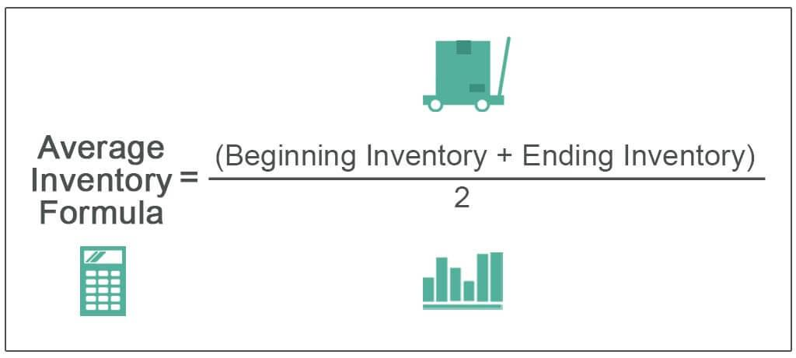

In the competitive world of trading and business management, effective inventory management plays a crucial role in optimizing financial health and market strategies. Whether managing stocks in a retail environment or handling securities in algorithmic trading, the principles of inventory management ensure that the right assets are available at the right time, minimizing costs and maximizing profitability.

This article explores key concepts such as average inventory calculation, inventory management techniques, and the implications of these metrics in algorithmic trading. Average inventory, typically calculated as the mean of beginning and ending inventory over a given period, offers insights into stock levels and helps forecast future inventory needs. By understanding this metric, businesses can make informed financial decisions, optimize stock levels, and avoid costly situations of surplus or shortage.



Inventory management techniques have evolved significantly over time, influenced by advancements in technology and the rise of data-driven decision-making. Traditional methods emphasized manual stock-taking and basic forecasting models, whereas modern approaches integrate sophisticated algorithms and real-time data analysis. Algorithmic trading, for example, utilizes advanced strategies to manage securities inventory effectively, balancing between maintaining adequate liquidity and minimizing market risk.

This article aims to blend insights from traditional inventory management with modern algorithmic trading approaches to provide a comprehensive understanding of the subject. By examining both conventional and contemporary practices, readers will gain perspective on how inventory management serves as a foundation for strong financial performance and strategic growth in today's dynamic market.

## Table of Contents

## Understanding Inventory Management

Inventory management involves tracking stock and resources to ensure that commodities are available at the right time, optimizing operations across various sectors. A critical component of supply chain management, effective inventory strategies help businesses minimize costs, reduce stockouts, avoid overstock situations, and enhance customer satisfaction by delivering the right products when needed. These objectives are achieved through accurate inventory level assessments, forecasts, and timely replenishment.

Inventory management systems often utilize techniques such as Just-In-Time (JIT), Economic Order Quantity (EOQ), and ABC analysis to balance supply and demand efficiently. JIT aims to decrease waste by receiving goods only as they are needed in the production process, reducing storage costs. EOQ models determine the ideal order quantity to minimize total inventory costs while fulfilling production needs. ABC analysis categorizes inventory into three classes: 'A' for high-value items with a low frequency of sales, 'B' for moderate value and frequency, and 'C' for low-value, high-frequency items, allowing businesses to prioritize resources accordingly.

In [algorithmic trading](/wiki/algorithmic-trading), inventory management extends to the finance sector, where it pertains to the quantity of securities held at any given time. This concept is pivotal for both risk and capital management. By maintaining appropriate inventory levels, traders can mitigate market risks and ensure [liquidity](/wiki/liquidity-risk-premium), enabling efficient execution of trades. Proper inventory management in trading helps in positioning strategies, capital allocation, and risk assessment, which are crucial for maximizing returns and sustaining competitiveness in the finance market. In this context, inventory management tools and algorithms use data-driven insights to refine models and predict market movements, optimizing the trading process.

In summary, effective inventory management systems are essential in both traditional business sectors and modern financial markets. They ensure that the right commodities or securities are available at the right time, thus streamlining operations, reducing costs, and improving overall efficiency.

## Average Inventory: Definition and Importance

Average inventory is a crucial financial metric that represents the mean value of a company's inventory over a set period, typically calculated by averaging the inventory levels at the beginning and end of that timeframe. Mathematically, it is expressed as:

$$
\text{Average Inventory} = \frac{\text{Beginning Inventory} + \text{Ending Inventory}}{2}
$$

This measure serves several important purposes in business management. Firstly, it helps organizations understand inventory trends, providing insight into their purchasing, production, and sales patterns. By analyzing these trends, businesses can make informed financial decisions concerning inventory procurement and warehouse management. This leads to optimized stock levels, which is essential to prevent surplus (where carrying costs increase and products risk becoming obsolete) or shortages (which can result in lost sales and dissatisfied customers). 

For algorithmic traders, average inventory holds particular significance. It aids in assessing the effectiveness of trading strategies by revealing how well a trading model maintains desired inventory levels amidst market fluctuations. Consequently, average inventory serves as an indicator of operational efficiency, pointing to how well resources are allocated and managed in trading activities. The ability to maintain optimal inventory levels is particularly pertinent in algorithmic trading, where capital utilization and risk management are closely monitored.

In applying average inventory in the context of algorithmic trading, traders can refine their approaches by assessing how average inventory aligns with their targets and constraints, adjusting strategies to optimize performance further. This enhances not only the understanding of current strategy effectiveness but also supports strategic planning for future trading operations.

## Calculating Average Inventory

Calculating average inventory is a critical aspect of inventory management that involves assessing the mean value of a company's stock over a designated period. This calculation is crucial for businesses to analyze stock trends, optimize stock levels, and make well-informed financial decisions. There are several methods to calculate average inventory, each serving different business needs and scenarios.

### Simple Average Method
The simple average method is the most straightforward and often used when there is a need for a quick estimation of inventory levels. It calculates the average by taking the sum of the beginning inventory and the ending inventory over a period and dividing by two:

$$
\text{Average Inventory} = \frac{\text{Beginning Inventory} + \text{Ending Inventory}}{2}
$$

This method is particularly useful in environments with stable inventory values, as it provides a clear snapshot of the inventory trend over the period. However, it may not accurately reflect inventory variations in cases with frequent transactions.

### Weighted Average Method
The weighted average method, often used in cost accounting, is suitable for scenarios where inventory costs and numbers fluctuate significantly. This method gives each inventory segment a weight proportional to its cost, allowing for a more accurate reflection of inventory value over time. The formula for the weighted average inventory is:

$$
\text{Weighted Average Cost} = \frac{\sum (\text{Cost of Inventory Purchased} \times \text{Quantity Purchased})}{\sum \text{Quantity Purchased}}
$$

This method is beneficial for businesses dealing with varying purchase costs, as it impacts the valuation of inventory and cost of goods sold in financial statements.

### Moving Average Method
The moving average method is a dynamic approach that continually updates the average inventory level as new data becomes available. This method is highly effective in fluctuating market conditions, as it smoothens out short-term [volatility](/wiki/volatility-trading-strategies) by considering a rolling average of inventory values over several periods. This method updates the average inventory by adding the most recent period's inventory and subtracting the oldest from a set window of data points.

A simple Python code snippet to calculate the moving average might look like this:

```python
def calculate_moving_average(inventory_list, window_size):
    moving_averages = []
    for i in range(len(inventory_list) - window_size + 1):
        window = inventory_list[i:i + window_size]
        moving_averages.append(sum(window) / window_size)
    return moving_averages

inventory_data = [100, 150, 200, 250, 300]
window_size = 3
print(calculate_moving_average(inventory_data, window_size))
```

### Choosing the Appropriate Method
The choice of method for calculating average inventory significantly impacts various aspects of inventory management, including the cost of goods sold, storage needs, and financial reporting. Businesses with stable and predictable inventory levels may benefit from the simplicity of the simple average method. In contrast, those facing fluctuating costs due to frequent sales and purchases might prefer the weighted average method to better align inventory valuation with actual costs. The moving average method offers a balanced approach for companies operating in volatile markets, ensuring that inventory calculations reflect recent trends and variations.

Selecting the appropriate method requires careful consideration of the business environment and inventory behavior to ensure accurate financial representation and efficient resource allocation.

## Inventory Calculation in Algorithmic Trading

In algorithmic trading, maintaining an optimal inventory level is pivotal for mitigating market risk, ensuring liquidity, and maximizing trading returns. Optimal inventory management involves adjusting the holdings of financial securities to align with market conditions and trading strategies. By leveraging inventory metrics, algorithmic traders can make informed decisions based on market trends, trading [volume](/wiki/volume-trading-strategy), and sentiment, thus enhancing their strategic positioning.

Average inventory, a key metric, is instrumental in providing insights into trading strategies' effectiveness. It reflects the operational efficiency of maintaining liquidity while minimizing exposure to adverse price movements. For instance, by calculating the average inventory, traders can ascertain whether their current holdings are excessive or insufficient relative to historical trading patterns and market expectations. 

Advanced algorithmic trading strategies such as statistical [arbitrage](/wiki/arbitrage) and market-making heavily depend on precise inventory management. In [statistical arbitrage](/wiki/statistical-arbitrage), traders exploit pricing inefficiencies between securities by taking offsetting positions that necessitate a careful balance between holding inventory and executing trades. The main objective is to keep the inventory levels such that they allow the capturing of temporary price discrepancies without excessive cost or risk.

In market-making, the strategy involves quoting buy and sell prices for financial instruments, and therefore, maintaining a balanced inventory is crucial to provide liquidity and capitalize on bid-ask spreads. A trader’s inventory must be adjusted to reflect changes in market demand and supply, which entails real-time inventory monitoring and adjustment algorithms.

The calculation and re-balancing of inventory in algorithmic trading can be facilitated by mathematical models and computational algorithms. One common approach is to employ a moving average method to compute the average inventory, which can adapt more quickly to recent data by placing greater weight on recent observations. This method is implemented in Python as follows:

```python
def moving_average(inventory_levels, window_size):
    weights = np.exp(np.linspace(-1., 0., window_size))
    weights /= weights.sum()
    moving_avg = np.convolve(inventory_levels, weights, mode='valid')
    return moving_avg
```

Implementing advanced inventory calculation techniques enables traders to manage their inventory more efficiently, thus reducing operational costs and exposure to risk. By using algorithmic trading platforms integrated with robust inventory management tools, traders can leverage quantitative insights to derive actionable strategies that enhance profitability and competitive edge in volatile markets.

Overall, effective inventory calculation and management in algorithmic trading are not merely about holding financial instruments but dynamically optimizing these holdings to align with trading strategies and market dynamics.

## Strategies and Tools for Effective Inventory Management

Effective inventory management requires a combination of strategic approaches and sophisticated tools to optimize stock levels, minimize costs, and maximize returns. In trading and business management, strategies like [trend following](/wiki/trend-following), mean reversion, and pairs trading are crucial for managing inventories effectively.

Trend following involves buying or selling assets based on the assumption that they will continue to move in the current direction. This strategy uses historical data and patterns to predict future movements, helping businesses and traders adjust their inventories accordingly. For example, if a particular asset's price is trending upward, a trader might increase holdings in anticipation of further gains.

Mean reversion is based on the expectation that prices and returns will eventually move back towards their historical averages. This strategy can inform inventory decisions by indicating when to buy underpriced assets or sell overpriced ones, balancing inventory levels accordingly. A Python implementation to check for mean reversion might use a rolling average to identify and act on deviations from the mean:

```python
import pandas as pd

# Example time series data
prices = pd.Series([101, 102, 98, 105, 103, 100, 97, 96, 102, 101])

# Calculating rolling mean
rolling_mean = prices.rolling(window=3).mean()

# Strategy: buy if price < rolling mean, sell if price > rolling mean
signals = prices - rolling_mean
buy_signals = signals < 0
sell_signals = signals > 0
```

Pairs trading focuses on the statistical correlation between two assets' prices, profiting from the convergence and divergence tendencies. By simultaneously buying and selling correlated assets, traders can maintain a balance in inventory while hedging against market volatility.

Alongside these strategies, various tools and technologies are essential for accurate inventory management. Algorithmic trading platforms and risk management software facilitate real-time data analysis and decision-making. These platforms allow for automated execution of trades based on pre-defined criteria, enhancing efficiency and accuracy in inventory management.

Advanced analytics and [machine learning](/wiki/machine-learning) further augment inventory management by offering predictive insights and improving tracking capabilities. Machine learning algorithms can analyze vast datasets to identify patterns, forecast demand, and suggest optimal inventory levels. For instance, a machine learning model could be trained to predict inventory needs based on historical sales data, seasonal trends, and market conditions:

```python
from sklearn.model_selection import train_test_split
from sklearn.linear_model import LinearRegression

# Hypothetical sales and inventory dataset
data = pd.DataFrame({
    'sales': [100, 150, 200, 250, 300],
    'inventory': [50, 80, 120, 160, 200]
})

# Training a simple linear regression model
X = data[['sales']]
y = data['inventory']
X_train, X_test, y_train, y_test = train_test_split(X, y, test_size=0.2)

model = LinearRegression()
model.fit(X_train, y_train)

# Predicting inventory for a given sales figure
predicted_inventory = model.predict([[275]])
```

These strategies and tools collectively contribute to efficient capital utilization, ensuring businesses and traders can maintain optimal inventory levels while navigating the complexities of market dynamics. Effective integration of strategic approaches with advanced technology enables organizations to remain competitive and adaptive in rapidly evolving markets.

## Challenges and Limitations of Average Inventory

Average inventory is an essential metric for evaluating stock levels and operational efficiency, yet it inherently presents specific challenges and limitations. The fundamental issue with average inventory lies in its static nature, which may not accurately reflect real-time changes in inventory levels. This static snapshot can lead to potential misalignments, especially in environments characterized by high volatility or rapidly changing demand patterns. 

Moreover, the method used to calculate average inventory, whether it is a simple average, weighted average, or moving average, can sometimes fail to capture the subtleties of inventory fluctuations over extended periods. For example, the formula for simple average inventory is:

$$
\text{Average Inventory} = \frac{\text{Beginning Inventory} + \text{Ending Inventory}}{2}
$$

This computation provides a general sense of inventory levels but does not account for the dynamic nature of supply chains where stock levels can vary significantly within a given timeframe. A moving average approach might offer more insight by smoothing out short-term fluctuations, but it still assumes a level of constancy in inventory movements that might not exist.

Additionally, average inventory calculations often do not adequately consider seasonal variations, which can dramatically affect stock levels. Businesses with pronounced seasonal patterns may find average inventory calculations misleading, as these might suggest stable inventory conditions even when significant seasonal shifts occur. This could result in either overstocking before peak seasons or understocking during demanding periods, leading to increased holding costs or potential stockouts.

To address these limitations and gain a more comprehensive understanding of inventory dynamics, traders and businesses should use additional metrics. Key supplementary measures include the inventory turnover ratio, which evaluates how frequently inventory is sold and replaced over a specific period. This calculation is important for gauging the efficiency of inventory management and is expressed as:

$$
\text{Inventory Turnover Ratio} = \frac{\text{Cost of Goods Sold}}{\text{Average Inventory}}
$$

Another useful metric is inventory holding costs, which encompass direct costs like storage and insurance, providing insights into the financial implications of inventory decisions.

Using a combination of these metrics allows for a more holistic view of inventory management, leading to informed decision-making. By considering both the limitations and the supplemental tools available, businesses and traders can better manage their inventory to align with market demands and financial goals.

## Conclusion

Understanding and managing average inventory is essential for businesses and traders aiming to optimize their operational efficiency and financial performance. By maintaining accurate and insightful inventory metrics, organizations can make informed decisions that directly influence both the cost-efficiency and profitability of operations. The average inventory metric serves as a fundamental tool in this optimization process, offering insights into stock levels, capital allocation, and overall supply chain management. 

Integrating advanced technologies and strategic methods revolutionizes inventory management, transforming it into a vital facet of successful business operations. Technologies such as [artificial intelligence](/wiki/ai-artificial-intelligence), machine learning, and predictive analytics enable businesses to forecast demand with greater accuracy, minimize stockouts, and reduce excess inventory. These technologies allow for real-time data analysis, predictive ordering, and automated replenishment, optimizing inventory levels seamlessly.

As the business landscape evolves, adapting to dynamic inventory practices will remain integral to achieving sustainable growth and competitiveness. Businesses must move beyond traditional inventory management methods, embracing adaptive strategies that respond swiftly to market changes, consumer demands, and technological advancements. This adaptability not only mitigates risks associated with inventory mismanagement but also positions businesses to leverage inventory as a strategic asset.

Furthermore, businesses should consider the implications of inventory decisions not just on internal financial performance, but also on customer satisfaction and market positioning. An agile, technologically-equipped inventory system is vital for supporting rapid shifts in strategy and operation, ensuring that businesses remain resilient and competitive in the face of global market fluctuations. Ultimately, successful inventory management — powered by advanced tools and forward-thinking strategies — will continue to be a cornerstone of business success.

## References & Further Reading

[1]: Arnold, T., Crack, T. F., & Schwartz, A. L. (2006). ["Valuation formulas for inventory with uncertain holding costs."](https://www.semanticscholar.org/paper/Real-Option-Valuation-Using-NPV-Arnold-Crack/7798e5bc44be7c55054b9ca45be0d364867a98a6) European Journal of Operational Research, 175(3), 1795-1800.

[2]: ["Inventory Management: Principles, Concepts and Techniques"](https://link.springer.com/book/10.1007/978-1-4615-4363-3) by John A. Muckstadt and Amar Sapra

[3]: ["Advances in Financial Machine Learning"](https://www.amazon.com/Advances-Financial-Machine-Learning-Marcos/dp/1119482089) by Marcos Lopez de Prado

[4]: Konsynski, B., & McFarlan, F. W. (1990). ["Information Partnerships—Shared Data, Shared Scale."](https://hbr.org/1990/09/information-partnerships-shared-data-shared-scale) Harvard Business Review.

[5]: Vollmann, T. E., Berry, W. L., Whybark, D. C., & Jacobs, F. R. (2005). ["Manufacturing Planning and Control Systems for Supply Chain Management"](https://www.mhebooklibrary.com/doi/book/10.1036/9780071750325) (5th ed.). McGraw-Hill.