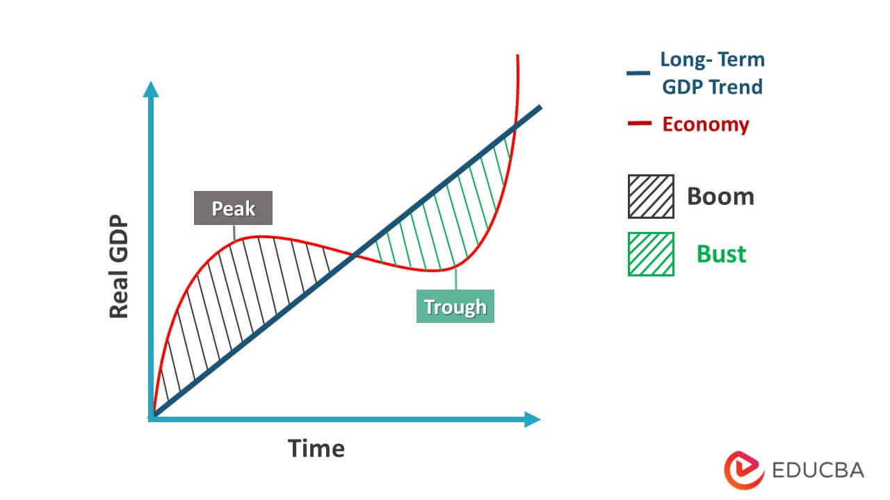

## Table of Contents

## What is an economic cycle?

An economic cycle, also known as a business cycle, is the natural rise and fall of economic activity over time. It includes periods of growth, known as expansions, and periods of decline, known as recessions. These cycles are influenced by many factors, like interest rates, employment, consumer spending, and government policy. Understanding economic cycles helps people and businesses plan for the future.

During an expansion, the economy grows, businesses make more money, and people often find it easier to get jobs. This is a time when consumer confidence is high, and spending increases. However, expansions don't last forever. Eventually, the economy might slow down and enter a recession. In a recession, businesses might struggle, unemployment can rise, and people may spend less money. Recessions can be tough, but they are a normal part of the economic cycle.

After a recession, the economy usually starts to recover and begins another expansion. This pattern of ups and downs repeats over time. Economists study these cycles to predict when changes might happen and to help guide economic policy. While no one can predict the future perfectly, understanding economic cycles can help people and businesses prepare for both good times and bad.

## What are the phases of an economic cycle?

An economic cycle has four main phases: expansion, peak, contraction, and trough. The expansion phase is when the economy is growing. Businesses do well, people have jobs, and everyone feels confident about spending money. This growth continues until the economy reaches its peak. At the peak, the economy is at its strongest, but it can't keep growing forever. This is when things start to slow down.

After the peak comes the contraction phase. During contraction, the economy starts to shrink. Businesses might struggle, and people might lose their jobs. If the contraction lasts long enough, it turns into a recession. Eventually, the economy hits its lowest point, called the trough. At the trough, things start to get better again. The economy begins to recover, and a new expansion phase starts. This cycle of growth and decline repeats over time.

## How is an economic boom defined?

An economic boom is a time when the economy grows a lot and very fast. During a boom, businesses make more money, more people have jobs, and everyone feels good about spending money. It's like the economy is on a big, exciting ride up. People buy more things, companies invest more, and the stock market often goes up too. This growth can make everyone feel rich and happy.

But booms don't last forever. They are part of the bigger economic cycle. After a boom, the economy might slow down and even go into a recession. It's important to enjoy the good times but also to be ready for when things might get tough. Economists watch for signs of a boom so they can help guide the economy and try to make the good times last as long as possible.

## What constitutes an economic bust?

An economic bust is when the economy starts to shrink a lot. It's the opposite of a boom. During a bust, businesses don't make as much money, and people start losing their jobs. This makes everyone worried, so they spend less money. When people spend less, it can make the economy shrink even more. It's like a big, scary slide down for the economy.

Busts can last for a while and can turn into a recession. A recession is when the economy is down for a long time. During a bust, the stock market might go down a lot, and companies might have to close. It's a tough time, but it's also a normal part of the economic cycle. After a bust, the economy usually starts to get better again, and a new boom can begin.

## What is the average length of an economic boom?

The average length of an economic boom can be different each time. Usually, a boom lasts about 3 to 5 years. But it can be shorter or longer. It depends on things like how much people are spending, what the government is doing, and what's happening in the world.

During a boom, the economy grows fast. Businesses do well, more people have jobs, and everyone feels good about spending money. But after a while, the economy can't keep growing so fast. That's when the boom might end, and the economy might start to slow down or even go into a bust.

## What is the average length of an economic bust?

An economic bust usually lasts about 1 to 2 years on average. But this can change a lot. It depends on things like how bad the bust is, what the government does to help, and what's happening around the world.

During a bust, the economy shrinks. Businesses don't make as much money, and people lose their jobs. This makes everyone worried, so they spend less money. When people spend less, it can make the economy shrink even more. After a bust, the economy usually starts to get better again, and a new boom can begin.

## How have the lengths of economic cycles changed over time?

The lengths of economic cycles have changed over time. In the past, economic cycles used to be shorter. They could last just a few years. This was because the economy was smaller and could change quickly. Also, there were fewer ways for the government to help during tough times. Now, economic cycles are often longer. They can last from 6 to 10 years or even more. This is because the economy is bigger and more complex. Governments and central banks have more tools to help keep the economy stable.

One big reason for longer economic cycles is better economic policies. Governments and central banks can now do things like change interest rates or spend more money to help the economy. This can make booms last longer and make busts less bad. Another reason is that the world is more connected now. What happens in one country can affect others. This can make economic cycles more stable but also means that big problems can spread more easily. Overall, economic cycles have gotten longer and more stable over time, but they can still be hard to predict.

## What factors influence the duration of economic booms and busts?

Many things can change how long an economic boom or bust lasts. One big [factor](/wiki/factor-investing) is what the government does. If the government spends more money or changes interest rates, it can help the economy grow longer or make a bust less bad. Another factor is what people and businesses do. If people keep spending money and businesses keep investing, a boom can last longer. But if people start saving more and businesses stop investing, a bust can come faster.

The world also plays a big role. If other countries are doing well, it can help a boom last longer. But if there are big problems in other countries, it can make a bust worse. Technology and new ideas can also affect how long booms and busts last. New technology can make the economy grow faster, making booms longer. But if the economy depends too much on one thing, like housing, a bust can be worse when that thing stops growing.

## How do different countries experience economic cycles differently?

Different countries can have very different experiences with economic cycles. This is because each country has its own mix of things like government policies, how much people spend, and what businesses do. For example, a country with a strong government that can spend a lot of money during tough times might have shorter and less bad busts. On the other hand, a country that depends a lot on one thing, like oil or tourism, can have big booms when that thing is doing well but also big busts when it's not.

The world also affects how countries experience economic cycles. If a big country like the United States or China has a boom, it can help other countries have booms too. But if those big countries have a bust, it can make other countries have busts as well. This is because countries trade with each other and invest in each other's businesses. So, what happens in one country can spread to others, making economic cycles more connected but also more complicated.

## What are the economic indicators used to measure the start and end of boom and bust cycles?

Economists use different signs, called economic indicators, to figure out when a boom starts and ends. One big sign is the Gross Domestic Product (GDP), which shows how much a country's economy is growing. When GDP goes up a lot, it might mean a boom is starting. But if GDP starts to grow more slowly or even goes down, it could mean the boom is ending and a bust might be coming. Another sign is unemployment. When more people have jobs, it's often a sign of a boom. But if more people start losing their jobs, it can mean a bust is happening.

Another important indicator is the stock market. When stock prices go up a lot, it can mean people feel good about the economy and a boom is happening. But if stock prices start to fall a lot, it might mean people are worried and a bust could be starting. Consumer spending is also a big sign. When people spend more money, it can help a boom last longer. But if people start saving more and spending less, it can mean a bust is coming. These indicators help economists understand where the economy is in its cycle and what might happen next.

## How do economic theories explain the causes of booms and busts?

Economic theories give different ideas about why booms and busts happen. One popular theory is the business cycle theory, which says that booms and busts are a normal part of how the economy works. According to this theory, booms start when people feel good about the economy and spend more money. This spending helps businesses grow and hire more people, which makes the economy grow even more. But after a while, too much spending can lead to inflation, where prices go up a lot. When prices go up, people might start spending less, and this can lead to a bust. The economy slows down, businesses struggle, and people lose jobs. Then, the cycle starts over again when things get better.

Another theory is the Austrian business cycle theory, which focuses on how money and interest rates affect the economy. This theory says that booms happen when there's too much easy money, often from low interest rates set by the government or central banks. When money is easy to get, businesses borrow more and invest in new projects, which can lead to a boom. But if these projects aren't really needed or useful, they can fail, leading to a bust. The bust happens when businesses can't pay back their loans, and the economy shrinks. This theory suggests that trying to keep the economy growing with easy money can lead to big problems later.

Both theories agree that booms and busts are part of the economy, but they have different ideas about why they happen and what can be done about them. Understanding these theories can help people and governments make better choices to try to make booms last longer and make busts less bad.

## What are the predictive models for forecasting the length of future economic cycles?

Predictive models for forecasting the length of future economic cycles use a lot of data and math to try to guess what will happen next. These models look at things like how much people are spending, how many people have jobs, and how well businesses are doing. They also look at past economic cycles to see how long they lasted and what made them change. By putting all this information together, economists can make guesses about how long the next boom or bust might last. But these guesses aren't always right because the economy can be hard to predict.

One kind of model is called a leading indicator model. This model uses signs that show up before a boom or bust to try to guess when it will happen. For example, if people start spending more money before a boom, that's a leading indicator. Another kind of model is called an econometric model. This model uses math formulas to look at lots of different parts of the economy at the same time. It can be really complicated but can help give a more complete picture of what might happen. Both types of models help economists and policymakers plan for the future, even if they can't be sure exactly what will happen.

## References & Further Reading

[1]: Bergstra, J., Bardenet, R., Bengio, Y., & Kégl, B. (2011). ["Algorithms for Hyper-Parameter Optimization."](https://dl.acm.org/doi/10.5555/2986459.2986743) Advances in Neural Information Processing Systems 24.

[2]: ["Advances in Financial Machine Learning"](https://www.amazon.com/Advances-Financial-Machine-Learning-Marcos/dp/1119482089) by Marcos Lopez de Prado

[3]: ["Evidence-Based Technical Analysis: Applying the Scientific Method and Statistical Inference to Trading Signals"](https://www.amazon.com/Evidence-Based-Technical-Analysis-Scientific-Statistical/dp/0470008741) by David Aronson

[4]: ["Machine Learning for Algorithmic Trading"](https://github.com/stefan-jansen/machine-learning-for-trading) by Stefan Jansen

[5]: ["Quantitative Trading: How to Build Your Own Algorithmic Trading Business"](https://github.com/LucindaYa/quant-resources/blob/master/Quantitative%20Trading%20How%20to%20Build%20Your%20Own%20Algorithmic%20Trading%20Business.pdf) by Ernest P. Chan