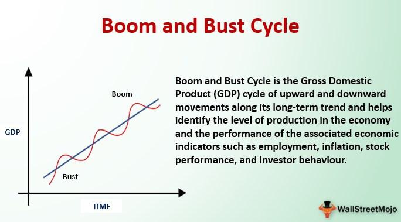

Understanding the boom and bust cycles is pivotal for grasping the nature of economic fluctuations. These cycles, characterized by alternating phases of economic expansion and contraction, are fundamental to the analysis of both historical and contemporary economic conditions. A boom phase is marked by robust economic growth, increased employment, and rising asset prices, often leading to periods of high confidence and investment. Conversely, the bust phase brings about economic contraction, increased unemployment, and declining asset prices, generating challenges for policymakers and investors.

Algorithmic trading has emerged as a modern tool to navigate these cycles, utilizing complex algorithms to execute trades based on predictions about these economic phases. This computational approach allows for rapid response to market changes, leveraging historical data and sophisticated modeling techniques to anticipate shifts in the economic landscape. 



This article aims to explore how economic cycles and algorithmic trading are interlinked, examining their historical underpinnings and the potential of technology to refine market strategies. By understanding the dynamics of boom and bust cycles, market participants can better position themselves to mitigate risks and capitalize on opportunities presented by economic fluctuations.

## Table of Contents

## Understanding Boom and Bust Cycles

Boom and bust cycles are fundamental aspects of understanding broader economic fluctuations, encompassing alternating phases of rapid economic growth and contraction. The boom phase is distinguished by robust economic activity characterized by increased consumer and business spending, resulting in high levels of production and employment. During this period, there is typically a surge in asset prices, including equities, real estate, and other investment vehicles, often fueled by investor optimism and sometimes by speculative behaviors.

During boom periods, several indicators reflect economic health. Key among these indicators are gross domestic product (GDP) growth, low unemployment rates, and inflation rate management. The GDP—the total monetary value of all goods and services produced within a country—often grows at an accelerated rate, signaling economic expansion. For instance, a country's GDP might grow noticeably in quarters leading up to the peak of a boom cycle.

In contrast, bust phases are marked by economic contraction, wherein economic activities slow down significantly. This downturn often results in increased unemployment as companies cut back on production and workforce in response to decreased demand. Consequently, asset values tend to plummet, leading to lower stock prices, declining real estate values, and sometimes even deflationary pressures.

Historically, several factors have played significant roles in shaping these cycles. One of the most critical is monetary policy, which involves central banks managing the money supply and interest rates to influence economic conditions. During booms, central banks might increase interest rates to control inflation, which can inadvertently trigger a downturn if the tightening is too severe. Conversely, during busts, they might lower interest rates to stimulate borrowing and investment.

Speculative bubbles also significantly contribute to boom and bust cycles. These bubbles occur when asset prices rise rapidly to levels that are unsustainable compared to their intrinsic values. Once the market corrects itself, a sharp decline often follows, initiating a bust cycle. Historical instances, such as the dot-com bubble in the late 1990s and the housing market bubble prior to the 2008 financial crisis, illustrate the pronounced impact speculative bubbles can have.

Understanding these cycles requires analyzing economic indicators and historical precedents to discern patterns and anticipate potential outcomes. While economic theory provides models to explain these oscillations, real-world application frequently involves complexities due to the myriad of influencing factors and the interconnectedness of global markets.

## Historical Business Cycles

From 1945 to 2009, the United States experienced economic cycles characterized by distinct periods of expansions and contractions. During this period, expansions averaged 58 months, while contractions were notably shorter, averaging 11 months. This cyclical nature highlights the ebb and flow of economic activities, influenced by various internal and external factors.

The Great Depression is one of the most severe examples of a bust period in modern history. Triggered by the stock market crash of 1929, the ensuing economic downturn led to a significant decline in economic output, skyrocketing unemployment rates, and widespread financial instability. The impact of the Great Depression was felt globally, causing a re-evaluation of economic policies and theories prevalent at the time.

Similarly, the 2008 Financial Crisis serves as a contemporary example of a bust period with far-reaching consequences. Initiated by the collapse of Lehman Brothers and a crisis in mortgage-backed securities, the resulting financial turmoil affected global markets, leading to massive job losses, a significant downturn in global GDP, and necessitated unprecedented intervention by governments and central banks to stabilize economies.

The recurrence of boom and bust cycles is a testament to the complex nature of economic systems. Factors such as monetary policies, fiscal decisions, technological innovations, and speculative activities contribute to these cycles. Understanding historical patterns of expansions and contractions can provide valuable insights into current economic conditions, aiding policymakers, economists, and investors in making informed decisions. By analyzing past economic cycles, it becomes possible to anticipate potential future trends and implement measures to mitigate the adverse effects of bust periods while capitalizing on growth opportunities during booms.

## Algorithmic Trading and Economic Cycles

Algorithmic trading has become a key player in the evolving landscape of financial markets, particularly concerning economic cycles. By leveraging sophisticated algorithms, traders can execute large volumes of orders with precision and speed based on dynamic assessments of economic conditions. These algorithms evaluate economic indicators, price movements, historical data, and even non-traditional datasets to predict and respond to cyclical market changes.

At the core of [algorithmic trading](/wiki/algorithmic-trading) is its ability to enhance market [liquidity](/wiki/liquidity-risk-premium). Liquidity refers to the ease with which assets can be bought or sold in the market without affecting their price. During periods of economic expansion, algorithmic systems facilitate smoother transactions, reducing bid-ask spreads and making markets more efficient. However, this efficiency comes at a cost during economic contractions, where rapid, automated trades can exacerbate price [volatility](/wiki/volatility-trading-strategies). This phenomenon is particularly evident during sudden market downturns, where programmed trading can lead to a cascade of sell orders, intensifying market declines.

Algorithmic trading operations heavily rely on historical data to identify trends and predict future movements. Machine learning and [artificial intelligence](/wiki/ai-artificial-intelligence) play a significant role in this context. These technologies enable the development of predictive models that analyze extensive datasets to uncover patterns that are not immediately obvious to human analysts. For instance, algorithms use time series analysis to detect seasonal patterns or long-term economic cycles, aligning trading strategies accordingly. Consider the implementation of a simple moving average crossover strategy, where trade decisions are made based on the crossing of short-term and long-term moving averages. This strategy highlights the reactive nature of algorithmic trading:

```python
import pandas as pd

# Sample data: 'data' is a DataFrame with 'Close' prices of a security
data['Short_MA'] = data['Close'].rolling(window=40, min_periods=1).mean()
data['Long_MA'] = data['Close'].rolling(window=100, min_periods=1).mean()

# Trading Signals
data['Signal'] = 0.0
data['Signal'][40:] = np.where(data['Short_MA'][40:] > data['Long_MA'][40:], 1.0, 0.0)
data['Position'] = data['Signal'].diff()

# Plotting
plt.figure(figsize=(10, 5))
plt.plot(data['Close'], label='Close Price')
plt.plot(data['Short_MA'], label='40-Day SMA', alpha=0.6)
plt.plot(data['Long_MA'], label='100-Day SMA', alpha=0.6)
plt.legend(loc='best')
plt.title('Moving Average Crossover Strategy')
plt.show()
```

The efficacy of algorithmic trading within economic cycles also stems from its ability to rapidly adjust to market changes. Algorithms can continuously process incoming data, updating their forecasts and modifying trading actions accordingly. This capacity for swift adjustment positions algorithmic trading as a potent tool during both economic booms and downturns. However, the same adaptability raises concerns over market stability, as the collective impact of algorithmic trades can lead to flash crashes or sudden liquidity shortages.

In conclusion, algorithmic trading rides the tides of economic cycles with both skill and caution. While these systems offer significant advantages in terms of speed and efficiency, their impact on market stability remains a subject of ongoing research and regulatory scrutiny. Understanding and harnessing the synergy between economic cycles and sophisticated trading algorithms can potentially transform trading strategies and market dynamics in the years to come.

## Integrating Economic History with Algorithmic Strategies

Machine learning models are pivotal in translating historical economic data into actionable predictions for future trends. These models rely on sophisticated techniques to analyze and interpret the vast array of historical data available, offering insights to bolster algorithmic trading strategies.

One primary method employed is time series analysis, which is instrumental in identifying and utilizing patterns from the past. Time series analysis allows traders to account for temporal dependencies and patterns in data, facilitating predictions about future market behaviors. This involves techniques like the Autoregressive Integrated Moving Average (ARIMA) model, which is adept at forecasting when historical data exhibits patterns over time. The ARIMA model leverages its parameters to capture the nuances of time series data: the autoregressive term (AR), integrated term (I), and moving average term (MA).

```python
import pandas as pd
from statsmodels.tsa.arima.model import ARIMA

# Example of ARIMA model implementation
data = pd.read_csv('historical_economic_data.csv')
model = ARIMA(data, order=(5, 1, 0))  # AR(5), I(1), MA(0) as an example
model_fit = model.fit()
forecast = model_fit.forecast(steps=10)
print(forecast)
```

Machine learning algorithms, such as neural networks and support vector machines, are also essential in processing historical economic data to detect complex patterns that traditional statistical methods might miss. Neural networks, particularly recurrent neural networks (RNNs) and their more advanced form, Long Short-Term Memory networks (LSTMs), are designed to handle sequential data, making them ideal for economic pattern prediction.

Case studies demonstrate the benefits of integrating historical insights into algorithmic trading strategies. An analysis of stock market data from previous financial crises can inform algorithms about the telltale signs of impending market downturns. This historical insight improves the algorithms' predictive accuracy, thus enhancing trading outcomes.

By combining historical economic data with [machine learning](/wiki/machine-learning) models, traders can refine their strategies and make informed decisions. This integration not only enhances predictive accuracy but also augments the capacity of algorithmic systems to respond adeptly to market dynamics. The symbiotic relationship between economic history and algorithmic strategies manifests in more robust, adaptable, and forward-looking trading platforms.

## Mitigating Effects of Boom and Bust Cycles

Monetary policy adjustments can serve as vital tools in stabilizing economies during bust phases. Central banks often adjust interest rates to influence economic activity; lowering rates can stimulate borrowing and investment, thereby encouraging economic growth. Quantitative easing, involving the purchase of government securities, also injects liquidity into the economy, encouraging lending and investment. These measures aim to soften the blow of economic downturns and pave the way for recovery.

To curb speculation and minimize risks during both boom and bust cycles, regulatory frameworks play a crucial role. Governments and financial institutions implement regulations such as capital requirements, which mandate financial institutions to maintain sufficient capital reserves, and stress testing, ensuring financial entities can withstand economic shocks. These regulations mitigate the risks associated with excessive speculation and prevent the amplification of economic fluctuations.

Companies employ advanced risk management strategies to safeguard against economic volatility. These strategies include diversification, which involves spreading investments across various asset classes, and hedging, which uses financial instruments like options and futures to offset potential losses. Predictive analytics and real-time data monitoring also enable companies to anticipate market changes and adjust strategies accordingly.

By utilizing these monetary, regulatory, and strategic approaches, economies can better navigate the inherent volatility of boom and bust cycles, sustaining long-term stability and growth.

## Conclusion

Boom and bust cycles remain integral to understanding market dynamics. These cyclical patterns, characterized by alternating periods of economic expansion and contraction, have been observed historically and continue to shape modern financial environments. Algorithmic trading, a sophisticated method involving the use of pre-programmed trading instructions and algorithms, offers potential advantages in navigating these cycles. The adaptability and speed of algorithmic systems enable traders to make rapid decisions based on market conditions, helping to optimize returns during both boom and bust phases.

However, the integration of algorithmic trading into economic cycles requires careful adaptation and oversight. While algorithmic trading systems can enhance market efficiency and liquidity, they can also exacerbate volatility, particularly during unpredictable economic shifts. This dual nature underscores the necessity for comprehensive regulatory frameworks and robust risk management strategies to mitigate potential negative impacts.

As economic cycles evolve, the synergy between historical analysis and modern data science holds considerable promise for financial markets. Machine learning and advanced data analytics allow for more accurate predictions of economic trends by incorporating vast historical datasets into algorithmic trading strategies. This fusion of historical economic insights with contemporary analytical techniques offers the potential for improved forecasting and decision-making in financial markets.

In summary, understanding boom and bust cycles is crucial for optimizing trading strategies, and algorithmic trading serves as a powerful tool when supported by informed oversight and data-driven insights. The ongoing evolution of economic cycles and technological advancements suggests that the dynamic interplay between these elements will continue to influence financial markets significantly.

## References & Further Reading

[1]: Bergstra, J., Bardenet, R., Bengio, Y., & Kégl, B. (2011). ["Algorithms for Hyper-Parameter Optimization."](https://dl.acm.org/doi/10.5555/2986459.2986743) Advances in Neural Information Processing Systems 24.

[2]: ["Advances in Financial Machine Learning"](https://www.amazon.com/Advances-Financial-Machine-Learning-Marcos/dp/1119482089) by Marcos Lopez de Prado

[3]: ["Evidence-Based Technical Analysis: Applying the Scientific Method and Statistical Inference to Trading Signals"](https://www.amazon.com/Evidence-Based-Technical-Analysis-Scientific-Statistical/dp/0470008741) by David Aronson

[4]: ["Machine Learning for Algorithmic Trading"](https://github.com/stefan-jansen/machine-learning-for-trading) by Stefan Jansen

[5]: ["Quantitative Trading: How to Build Your Own Algorithmic Trading Business"](https://github.com/LucindaYa/quant-resources/blob/master/Quantitative%20Trading%20How%20to%20Build%20Your%20Own%20Algorithmic%20Trading%20Business.pdf) by Ernest P. Chan