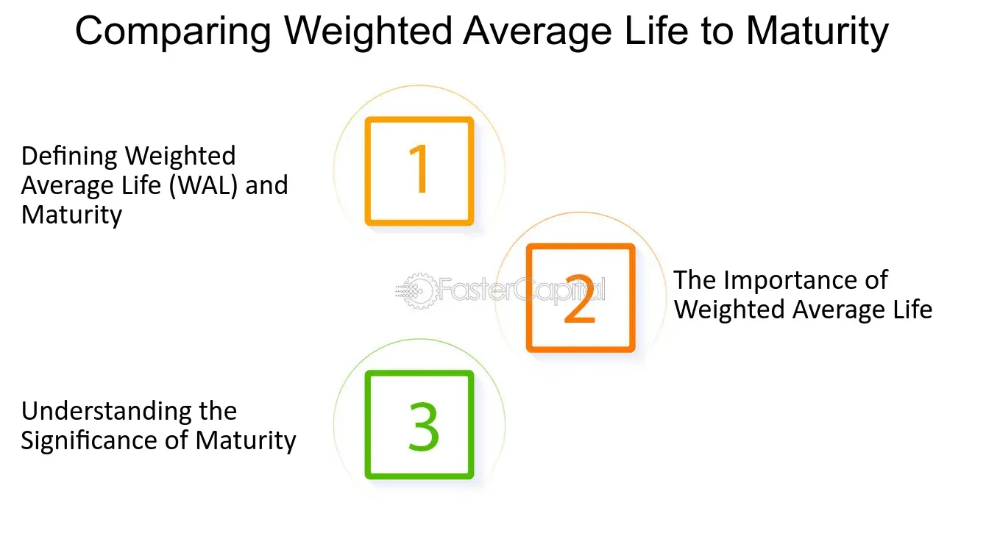

## Table of Contents

## What is the concept of average life?

The concept of average life, often called half-life, is a way to measure how long it takes for half of a substance to decay or change. Imagine you have a bucket of sand and you start taking out half of it every hour. After one hour, you'll have half the sand left. After another hour, you'll have a quarter of the original amount. This idea is used a lot in science, especially with things like radioactive materials where atoms break down over time.

In everyday life, the average life can help us understand things like how long a new phone battery will last before it needs to be replaced. If a battery's average life is two years, it means that after two years, half of the batteries of that type will have worn out. This helps companies and people plan better, knowing when things might need to be replaced or fixed. It's a simple but powerful way to predict and manage the life of products and materials.

## How is average life calculated?

To calculate the average life, you need to know how fast something is changing or breaking down. Imagine you have a bunch of light bulbs and you want to know how long they last on average. You turn them on and keep track of when each one burns out. The average life is found by adding up all the times each bulb lasted and then dividing by the number of bulbs. So, if one bulb lasted 100 hours, another 200 hours, and a third 300 hours, you add 100 + 200 + 300 and then divide by 3. That gives you an average life of 200 hours.

In science, like with radioactive materials, average life is a bit trickier but follows a similar idea. Scientists use a special formula that involves the rate at which atoms decay. They measure how long it takes for half of the atoms to break down, which is called the half-life. From the half-life, you can calculate the average life using a formula that takes into account the continuous nature of the decay. It's a bit like figuring out the average age of a group of people, but instead of ages, you're dealing with how long atoms last before they change.

## What factors influence the average life of a population?

The average life of a population can be influenced by many things. One big factor is healthcare. If people have good doctors and hospitals, they can live longer because they get help when they're sick. Another factor is the environment. If the air and water are clean, people tend to be healthier and live longer. Also, what people eat matters a lot. A diet full of good food like fruits and vegetables can help people live longer.

Lifestyle choices also play a big role. If people smoke or drink a lot of alcohol, it can shorten their lives. On the other hand, exercising and staying active can help people live longer. Education is another important factor. People who go to school and learn about health often make better choices that help them live longer. All these things together can make a big difference in how long people in a population live on average.

## How does average life differ from life expectancy?

Average life and life expectancy are two different ways to talk about how long people live. Average life, also called mean life, is like finding the average age of everyone in a group when they die. You add up all the ages at which people died and then divide by the number of people. It gives you a single number that represents the typical lifespan of the whole group.

Life expectancy, on the other hand, is a prediction about how long someone might live based on when they were born. It looks at things like healthcare, lifestyle, and environment to guess how long a baby born today might live. Life expectancy can change over time as these factors change, while average life is a snapshot of what actually happened to a group of people. Both are useful, but they tell us different things about how long people live.

## What is maturity in the context of life stages?

Maturity in the context of life stages means reaching a point where a person is fully grown up, both in body and mind. It's when someone has finished growing and their body is as big and strong as it will get. This usually happens in the late teens or early twenties. But maturity isn't just about the body. It's also about the mind. A mature person can think and act like an adult, making good choices and understanding the world around them.

Maturity also includes emotional growth. This means being able to handle feelings in a healthy way, like not getting too upset over small things and being able to talk about feelings with others. It's about being responsible and taking care of yourself and others. Maturity is different for everyone and can take longer for some people than others. But when someone reaches maturity, they are ready to take on the challenges of adult life.

## How can maturity be measured or assessed?

Maturity can be measured or assessed by looking at how well someone can handle adult responsibilities. This includes things like having a job, paying bills, and taking care of a home. If a person can do these things well, it's a sign they are mature. They also need to show they can make good choices and think about the future, not just what they want right now. For example, saving money instead of spending it all on fun things shows maturity.

Another way to assess maturity is by looking at emotional growth. Mature people can handle their feelings in a healthy way. They don't get too upset over small problems and can talk about their feelings calmly. They also think about how their actions affect others and try to be kind and understanding. If someone can do these things, it's a good sign they have reached emotional maturity. Maturity is a bit different for everyone, but these signs help us know when someone is ready to be an adult.

## What are the key differences between average life and maturity?

Average life and maturity are two different ideas about people's lives. Average life is about how long people live on average. It's like figuring out the typical age at which people in a group die. You add up all their ages when they pass away and then divide by the number of people. This gives you a single number that tells you the average lifespan of that group. It's a way to look back and see how long people actually lived.

Maturity, on the other hand, is about growing up and being ready for adult life. It's when someone's body has finished growing and they are as big and strong as they will get. But it's not just about the body. Maturity also means being able to think and act like an adult. This includes making good choices, handling emotions in a healthy way, and being responsible. Maturity is different for everyone and can take longer for some people than others. It's about being ready to take on the challenges of being an adult, not just how long someone lives.

## How do demographic trends affect average life and maturity?

Demographic trends can change how long people live on average. If more people are getting good healthcare and eating healthy food, the average life can go up. But if there are more wars or sicknesses, the average life can go down. Also, if a lot of babies are born, it can make the average life seem shorter because they haven't lived long yet. When older people live longer because of better medicine, it can make the average life longer too. So, the things that happen in a big group of people can really change how long they live on average.

Demographic trends can also affect when people reach maturity. If more young people are going to school and learning about health, they might reach maturity faster. But if there are more problems like poverty or not enough food, it can take longer for people to grow up and be ready for adult life. Also, if a lot of people move to cities, they might grow up faster because they see and learn more things. So, the big changes in a population can make a difference in how soon people become mature and ready for adult life.

## Can average life and maturity be correlated? If so, how?

Average life and maturity can be correlated because how long people live can affect when they reach maturity. If people live longer on average, they might take longer to reach maturity because they have more time to grow up. For example, if a society has good healthcare and people live to be 80 or 90 years old, young people might take more time to become adults because they have more years to learn and grow. On the other hand, if life is shorter, people might have to grow up faster because they don't have as much time.

The way people live their lives can also connect average life and maturity. If a population has good food, clean water, and safe places to live, people might live longer and reach maturity at a healthier pace. But if there are a lot of problems like war or sickness, people might not live as long and might have to become mature faster just to survive. So, the things that make people live longer or shorter can also change how quickly they grow up and become ready for adult life.

## What are the global variations in average life and maturity?

Average life and maturity can be very different around the world. In places like Japan and Switzerland, people live a long time on average, often into their 80s or even 90s. This is because they have good healthcare, clean water, and healthy food. Kids in these places might take longer to become mature because they have more time to learn and grow up slowly. On the other hand, in countries like Chad or Central African Republic, people might not live as long, often only into their 50s or 60s. This is because they might not have good healthcare or enough food. Kids in these places might have to grow up faster because life is harder and they need to help their families.

The way people live their lives also affects how long they live and when they become mature. In rich countries, people might live longer because they can afford good healthcare and healthy food. Kids in these places might go to school for many years and learn a lot before they start working. This means they might become mature later because they have more time to learn and grow. In poorer countries, people might not have as much money for healthcare or food. Kids might have to start working early to help their families, so they might become mature faster. So, the big differences in how people live around the world can change how long they live and when they grow up.

## How do socio-economic factors impact the calculation and perception of average life and maturity?

Socio-economic factors can really change how long people live on average and when they become mature. If people have a lot of money, they can buy good food and go to the doctor when they're sick. This means they might live longer because they are healthier. Also, kids in rich families might go to school for a long time and learn a lot before they start working. This can make them take longer to become mature because they have more time to grow up slowly. On the other hand, if people don't have much money, they might not be able to afford good food or healthcare. This can make them live shorter lives because they are not as healthy. Kids in poor families might have to start working early to help their families, so they might become mature faster.

The way people see average life and maturity can also be different because of socio-economic factors. In rich countries, people might think of maturity as finishing school and getting a good job. They might see average life as living a long time because they have good healthcare and live healthy lives. But in poor countries, people might see maturity as being able to help the family and take care of themselves, even if they are young. They might see average life as shorter because life is harder and they don't have the same resources. So, the money and resources people have can change how long they live and when they grow up, and also how they think about these things.

## What advanced statistical methods are used to analyze the relationship between average life and maturity?

To study how average life and maturity are related, scientists use fancy math called regression analysis. This method helps them see if one thing, like how long people live, can help predict another thing, like when they become mature. They look at lots of data from different people and see if there's a pattern. For example, they might find that in places where people live longer, it takes longer for kids to become mature. This kind of math can show how strong the connection is between average life and maturity.

Another method scientists use is survival analysis. This helps them understand how long it takes for people to reach certain points in their lives, like becoming mature. They look at things like how long people live and when they reach maturity, and they can see if there are differences between different groups of people. For example, they might find that in richer countries, people not only live longer but also take longer to become mature. By using these advanced math methods, scientists can learn a lot about how average life and maturity are connected and how different factors can change this relationship.

## What is the understanding of maturity and average life?

Maturity and average life are fundamental concepts in bond and fixed-income investments, each offering distinct insights into the repayment structure of financial instruments.

Maturity, commonly referred to as the maturity date, specifies the fixed deadline for the final repayment of principal on a financial instrument like a bond. It denotes the end of the bond's lifecycle, after which no further payments are due. This metric is crucial for investors as it provides clarity on the investment horizon and enables them to plan liquidity and reinvestment strategies accordingly. Maturity is a straightforward measure, especially beneficial for comparing straightforward debt instruments with similar terms and coupon structures.

Average life, also known as the weighted average maturity, presents a more nuanced view of a bond's payment timeline. Unlike maturity, which considers only the final repayment date, average life accounts for all the scheduled principal repayments throughout the bond's term. This concept is particularly relevant in securities with amortizing structures, such as mortgage-backed securities or asset-backed securities, where periodic principal repayments are made before the final maturity date.

Mathematically, the average life can be expressed using the formula:

$$
\text{Average Life} = \frac{\sum (\text{Principal Payment} \times \text{Time Period})}{\text{Total Principal}}
$$

Where each principal payment is multiplied by the time period until its disbursement, the sum of these products is then divided by the total principal, resulting in a figure that represents the average time until principal repayment.

The difference between maturity and average life holds considerable significance in trading and investment decisions. While maturity provides a clear endpoint for a bond investment, average life offers insights into the timing of cash flows, particularly in instruments subject to prepayments or early redemptions. Understanding these nuances can influence investment strategy, particularly in environments with fluctuating interest rates or economic conditions impacting prepayment behaviors.

In financial markets, an accurate grasp of both maturity and average life aids in optimizing portfolio durations and enhances the predictability of cash flows, enabling investors to mitigate risks associated with [interest rate](/wiki/interest-rate-trading-strategies) changes and [liquidity](/wiki/liquidity-risk-premium) needs.

## How do you calculate average life: what is the formula and can you provide an example?

Average life, or weighted average maturity, is a critical metric used to assess the timing and magnitude of principal repayments in debt instruments. The calculation of average life aids investors in understanding the risk profile associated with bonds and mortgage-backed securities by providing insight into the timing of cash flows.

To compute the average life of a financial instrument, follow these steps:

1. **Identify the Principal Payments and Corresponding Time Periods**: Gather data on when each principal payment occurs throughout the life of the instrument.

2. **Calculate the Weighted Time Periods**: For each principal payment, multiply the amount of the payment by the time period in which it is made. This product represents the weighted time period for each payment.

3. **Sum the Weighted Time Periods**: Accumulate the results from the weighted time periods for all principal payments.

4. **Divide by the Total Principal**: The sum of the weighted time periods is divided by the total principal amount of the instrument. This quotient represents the average life.

The formula for calculating average life is as follows:

$$
\text{Average Life} = \frac{\sum (\text{Principal Payment}_i \times \text{Time Period}_i)}{\sum \text{Principal Payments}}
$$

**Example Calculation**

Consider a bond that pays a total principal of $1000 in the following manner:

- $300 at the end of Year 1
- $300 at the end of Year 2
- $400 at the end of Year 3

Using the formula:

1. Calculate the weighted time periods:
   - Year 1: $300 \times 1 = 300$
   - Year 2: $300 \times 2 = 600$
   - Year 3: $400 \times 3 = 1200$

2. Sum the weighted time periods: $300 + 600 + 1200 = 2100$

3. Sum the principal payments: $300 + 300 + 400 = 1000$

4. Divide the total weighted time periods by the total principal: 
$$
   \text{Average Life} = \frac{2100}{1000} = 2.1 \text{ years}

$$

This result indicates that, on average, it takes 2.1 years for the principal of this bond to be repaid. Understanding and utilizing this calculation allows investors to better evaluate the risk and timing of cash flows, leading to more informed decisions in managing portfolios that include bonds and mortgage-backed securities.

## How does the average life compare with the Volume-Weighted Average Price (VWAP)?

Average life and Volume-Weighted Average Price (VWAP) serve distinct purposes within financial trading, relevant to their specific asset classes. Average life is a critical metric in assessing fixed income securities, such as bonds and mortgage-backed securities. It measures the average time it takes for a security to repay its principal, offering insight into the timing of cash flows and potential exposure to interest rate and prepayment risks. On the other hand, VWAP is integral to stock trading. It calculates a stock's average price throughout the trading session, weighted by [volume](/wiki/volume-trading-strategy), serving as a performance benchmark for trading efficiency.

The difference between these measures primarily lies in their applications. Average life is essential for investors analyzing the cash flow structure and risk profile of fixed income investments. It informs decisions about interest rate exposure and the likelihood of early repayment. Investors concerned about market volatility may prefer securities with a shorter average life, reducing the risk associated with future rate changes and prepayments.

In contrast, VWAP is mainly used by equity traders to assess trade execution quality and price trends within a specific time frame. It is computed as follows:

$$
\text{VWAP} = \frac{\sum_{i=1}^{n} (P_i \times Q_i)}{\sum_{i=1}^{n} Q_i}
$$

Where $P_i$ is the price of the trade and $Q_i$ is the quantity of the trade. Traders aim to execute buy orders below the VWAP and sell orders above it, indicating superior execution and enhanced profitability. VWAP serves as a crucial reference point for algorithmic trading strategies, particularly in high-frequency trading environments.

Integrating both metrics into trading strategies depends on the asset class and trading objectives. Fixed income traders prioritize average life to manage interest rate risk and cash flow schedules, while equity traders focus on VWAP for optimizing trade placements and assessing market efficiency. Understanding when to deploy each metric is vital for maximizing trade outcomes and aligning strategies with market conditions.

## References & Further Reading

1. **Fabozzi, F. J. (2007). Fixed Income Analysis.** This comprehensive guide details various metrics used in fixed income markets, including maturity and average life, and their applications in bond evaluation.

2. **Harris, L. (2003). Trading & Exchanges: Market Microstructure for Practitioners.** This book provides insight into trading mechanisms and complex strategies, with discussions on average life and its relevance in trading systems.

3. **Choudhry, M. (2004). The Bond and Money Markets: Strategy, Trading, Analysis.** This text explores bond market instruments and strategies, offering analysis on concepts like average life and prepayment risk.

4. **Hull, J. (2017). Options, Futures, and Other Derivatives.** While focusing on derivatives, this book provides foundational knowledge on financial instruments, useful for understanding the context in which average life and maturity are applied.

5. **Shreve, S. E. (2004). Stochastic Calculus for Finance.** For those with a mathematical inclination, this book provides the stochastic calculus needed to model and understand financial instruments, including concepts of duration and average life.

6. **Bloomberg Terminal and Reuters Eikon.** These platforms offer up-to-date data and analysis tools essential for understanding real-world applications and market dynamics concerning average life and maturity in trading.

7. **Jorion, P. (2006). Value at Risk: The New Benchmark for Managing Financial Risk.** Although focused on risk, this resource provides insights into risk management strategies that involve metrics such as average life.

8. **Patterson, S. (2010). The Quants: How a New Breed of Math Whizzes Conquered Wall Street and Nearly Destroyed It.** An engaging read on the impact of quantitative trading strategies, highlighting the role played by sophisticated metrics like average life.

9. **Investopedia Article: "Average Life."** A concise online resource explaining the concept of average life, how it is calculated, and its significance in financial markets.

10. **CFA Institute’s Curriculum.** Widely regarded as a leading resource for finance professionals, it covers principles related to average life, maturity, and other financial metrics crucial for investment analysis.

These readings provide detailed perspectives on average life, maturity, and their relevance in finance, offering both theoretical and practical insights for investors and traders.

