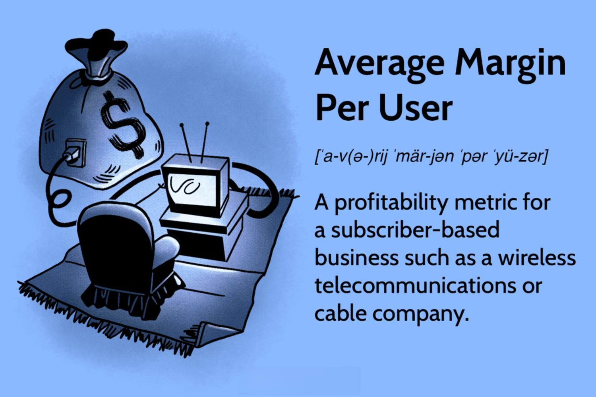

Algorithmic trading has revolutionized financial markets by leveraging automation to execute trades swiftly and efficiently. This transformation has allowed for rapid decision-making, reduced transaction costs, and the ability to handle vast amounts of data, thereby enhancing trading precision and scalability. Algorithmic trading strategies are guided by complex mathematical models that analyze market data to identify optimal trading opportunities within milliseconds.

A critical element for firms engaging in algorithmic trading is understanding the synergy between business metrics and trading performance indicators. One such business metric is the Average Margin Per User (AMPU), which provides a nuanced measure of profitability by factoring in operating expenses, thus offering a clearer view of financial health than traditional metrics like Average Revenue Per User (ARPU). Unlike ARPU, which solely considers revenue generated per user, AMPU adjusts for costs, providing a more holistic evaluation of profit margins. 



The alignment of business metrics such as AMPU with algorithmic trading performance metrics—such as the Sharpe Ratio, Maximum Drawdown, and Profit Factor—is essential. These performance metrics evaluate the risk-adjusted returns and resilience of trading strategies in various market conditions, ensuring that profits are not merely theoretical but are maximized and sustainable over the long term.

Understanding these aspects is crucial for businesses investing in algorithmic trading. Not only does it allow for the refinement of trading strategies, but it also provides insights for cost efficiencies and potential profitability enhancement. As the financial markets become increasingly complex, businesses must integrate traditional financial analysis with advanced algorithmic techniques to optimize trading outcomes and maintain competitive advantages.

## Table of Contents

## Understanding Average Margin Per User (AMPU)

Average Margin Per User (AMPU) is a key profitability metric used predominantly in subscriber-based businesses. It provides an accurate understanding of the profitability generated by an individual user by factoring in both revenue and costs associated with serving that user. Unlike its counterpart, Average Revenue Per User (ARPU), which only considers the revenue generated, AMPU offers a refined perspective by factoring in operating expenses, thus offering a clearer picture of financial health.

The formula for calculating AMPU is:

$$
\text{AMPU} = \frac{\text{Operating Revenue} - \text{Operating Expenses}}{\text{Average Number of Users}}
$$

This metric is crucial for businesses that aim to maximize profitability by understanding the cost-efficiency of their operations at a user level. By considering operating expenses, such as customer service, marketing, and infrastructure costs, AMPU allows companies to assess the real contribution of each user to the bottom line. This information is vital for decision-making processes, such as pricing strategies and resource allocation, helping companies to streamline operations and maximize profits.

In terms of practical application, consider a software-as-a-service (SaaS) company. By calculating AMPU, the company can identify whether the cost savings from operational efficiencies are translating into higher margins per user. If a SaaS company generates $500,000 in operating revenue and incurs $300,000 in operating expenses, with an average user base of 2,000 individuals, the AMPU would be calculated as follows:

$$
\text{AMPU} = \frac{500,000 - 300,000}{2,000} = \frac{200,000}{2,000} = 100
$$

This means that each user contributes an average margin of $100. Such an analysis can pinpoint areas where businesses may need to reduce costs or adjust strategies to enhance profitability. Thus, AMPU is a vital metric for any business aiming to understand and improve its financial performance at the user level.

## Algorithmic Trading and Financial Metrics

Algorithmic trading strategies rely on various financial metrics to measure performance, ensuring that these strategies not only generate revenue but also convert it into substantial profit while managing associated risks. Among these critical metrics are the Sharpe Ratio, Maximum Drawdown, and Profit Factor, each serving a distinct role in evaluating the effectiveness of trading strategies.

The Sharpe Ratio is a widely used measure that indicates the average return earned in excess of the risk-free rate per unit of [volatility](/wiki/volatility-trading-strategies) or total risk. It is calculated as:

$$
\text{Sharpe Ratio} = \frac{E[R_p - R_f]}{\sigma_p}
$$

where $E[R_p - R_f]$ is the expected return of the portfolio in excess of the risk-free rate and $\sigma_p$ is the standard deviation of the portfolio's return. A higher Sharpe Ratio indicates more return for the same level of risk, aiding traders in selecting or tweaking strategies that optimize risk-adjusted returns.

Maximum Drawdown represents the largest drop from a peak to a trough in the value of a portfolio, before a new peak is achieved. It is a measure of downside risk over a specified time period, providing insight into potential losses. This is crucial for assessing the risk profile and resilience of a trading strategy during adverse market conditions.

Profit Factor is a ratio of the gross profit to the gross loss in a trading system, calculated as:

$$
\text{Profit Factor} = \frac{\text{Total Gross Profit}}{\text{Total Gross Loss}}
$$

A Profit Factor greater than 1 indicates a profitable strategy, while a value less than 1 suggests losses.

Understanding and applying these metrics enhances traders' abilities to refine their strategies and align them with dynamic market conditions. By analyzing the Sharpe Ratio, Maximum Drawdown, and Profit Factor, traders can ensure their strategies are robust, financially viable, and resilient to market volatility. This allows traders to not only identify the most profitable strategies but also to manage and mitigate risks effectively, adapting to evolving market environments.

## Integrating Business and Trading Metrics

Integrating business metrics like Average Margin Per User (AMPU) with trading performance metrics offers a comprehensive framework for evaluating profitability in [algorithmic trading](/wiki/algorithmic-trading). Incorporating AMPU allows traders and businesses to gauge cost-efficiency and profitability beyond superficial revenue figures. While traditional trading metrics measure market performance, AMPU provides an internal gauge of profit by factoring in operating expenses, thus ensuring a more holistic view of financial outcomes.

To integrate AMPU into trading strategies, businesses should prioritize setting realistic margin targets that align with their trading goals. By understanding their average margin, businesses can evaluate whether their trading strategies are profitable after accounting for operational costs. This alignment is crucial for optimizing strategies to maximize the financial yield. For example, if a trading strategy generates substantial returns, but the AMPU indicates low profitability due to high operational expenses, the strategy may need adjustment to enhance efficiency.

Additionally, trading strategies can be optimized through continuous monitoring and fine-tuning using both sets of metrics. For instance, consider a Python code snippet that simulates the incorporation of AMPU in trading strategy evaluation:

```python
def calculate_ampu(revenue, operating_expenses, average_users):
    return (revenue - operating_expenses) / average_users

def optimize_strategy(revenue, expenses, users, trading_returns):
    ampu = calculate_ampu(revenue, expenses, users)
    profit_factor = trading_returns / expenses

    # Example optimization condition
    if ampu > desired_amputation_threshold and profit_factor > desired_profit_factor_threshold:
        return "Strategy is optimal"
    else:
        return "Strategy needs adjustment"

# Example parameters
revenue = 200000
expenses = 150000
average_users = 1000
trading_returns = 50000

print(optimize_strategy(revenue, expenses, average_users, trading_returns))
```

In this example, the function `calculate_ampu` computes the AMPU, which is then used along with the profit [factor](/wiki/factor-investing) to determine whether the trading strategy is optimal. Strategies can be adjusted based on these comprehensive measures to ensure that they deliver the desired financial performance.

Overall, merging AMPU with trading metrics empowers businesses to refine their strategies considering both market opportunities and internal cost structures, ultimately improving their financial outcomes.

## Challenges in Algorithmic Trading

Algorithmic trading, while transformative in its potential to optimize trading activities, encounters several notable challenges. One predominant issue is the overfitting of models. Overfitting occurs when a trading algorithm is tailored so closely to historical data that it fails to perform well on new, unseen market data. This often results in poor generalization to real-world trading conditions, where market conditions can diverge significantly from historical patterns.

To combat overfitting, traders and developers emphasize robust validation methods such as cross-validation. Cross-validation divides the data into distinct subsets, training the model on one subset and validating it on another to ensure consistent performance. Additionally, techniques like regularization can be applied to prevent overfitting by introducing a penalty for overly complex model configurations.

High transaction costs also pose a significant challenge for algorithmic trading strategies. These costs can erode returns, particularly for high-frequency trading strategies where frequent buying and selling amplify the cumulative cost. To address this, trading models incorporate transaction costs into their profitability analyses from the outset, allowing the strategies to be adjusted or discarded if costs outweigh expected gains. A simple illustration in Python to incorporate these costs could look like this:

```python
def calculate_profit(revenue, transaction_costs):
    return revenue - transaction_costs

revenue = 10000  # example revenue
transaction_costs = 1000  # example transaction costs
profit = calculate_profit(revenue, transaction_costs)
```

Furthermore, algorithmic trading strategies must continually adapt to new market dynamics. Financial markets are influenced by a multitude of factors, including economic shifts, regulatory changes, and unforeseen geopolitical events. Adapting to these requires the development of adaptive trading models capable of evolving with such changes. Techniques such as [machine learning](/wiki/machine-learning) can facilitate this adaptability by learning from new data and adjusting strategies accordingly.

The continuous evaluation of trading strategies using performance metrics is integral to maintaining their effectiveness and profitability. Metrics such as the Sharpe Ratio, Maximum Drawdown, and Profit Factor offer a comprehensive view of how strategies perform under different conditions. These metrics enable traders to identify areas for improvement and refine their strategies continually.

In conclusion, addressing these challenges in algorithmic trading demands a comprehensive approach involving robust strategy validation, transaction cost analysis, and adaptive, data-driven model development. This ensures that trading strategies are not only profitable but also resilient to the dynamic nature of financial markets.

## Conclusion

The synergy of average margin business metrics and algorithmic trading metrics offers deeper insights into profitability potential. By combining these metrics, businesses gain a holistic understanding of their financial performance beyond traditional revenue metrics such as Average Revenue Per User (ARPU). Metrics like Average Margin Per User (AMPU) help clarify the impact of operating costs on profitability, providing a nuanced perspective that complements the performance evaluation of trading strategies.

Optimal trading strategies are those that effectively integrate comprehensive financial analyses with algorithmic precision. This integration allows traders to mitigate risks and enhance returns by taking into account both market opportunities and operational cost-efficiency. For instance, while a trading algorithm may demonstrate high promise based on returns alone, its true effectiveness is revealed only when average margin metrics are considered, ensuring that generated revenues translate into overall profit.

As financial markets evolve, traders must adapt by leveraging a combination of traditional financial metrics and advanced computational techniques. This means continuously refining trading models using up-to-date financial data and incorporating business insights to remain competitive. Machine learning algorithms and data analytics tools can further support this adaptation by uncovering patterns and trends from large datasets, enhancing decision-making processes.

Staying attuned to these advancements and ensuring that trading strategies align with financial performance metrics like AMPU and algorithm-driven insights allows businesses to navigate the complexities of today's dynamic markets effectively. This blend of financial discipline and algorithmic innovation is crucial for sustaining profitability in an ever-changing market landscape.

## References & Further Reading

Explore the importance of financial metrics in trading through seminal works such as John Hull's "Options, Futures, and Other Derivatives," which offers comprehensive insights into derivatives markets, pricing mechanisms, and risk management techniques. This resource is essential for understanding the mathematical and financial foundations that underpin various trading strategies and their associated metrics. Another critical reference is William F. Sharpe's "The Sharpe Ratio," which is vital for comprehending risk-adjusted returns, a key component in evaluating the effectiveness of trading strategies.

For algorithmic trading insights, a recommended starting point is "Starting with a gridding approach to algorithmic trading" by Wong. This publication details methods for developing algorithmic trading strategies using grid-based techniques, emphasizing the importance of structure and discipline in systematic trading.

Additionally, Robert Pardo's "The Evaluation and Optimization of Trading Strategies" is a fundamental resource for those interested in the development, testing, and optimization of trading algorithms. This book guides readers through the meticulous process of validating trading strategies, ensuring they are robust and capable of adapting to market changes.

These references provide a well-rounded perspective on how to leverage financial metrics and develop effective algorithmic trading strategies, facilitating a deeper understanding of how to maximize profitability and manage risks in volatile markets.

