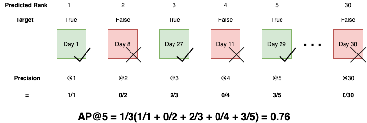

## Table of Contents

## What is Average Precision at K (AP@K) in the context of machine learning?

Average Precision at K (AP@K) is a metric used in machine learning to evaluate the performance of a model, particularly in tasks like information retrieval, recommendation systems, and object detection. It measures how well a model ranks relevant items among the top K results. The idea is to see if the model can place the most relevant items at the top of its predictions. To calculate AP@K, you look at the precision at each point where a relevant item is found within the top K results, and then you average these precision values. This gives you a single number that tells you how good the model is at finding relevant items early in its list of predictions.

For example, if you're searching for relevant documents and you want the top 10 results to be as relevant as possible, AP@10 would tell you how well the model did at placing those relevant documents in the top 10 spots. The formula for AP@K is $$ \text{AP@K} = \frac{1}{\min(\text{number of relevant items}, K)} \sum_{k=1}^{K} \text{P@k} \times \text{rel}(k) $$, where P@k is the precision at cut-off k, and rel(k) is an indicator function equalling 1 if the item at rank k is relevant, and 0 otherwise. This metric is especially useful because it rewards models that not only find relevant items but also rank them higher, which is crucial in many real-world applications where users typically only look at the top few results.

## Why is AP@K important for evaluating machine learning models?

AP@K is important for evaluating machine learning models because it helps us understand how well a model can find and rank the most important items at the top of its results. In many real-world situations, like searching for information online or getting product recommendations, people usually only look at the first few results. If a model can put the most relevant items at the top, it makes the user's experience much better. AP@K measures this by looking at how many of the top K results are relevant and gives a score based on that. This score tells us if the model is good at putting important things first.

For example, if you're using a search engine and you want to find the best results quickly, you would want the most useful links to appear at the top of the page. AP@K helps us see if the search engine is doing a good job at this. The formula for AP@K is $$ \text{AP@K} = \frac{1}{\min(\text{number of relevant items}, K)} \sum_{k=1}^{K} \text{P@k} \times \text{rel}(k) $$, where P@k is the precision at cut-off k, and rel(k) is an indicator function that equals 1 if the item at rank k is relevant, and 0 otherwise. This metric is useful because it rewards models that not only find relevant items but also rank them higher, which is crucial for applications where users only look at the top few results.

## How is AP@K different from other evaluation metrics like precision and recall?

AP@K is different from precision and recall because it focuses on how well a model ranks relevant items in the top K results, rather than just looking at all the results. Precision tells you the percentage of results that are relevant out of all the results you get. Recall tells you the percentage of all relevant items that your model found. AP@K combines these ideas but puts more importance on getting relevant items at the top of the list. This is important because in real life, people usually only look at the first few results, so you want the best stuff to be at the top.

For example, if you're using a search engine, you might only look at the first page of results. AP@K measures how well the search engine puts the most useful links at the top of that page. The formula for AP@K is $$ \text{AP@K} = \frac{1}{\min(\text{number of relevant items}, K)} \sum_{k=1}^{K} \text{P@k} \times \text{rel}(k) $$, where P@k is the precision at cut-off k, and rel(k) is an indicator function that equals 1 if the item at rank k is relevant, and 0 otherwise. This means AP@K rewards a model for finding relevant items and also for ranking them higher, which is different from precision and recall that don't consider the order of the results.

## Can you explain the step-by-step process to calculate AP@K?

To calculate AP@K, you first need to know what items are relevant and what K value you're using. Let's say you have a list of items that your model ranked, and you know which of those items are relevant. You'll look at the top K items in this list. For each relevant item in the top K, you calculate the precision at that point. Precision at a certain point, like the 5th item, means the number of relevant items you've seen so far divided by the number of items you've looked at so far. If the 5th item is relevant, and you've seen 3 relevant items out of 5, the precision at 5 is 3/5 or 0.6.

Next, you multiply each of these precision values by an indicator function that equals 1 if the item at that position is relevant, and 0 otherwise. You then sum up all these values and divide by the minimum of the number of relevant items or K. The formula for AP@K is $$ \text{AP@K} = \frac{1}{\min(\text{number of relevant items}, K)} \sum_{k=1}^{K} \text{P@k} \times \text{rel}(k) $$. This gives you the Average Precision at K, which tells you how well your model did at ranking relevant items at the top of its list. If your model is good at putting relevant items at the top, the AP@K value will be high.

## What does the 'K' in AP@K represent, and how do you choose its value?

The 'K' in AP@K stands for the number of top results you're looking at. For example, if you set K to 10, you're only interested in how well the model ranks the top 10 items. Choosing the right value for K depends on what you're trying to do. If you're making a search engine and you know that people usually only look at the first page of results, which might show 10 items, then you might choose K to be 10. This way, you're measuring how well the model does at putting the most important results on that first page.

The choice of K can really change how you see the model's performance. A smaller K means you're focusing on the very top results, which is good if you want to make sure the most relevant items are right at the top. A larger K might be better if you want to see how well the model does over a bigger set of results. The formula for AP@K is $$ \text{AP@K} = \frac{1}{\min(\text{number of relevant items}, K)} \sum_{k=1}^{K} \text{P@k} \times \text{rel}(k) $$. This formula helps you calculate the average precision for the top K results, giving you a good idea of how well the model ranks relevant items in that range.

## How does AP@K handle imbalanced datasets?

AP@K can be quite useful when dealing with imbalanced datasets, where the number of relevant items is much smaller than the number of irrelevant ones. In such cases, traditional metrics like accuracy might not be very informative because even a model that always predicts the majority class can have high accuracy. AP@K, however, focuses on how well the model ranks the few relevant items at the top of its results. This means that even if there are only a few relevant items, AP@K rewards the model for finding and ranking them high, which is more useful in real-world applications where finding those few important items quickly matters a lot.

To calculate AP@K, you still use the same formula $$ \text{AP@K} = \frac{1}{\min(\text{number of relevant items}, K)} \sum_{k=1}^{K} \text{P@k} \times \text{rel}(k) $$. This formula helps you see how well the model does at putting the relevant items, even if they are few, in the top K spots. By focusing on precision at different points and averaging it, AP@K gives you a better idea of the model's performance on imbalanced data, making it a valuable metric for tasks where finding the needle in the haystack is the goal.

## What are the common applications of AP@K in machine learning?

AP@K is often used in information retrieval systems, like search engines. When you search for something online, you want the most relevant results to show up at the top of the page. AP@K helps measure how well a search engine does this by looking at the top K results. If the search engine puts the most useful links at the top, it gets a high AP@K score. This is important because people usually only look at the first page of results, so getting the best results at the top makes the search engine better for users. The formula for AP@K is $$ \text{AP@K} = \frac{1}{\min(\text{number of relevant items}, K)} \sum_{k=1}^{K} \text{P@k} \times \text{rel}(k) $$. This formula helps calculate how well the search engine ranks the relevant results in the top K spots.

Another common use of AP@K is in recommendation systems, like those used by online stores or streaming services. These systems suggest products or movies to users, and it's important that the most interesting suggestions are at the top of the list. AP@K measures how well the system does this by checking the top K recommendations. If the system puts the items that the user is most likely to like at the top, it gets a high AP@K score. This helps make the user's experience better because they see the best recommendations first. The same formula is used to calculate AP@K in this context, making it a useful tool for improving recommendation systems.

## How does AP@K perform in multi-label classification tasks?

AP@K can be used in multi-label classification tasks, where each item can belong to more than one category. In these tasks, you want to see how well the model ranks the relevant labels for each item in the top K predictions. For example, if you're classifying images and each image can have multiple labels like "dog," "park," and "sunny," you want the model to put these correct labels at the top of its list of predictions. AP@K helps you measure this by looking at the top K labels and seeing how many of them are correct. The formula for AP@K is $$ \text{AP@K} = \frac{1}{\min(\text{number of relevant items}, K)} \sum_{k=1}^{K} \text{P@k} \times \text{rel}(k) $$. This formula calculates the average precision for the top K labels, giving you a good idea of how well the model ranks the correct labels.

In multi-label classification, AP@K is useful because it focuses on the order of the predictions. If the model puts the most important labels at the top, it gets a higher AP@K score. This is important in real-world applications where users might only look at the top few labels. For example, in a medical diagnosis system, if a patient has multiple conditions, you want the system to list the most critical conditions first. AP@K helps you see if the system is doing a good job at this. By using AP@K, you can improve the model to make sure it ranks the most relevant labels higher, which can lead to better performance in multi-label classification tasks.

## Can AP@K be used for both binary and multi-class classification problems?

AP@K can be used for both binary and multi-class classification problems. In binary classification, where you're trying to decide if something belongs to one class or not, AP@K helps you see how well the model ranks the positive examples at the top of its list. For example, if you're trying to find relevant emails in a spam filter, AP@K measures how well the filter puts the important emails at the top of the inbox. The formula for AP@K is $$ \text{AP@K} = \frac{1}{\min(\text{number of relevant items}, K)} \sum_{k=1}^{K} \text{P@k} \times \text{rel}(k) $$. This formula calculates the average precision for the top K results, which tells you how good the model is at finding the relevant items early in its predictions.

In multi-class classification, where an item can belong to one of many classes, AP@K is also useful. Here, you want the model to rank the correct class high in its list of predictions. For instance, if you're classifying images into categories like "dog," "cat," or "bird," AP@K helps you see if the model puts the right category at the top of its guesses. The same formula is used to calculate AP@K, making it a versatile metric that can help improve the performance of models in both binary and multi-class classification tasks by ensuring the most relevant results are ranked higher.

## What are the limitations of using AP@K as an evaluation metric?

AP@K has some limitations when used as an evaluation metric. One big problem is that it only looks at the top K results. If you set K too small, you might miss out on seeing how well the model does for all the results. For example, if you only look at the top 5 results, you won't know if the model did a good job with the rest of the results. Also, AP@K can be sensitive to the choice of K. If you pick a different K, you might get a different score, which can make it hard to compare models fairly.

Another limitation is that AP@K can be hard to understand for people who aren't experts in machine learning. The formula $$ \text{AP@K} = \frac{1}{\min(\text{number of relevant items}, K)} \sum_{k=1}^{K} \text{P@k} \times \text{rel}(k) $$ might look confusing to someone who doesn't know what precision and recall are. This can make it tough to explain why one model is better than another based on AP@K scores. Plus, AP@K might not work well if you have very few relevant items, because the score can change a lot based on just a few results.

## How can AP@K be optimized in model training?

To optimize AP@K during model training, you need to focus on making the model better at putting the most important results at the top of its list. One way to do this is by changing the loss function to care more about the order of the results. For example, you can use a loss function that gives a bigger penalty if a relevant item is ranked lower than it should be. This helps the model learn to rank relevant items higher, which is what AP@K measures. You can also use techniques like learning to rank, where the model is trained specifically to order items in a way that maximizes AP@K.

Another way to improve AP@K is by adjusting the model's hyperparameters. This means trying different settings to see which ones make the model better at ranking relevant items at the top. You can use a method called grid search or random search to try out different combinations of hyperparameters and see which ones give the highest AP@K score. The formula for AP@K is $$ \text{AP@K} = \frac{1}{\min(\text{number of relevant items}, K)} \sum_{k=1}^{K} \text{P@k} \times \text{rel}(k) $$. By focusing on this metric during training, you can make the model better at finding and ranking the most important results, which is what users care about in many real-world applications.

## What advanced techniques can be used to improve the performance of AP@K in complex scenarios?

In complex scenarios, one advanced technique to improve AP@K is using ensemble methods. This means combining the predictions of multiple models to get a better overall ranking. By training different models on the same data and then combining their predictions, you can often get a higher AP@K score. For example, you could use a technique called boosting, where each model focuses on the errors of the previous ones, helping to rank relevant items higher. Another approach is to use a method called rank aggregation, where you combine the rankings from different models to create a final ranking that is more likely to put the most important items at the top.

Another technique is to use more advanced loss functions that are specifically designed to optimize for AP@K. These loss functions can be more complex than traditional ones but are better at training the model to rank relevant items higher. For example, you can use a loss function that penalizes the model more if a relevant item is ranked lower than it should be. The formula for AP@K is $$ \text{AP@K} = \frac{1}{\min(\text{number of relevant items}, K)} \sum_{k=1}^{K} \text{P@k} \times \text{rel}(k) $$. By using this loss function during training, the model learns to improve its AP@K score directly. Additionally, you can use techniques like cross-validation to test the model's performance on different subsets of the data, making sure it generalizes well and maintains a high AP@K score across various scenarios.