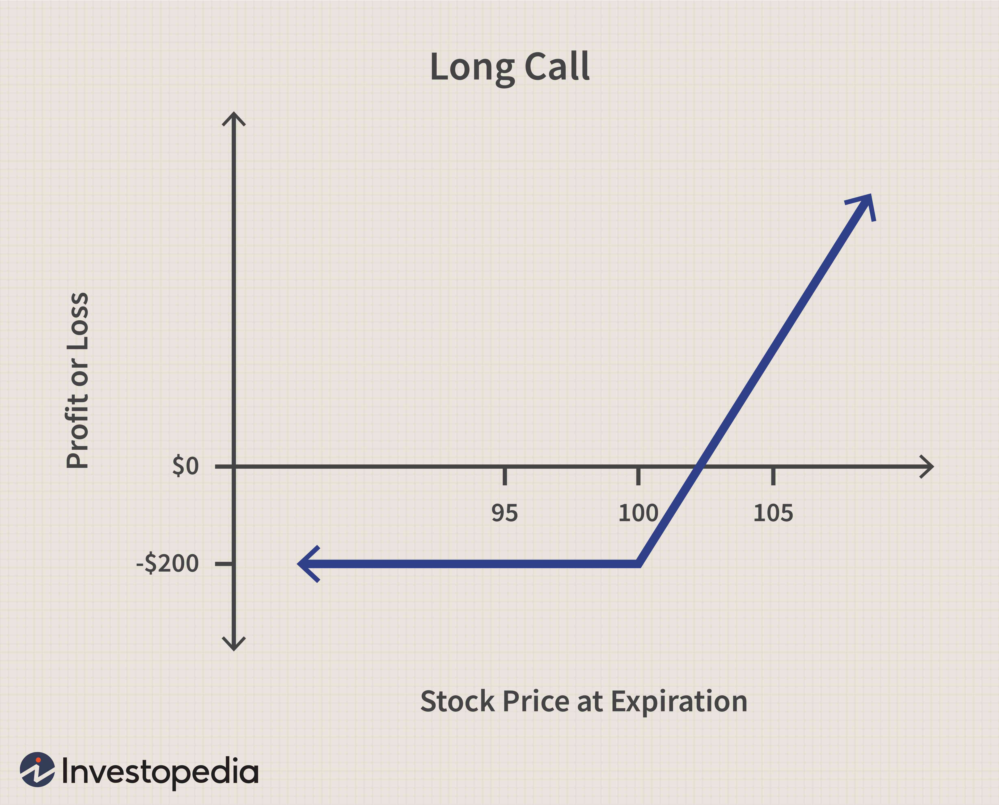

## Table of Contents

## What is an Average Price Call?

An Average Price Call is a type of option contract where the price used to determine if the option is profitable is not just the price of the asset at the end of the contract. Instead, it uses an average price of the asset over a certain period of time. This makes it different from regular call options, which only look at the price at the end.

People might choose an Average Price Call if they think the price of the asset will go up and down a lot during the time of the contract. By using an average price, it can protect them a bit from big drops in price at the end. It's like smoothing out the price changes over time, which can be helpful in certain situations.

## How does an Average Price Call differ from a standard call option?

An Average Price Call and a standard call option both give you the right to buy an asset at a certain price, but they work differently. With a standard call option, the price that matters is the price of the asset when the option ends. If the asset's price is higher than the price set in the option, you can buy it and make a profit. But if the price is lower, the option isn't worth anything.

An Average Price Call, on the other hand, uses the average price of the asset over a period of time, not just the price at the end. This can be good if the price of the asset goes up and down a lot. It helps smooth out the price changes, so even if the price drops a lot right at the end, you might still make money if the average price over time was higher than the price set in the option.

## What are the key features of an Average Price Call?

An Average Price Call is a special kind of option where the price that matters is not just the price at the end, but the average price over a certain time. This can be helpful if the price of the asset goes up and down a lot. If you think the price will be high sometimes but might drop at the end, an Average Price Call can protect you from that drop because it looks at the average price.

Using an average price can make the option less risky because it smooths out the ups and downs. If the average price over time is higher than the price set in the option, you can still make money even if the price at the end is lower. This makes Average Price Calls different from regular call options, which only care about the price at the very end.

## How is the average price calculated in an Average Price Call?

In an Average Price Call, the average price is calculated by taking the prices of the asset at different times during the life of the option and then finding the average of those prices. This can be done in different ways, but usually, it involves adding up all the prices and then dividing by the number of times the price was checked.

For example, if the price of the asset is checked every day for 30 days, you would add up the prices for all 30 days and then divide by 30 to get the average price. This average price is then used to see if the option is profitable, instead of just looking at the price on the last day. This method helps smooth out the ups and downs in the price of the asset over time.

## What are the potential benefits of using an Average Price Call?

One big benefit of using an Average Price Call is that it can help protect you from big drops in the price of the asset right at the end of the option's life. Since it uses the average price over time, even if the price falls a lot on the last day, you might still make money if the average price was higher than the price set in the option. This makes it less risky compared to a regular call option, which only looks at the price at the very end.

Another advantage is that an Average Price Call can be a good choice if you think the price of the asset will go up and down a lot during the time of the option. By smoothing out these price changes, an Average Price Call gives you a better chance to profit from the overall trend of the price, rather than just hoping it's high on the last day. This can be especially useful in markets where prices are very volatile.

## What are the risks associated with Average Price Calls?

One risk of using Average Price Calls is that they can be more complicated than regular call options. Because they use an average price over time, it can be harder to predict if the option will be profitable. You need to keep track of the price of the asset over the whole period, not just at the end. This can make it trickier to decide if buying an Average Price Call is a good idea.

Another risk is that even though Average Price Calls can protect you from big price drops at the end, they might not be as profitable if the price of the asset goes up a lot right at the end. If the price is really high on the last day but the average price over time is lower, you might not make as much money as you would with a regular call option. So, you need to think carefully about whether the protection from price drops is worth possibly missing out on bigger gains.

## In what scenarios would an investor use an Average Price Call?

An investor might choose to use an Average Price Call if they think the price of the asset will go up and down a lot during the time of the option. This kind of option can be helpful in markets that are very volatile, where the price can change a lot from day to day. By using the average price over time, the investor can protect themselves a bit from big drops in price at the end of the option's life. If the average price is higher than the price set in the option, they can still make money even if the price falls on the last day.

Another scenario where an investor might use an Average Price Call is when they want to smooth out the ups and downs in the price of the asset. This can be a good strategy if the investor believes the overall trend of the price will be up, but they're worried about short-term drops. By focusing on the average price, they can take advantage of the general upward trend without being too affected by sudden price changes. This makes the option less risky and can help them feel more confident about their investment.

## How do market conditions affect the value of an Average Price Call?

Market conditions can really change how much an Average Price Call is worth. If the market is going up and down a lot, an Average Price Call might be more valuable. That's because it uses the average price over time, which can help if the price drops a lot at the end. So, in a market where prices are all over the place, this kind of option can be a good way to protect against those big drops.

On the other hand, if the market is very steady and the price is going up slowly, an Average Price Call might not be as useful. In this case, a regular call option might be better because it would let you make more money if the price is high at the end. So, the value of an Average Price Call depends a lot on how much the market moves around during the time the option is active.

## What are the pricing models used for Average Price Calls?

Pricing models for Average Price Calls can be a bit more complicated than those for regular call options because they need to take into account the average price over time. One common model used is the Black-Scholes model, but it has to be changed a bit to work with Average Price Calls. This adjusted model, sometimes called the Black-Scholes model for Asian options, looks at the average price instead of just the price at the end. It uses things like the average of the asset's price over the life of the option, the time left until the option ends, the expected ups and downs in the price, and the [interest rate](/wiki/interest-rate-trading-strategies) to figure out the option's value.

Another model that can be used is the Monte Carlo simulation. This method involves running a lot of different possible future price paths for the asset and then figuring out the average price for each path. By doing this many times, you can get a good idea of what the average price might be and how likely different outcomes are. This helps to find the value of the Average Price Call. The Monte Carlo simulation is really good for dealing with the complicated nature of Average Price Calls, especially when the market is very unpredictable.

## How can an Average Price Call be hedged?

Hedging an Average Price Call means finding ways to protect against the risk that the option might lose value. One way to do this is by using another financial tool, like a futures contract. If you own an Average Price Call on a stock, you could sell futures on that same stock. This helps balance out any losses from the option if the stock's price goes down a lot. The futures contract would gain value if the stock price falls, which could make up for some of the money lost on the Average Price Call.

Another way to hedge an Average Price Call is by using other options. For example, you could buy a put option on the same stock. A put option gives you the right to sell the stock at a certain price, which can be helpful if the stock's price drops. If the average price of the stock over time is lower than expected, the put option could help cover some of the losses from the Average Price Call. By using these other financial tools, you can make your investment less risky and feel more secure about the money you've put into the Average Price Call.

## What are the tax implications of trading Average Price Calls?

When you trade Average Price Calls, the money you make or lose can affect your taxes. If you make a profit from trading these options, you'll usually have to pay capital gains tax. How much tax you pay depends on how long you held the option. If you held it for a year or less, it's considered a short-term capital gain, and you'll pay your regular income tax rate on that profit. If you held it for more than a year, it's a long-term capital gain, and the tax rate is usually lower.

On the other hand, if you lose money on an Average Price Call, you might be able to use that loss to lower your taxes. You can use the loss to reduce your taxable income, which can save you money on taxes. But there are rules about how much loss you can use each year, and you might need to report it on your tax return. It's a good idea to talk to a tax professional to make sure you're doing everything right and taking advantage of all the tax benefits you can.

## How do regulatory requirements impact the trading of Average Price Calls?

Regulatory requirements can have a big impact on how you trade Average Price Calls. Different countries and financial markets have their own rules about who can trade these options and how they need to be reported. For example, some places might say that only people with a certain level of experience or money can trade Average Price Calls. This is to make sure that people understand the risks involved and can handle any losses. Also, trading these options might need to be reported to a financial authority, which helps keep the market fair and transparent.

These rules can also affect how Average Price Calls are priced and how easy it is to trade them. Some regulations might make it harder to find a place to buy or sell these options, or they might change how much you have to pay to trade them. For example, there might be extra costs or fees that you need to pay because of the rules. It's important to know about these regulations so you can follow them and make smart choices when trading Average Price Calls.

## What are Average Price Call Options and how are they explained?

Average price call options, often referred to as Asian options, are a specialized type of options contract where the payoff is determined by the average price of the underlying asset over a specified period, rather than its price at a single point in time. This characteristic distinctively sets them apart from traditional European or American call options, which are exercised based on the underlying asset's price at a specific date.

The payoff structure for an average price call option can be mathematically represented as:

$$
\text{Payoff} = \max(0, A - K)
$$

where $A$ is the average price of the underlying asset over the option's term, and $K$ is the strike price. The average price, $A$, can be calculated as either an arithmetic or geometric average, depending on the specific terms of the contract. An arithmetic average is the simple mean of prices sampled at regular intervals, whereas a geometric average is the nth root of the products of the sampled prices.

The nomenclature "Asian options" stems from their initial popularity in Asian financial markets, where they were first extensively used. One of the primary benefits of average price call options is their ability to mitigate the impact of high [volatility](/wiki/volatility-trading-strategies) in the underlying asset's price. By focusing on the average price, these options reduce the potential distortions caused by extreme price movements. This makes them particularly attractive for investors who are concerned with managing risk in volatile markets.

In practice, average price call options can be structured and traded in both over-the-counter (OTC) and exchange markets. In the OTC market, contracts are often tailor-made to meet the specific needs of the parties involved, allowing for flexibility in determining the averaging method and frequency. Exchange-traded Asian options, while less customizable, provide the advantage of standardized terms and greater [liquidity](/wiki/liquidity-risk-premium).

An example of how these options are traded involves a commodities trading firm wishing to hedge against price fluctuations in [crude oil](/wiki/crude-oil). By purchasing an average price call option on oil, the firm can ensure that the potential benefits from price increases are captured, while the averaging mechanism reduces the impact of sharp, short-term price spikes that typically accompany volatile commodity markets.

In summary, average price call options offer a strategic approach for investors aiming to manage volatility by using the averaging feature to reduce the effect of erratic price changes. They are traded in both OTC and exchange settings, providing a versatile tool for hedging and speculative strategies.

## References & Further Reading

[1]: Bergstra, J., Bardenet, R., Bengio, Y., & Kégl, B. (2011). ["Algorithms for Hyper-Parameter Optimization."](https://dl.acm.org/doi/10.5555/2986459.2986743) Advances in Neural Information Processing Systems 24.

[2]: ["Advances in Financial Machine Learning"](https://www.amazon.com/Advances-Financial-Machine-Learning-Marcos/dp/1119482089) by Marcos Lopez de Prado

[3]: ["Options, Futures, and Other Derivatives"](https://www.amazon.com/Options-Futures-Other-Derivatives-10th/dp/013447208X) by John C. Hull

[4]: ["Machine Learning for Algorithmic Trading"](https://github.com/stefan-jansen/machine-learning-for-trading) by Stefan Jansen

[5]: ["The Concepts and Practice of Mathematical Finance"](https://archive.org/download/quant_books/Concepts%20_%20Practice%20of%20Mathematical%20Finance%20-%20M.%20S.%20Joshi.pdf) by Mark S. Joshi

[6]: ["Quantitative Trading: How to Build Your Own Algorithmic Trading Business"](https://www.amazon.com/Quantitative-Trading-Build-Algorithmic-Business/dp/1119800064) by Ernest P. Chan