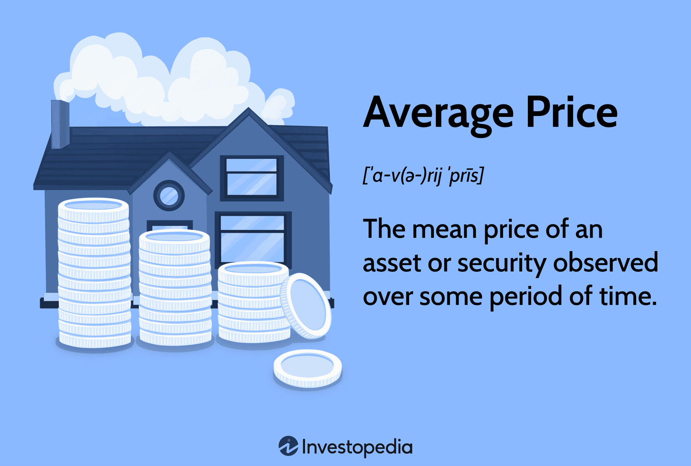

## Table of Contents

## What is the average price?

The average price is the total price of several items divided by the number of items. It helps us understand the typical cost of things. For example, if you buy three items for $5, $10, and $15, the average price would be $10. You find this by adding $5 + $10 + $15 to get $30, then dividing $30 by 3.

Knowing the average price can be useful in many situations. It can help you compare prices at different stores or see if a price is a good deal. For instance, if you are looking at buying a new phone and see that the average price of similar phones is $300, you can decide if a phone priced at $400 is worth it or if you should look for a cheaper option.

## How do you calculate the average price of a set of items?

To calculate the average price of a set of items, you first add up the prices of all the items. For example, if you have three items that cost $5, $10, and $15, you would add these numbers together to get a total of $30. This step is important because it gives you the total cost of all the items combined.

Next, you need to count how many items you have. In our example, there are three items. Then, you divide the total cost by the number of items. So, you would divide $30 by 3, which gives you an average price of $10. This average price tells you what you would expect to pay for one item if all the items were the same price.

## What is the mean and how is it different from the average?

The mean is a way to find the center of a set of numbers. You find it by adding up all the numbers and then dividing by how many numbers you have. For example, if you have the numbers 2, 4, and 6, you add them up to get 12. Then you divide 12 by 3 (the number of numbers) to get a mean of 4. The mean is very useful because it gives you a single number that represents the whole set.

The mean and the average are actually the same thing. When people talk about the average, they are usually talking about the mean. So, if you hear someone say "the average price," they mean the same thing as "the mean price." Both words describe the result of adding up all the values and dividing by the number of values. So, there is no difference between the mean and the average; they are just different words for the same idea.

## Can you explain the mathematical formula for calculating the mean?

The mean is a number that shows the middle of a set of numbers. To find the mean, you add up all the numbers in the set. For example, if you have the numbers 3, 5, and 7, you would add them together to get 15. This step is important because it gives you the total of all the numbers.

Next, you count how many numbers are in the set. In our example, there are three numbers. Then, you divide the total (which is 15) by the number of numbers (which is 3). So, 15 divided by 3 equals 5. This number, 5, is the mean. It tells you what the average value of the numbers in the set is.

## How do average price and mean relate to each other in statistics?

The average price and the mean are the same thing in [statistics](/wiki/bayesian-statistics). When you talk about the average price of a set of items, you are really talking about the mean price. To find the mean, you add up all the prices and then divide by the number of items. For example, if you have three items that cost $5, $10, and $15, you add these prices together to get $30. Then, you divide $30 by 3 (the number of items) to get a mean, or average, price of $10.

This idea is important because it helps us understand the typical cost of things. Knowing the average price can help you compare prices at different stores or decide if a price is a good deal. For instance, if you are looking at buying a new phone and see that the average price of similar phones is $300, you can decide if a phone priced at $400 is worth it or if you should look for a cheaper option. So, the average price and the mean are just different ways to say the same thing, and they are very useful in everyday life.

## What are some common misconceptions about average price and mean?

One common misconception about average price and mean is that they represent the price you will always pay for an item. People sometimes think that if the average price of a product is $10, every item they buy should cost $10. But, the average or mean is just a way to find the middle value of a set of numbers. It doesn't mean every item will cost the same. For example, if you buy three items for $5, $10, and $15, the average price is $10, but you won't pay $10 for each item.

Another misconception is that the average price gives you a complete picture of the prices. People might think that knowing the average is enough to understand all the prices. But, the average can hide important details. For example, if you have one item that costs $100 and four items that cost $10 each, the average price is $30. This average might make you think all items are around $30, but in reality, the prices are very different. So, it's important to look at all the prices, not just the average, to get a full understanding.

## In what scenarios might the average price be misleading?

The average price can be misleading when there are big differences between the prices of items. For example, if you are looking at the prices of houses in a neighborhood, and most houses cost around $200,000, but one house costs $2 million, the average price will be much higher than what most people would expect to pay. The average might make it seem like houses in that neighborhood are very expensive, even though most of them are not.

Another scenario where the average price can be misleading is when you are looking at prices over time. If a product's price goes up and down a lot, the average price over a year might not show you the real changes. For example, if a product costs $10 for most of the year but jumps to $50 for one month, the average price might be around $15. This average doesn't tell you about the big price change that happened, which could be important information for someone trying to buy the product at the right time.

## How can outliers affect the calculation of the mean and average price?

Outliers are numbers that are much bigger or smaller than the other numbers in a set. When you have an outlier in your data, it can change the mean or average price a lot. For example, if you are looking at the prices of houses and most houses cost around $200,000, but one house costs $2 million, the average price will be much higher than what most people would expect to pay. The $2 million house is an outlier, and it pulls the average price up, making it seem like houses in that area are more expensive than they really are.

This can be a problem because the average price might not show the true picture of what most people are paying. If you are trying to decide if you can afford a house in that neighborhood, looking at the average price might make you think it's too expensive. But if you look at the prices of most of the houses, you might find that they are actually within your budget. So, it's important to be aware of outliers when you are using the average price to make decisions.

## What are alternative measures to the mean that can be used to describe the central tendency of price data?

When the mean or average price might not give you a good picture of the prices because of outliers, you can use other measures to describe the central tendency of the price data. One alternative is the median. The median is the middle number when you list all the prices in order from smallest to largest. If you have an odd number of prices, the median is the number right in the middle. If you have an even number of prices, the median is the average of the two middle numbers. The median is helpful because it is not affected by very high or very low prices, so it can give you a better idea of what most people are paying.

Another measure you can use is the mode. The mode is the price that appears most often in your set of data. If you have a list of prices and one price shows up more than any other, that is the mode. The mode is useful when you want to know what price is most common. For example, if you are looking at the prices of a certain product and most of them are $10, the mode would be $10. This can help you understand what price you are most likely to see when you go to buy the product. Both the median and the mode can be better than the mean when you have outliers or when you want to know what is typical or most common.

## How do you compare the average price across different datasets or time periods?

To compare the average price across different datasets or time periods, you first need to calculate the average price for each dataset or time period separately. For example, if you want to compare the average price of a product in January and February, you would add up all the prices for January and divide by the number of prices to get the average for January. Then, you would do the same for February. Once you have the average prices for both months, you can compare them to see if the price went up, went down, or stayed the same.

When comparing average prices across different datasets, like the prices of the same product in different stores, you follow a similar process. You calculate the average price at each store by adding up all the prices and dividing by the number of prices. Then, you can compare these averages to see which store has the lowest or highest average price. This can help you decide where to buy the product to get the best deal. Remember, it's important to consider other factors like outliers or big changes in prices that might affect the average, so you get a true picture of the price differences.

## What statistical tests can be used to determine if the differences in mean prices between two groups are significant?

To find out if the difference in mean prices between two groups is significant, you can use a statistical test called the t-test. A t-test helps you see if the difference you see between the two groups is real or if it might just be due to chance. For example, if you want to know if the average price of a product is different in two different stores, you would use a t-test to compare the mean prices from each store. The test will give you a p-value, which tells you how likely it is that the difference you see is just by chance. If the p-value is small (usually less than 0.05), it means the difference is likely real and not just due to random chance.

Another test you can use is the Mann-Whitney U test, which is good when your data doesn't follow a normal distribution or when you have outliers that might affect the mean. This test compares the ranks of the prices in the two groups instead of the actual prices. Like the t-test, it will give you a p-value. If the p-value is small, it means the difference in the average prices between the two groups is likely significant. Both tests help you make better decisions by showing you if the difference in prices is something you should pay attention to or if it might just be a random fluctuation.

## How can advanced statistical techniques like regression analysis be used to understand the factors influencing average price?

Regression analysis is a powerful tool that helps you understand how different factors affect the average price of something. Imagine you want to know what makes the price of a house go up or down. You can use regression analysis to look at things like the size of the house, how old it is, and where it is located. By putting all this information into a regression model, you can see which factors have the biggest impact on the price. For example, the model might show that bigger houses tend to cost more, but older houses might cost less. This helps you see the big picture of what drives the price.

Using regression analysis, you can also predict future prices based on the factors you've studied. If you know that the size of a house is a big [factor](/wiki/factor-investing) in its price, you can use the model to guess how much a new, bigger house might cost. This is really useful for people who need to make decisions about buying or selling things. By understanding the factors that influence the average price, you can make smarter choices and maybe even find a better deal. Regression analysis takes a lot of the guesswork out of understanding prices, making it easier to see what really matters.

## What is the understanding of mean and average prices?

In financial trading and investment, the concept of the average price is fundamental to evaluating asset performance over a specified period. The average price, often referred to as the arithmetic mean, is calculated by summing all the individual asset prices within a given timeframe and then dividing the total by the number of prices used in the summation. This can be mathematically represented as:

$$
\text{Average Price} = \frac{\sum_{i=1}^{n} P_i}{n}
$$

where $P_i$ is the price of the asset at each time point and $n$ is the total number of price points.

The arithmetic mean simplifies a diverse set of price data into a single, representative value, providing traders and investors a clear picture of an asset’s historical price behavior. This simplification allows for more straightforward comparisons between different time periods or different assets, aiding in the quick assessment of performance.

In trading, average prices are crucial for several reasons. First, they offer a baseline for predicting market trends; by examining historical average prices, traders can identify potential patterns or shifts in market sentiment. This can be particularly useful in technical analysis, where price averages can indicate support or resistance levels. For instance, if an asset's current price is significantly higher than its historical average, it may signal overvaluation, prompting traders to consider selling. Conversely, if the current price is below the average, it might suggest undervaluation and a potential buying opportunity.

Moreover, average prices empower traders to make data-driven decisions by providing context to the current market conditions. By understanding how current prices compare to historical averages, traders can better assess whether an asset is performing as expected or if there are underlying factors influencing its deviation from the norm.

These insights make average price calculations a vital tool in developing and refining trading strategies, contributing significantly to informed decision-making in often volatile financial markets. As market dynamics continue to evolve, the adept use of average prices helps traders navigate complexities and pursue strategic advantages.

## What is the Application of Average Price in Bonds in relation to Yield to Maturity (YTM)?

In the bond markets, the concept of the average price plays a critical role in evaluating bond investments, primarily through the calculation of the Yield to Maturity (YTM). YTM is the total return anticipated on a bond if it is held until its maturity date. It is a complex calculation that considers the present value of a bond's future cash flows, including interest payments and the repayment of principal. The average price of a bond throughout its life can serve as a benchmark against which its YTM is measured. 

### Calculation of Yield to Maturity

Yield to Maturity is determined by solving for the yield (r) in the following present value formula:

$$

P = \sum_{t=1}^{n} \frac{C}{(1+r)^t} + \frac{F}{(1+r)^n} 
$$

Where:
- $P$ = price of the bond
- $C$ = annual coupon payment
- $F$ = face value of the bond
- $n$ = number of years to maturity
- $r$ = yield to maturity

This formula sums the present value of the bond's future cash flows, represented by periodic coupon payments, and the redemption of the bond at its par value upon maturity.

#### Practical Example

Consider a bond with a face value ($F$) of \$1,000, a coupon rate of 5% ($C = \frac{0.05 \times 1000}{1} = \$50$ per year), and 10 years to maturity. The bond is currently trading at \$950. The YTM can be calculated by finding the $r$ that satisfies the equation:

$$

950 = \sum_{t=1}^{10} \frac{50}{(1+r)^t} + \frac{1000}{(1+r)^{10}} 
$$

This equation typically requires numerical methods or financial calculators to solve as it cannot be explicitly solved for $r$.

### Significance of Average Price

The average price of a bond serves as a vital reference point for investors. It helps provide context to the current trading price, allowing investors to assess whether the bond is over- or undervalued based on historical performance. Analyzing the average price can guide investing decisions, especially when comparing the YTM against similar investment opportunities.

In summary, while the YTM provides a forward-looking measure of bond returns, the average price offers historical insight, allowing investors to make informed decisions by understanding the bond's position within the market cycle. This complementary analysis can be particularly useful in volatile market conditions where pricing discrepancies may exist.

## What is Volume-Weighted Average Price (VWAP) and why is it a key metric?

The Volume-Weighted Average Price (VWAP) is a fundamental metric in financial trading, offering traders and investors a deeper understanding of intraday market dynamics. Unlike a simple average price, which calculates the mean of all prices over a specific period, VWAP gives equal weight to trades based on their [volume](/wiki/volume-trading-strategy), providing a more nuanced view of how an asset is trading throughout the day.

### Calculation of VWAP

VWAP is calculated by taking the sum of the value of every trade (price multiplied by volume) and dividing it by the total volume over a specific time frame. Mathematically, this can be represented as:

$$
\text{VWAP} = \frac{\sum_{i=1}^{n} (P_i \times V_i)}{\sum_{i=1}^{n} V_i}
$$

Where:
- $P_i$ is the trade price at time $i$.
- $V_i$ is the volume of the trade at time $i$.
- $n$ is the total number of trades in the period.

### Difference from Simple Average Price Calculations

A simple average price neglects the volume of trades, potentially skewing the view of an asset's true trading activity. In contrast, VWAP incorporates trading volume, offering insights into the price which reflects not just prices changes but the [liquidity](/wiki/liquidity-risk-premium) and intensity of trading. This makes VWAP a more comprehensive and reliable metric for understanding market behavior, particularly in markets where trade sizes vary significantly.

### Benefits of VWAP

One of the key benefits of VWAP is its role in informing trade decisions. Traders use VWAP as a benchmark to assess the quality of their trades. If a buy order is executed below the VWAP, it is considered a good trade as it indicates a purchase below the average market price. Conversely, selling above the VWAP may be deemed advantageous.

Furthermore, VWAP helps minimize market impact costs. Large institutional trades can significantly affect an asset's price, bringing market impact costs into consideration. By using VWAP, traders can strategically time entries and exits to minimize these costs, as it provides a reliable reference to refrain from trading during periods of low liquidity or unfavorable price movements.

In summary, VWAP serves as an indispensable tool for traders seeking to enhance trade execution efficiency and reduce transaction costs. Its sophisticated approach to capturing both price and trading volume empowers traders to make more informed, strategic decisions in the market.

## How can VWAP be implemented in algorithmic trading?

Volume-Weighted Average Price (VWAP) is an essential tool in [algorithmic trading](/wiki/algorithmic-trading), particularly for institutional traders who deal with large volumes. VWAP represents the average price a security has traded at throughout the day, based on both volume and price. This calculation aids traders in making decisions on trade executions to maximize efficiency and minimize market impact.

In executing algorithmic trading strategies, VWAP is crucial for spreading large orders across the trading day. By doing so, institutional traders can avoid significant price variations that might occur if large orders were executed all at once. The formula for VWAP is given by:

$$
\text{VWAP} = \frac{\sum_{i=1}^{n} P_i \times Q_i}{\sum_{i=1}^{n} Q_i}
$$

Where $P_i$ is the price of the trade, $Q_i$ is the quantity of the trade, and $n$ is the number of trades.

Institutional traders often leverage VWAP to achieve better average execution prices compared to their individual benchmarks. By closely monitoring VWAP, they can decide the optimal times to execute trades, thereby reducing slippage — the difference between expected and actual transaction prices. This is particularly beneficial when discretely executing large orders, as VWAP helps maintain the average price within a favorable range, thereby providing order and stability in the market conditions.

Moreover, VWAP's role in trend confirmation cannot be understated. Traders use VWAP to determine the general market trend throughout the day. A price trading above the VWAP might indicate a bullish market trend, while a price below it could suggest a bearish trend. Utilizing VWAP assists traders in deciding not only when to enter or [exit](/wiki/exit-strategy) trades but also in assessing the overall market sentiment.

Algorithmic trading systems can be programmed to use VWAP as a benchmark to execute parts of large orders only when the price conditions relative to VWAP are favorable. This strategic placement of orders helps in concealing trading intentions and prevents substantial market movements.

In summary, VWAP serves as a dual-purpose tool in algorithmic trading: optimizing trade execution for large volume orders and providing a reliable metric for trend confirmation, thereby ensuring better market participation and price stability.

## References & Further Reading

[1]: Lopez de Prado, M. (2018). ["Advances in Financial Machine Learning"](https://www.amazon.com/Advances-Financial-Machine-Learning-Marcos/dp/1119482089). Wiley.

[2]: Guilford, E., & Russo, V. (2010). ["Quantitative Trading with Interactive Brokers"](https://eric.ed.gov/?id=ED509903). Apress.

[3]: Chan, E. P. (2009). ["Quantitative Trading: How to Build Your Own Algorithmic Trading Business"](https://github.com/ftvision/quant_trading_echan_book). Wiley.

[4]: Aronson, D. R. (2007). ["Evidence-Based Technical Analysis: Applying the Scientific Method and Statistical Inference to Trading Signals"](https://www.amazon.com/Evidence-Based-Technical-Analysis-Scientific-Statistical/dp/0470008741). Wiley.

[5]: Jansen, S. (2020). ["Machine Learning for Algorithmic Trading: Predictive models to extract signals from market and alternative data for systematic trading strategies with Python."](https://www.amazon.com/Machine-Learning-Algorithmic-Trading-alternative/dp/1839217715). Packt Publishing.