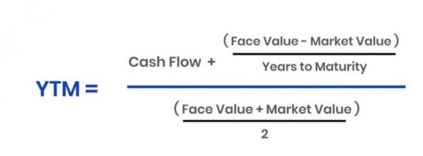

Understanding how average and mean prices are determined is crucial in financial trading and investment. These calculations form the foundation for various trading strategies and investment decisions. Traders rely on these numerical indicators to assess market trends, make predictions, and execute trades with greater accuracy and efficiency.

Average price calculations, including methods like the arithmetic mean, simplify complex sets of data into a single representative figure. This simplification helps traders and investors in forecasting market movements and making informed decisions. For example, the arithmetic mean of asset prices over a designated period provides a snapshot of market behavior, enabling the identification of trends and potential price changes.

Beyond basic average calculations, sophisticated methods such as the volume-weighted average price (VWAP) provide more nuanced insights. VWAP is particularly useful in algorithmic trading as it takes into account the volume of trades, offering a more comprehensive view of an asset's average price. This metric assists traders in executing large orders with minimal market disruption, optimizing trade execution, and minimizing costs.

The integration of VWAP and average price calculations into trading strategies is essential, especially in volatile markets where price fluctuations are frequent and often unpredictable. By incorporating these methods, traders can enhance their decision-making processes and navigate complex market conditions more effectively. This article aims to explore these concepts further, focusing on their practical applications and implications in the dynamic world of trading and investment.

## Table of Contents

## Understanding Mean and Average Prices

In financial trading and investment, the concept of the average price is fundamental to evaluating asset performance over a specified period. The average price, often referred to as the arithmetic mean, is calculated by summing all the individual asset prices within a given timeframe and then dividing the total by the number of prices used in the summation. This can be mathematically represented as:

$$
\text{Average Price} = \frac{\sum_{i=1}^{n} P_i}{n}
$$

where $P_i$ is the price of the asset at each time point and $n$ is the total number of price points.

The arithmetic mean simplifies a diverse set of price data into a single, representative value, providing traders and investors a clear picture of an asset’s historical price behavior. This simplification allows for more straightforward comparisons between different time periods or different assets, aiding in the quick assessment of performance.

In trading, average prices are crucial for several reasons. First, they offer a baseline for predicting market trends; by examining historical average prices, traders can identify potential patterns or shifts in market sentiment. This can be particularly useful in technical analysis, where price averages can indicate support or resistance levels. For instance, if an asset's current price is significantly higher than its historical average, it may signal overvaluation, prompting traders to consider selling. Conversely, if the current price is below the average, it might suggest undervaluation and a potential buying opportunity.

Moreover, average prices empower traders to make data-driven decisions by providing context to the current market conditions. By understanding how current prices compare to historical averages, traders can better assess whether an asset is performing as expected or if there are underlying factors influencing its deviation from the norm.

These insights make average price calculations a vital tool in developing and refining trading strategies, contributing significantly to informed decision-making in often volatile financial markets. As market dynamics continue to evolve, the adept use of average prices helps traders navigate complexities and pursue strategic advantages.

## Application of Average Price in Bonds: Yield to Maturity (YTM)

In the bond markets, the concept of the average price plays a critical role in evaluating bond investments, primarily through the calculation of the Yield to Maturity (YTM). YTM is the total return anticipated on a bond if it is held until its maturity date. It is a complex calculation that considers the present value of a bond's future cash flows, including interest payments and the repayment of principal. The average price of a bond throughout its life can serve as a benchmark against which its YTM is measured. 

### Calculation of Yield to Maturity

Yield to Maturity is determined by solving for the yield (r) in the following present value formula:

$$

P = \sum_{t=1}^{n} \frac{C}{(1+r)^t} + \frac{F}{(1+r)^n} 
$$

Where:
- $P$ = price of the bond
- $C$ = annual coupon payment
- $F$ = face value of the bond
- $n$ = number of years to maturity
- $r$ = yield to maturity

This formula sums the present value of the bond's future cash flows, represented by periodic coupon payments, and the redemption of the bond at its par value upon maturity.

#### Practical Example

Consider a bond with a face value ($F$) of \$1,000, a coupon rate of 5% ($C = \frac{0.05 \times 1000}{1} = \$50$ per year), and 10 years to maturity. The bond is currently trading at \$950. The YTM can be calculated by finding the $r$ that satisfies the equation:

$$

950 = \sum_{t=1}^{10} \frac{50}{(1+r)^t} + \frac{1000}{(1+r)^{10}} 
$$

This equation typically requires numerical methods or financial calculators to solve as it cannot be explicitly solved for $r$.

### Significance of Average Price

The average price of a bond serves as a vital reference point for investors. It helps provide context to the current trading price, allowing investors to assess whether the bond is over- or undervalued based on historical performance. Analyzing the average price can guide investing decisions, especially when comparing the YTM against similar investment opportunities.

In summary, while the YTM provides a forward-looking measure of bond returns, the average price offers historical insight, allowing investors to make informed decisions by understanding the bond's position within the market cycle. This complementary analysis can be particularly useful in volatile market conditions where pricing discrepancies may exist.

## Volume-Weighted Average Price (VWAP): A Key Metric

The Volume-Weighted Average Price (VWAP) is a fundamental metric in financial trading, offering traders and investors a deeper understanding of intraday market dynamics. Unlike a simple average price, which calculates the mean of all prices over a specific period, VWAP gives equal weight to trades based on their [volume](/wiki/volume-trading-strategy), providing a more nuanced view of how an asset is trading throughout the day.

### Calculation of VWAP

VWAP is calculated by taking the sum of the value of every trade (price multiplied by volume) and dividing it by the total volume over a specific time frame. Mathematically, this can be represented as:

$$
\text{VWAP} = \frac{\sum_{i=1}^{n} (P_i \times V_i)}{\sum_{i=1}^{n} V_i}
$$

Where:
- $P_i$ is the trade price at time $i$.
- $V_i$ is the volume of the trade at time $i$.
- $n$ is the total number of trades in the period.

### Difference from Simple Average Price Calculations

A simple average price neglects the volume of trades, potentially skewing the view of an asset's true trading activity. In contrast, VWAP incorporates trading volume, offering insights into the price which reflects not just prices changes but the [liquidity](/wiki/liquidity-risk-premium) and intensity of trading. This makes VWAP a more comprehensive and reliable metric for understanding market behavior, particularly in markets where trade sizes vary significantly.

### Benefits of VWAP

One of the key benefits of VWAP is its role in informing trade decisions. Traders use VWAP as a benchmark to assess the quality of their trades. If a buy order is executed below the VWAP, it is considered a good trade as it indicates a purchase below the average market price. Conversely, selling above the VWAP may be deemed advantageous.

Furthermore, VWAP helps minimize market impact costs. Large institutional trades can significantly affect an asset's price, bringing market impact costs into consideration. By using VWAP, traders can strategically time entries and exits to minimize these costs, as it provides a reliable reference to refrain from trading during periods of low liquidity or unfavorable price movements.

In summary, VWAP serves as an indispensable tool for traders seeking to enhance trade execution efficiency and reduce transaction costs. Its sophisticated approach to capturing both price and trading volume empowers traders to make more informed, strategic decisions in the market.

## Implementing VWAP in Algorithmic Trading

Volume-Weighted Average Price (VWAP) is an essential tool in [algorithmic trading](/wiki/algorithmic-trading), particularly for institutional traders who deal with large volumes. VWAP represents the average price a security has traded at throughout the day, based on both volume and price. This calculation aids traders in making decisions on trade executions to maximize efficiency and minimize market impact.

In executing algorithmic trading strategies, VWAP is crucial for spreading large orders across the trading day. By doing so, institutional traders can avoid significant price variations that might occur if large orders were executed all at once. The formula for VWAP is given by:

$$
\text{VWAP} = \frac{\sum_{i=1}^{n} P_i \times Q_i}{\sum_{i=1}^{n} Q_i}
$$

Where $P_i$ is the price of the trade, $Q_i$ is the quantity of the trade, and $n$ is the number of trades.

Institutional traders often leverage VWAP to achieve better average execution prices compared to their individual benchmarks. By closely monitoring VWAP, they can decide the optimal times to execute trades, thereby reducing slippage — the difference between expected and actual transaction prices. This is particularly beneficial when discretely executing large orders, as VWAP helps maintain the average price within a favorable range, thereby providing order and stability in the market conditions.

Moreover, VWAP's role in trend confirmation cannot be understated. Traders use VWAP to determine the general market trend throughout the day. A price trading above the VWAP might indicate a bullish market trend, while a price below it could suggest a bearish trend. Utilizing VWAP assists traders in deciding not only when to enter or [exit](/wiki/exit-strategy) trades but also in assessing the overall market sentiment.

Algorithmic trading systems can be programmed to use VWAP as a benchmark to execute parts of large orders only when the price conditions relative to VWAP are favorable. This strategic placement of orders helps in concealing trading intentions and prevents substantial market movements.

In summary, VWAP serves as a dual-purpose tool in algorithmic trading: optimizing trade execution for large volume orders and providing a reliable metric for trend confirmation, thereby ensuring better market participation and price stability.

## Comparing VWAP and Simple Moving Averages

Volume-Weighted Average Price (VWAP) and Simple Moving Averages (SMA) are fundamental tools used by traders to interpret market trends and inform trading strategies. Despite their similarities as average price indicators, they serve distinct functions and offer different insights.

VWAP is calculated by taking the total dollar value of stock traded (price multiplied by number of shares traded) and dividing it by the total volume of shares traded over a specific time frame. This process provides a price that reflects both price and volume, offering a more comprehensive view of trading activity during a given period. In contrast, a Simple Moving Average involves calculating the arithmetic mean of a set of prices over a specified number of periods, such as days, and is based solely on price, without consideration of volume.

The distinction between these two metrics plays out significantly in trading strategies. VWAP is particularly advantageous for institutional traders who need to execute large orders with minimal market impact. By comparing the current price to the VWAP, traders can assess whether the security is trading above or below its average price, which assists in optimizing trade execution and reducing cost by spreading trades across the trading day. This spread reduces the likelihood of causing price fluctuations through large, single-time transactions. 

On the other hand, SMAs are valuable for identifying price trends and support/resistance levels. They smooth out price data and highlight longer-term trends by eliminating short-term fluctuations. When traders look for trend reversals or confirm trend continuation, SMAs provide clear signals. For example, in a bullish market, a short-term SMA crossing above a long-term SMA can indicate a potential buy signal.

Despite their advantages, each method has limitations. VWAP does not incorporate price trends into its calculation, which can result in delayed signals in fast-moving markets. Consequently, while VWAP excels in high-volume trading scenarios, it may not provide effective signals in low-volume conditions where volumes do not significantly affect price movements. Additionally, as VWAP is recalculated throughout the day, its relevance is confined to intraday trading and less useful for predicting future price movements beyond the trading day.

Simple Moving Averages, although effective in trend identification, can lag behind current market prices due to their reliance on historical data. This lag can delay signals compared to more responsive indicators such as exponential moving averages. Therefore, in situations requiring real-time price action insight, relying solely on SMAs might not suffice.

In practice, a trader might find VWAP more beneficial when executing substantial trades in a liquid market, where minimizing market impact is crucial. Meanwhile, an SMA could serve an individual trader better in identifying longer-term trends and making decisions based on historical price movements rather than the immediate trading session.

In summary, selecting between VWAP and SMAs depends on the specific trading context and objectives. Traders often incorporate both tools within a broader strategy, combining VWAP's volume-informed precision with the trend-following nature of SMAs to optimize their trading approaches.

## Challenges and Limitations of VWAP

Volume-Weighted Average Price (VWAP) is a popular trading metric used to assess the average price at which a security has traded throughout the day, considering both price and volume. Despite its widespread usage, VWAP has notable limitations, especially when relied upon solely for trading decisions.

One of the primary issues with VWAP is its tendency to provide delayed signals. Since VWAP is calculated over a specific period, typically the trading day, it does not respond to sudden price movements or shifts in market sentiment. This lag can lead traders to make decisions based on obsolete data, potentially causing suboptimal trade execution in fast-moving markets.

VWAP's effectiveness is also significantly reduced in low-volume markets. The accuracy of VWAP relies on a substantial volume of trades to provide a realistic measure of market interest. In low-volume conditions, VWAP may not accurately represent the average price, as few trades can disproportionately influence the metric. This scenario can distort a trader's perception of the true market value, leading to misguided decisions.

To mitigate these challenges, traders can combine VWAP with other trading indicators to enhance decision-making. One such strategy is integrating VWAP with real-time indicators like the Relative Strength Index (RSI) or moving average convergence divergence (MACD). These dynamic indicators can provide insights into market [momentum](/wiki/momentum) and potential trend reversals, complementing VWAP’s volume-based analysis.

For instance, traders might use VWAP to identify potential buy or sell levels and then confirm these levels with RSI or MACD to ensure alignment with market trends. This combination can help filter out false signals stemming from VWAP's lagging nature, particularly in volatile markets.

Another technique to address VWAP's limitations is implementing intraday recalibrations. Traders can periodically adjust the VWAP calculation to shorter time frames, such as hourly VWAPs, allowing for more responsive adjustments to market changes. This method provides a balance between VWAP's volume-weighted advantages and the need for timely data, especially crucial during periods of heightened [volatility](/wiki/volatility-trading-strategies).

Additionally, utilizing real-time market data platforms that offer customizable VWAP settings can enhance adaptability. By tailoring VWAP calculations to specific trading strategies or market conditions, traders can better align the metric with their unique requirements.

In conclusion, while VWAP is a valuable metric for understanding the average trading price of a security, it is not without its limitations. By integrating VWAP with other technical indicators and adjusting its calculation parameters to suit specific market environments, traders can improve their decision-making process, ensuring VWAP serves as part of a comprehensive trading strategy rather than a standalone basis for action.

## Conclusion

Understanding the calculations for average prices and their implications in trading is vital for anyone engaged in the financial markets. The arithmetic mean provides traders with a simplified representation of price data over a specific period, allowing them to make data-driven decisions by identifying trends and patterns. Furthermore, the mean calculation offers insights that help in predicting market behavior, thus aiding in better decision-making.

The Volume-Weighted Average Price (VWAP) stands out as a critical metric in modern trading. Unlike simple averages, VWAP incorporates trading volume, offering a more nuanced view of price movements and reflecting more realistic trading scenarios. This becomes invaluable when strategic trading decisions are required, as VWAP accounts for the volume of trades occurring at particular price levels, making it superior for minimizing the market impact.

It is important to recognize the vital role that VWAP and average price calculations play in the sphere of trading. They serve as essential tools for both traders and investors, providing crucial benchmarks that guide buy or sell decisions and the execution of trades. By understanding these metrics, traders can optimize their strategies and improve market performance.

Continued learning and adapting these tools to develop robust trading strategies can lead to significant improvements. Traders should not merely rely on these indicators but should incorporate them alongside other analytical tools and market indicators. This multifaceted approach ensures a more comprehensive understanding, allowing traders to navigate the complexities of trading with greater precision. As the market evolves, so too should the strategies employed, enabling traders to consistently refine their methods for optimal results.

## References & Further Reading

[1]: Lopez de Prado, M. (2018). ["Advances in Financial Machine Learning"](https://www.amazon.com/Advances-Financial-Machine-Learning-Marcos/dp/1119482089). Wiley.

[2]: Guilford, E., & Russo, V. (2010). ["Quantitative Trading with Interactive Brokers"](https://eric.ed.gov/?id=ED509903). Apress.

[3]: Chan, E. P. (2009). ["Quantitative Trading: How to Build Your Own Algorithmic Trading Business"](https://github.com/ftvision/quant_trading_echan_book). Wiley.

[4]: Aronson, D. R. (2007). ["Evidence-Based Technical Analysis: Applying the Scientific Method and Statistical Inference to Trading Signals"](https://www.amazon.com/Evidence-Based-Technical-Analysis-Scientific-Statistical/dp/0470008741). Wiley.

[5]: Jansen, S. (2020). ["Machine Learning for Algorithmic Trading: Predictive models to extract signals from market and alternative data for systematic trading strategies with Python."](https://www.amazon.com/Machine-Learning-Algorithmic-Trading-alternative/dp/1839217715). Packt Publishing.