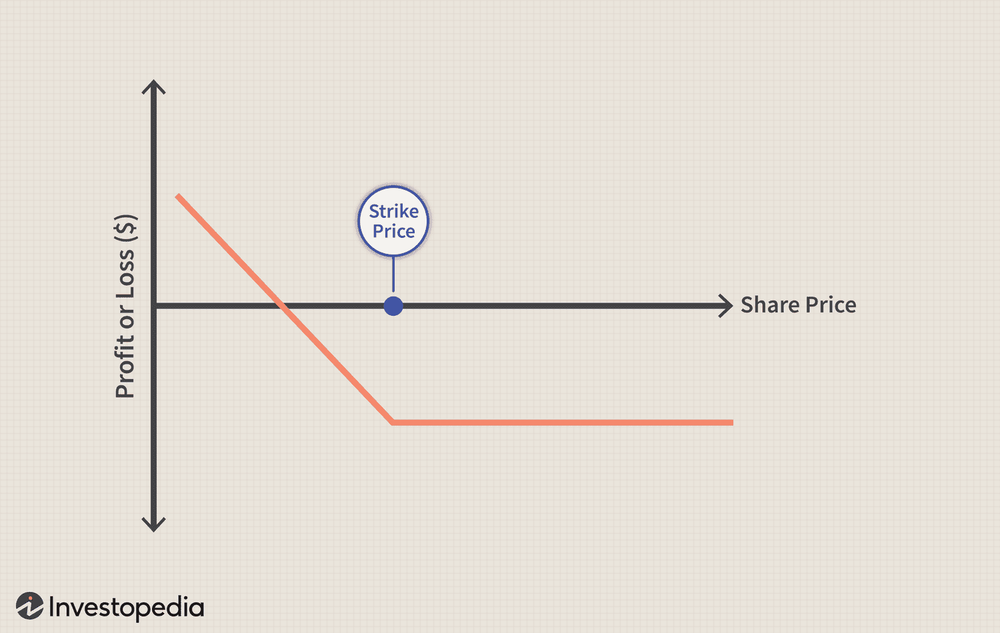

Options trading, and particularly put options, plays a significant role in financial derivatives. A put option provides the holder the right, but not the obligation, to sell an underlying asset at a specified price before the option's expiration date. This financial instrument is crucial in hedging strategies to mitigate potential losses in portfolios and enables investors to capitalize on anticipated declines in asset prices.

In recent years, algorithmic trading has transformed the landscape of options trading by automating and optimizing complex trading strategies. The integration of sophisticated algorithms in trading systems has enhanced the efficiency of executing put options, allowing for quicker response times to market changes and improved pricing strategies. This amalgamation of finance and technology facilitates the management of large and complex portfolios with precision that human traders alone cannot match. 



The concept of average price put options adds another layer of complexity and opportunity to trading strategies. Unlike traditional put options, where the payoff is determined based on the asset price at expiration, average price puts consider the average price of the underlying asset over a set period. This feature provides a form of volatility smoothing, a significant benefit in turbulent markets, by reducing the impact of short-term price fluctuations on option payouts. 

This article explores these dynamics thoroughly, including the average price of put options within financial derivatives, and discusses the impact of algorithmic trading on pricing and execution. The evolving interaction between advanced trading technologies and financial instruments like put options is central to understanding current and future trends in financial markets.

## Table of Contents

## Understanding Put Options

Put options are a fundamental element of options trading in financial markets. A put option is a financial contract that gives the holder the right, but not the obligation, to sell a specified quantity of an underlying asset at a predetermined price, known as the strike price, within a set time period. The seller, or writer, of the put option is obligated to buy the asset at the strike price if the holder exercises the option. Put options are widely used as they allow investors to hedge against potential declines in asset prices while also providing opportunities for speculative profits.

In contrast, call options give the holder the right to purchase an asset at the strike price before the option expires. The key difference between put and call options is the direction of the transaction. While put options are used to bet on, or protect against, a decline in the asset's price, call options are used to benefit from an expected increase. Both instruments are crucial for constructing various trading strategies and provide investors with flexibility in managing risk.

The mechanics of put options involve several factors, such as the underlying asset’s market price, the strike price, the time to expiration, and the [volatility](/wiki/volatility-trading-strategies) of the asset. For instance, when the market price of the underlying asset falls below the strike price, the put option becomes “in-the-money,” providing the holder with the potential for profit. Conversely, if the market price is above the strike price, the option is “out-of-the-money,” and the holder might choose not to exercise it since it would result in a loss.

Put options serve an essential hedging function by insuring portfolios against downturns. Investors use put options to protect their holdings against declining market prices, effectively setting a floor on potential losses. For example, owning a put option on a stock can offset losses if the stock price drops, as the value of the put option typically rises in such scenarios.

Speculators use put options to profit from anticipated declines in the underlying asset’s price. By purchasing a put option, speculators can benefit from price movements without the need to directly own or short sell the asset. This ability to leverage positions and obtain downside exposure with limited capital outlay makes put options an attractive tool for traders with bearish sentiments.

Overall, put options are invaluable for risk management and speculation. They offer a method for investors to navigate market volatility, providing both protection and profit opportunities depending on their market outlook. This dynamic role ensures put options maintain their significance in the financial derivatives landscape.

## The Concept of Average Price Put

Average price puts are a type of exotic option where the payoff is determined by the average price of the underlying asset over a specified period, rather than the price at a specific point in time. Unlike traditional put options, which grant the holder the right to sell the underlying asset at a predetermined strike price before the option expires, average price puts offer a payoff based on the difference between the average asset price and the strike price if the option is in the money at expiration. This characteristic helps to smooth out volatility in the pricing of the option's payoff.

Average price put options are particularly beneficial in volatile markets. Their structure inherently reduces the impact of significant price fluctuations by considering an average price, providing a more stable and predictable outcome for investors. This pricing mechanism mitigates the risk of sharp movements in asset prices that could otherwise affect the profitability of a standard put option.

When compared to Asian options, which also use an average price mechanism, average price put options operate on a similar principle but specifically focus on providing a protective hedge for downward price movements in the underlying asset. Both types of options contribute to volatility smoothing, reducing the sensitivity of the option's payoff to extreme price spikes or drops within the averaging period.

The volatility smoothing effect of average price puts can be advantageous for traders seeking to maintain a consistent hedging strategy without being overly reactive to short-term market volatility. By averaging the price of the underlying asset over a set duration, these options serve as a tool for managing risk associated with temporary price shocks, making them an attractive choice for risk-averse investors or those seeking a more predictable risk management approach in their portfolio strategies.

## Financial Derivatives and Put Options

Put options are a crucial component within the expansive category of financial derivatives. They provide investors with the right, but not the obligation, to sell a specified amount of an underlying asset at a predetermined price, known as the strike price, before the option's expiration date. This feature makes put options instrumental for hedging against potential declines in asset prices, thereby reducing downside risk. Financial derivatives, such as put options, are pivotal for risk management, speculation, and improving market [liquidity](/wiki/liquidity-risk-premium).

Valuing put options involves several sophisticated financial models, with the Black-Scholes model being one of the most renowned and widely used. The Black-Scholes formula, developed in the early 1970s, revolutionized the financial industry by providing a systematic way to estimate the fair value of options. The model assumes that the price of the underlying asset follows a geometric Brownian motion with constant volatility and generates prices using the following formula for European put options:

$$
P = Xe^{-rT}N(-d_2) - S_0 N(-d_1)
$$

where:
- $P$ is the price of the put option,
- $S_0$ is the current price of the underlying asset,
- $X$ is the strike price,
- $r$ is the risk-free interest rate,
- $T$ is the time to expiration,
- $N$ is the cumulative distribution function of the standard normal distribution,
- $d_1 = \frac{\ln(S_0/X) + (r + \sigma^2/2)T}{\sigma\sqrt{T}}$
- $d_2 = d_1 - \sigma\sqrt{T}$,
- $\sigma$ is the volatility of the returns of the underlying asset.

Although the Black-Scholes model is popular, it has limitations, particularly under conditions of extreme volatility or discontinuous markets. Therefore, other models, such as binomial and trinomial trees, and Monte Carlo simulations, are also used to provide more flexibility and precision in certain scenarios.

An intriguing case is the use of average price puts, a specific type of option that can be beneficial in hedging strategies. Average price puts base their payoff on the difference between the strike price and the average price of the underlying asset over a set period. This method smooths out price volatility fluctuations, offering a more stable hedging outcome in choppy or unpredictable markets. 

Consider this scenario: A business that relies on copper purchases faces the risk of rising copper prices affecting its profitability. By using average price puts, the business can hedge against this risk by locking in the average copper price over a future period, ensuring cost predictability while mitigating short-term price spikes.

These dynamics highlight the significant role of put options in financial derivatives, showcasing their strategic importance for investors to manage risk, explore [arbitrage](/wiki/arbitrage) opportunities, and maintain portfolio stability amidst market uncertainties.

## Algorithmic Trading in Options Markets

Algorithmic trading, also known as algo trading, refers to the use of computer algorithms to automate and execute trading strategies at high speeds and volumes. In the options markets, this approach has significantly transformed how investors and traders operate, offering a range of advantages over traditional manual methods.

One of the primary benefits of [algorithmic trading](/wiki/algorithmic-trading) is speed. Algorithms can process a massive variety of data and execute trades in milliseconds, outpacing any human trader. This speed is crucial in fast-moving markets where opportunities can quickly evaporate. By reacting to market signals almost instantaneously, algorithmic trading ensures that traders can capitalize on fleeting market conditions.

Accuracy is another advantage. Algorithms execute trades based on pre-defined criteria, which eliminates the risk of human error. This precision is particularly important in options markets, where complex calculations are often required to evaluate the Greeks (delta, gamma, theta, etc.) and to formulate strategies like straddles or strangles. With algorithmic trading, the probability of incorrectly executing a trade due to a misreading of market data or a computational error is minimized.

Efficiency is enhanced through algorithms by optimizing the trading process. This includes not just the execution of trades but also other aspects like order management, risk management, and portfolio optimization. By automating these tasks, algorithmic trading streamlines operations and reduces transaction costs, allowing for more efficient use of capital.

Algorithms utilize numerous data sources for decision-making in options trading. Historical price data, real-time market data, and even [alternative data](/wiki/best-alternative-data) (such as social media sentiment and news feeds) can be aggregated and analyzed to identify profitable trading opportunities. Machine learning techniques can be applied to this data to discern patterns and forecast future price movements. For instance, an algo trading system might employ a price prediction model that integrates both historical volatility patterns and real-time [order book](/wiki/order-book-trading-strategies) data to estimate future price trends.

Here is a simple example of how an algorithm might be structured in Python to make trading decisions based on moving averages, one of the many strategies used in options trading:

```python
import numpy as np
import pandas as pd

class AlgoTradingStrategy:
    def __init__(self, data, short_window=40, long_window=100):
        self.data = data
        self.short_window = short_window
        self.long_window = long_window

    def moving_average_strategy(self):
        signals = pd.DataFrame(index=self.data.index)
        signals['price'] = self.data['price']
        signals['short_mavg'] = self.data['price'].rolling(window=self.short_window, min_periods=1, center=False).mean()
        signals['long_mavg'] = self.data['price'].rolling(window=self.long_window, min_periods=1, center=False).mean()

        signals['signal'] = 0.0
        signals['signal'][self.short_window:] = np.where(signals['short_mavg'][self.short_window:] > signals['long_mavg'][self.short_window:], 1.0, 0.0)

        signals['positions'] = signals['signal'].diff()

        return signals

# Example usage
# Assume 'market_data' is a DataFrame containing historical price data
strategy = AlgoTradingStrategy(market_data)
signals = strategy.moving_average_strategy()
```

This script implements a moving average crossover strategy, a common technique in trading, where positions are taken when the short-term moving average crosses the long-term moving average. Such strategies benefit from the speed and accuracy of algorithmic trading, executing trades immediately upon signal generation.

Overall, algorithmic trading in options markets provides traders with the speed, accuracy, and efficiency required to successfully navigate complex and high-[volume](/wiki/volume-trading-strategy) trading environments. By leveraging vast datasets and advanced analytical techniques, algorithms can greatly enhance decision-making processes in options trading.

## Impact of Algorithmic Trading on Option Pricing

Algorithmic trading has significantly influenced the pricing and liquidity of put options by introducing high-speed data processing, real-time market analysis, and precise execution strategies. These developments have reshaped how traders and financial institutions approach option pricing, emphasizing efficiency and accuracy.

One primary impact of algorithmic trading is the enhancement of liquidity in options markets. Algorithms can continuously process and react to market data, providing consistent bid and ask prices, thus narrowing spreads and increasing market depth. This heightened liquidity reduces the cost of transactions and enables large orders to be executed without substantial market impact.

In terms of pricing, algorithmic trading facilitates the integration of complex models for option valuation, such as those incorporating stochastic volatility or jump diffusion processes. Traditional models like Black-Scholes, which assumes constant volatility and log-normal distribution of returns, often fall short in capturing real market dynamics. Algorithmic systems allow for continuous recalibration of models, incorporating real-time data to adjust for market changes. This ability to update pricing models instantaneously provides a more accurate reflection of an option's fair value.

Adjustments in trading strategies due to algorithmic trading often involve sophisticated tools such as [machine learning](/wiki/machine-learning) and data analytics. These tools can identify patterns or anomalies in market data that may indicate opportunities for arbitrage or other strategic plays. For example, volatility arbitrage, a popular algorithmic trading strategy, exploits discrepancies between an option's implied volatility and the trader's forecast of future volatility. By constructing delta-neutral portfolios, traders aim to benefit from these predicted volatility changes while minimizing exposure to market direction.

A simplified Python example of an algorithmic strategy for calculating implied volatility could be implemented as follows:

```python
from scipy.optimize import minimize
from scipy.stats import norm
import numpy as np

def black_scholes_price(S, K, T, r, sigma, option_type='put'):
    # Calculate d1 and d2
    d1 = (np.log(S / K) + (r + 0.5 * sigma ** 2) * T) / (sigma * np.sqrt(T))
    d2 = d1 - sigma * np.sqrt(T)

    # Calculate option price
    if option_type == 'put':
        return K * np.exp(-r * T) * norm.cdf(-d2) - S * norm.cdf(-d1)
    else:
        return S * norm.cdf(d1) - K * np.exp(-r * T) * norm.cdf(d2)

def implied_volatility(market_price, S, K, T, r, option_type='put'):
    # Objective function to minimize
    objective = lambda sigma: (black_scholes_price(S, K, T, r, sigma, option_type) - market_price) ** 2

    # Minimize objective function to find implied volatility
    result = minimize(objective, 0.2, bounds=[(0.01, 5.0)])
    return result.x[0]

# Example usage
market_price = 10  # Replace with actual market price
S = 100  # Current stock price
K = 95  # Option strike price
T = 1  # Time to expiration in years
r = 0.05  # Risk-free interest rate

iv = implied_volatility(market_price, S, K, T, r)
print(f"Implied Volatility: {iv:.2f}")
```

Algorithmic trading also responds to implied volatility by utilizing advanced hedging strategies. Dynamic hedging frameworks often involve adjusting the hedge ratios based on real-time data, thus optimizing the risk management process of the option portfolios.

In summary, algorithmic trading's integration into option markets has profoundly improved the precision of pricing and liquidity mechanisms. By leveraging advanced computation and data analysis techniques, traders can adopt more refined strategies, such as volatility arbitrage, to capitalize on the ever-evolving dynamics of options markets.

## Challenges and Limitations

In the ever-evolving sphere of options trading, algorithmic methods have both advanced the industry and introduced distinct challenges for traders. The use of sophisticated algorithms presents several hurdles that must be carefully managed to optimize trading.

One of the core challenges is the reliance on technology, which inherently carries the risk of technical glitches. These glitches can arise from hardware malfunctions, software bugs, or network issues, potentially leading to erroneous trades. For example, a malfunctioning algorithm might execute trades at incorrect prices or in incorrect quantities, resulting in substantial financial losses. Therefore, maintaining robust technological infrastructure and implementing fail-safes are vital.

Moreover, algorithmic trading's swift execution capabilities can inadvertently influence market behavior. For instance, large volumes of trades executed in rapid succession can lead to significant price changes, sometimes inducing market anomalies like "flash crashes." These are events where prices plummet and recover within a short time. To mitigate such risks, regulatory frameworks often impose circuit breakers to temporarily halt trading and prevent abrupt market movements.

Traditional valuation models, such as the Black-Scholes model, encounter limitations when applied within an algorithmic framework. Although Black-Scholes provides a foundational approach for valuing options based on factors like volatility and time decay, it presumes constant volatility and risk-free interest rates, which may not reflect real-time market dynamics efficiently captured by algorithms.

The Black-Scholes model's formula for pricing a European put option is:

$$
P = K \cdot e^{-rT} \cdot N(-d_2) - S \cdot N(-d_1)
$$

Where:
- $P$ is the price of the put option
- $K$ is the strike price of the option
- $r$ is the risk-free interest rate
- $T$ is the time to maturity
- $S$ is the current stock price
- $N$ is the cumulative distribution function of the standard normal distribution
- $d_1$ and $d_2$ are calculated as follows:

$$
d_1 = \frac{\ln(S/K) + (r + \sigma^2/2)T}{\sigma \sqrt{T}}
$$

$$
d_2 = d_1 - \sigma \sqrt{T}
$$

Here, $\sigma$ represents volatility. Algorithms can model dynamic volatility with more precision, but implementing such adaptability in traditional models can be complex.

Traders also contend with market impact costs associated with large algorithmic orders. The execution of large trades can shift market prices unfavorably against the trader before completion, a phenomenon known as 'slippage.' Algorithms must be designed to minimize this by intelligently spreading orders over time or using techniques like "iceberg" strategies, which conceal the true size of a large order.

Additionally, the hidden biases in algorithm design, driven by the assumptions embedded in data and models, also represent a significant limitation. For instance, if historical data contains biases or anomalies, algorithms could perpetuate these discrepancies, leading to incorrect predictions and decisions.

Algorithmic trading requires a balanced approach, incorporating advanced technology and robust risk management strategies. Traders must continually innovate and revise their models and algorithms to align with changing market conditions and technological advancements.

## Future of Put Options and Algorithmic Trading

Emerging trends in options trading continue to shape both the availability and functionality of algorithmic technologies. With the growing complexity of markets, there is an increasing demand for sophisticated algorithms that can process vast amounts of data to make timely and informed trading decisions. Machine learning models and [artificial intelligence](/wiki/ai-artificial-intelligence) are expected to play a critical role in enhancing prediction accuracy and strategy optimization. The development of quantum computing might further redefine computational limits, enabling traders to solve complex problems faster and with higher precision.

Advancements in algorithmic trading platforms also offer significant implications for options markets. Enhanced data analytics and real-time processing capabilities are likely to improve the speed and efficiency of trade executions. Platforms are integrating more user-friendly interfaces, allowing traders of various expertise levels to customize algorithms and exploit real-time market opportunities effectively. Additionally, blockchain technology could advance clearing and settlement processes, potentially reducing counterparty risk and increasing transparency in trading activities.

Speculations on the future role of put options in diversified portfolios suggest that they will continue to be an essential hedging tool, especially in uncertain market conditions. With the advancements in algorithmic trading, it is anticipated that investors will have better risk management capabilities, allowing them to adapt to market dynamics swiftly. Put options can provide a safety net for portfolios, offering protection against downside risk while still allowing participation in upward market movements.

Algorithmic techniques can further enhance the strategic use of put options. For example, volatility forecasting models could refine when and how put options are deployed, maximizing their protective benefits. Additionally, the proliferation of customizable algorithms may empower traders to implement more intricate hedging strategies that align closely with their risk profiles.

Together, these factors indicate that both put options and algorithmic trading will likely evolve, adapting to new technological and market-driven challenges. As financial markets become more interconnected and complex, the synergy between put options and advanced algorithms could offer sophisticated tools for those aiming to optimize their trading strategies effectively.

## Conclusion

Understanding average price put options and the impact of algorithmic trading is crucial for anyone involved in financial markets. Average price puts offer a strategic advantage by helping to manage volatility and improve pricing accuracy, particularly in turbulent markets. This approach contrasts with traditional put options, which may be susceptible to sharp price swings.

Algorithmic trading has significantly transformed the trading landscape, especially concerning options. Algorithms provide enhanced speed, accuracy, and efficiency, making them indispensable for traders looking to optimize their strategies. The integration of algorithmic methods has not only improved pricing and liquidity for put options but has also simplified the execution of complex trading strategies. With the ability to process vast amounts of data in real-time, algorithms enable traders to make more informed decisions, mitigating risks and capitalizing on market opportunities faster than ever before.

As financial markets continue to evolve, staying informed about the latest advancements in algorithmic trading and options pricing is essential. Embracing these innovations allows traders to maintain competitive in a dynamic environment. Continuous learning and adaptation are crucial as new technologies emerge, promising further enhancements in trading efficiency and strategy development. The landscape of options trading is rapidly changing, urging participants to be proactive in understanding and implementing cutting-edge techniques to ensure sustainable success in their financial endeavors.

## References & Further Reading

[1]: Hull, J. C. (2014). ["Options, Futures, and Other Derivatives"](https://www.amazon.com/Options-Futures-Other-Derivatives-9th/dp/0133456315). Pearson Education.

[2]: Black, F., & Scholes, M. (1973). ["The Pricing of Options and Corporate Liabilities"](https://www.cs.princeton.edu/courses/archive/fall09/cos323/papers/black_scholes73.pdf). The Journal of Political Economy, 81(3), 637-654.

[3]: Aldridge, I. (2013). ["High-Frequency Trading: A Practical Guide to Algorithmic Strategies and Trading Systems"](https://onlinelibrary.wiley.com/doi/pdf/10.1002/9781119203803.fmatter). John Wiley & Sons.

[4]: Jorion, P. (2006). ["Value at Risk: The New Benchmark for Managing Financial Risk"](https://books.google.com/books/about/Value_at_Risk_3rd_Ed.html?id=nnblKhI7KP8C). McGraw Hill Professional.

[5]: Pardo, R. (2008). ["The Evaluation and Optimization of Trading Strategies"](https://onlinelibrary.wiley.com/doi/book/10.1002/9781119196969). Wiley Trading.