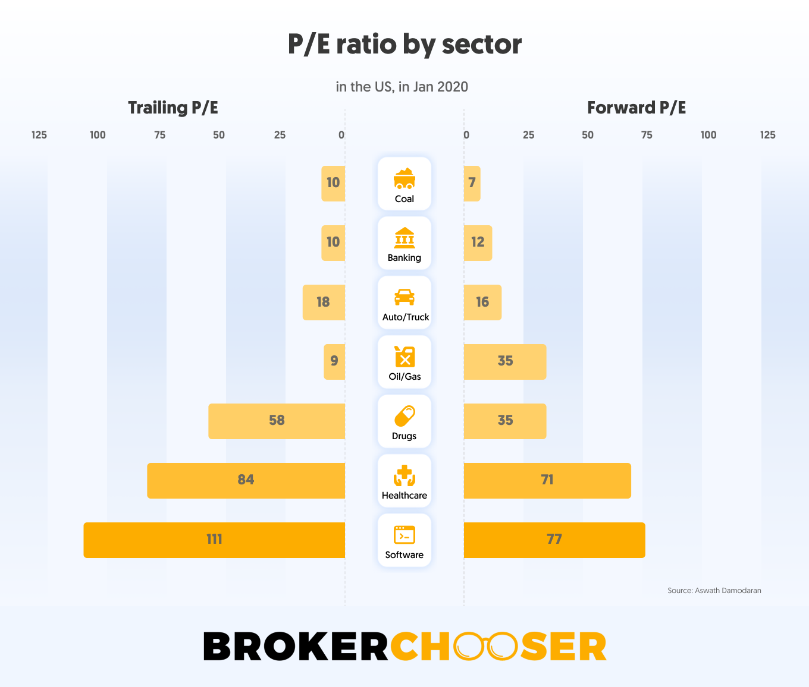

## Table of Contents

## What is the Price-To-Earnings (P/E) ratio?

The Price-To-Earnings (P/E) ratio is a way to figure out how much people are willing to pay for a company's earnings. It's calculated by taking the current stock price and dividing it by the earnings per share (EPS). The P/E ratio helps investors see if a stock is a good buy. A high P/E might mean people think the company will grow a lot in the future. A low P/E might mean the company is not expected to grow much or could be undervalued.

This ratio is useful for comparing companies in the same industry. For example, if one company has a P/E of 15 and another has a P/E of 30, the second company might be seen as more expensive. But it's important to remember that the P/E ratio is just one tool. It doesn't tell the whole story about a company's value or future. Other things like the company's debt, how fast it's growing, and what's happening in the economy can also affect whether a stock is a good investment.

## How is the P/E ratio calculated?

The P/E ratio is calculated by dividing the current stock price by the earnings per share (EPS). The stock price is how much one share of the company costs on the stock market. Earnings per share is the company's total earnings divided by the number of shares. So, if a company's stock is $50 and its earnings per share is $5, the P/E ratio would be 10.

Sometimes, the P/E ratio can be calculated using predicted future earnings instead of past earnings. This is called the forward P/E ratio. It uses earnings forecasts for the next year. If analysts predict the earnings per share will be $6 next year, and the stock price stays at $50, the forward P/E ratio would be about 8.33. This can give investors an idea of what the company might be worth in the future.

## Why is the P/E ratio important for investors?

The P/E ratio is important for investors because it helps them see if a stock is a good deal. It tells you how much you have to pay for each dollar of the company's earnings. If the P/E ratio is low, it might mean the stock is cheap and could be a good buy. If it's high, the stock might be expensive, and you might want to think twice before buying it. But remember, a high P/E can also mean people think the company will do really well in the future.

Investors use the P/E ratio to compare different companies, especially those in the same industry. For example, if one company has a P/E of 15 and another has a P/E of 30, the first one might look like a better deal. But it's not just about the numbers. You also need to think about other things like how fast the company is growing, how much debt it has, and what's going on in the economy. The P/E ratio is just one piece of the puzzle when deciding if a stock is worth buying.

## What is considered a 'good' P/E ratio in the banking sector?

In the banking sector, a 'good' P/E ratio can vary a lot, but it's often thought to be between 10 and 15. This means that for every dollar the bank earns, you're paying between $10 and $15 to own a piece of it. Banks with a P/E in this range are often seen as a good value because they're not too expensive but still have room to grow.

But, the idea of a 'good' P/E ratio can change based on things like the economy, interest rates, and how well the bank is doing compared to others. If the economy is doing great and interest rates are low, people might be okay with paying more for bank stocks, so a higher P/E might still be seen as good. It's always smart to look at the P/E ratio along with other stuff like the bank's growth, how much money it makes, and what's happening in the world to really know if it's a good deal.

## How does the P/E ratio of the banking sector compare to other sectors?

The P/E ratio can be different for different sectors. For the banking sector, a good P/E ratio is often thought to be between 10 and 15. This is lower than some other sectors like technology, where P/E ratios can be much higher, sometimes over 20 or even 30. The reason for this difference is that banks are seen as more stable and less likely to grow super fast, so people don't want to pay as much for their earnings.

In sectors like technology, people are often willing to pay more for earnings because they think these companies will grow a lot in the future. This makes the P/E ratios in tech much higher than in banking. On the other hand, sectors like utilities or consumer goods might have P/E ratios similar to banking, usually between 10 and 20, because they are also seen as stable but not expected to grow as fast as tech companies. So, when looking at P/E ratios, it's important to compare companies within the same sector to get a better idea of what's a good deal.

## What factors influence the P/E ratio in the banking sector?

The P/E ratio in the banking sector can be influenced by many things. One big [factor](/wiki/factor-investing) is how the economy is doing. When the economy is strong, people might be willing to pay more for bank stocks, which can push up the P/E ratio. On the other hand, if the economy is weak, people might not want to pay as much, and the P/E ratio could go down. Interest rates also play a big role. When interest rates are low, banks can make more money from loans, which can make their earnings go up and affect their P/E ratio. But if interest rates are high, it might be harder for banks to make money, and their P/E ratio could be lower.

Another thing that can change the P/E ratio is how well the bank is doing compared to other banks. If a bank is growing faster or making more money than its competitors, people might be willing to pay more for its stock, which would raise its P/E ratio. Also, if a bank has a lot of debt, it might be seen as riskier, and people might not want to pay as much for its stock, which could lower its P/E ratio. Finally, what investors think about the future of the banking industry can also affect P/E ratios. If they think the industry will do well, they might be okay with paying more for bank stocks, leading to higher P/E ratios.

## How has the average P/E ratio in the banking sector changed over the past decade?

Over the past decade, the average P/E ratio in the banking sector has gone up and down because of many things like the economy, interest rates, and how well banks are doing. After the big financial crisis in 2008, P/E ratios were pretty low because people were scared and didn't want to pay a lot for bank stocks. But as the economy got better and banks started making more money, P/E ratios started to go up. For example, around 2012 to 2015, P/E ratios were starting to get back to normal, often between 10 and 15.

From 2016 to 2020, P/E ratios kept going up a bit more because interest rates were low and banks were doing well. But then, in 2020, the world got hit by the COVID-19 pandemic, and P/E ratios dropped again because people were worried about the economy. After the first shock of the pandemic, P/E ratios started to recover as banks got help from the government and the economy started to get better. By 2022 and 2023, P/E ratios were back to being around 10 to 15, but they could change because of things like inflation and what the Federal Reserve does with interest rates.

## Can you provide examples of banks with high and low P/E ratios and explain why?

One example of a bank with a high P/E ratio is JPMorgan Chase. As of early 2023, its P/E ratio was around 10, which is on the higher side for the banking sector. The reason for this high P/E ratio could be because JPMorgan Chase is seen as a strong and stable bank. It has a good history of making money and growing, even during tough times like the financial crisis and the COVID-19 pandemic. Investors might be willing to pay more for its stock because they think it will keep doing well in the future.

On the other hand, an example of a bank with a low P/E ratio is Citigroup. Around the same time, its P/E ratio was around 7, which is lower than the average for the banking sector. This could be because Citigroup has had some problems in the past, like big losses and having to pay fines for breaking rules. Investors might not want to pay as much for its stock because they think it's riskier and might not do as well in the future. So, even though both banks are in the same sector, their P/E ratios are different because of how investors see their future and past performance.

## How do economic cycles affect the P/E ratios in the banking sector?

Economic cycles have a big impact on the P/E ratios in the banking sector. When the economy is doing well and growing, people feel good about the future. They might be willing to pay more for bank stocks because they think banks will make more money from loans and other services. This can push up the P/E ratios. But if the economy is in a downturn, like during a recession, people get worried. They might not want to pay as much for bank stocks because they think banks will have a harder time making money. This can make P/E ratios go down.

Interest rates, which change with the economic cycle, also play a big role. When interest rates are low during good economic times, banks can make more money from loans, which can increase their earnings and push up their P/E ratios. But when the economy is bad and interest rates go up, it can be harder for banks to make money from loans, and their P/E ratios might go down. So, the ups and downs of the economy and interest rates can make the P/E ratios in the banking sector go up and down a lot.

## What are the limitations of using P/E ratios to evaluate banks?

Using P/E ratios to evaluate banks has some problems. One big problem is that P/E ratios don't tell you everything about a bank. They just show how much people are willing to pay for the bank's earnings, but they don't say anything about the bank's debt, how well it's run, or if it's growing. For example, a bank might have a low P/E ratio because it's not making much money, but it could also be because it has a lot of debt or is not doing well compared to other banks. So, looking at just the P/E ratio might make you miss important stuff.

Another problem is that P/E ratios can be different because of things outside the bank's control, like the economy or interest rates. If the economy is doing great, P/E ratios might be high because people are feeling good about the future. But if the economy is bad, P/E ratios might be low even if the bank is doing okay. This can make it hard to know if a bank's P/E ratio is high or low because it's a good or bad bank, or just because of what's happening in the world. So, while P/E ratios can be helpful, they're not the whole story, and you need to look at other things too to really understand if a bank is a good investment.

## How do international differences impact P/E ratios in the global banking sector?

International differences can make P/E ratios in the global banking sector look very different. One big reason is that different countries have different economies. For example, if one country's economy is growing fast, people might be willing to pay more for bank stocks there, which can make P/E ratios higher. But if another country's economy is not doing so well, people might not want to pay as much for bank stocks, and P/E ratios could be lower. Also, things like interest rates, how much people trust banks, and government rules can be different in each country, which can change how much people are willing to pay for bank stocks and affect P/E ratios.

Another thing that can make P/E ratios different around the world is how banks are run and how they make money. In some countries, banks might focus on making money from loans, while in others they might make more money from fees or other services. This can make their earnings look different, which can change their P/E ratios. Also, some countries might have banks that are owned by the government, which can make their P/E ratios different from banks that are owned by private investors. So, when looking at P/E ratios in the global banking sector, it's important to think about all these international differences to really understand what the numbers mean.

## What advanced metrics should be used alongside P/E ratios for a more comprehensive analysis of banks?

When looking at banks, using just the P/E ratio isn't enough. You should also look at the Price-to-Book (P/B) ratio. This tells you how much the market thinks the bank is worth compared to what it's worth on paper. A low P/B ratio might mean the bank is a good deal, but a high one could mean it's overpriced. Another important metric is the Return on Equity (ROE), which shows how well the bank is using the money shareholders have put in to make more money. A high ROE is good because it means the bank is doing a good job of making profits.

You should also check the bank's Net Interest Margin (NIM). This shows how much money the bank makes from the difference between what it pays for deposits and what it earns from loans. A higher NIM is better because it means the bank is making more money from its main business. Lastly, looking at the bank's efficiency ratio can help too. This tells you how well the bank is managing its costs. A lower efficiency ratio means the bank is running its business well and keeping costs down. Using these metrics along with the P/E ratio gives you a fuller picture of how healthy and valuable a bank really is.

## What is the Price-to-Earnings Ratio and how do we understand it?

The Price-to-Earnings (P/E) ratio serves as a critical instrument in equity valuation, reflecting the relationship between a company's stock price and its earnings per share (EPS). Mathematically, the P/E ratio is expressed as:

$$
\text{P/E Ratio} = \frac{\text{Market Value per Share}}{\text{Earnings per Share (EPS)}}
$$

Fundamentally, this ratio provides insights into how much investors are willing to pay for each dollar of earnings, thus helping to determine whether a stock is overvalued or undervalued relative to its earnings performance. This makes the P/E ratio an indispensable tool for investors keen on understanding market dynamics.

For instance, a high P/E ratio typically suggests that investors have high expectations of future growth and are willing to pay a premium for the company's stock. Conversely, a low P/E ratio may imply that the company faces difficulties in achieving desired growth levels or is possibly undervalued in the marketplace.

The straightforward nature of the P/E ratio contributes to its popularity among both fundamental analysts and algorithmic traders. For fundamental analysts, this ratio allows for quick comparisons between firms and helps highlight stocks that could be trading below their intrinsic value. Meanwhile, algorithmic traders favor its simplicity because it can be seamlessly integrated into computerized models for swift analysis and decision-making.

Furthermore, while its simplicity is a notable strength, it is essential to consider the context and industry-specific factors when interpreting P/E ratios. For example, comparing P/E ratios across different sectors without considering growth patterns and economic conditions can lead to misleading conclusions. Therefore, while the P/E ratio is a powerful metric, its effectiveness is heightened when used in conjunction with a broader set of financial indicators and analyses.

## What are P/E Ratios in the Banking Sector?

The banking sector offers a unique context for analyzing Price-to-Earnings (P/E) ratios due to its intricate regulatory landscape and economic dynamics. P/E ratios, a key financial metric, are influenced by various factors that are particularly pronounced in this sector. These factors include regulatory requirements, [interest rate](/wiki/interest-rate-trading-strategies) fluctuations, and the overall economic environment that banks operate within.

Recent data indicate that larger, well-established banks tend to exhibit lower P/E ratios compared to their smaller, regional counterparts. This disparity can be attributed to several factors. Larger banks generally have more stable earnings and predictable growth trajectories, resulting in more conservative investor expectations, which are reflected in lower P/E ratios. In contrast, smaller regional banks often experience rapid growth or are perceived to have higher growth potential, leading to higher P/E ratios as investors anticipate increased future earnings.

To make informed investment decisions, it is important to analyze P/E ratios in conjunction with historical performance data and sector averages. Historical analysis helps in understanding the context of current P/E ratios and how they compare with past trends. Sector averages provide a benchmark against which individual banks' performance can be evaluated.

For instance, as per recent financial reports, the average P/E ratio in the banking sector was approximately 13.50. However, this figure can vary significantly among different categories of banks. For instance, globally established banking giants might hover around the lower end of this average, while smaller, more dynamic institutions might exceed it. Such variations highlight the importance of considering both the macroeconomic environment and individual bank characteristics when evaluating P/E ratios.

In mathematical terms, the P/E ratio is calculated as:

$$
\text{P/E Ratio} = \frac{\text{Market Price per Share}}{\text{Earnings per Share (EPS)}}
$$

This ratio provides a snapshot of the company's valuation relative to its earnings, guiding investors' expectations about growth and profitability. In the banking sector, however, these valuations are constantly influenced by complex external factors, making the analysis of P/E ratios a more nuanced process than in other industries.

## References & Further Reading

[1]: ["Advances in Financial Machine Learning"](https://www.amazon.com/Advances-Financial-Machine-Learning-Marcos/dp/1119482089) by Marcos Lopez de Prado

[2]: ["Machine Learning for Algorithmic Trading"](https://github.com/stefan-jansen/machine-learning-for-trading) by Stefan Jansen

[3]: ["Quantitative Trading: How to Build Your Own Algorithmic Trading Business"](https://www.amazon.com/Quantitative-Trading-Build-Algorithmic-Business/dp/1119800064) by Ernest P. Chan

[4]: Financial Analysts Journal by CFA Institute. Available at: [https://www.cfainstitute.org/en/research/financial-analysts-journal](https://rpc.cfainstitute.org/research/financial-analysts-journal)

[5]: Black, Fischer. "Estimating Expected Return." Financial Analysts Journal, 1993. Available at: [https://www.researchgate.net/publication/250845514_Estimating_Expected_Return](https://www.jstor.org/stable/4479681)

[6]: ["Evidence-Based Technical Analysis: Applying the Scientific Method and Statistical Inference to Trading Signals"](https://www.amazon.com/Evidence-Based-Technical-Analysis-Scientific-Statistical/dp/0470008741) by David Aronson