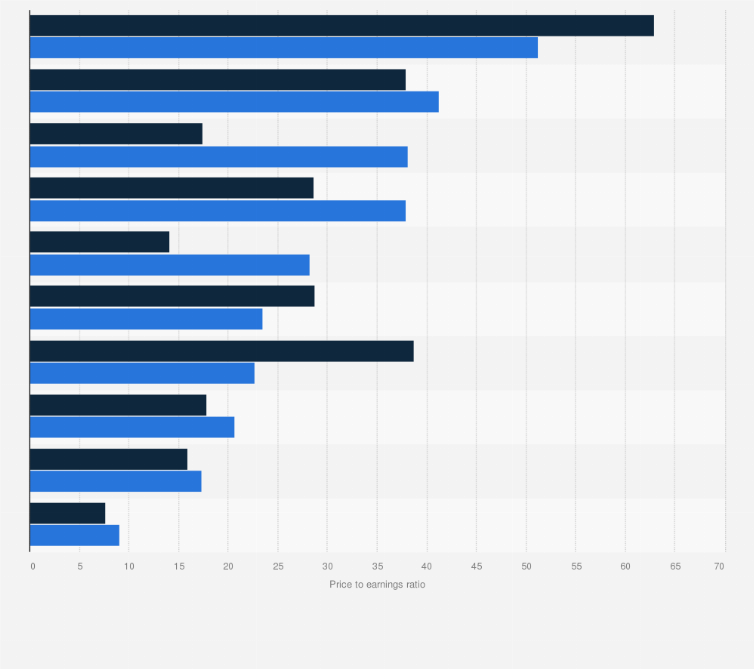

## Table of Contents

## What is the Price-to-Earnings (P/E) ratio?

The Price-to-Earnings (P/E) ratio is a way to figure out how much investors are willing to pay for a company's earnings. It's calculated by taking the current stock price and dividing it by the earnings per share (EPS). The P/E ratio helps investors see if a stock is a good buy. A high P/E might mean people think the company will grow a lot in the future. A low P/E might mean the company is not expected to grow much or could be undervalued.

This ratio is useful for comparing companies in the same industry. For example, if one company has a P/E of 15 and another has a P/E of 30, the second company might be seen as more expensive. But, it's important to remember that the P/E ratio is just one tool. It doesn't tell the whole story about a company's value or future. Other things like the company's debt, growth plans, and the overall market conditions should also be considered.

## Why is the P/E ratio important in the food and beverage industry?

The P/E ratio is important in the food and beverage industry because it helps investors see how much they are paying for a company's earnings. This industry can be very competitive, with many companies fighting for customers. By looking at the P/E ratio, investors can compare different companies to see which ones might be a better value. For example, if one food company has a lower P/E ratio than another, it might mean that the first company is cheaper to buy based on its earnings.

Also, the P/E ratio can show what investors think about a company's future. In the food and beverage industry, trends can change quickly. If a company has a high P/E ratio, it might mean that investors believe the company will grow a lot in the future. They might think the company has a new product that will be popular or that it will do well in new markets. On the other hand, a low P/E ratio might mean investors are not as excited about the company's future growth.

## How is the P/E ratio calculated?

The P/E ratio is calculated by dividing a company's stock price by its earnings per share (EPS). The stock price is how much one share of the company costs. The EPS is the company's total earnings divided by the number of shares. So, if a company's stock price is $50 and its EPS is $2, the P/E ratio would be $50 divided by $2, which equals 25.

This calculation can be done using the most recent earnings or the expected future earnings. If you use the most recent earnings, it's called the trailing P/E ratio. If you use the expected future earnings, it's called the forward P/E ratio. Both ways give you an idea of how much investors are willing to pay for the company's earnings, but they look at different time periods.

## What is considered a 'good' P/E ratio in the food and beverage sector?

In the food and beverage sector, what counts as a 'good' P/E ratio can change a lot. It depends on things like how fast the company is growing, what's happening in the industry, and what investors are expecting. Usually, a P/E ratio that's lower than the average for the sector might be seen as good because it could mean the stock is a good deal. For example, if the average P/E ratio in the food and beverage sector is around 20, a company with a P/E of 15 might be seen as having a good ratio.

But, it's not just about the numbers. A higher P/E ratio might be okay if people think the company will grow a lot in the future. For instance, if a company is coming out with new products that everyone wants, investors might be happy to pay more for its stock, even if the P/E ratio is higher than average. So, when looking at P/E ratios in the food and beverage sector, it's important to think about the whole picture, not just the numbers.

## How does the average P/E ratio in the food and beverage industry compare to other industries?

The average P/E ratio in the food and beverage industry is often lower than in some other industries like technology or healthcare. This is because food and beverage companies usually grow more slowly and have less risk than tech companies, which can grow very fast and have big changes in their earnings. For example, the average P/E ratio in the food and beverage sector might be around 20, while tech companies might have P/E ratios of 30 or more because investors expect them to grow a lot.

However, the P/E ratio in the food and beverage industry can be higher than in more stable industries like utilities or consumer staples. These industries often have P/E ratios around 15 to 20 because they are seen as safer investments with steady but slow growth. So, while the food and beverage sector might not have the highest P/E ratios, they are usually in the middle when compared to other industries.

## What factors influence the P/E ratio in the food and beverage industry?

Several things can change the P/E ratio in the food and beverage industry. One big thing is how fast the company is growing. If a company is growing quickly, investors might be willing to pay more for its stock, which makes the P/E ratio go up. Another thing is how much risk there is. If a company is doing well and people think it will keep doing well, the P/E ratio might be higher. But if there are problems, like a big recall or a drop in sales, the P/E ratio might go down because investors are worried.

Also, what's happening in the whole industry can affect the P/E ratio. If everyone is excited about new trends, like plant-based foods or healthier snacks, companies that are part of those trends might have higher P/E ratios. On the other hand, if the industry is struggling, like during a big economic downturn, P/E ratios might be lower because people are less willing to pay a lot for stocks. Finally, what investors expect in the future matters a lot. If they think a company will do better than others in the future, they might be okay with paying more for its stock, which pushes the P/E ratio up.

## How has the average P/E ratio in the food and beverage industry changed over the past decade?

Over the past decade, the average P/E ratio in the food and beverage industry has gone up and down because of many things like how the economy is doing, what people are buying, and what investors are expecting. At the start of the decade, P/E ratios were around 15 to 18. This was because the industry was seen as steady but not growing super fast. As time went on, new trends like plant-based foods and healthier snacks made some companies more exciting to investors, which pushed up their P/E ratios. By the middle of the decade, the average P/E ratio had climbed to around 20 to 22.

In the last few years, the P/E ratio has seen more changes. The global health crisis in 2020 made a big difference. Some companies did really well because people were eating at home more, which made their P/E ratios go up. But other companies had a hard time because restaurants were closed, and their P/E ratios went down. By the end of the decade, the average P/E ratio settled around 20 to 25. This shows that investors still see the food and beverage industry as a good place to put their money, but they are also looking for companies that can grow and change with new trends.

## Can you provide examples of companies in the food and beverage industry with high and low P/E ratios?

In the food and beverage industry, a company like Beyond Meat has had a high P/E ratio in recent years. Beyond Meat makes plant-based meat products that have become very popular. Because people are excited about their products and expect the company to grow a lot, investors are willing to pay more for the stock. This pushes the P/E ratio up. For example, at some points, Beyond Meat's P/E ratio was over 100, which is much higher than the industry average.

On the other hand, a company like Kraft Heinz has often had a lower P/E ratio. Kraft Heinz makes a lot of well-known food products, but they are not seen as growing as fast as some other companies. Investors might see Kraft Heinz as a safer but slower-growing investment, so they are not willing to pay as much for the stock. This keeps the P/E ratio lower. For example, Kraft Heinz's P/E ratio has been around 10 to 15, which is below the industry average.

These examples show how different companies in the same industry can have very different P/E ratios. It depends on what investors think about the company's future growth and how much risk they are willing to take.

## How do economic cycles affect the P/E ratios in the food and beverage industry?

Economic cycles can really change the P/E ratios in the food and beverage industry. When the economy is doing well, people have more money to spend on food and drinks. They might buy more expensive or new kinds of food, which can make some companies in the industry do better. Investors see this and might be willing to pay more for stocks in these companies, which makes the P/E ratios go up. But if the economy is not doing well, people might spend less on food and drinks. They might stick to cheaper options, and this can hurt some companies. Investors might not want to pay as much for these stocks, so the P/E ratios can go down.

Also, during tough economic times, people might see the food and beverage industry as a safer place to put their money. This is because people always need to eat, so the industry can be more stable than others. This can keep P/E ratios from dropping too much, even when the economy is bad. But, if the economy gets better, investors might start looking for companies that can grow a lot, and this can make P/E ratios in the food and beverage industry go up again. So, economic cycles can push P/E ratios up and down, depending on how people are spending and what investors are expecting.

## What are the limitations of using P/E ratios to evaluate companies in the food and beverage sector?

Using P/E ratios to evaluate companies in the food and beverage sector has some limitations. One big problem is that P/E ratios don't tell the whole story about a company. They just show how much investors are willing to pay for the company's earnings, but they don't say anything about the company's debt, how well it's managed, or if it's making new products that could make it grow in the future. So, if you only look at the P/E ratio, you might miss important things that could affect the company's value.

Another issue is that P/E ratios can be hard to compare between different companies in the food and beverage sector. Some companies might have different ways of making money or different growth plans, which can make their P/E ratios look very different even if they are doing well. Also, P/E ratios can change a lot because of things like economic cycles or new trends in the industry. This means that a P/E ratio that looks good today might not be as good in a few months if the economy or the industry changes. So, while P/E ratios can be a helpful tool, they should be used with other information to get a full picture of a company's value.

## How do analysts forecast future P/E ratios for the food and beverage industry?

Analysts forecast future P/E ratios for the food and beverage industry by looking at a lot of different things. They start by looking at how the company has been doing in the past. They check the company's earnings and see if they have been going up or down. Then, they think about what might happen in the future. They look at things like new products the company might be making, how the economy is doing, and what people are buying. If they think the company will do better in the future, they might guess that the P/E ratio will go up. If they think the company will have a hard time, they might guess that the P/E ratio will go down.

Analysts also look at what other people in the industry are doing. They compare the company to others that make similar products. If other companies are doing well and have high P/E ratios, the company they are looking at might have a high P/E ratio too. They also think about what investors are expecting. If investors are excited about the company and think it will grow a lot, the P/E ratio might be higher. By putting all these things together, analysts can make a guess about what the P/E ratio might be in the future. But, it's important to remember that these are just guesses, and the real P/E ratio can be different.

## What advanced metrics should be considered alongside P/E ratios for a comprehensive analysis of the food and beverage industry?

When looking at companies in the food and beverage industry, using just the P/E ratio isn't enough. You should also look at other metrics like the Price-to-Sales (P/S) ratio. This ratio tells you how much you're paying for each dollar of a company's sales. It's good for comparing companies that might not be making a profit yet but are growing their sales. Another useful metric is the Price-to-Book (P/B) ratio, which shows how much you're paying for the company's net assets. This can be helpful for understanding if a company's stock price is too high compared to what it actually owns.

Also, you should consider the Return on Equity (ROE), which shows how well a company is using the money shareholders have put into it to make a profit. A high ROE can mean the company is doing a good job with its money. Another important thing to look at is the Debt-to-Equity (D/E) ratio, which tells you how much debt the company has compared to what shareholders have put in. This can show you if the company is taking on too much risk. By looking at these metrics along with the P/E ratio, you get a fuller picture of a company's health and value in the food and beverage industry.

## What is the Price-to-Earnings Ratio and how can it be understood?

The Price-to-Earnings (P/E) ratio is a fundamental financial metric frequently used in stock valuation. It is calculated by dividing the current market price of a company's stock by its earnings per share (EPS). The formula is expressed as:

$$
\text{P/E Ratio} = \frac{\text{Current Stock Price}}{\text{Earnings Per Share (EPS)}}
$$

This metric serves as a tool for investors to assess how much they are willing to pay for a dollar of a company's earnings, providing insights into the market's expectations for the company's future growth and profitability. 

There are two main types of P/E ratios: trailing twelve months (TTM) and forward P/E. The TTM P/E ratio is based on the earnings data from the past 12 months, reflecting historical performance. This gives investors a sense of how the company has been performing recently. In contrast, the forward P/E ratio uses projected earnings for the upcoming 12 months, offering a perspective on future performance. Analysts and investors use forward P/E to estimate future profitability and growth potential, which can be crucial for making investment decisions.

The P/E ratio is a valuable indicator for determining whether a stock is overvalued or undervalued. A high P/E ratio may suggest that a stock is overpriced relative to its earnings, implying high expectations for its future growth. Conversely, a low P/E ratio may indicate that a stock is undervalued, suggesting that it could be a bargain relative to its current earnings.

However, the P/E ratio should be interpreted with caution. It is essential to compare the P/E ratio of a company with its industry peers to determine relative valuation effectively. Differences in growth rates, market conditions, and financial health can influence appropriate P/E levels, making it critical for investors to consider other factors and financial metrics alongside the P/E ratio.

## What are the limitations and considerations?

The Price-to-Earnings (P/E) ratio is a widely recognized tool for evaluating stock valuation, yet it has notable limitations when used in isolation. A primary concern is the potential for inaccuracies arising from the inherent [volatility](/wiki/volatility-trading-strategies) of earnings, particularly in sectors like food and beverage that may experience cyclical fluctuations. For instance, companies dealing in seasonal products might have earnings that vary significantly throughout the year, directly impacting their P/E ratios. Formulaically, the P/E ratio is calculated as follows:

$$
\text{P/E Ratio} = \frac{\text{Current Stock Price}}{\text{Earnings Per Share (EPS)}}
$$

This straightforward formula doesn't account for variations in earnings, a pivotal aspect that investors should consider.

One-time financial events pose another challenge to the reliability of P/E ratios. Events such as mergers, acquisitions, or asset sales can dramatically alter a company's earnings in a way that is not indicative of its usual operational performance. Such anomalies can lead to inflated or deflated P/E ratios that do not accurately reflect the long-term prospects of the company.

Moreover, industry-specific nuances play a significant role. For example, high growth sub-sectors within the food and beverage industry, such as specialty health foods, might have inherently high P/E ratios due to anticipated future earnings growth. Conversely, more established sub-sectors might exhibit lower P/E ratios, reflecting their mature market position. These disparities necessitate a more nuanced interpretation of P/E ratios across different industry contexts.

Due to these complexities, it's crucial for investors to incorporate a comprehensive analysis framework. Algorithmic trading offers an advanced approach by quickly processing vast datasets and integrating multiple financial indicators to provide a more holistic view of a company's valuation. Additionally, considering qualitative factors such as market trends, competitive positioning, and management quality can further enhance investment strategies. By blending traditional metrics like the P/E ratio with modern algorithmic tools and qualitative assessments, investors can develop robust strategies that accommodate the multifaceted nature of financial markets.

## References & Further Reading

[1]: ["Security Analysis"](https://www.wallstreetmojo.com/security-analysis/) by Benjamin Graham and David L. Dodd

[2]: ["Common Stocks and Uncommon Profits and Other Writings"](https://www.amazon.com/Common-Stocks-Uncommon-Profits-Writings/dp/0471445509) by Philip A. Fisher

[3]: Damodaran, A. (2012). ["Investment Valuation: Tools and Techniques for Determining the Value of Any Asset."](https://books.google.com/books/about/Investment_Valuation.html?id=5SRHAAAAQBAJ) Wiley Finance.

[4]: Guyon, I., & Elisseeff, A. (2003). ["An Introduction to Variable and Feature Selection."](https://dl.acm.org/doi/10.5555/944919.944968) Journal of Machine Learning Research.

[5]: Fama, E. F., & French, K. R. (1992). ["The Cross-Section of Expected Stock Returns."](https://onlinelibrary.wiley.com/doi/full/10.1111/j.1540-6261.1992.tb04398.x) The Journal of Finance. 

[6]: ["Valuation: Measuring and Managing the Value of Companies"](https://www.amazon.com/Valuation-Measuring-Managing-Companies-Finance/dp/1119610885) by McKinsey & Company Inc.

[7]: Narang, R. (2013). ["Inside the Black Box: The Simple Truth About Quantitative Trading."](https://www.amazon.com/Inside-Black-Box-Quantitative-Trading/dp/0470432063) Wiley. 

[8]: Chan, E. (2009). ["Quantitative Trading: How to Build Your Own Algorithmic Trading Business."](https://github.com/ftvision/quant_trading_echan_book) Wiley Trading.