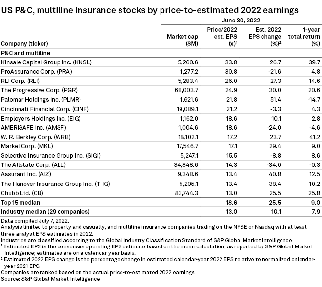

## Table of Contents

## What is the Price-to-Earnings (P/E) ratio?

The Price-to-Earnings (P/E) ratio is a way to figure out how much investors are willing to pay for a company's earnings. It's calculated by dividing the current stock price by the company's earnings per share (EPS). If a company's stock is selling for $50 and its EPS is $5, the P/E ratio would be 10. This means investors are willing to pay $10 for every $1 of the company's earnings.

The P/E ratio helps investors see if a stock is a good buy. A high P/E might mean that people think the company will grow a lot in the future, so they're willing to pay more for its stock. On the other hand, a low P/E might mean the company is not expected to grow much, or it could be a sign that the stock is undervalued and might be a good deal. Comparing the P/E ratios of different companies in the same industry can help investors make better choices.

## Why is the P/E ratio important in evaluating insurance companies?

The P/E ratio is important when looking at insurance companies because it helps investors see how much they are paying for the company's profits. Insurance companies often have different ways of making money, like selling policies or investing money. The P/E ratio can show if an insurance company is priced fairly compared to others in the same business. If an insurance company has a lower P/E ratio than others, it might mean the stock is a good deal, or it could mean that people don't think the company will grow much.

Also, the P/E ratio can tell investors about the future of the insurance company. If the P/E ratio is high, it might mean that people expect the company to do well and grow in the future. This is important for insurance companies because they need to keep making money from their policies and investments. By looking at the P/E ratio, investors can decide if an insurance company is a good investment based on how much they are paying for the expected future earnings.

## How is the P/E ratio calculated for insurance companies?

The P/E ratio for insurance companies is calculated the same way it is for other companies. You take the current stock price of the insurance company and divide it by the company's earnings per share (EPS). The EPS is found by taking the company's total earnings and dividing it by the number of shares outstanding. So, if an insurance company's stock is selling for $100 and its EPS is $10, the P/E ratio would be 10. This means investors are paying $10 for every $1 of the company's earnings.

Insurance companies might have different sources of earnings compared to other businesses, like premiums from policies and income from investments. But the basic way to calculate the P/E ratio stays the same. It's important to use the right EPS number, which could be based on the last year's earnings or a prediction for the next year's earnings. This helps investors see if the insurance company's stock is priced fairly compared to other insurance companies or the market as a whole.

## What is considered a 'good' P/E ratio in the insurance industry?

In the insurance industry, a 'good' P/E ratio can vary, but generally, a lower P/E ratio might be seen as better because it means you're paying less for each dollar of the company's earnings. If an insurance company's P/E ratio is lower than the average for other insurance companies, it could mean the stock is a good deal. But it's important to look at why the P/E ratio is low. It could be because people think the company won't grow much, or it might be a sign that the stock is undervalued.

On the other hand, a higher P/E ratio might mean that investors expect the insurance company to grow a lot in the future. They're willing to pay more for the stock because they think the company's earnings will go up. But a high P/E ratio can also mean the stock is overvalued, so it's risky. To figure out what's a 'good' P/E ratio, you need to compare it with other insurance companies and think about the company's future growth and how the industry is doing.

## How does the average P/E ratio in the insurance industry compare to other industries?

The average P/E ratio in the insurance industry can be different from other industries. Insurance companies often have P/E ratios that are around the middle compared to other sectors. For example, tech companies might have higher P/E ratios because people expect them to grow a lot. On the other hand, industries like utilities might have lower P/E ratios because they don't grow as fast. The insurance industry is usually seen as stable, so its P/E ratios might not be as high as tech but might be higher than utilities.

When you look at the insurance industry's P/E ratios, they can be affected by things like how much money they make from investments and how well they do at selling policies. These things can make the P/E ratios go up or down. Compared to other industries, the insurance sector's P/E ratios might be seen as fair value, not too high or too low. But it's always good to compare the P/E ratios of different insurance companies to see which ones might be a better deal.

## What factors influence the P/E ratio in the insurance sector?

The P/E ratio in the insurance sector can change because of many things. One big thing is how well the insurance company is doing with its investments. Insurance companies make money not just from selling policies, but also from investing the money they get from those policies. If their investments do well, their earnings go up, which can make the P/E ratio go down because the price of the stock stays the same but the earnings per share get bigger. Another thing that can change the P/E ratio is how much money the company makes from selling insurance policies. If they sell more policies and make more money, their earnings go up and the P/E ratio might go down.

Another factor is how people feel about the future of the insurance company. If people think the company will do well and grow, they might be willing to pay more for the stock, which makes the P/E ratio go up. On the other hand, if people think the company won't do well, they might not want to pay as much for the stock, and the P/E ratio could go down. Also, things like interest rates and how the economy is doing can affect the P/E ratio. When interest rates are low, insurance companies might make less money from their investments, which can affect their earnings and the P/E ratio.

## How has the average P/E ratio in the insurance industry changed over the past decade?

Over the past decade, the average P/E ratio in the insurance industry has gone up and down because of many things. When the economy was doing well, people felt good about insurance companies, so they were willing to pay more for their stocks. This made the P/E ratios go up. But when there were big problems, like the financial crisis in 2008 or the economic slowdown because of the COVID-19 pandemic, people got worried and the P/E ratios went down. Also, when interest rates were low for a long time, insurance companies made less money from their investments, which could make their earnings go down and affect the P/E ratios.

In the last few years, the P/E ratios in the insurance industry have been around the middle compared to other industries. They are not as high as tech companies, which people think will grow a lot, but they are higher than industries like utilities, which don't grow as fast. The insurance industry is seen as stable, so its P/E ratios have stayed pretty steady, but they can still change because of things like how well the companies are doing with their investments and how many insurance policies they sell.

## Can you provide examples of insurance companies with high and low P/E ratios and explain why?

One insurance company with a high P/E ratio is Lemonade, Inc. As of recent data, Lemonade has a P/E ratio that is much higher than the industry average. This is because Lemonade is a newer company that uses technology and AI to sell insurance. People think Lemonade will grow a lot in the future, so they are willing to pay more for its stock. This makes the P/E ratio go up. Even though Lemonade might not be making as much money right now, investors believe it will do well later, which is why the P/E ratio is high.

On the other hand, an insurance company with a low P/E ratio is MetLife, Inc. MetLife's P/E ratio is lower than the industry average. This could be because MetLife is a big, older company that people don't think will grow as fast as newer companies like Lemonade. Also, MetLife's earnings might be affected by things like interest rates, which have been low for a while. When interest rates are low, insurance companies like MetLife make less money from their investments. So, investors might not want to pay as much for MetLife's stock, which makes the P/E ratio lower.

## How do economic cycles affect the P/E ratios of insurance companies?

Economic cycles can change the P/E ratios of insurance companies a lot. When the economy is doing well, people feel good about the future and are more likely to buy insurance. This means insurance companies can sell more policies and make more money. Also, when the economy is strong, insurance companies can make more money from their investments. Because their earnings go up, the P/E ratio might go down if the stock price doesn't change much. But if people think the good times will keep going, they might be willing to pay more for the stock, which can make the P/E ratio go up.

On the other hand, when the economy is not doing well, like during a recession, people might not want to buy as much insurance. This can make it harder for insurance companies to sell policies and make money. Also, when the economy is bad, their investments might not do as well, which can make their earnings go down. If earnings go down and the stock price stays the same or goes down a little, the P/E ratio can go up. But if people are worried about the future, they might not want to pay as much for the stock, which can make the P/E ratio go down. So, economic cycles can make the P/E ratios of insurance companies go up or down depending on how people feel about the future and how the companies are doing.

## What are the limitations of using P/E ratios to assess insurance companies?

Using P/E ratios to assess insurance companies has some problems. One big problem is that P/E ratios don't tell you everything about a company. For example, they don't show how well the company is doing with its investments or how many policies it is selling. These things are important for insurance companies because they make money from both. Also, P/E ratios can be affected by things like one-time events or changes in accounting rules, which can make the numbers look different than they really are.

Another problem is that P/E ratios can be hard to compare between different insurance companies. Some companies might have different ways of making money or different risks, so their P/E ratios might not mean the same thing. Also, P/E ratios can change a lot because of how people feel about the future. If people think an insurance company will do well, they might pay more for its stock, which makes the P/E ratio go up. But if people get worried, the P/E ratio can go down even if the company is still doing okay. So, while P/E ratios can give you some information, they should not be the only thing you look at when deciding if an insurance company is a good investment.

## How do different types of insurance (life, health, property & casualty) impact their respective P/E ratios?

Different types of insurance like life, health, and property & casualty can have different P/E ratios because they make money in different ways. Life insurance companies often have steady earnings from long-term policies and investments. This can make their P/E ratios more stable and maybe lower than other types of insurance. People might not expect life insurance companies to grow a lot, so they don't pay as much for the stock, which keeps the P/E ratio down. Health insurance companies can have P/E ratios that go up and down more because their earnings can change a lot depending on things like how many people get sick or how much they have to pay for medical care. If people think health insurance will grow because more people need it, the P/E ratio might go up.

Property & casualty insurance companies can have P/E ratios that are affected by things like natural disasters or how much they have to pay out in claims. If there are a lot of claims, their earnings might go down, which can make the P/E ratio go up if the stock price stays the same. But if they do well with their investments and don't have to pay out a lot in claims, their earnings can go up, which might make the P/E ratio go down. Each type of insurance has its own risks and ways of making money, so their P/E ratios can be different and change for different reasons.

## What advanced metrics should be used alongside P/E ratios for a more comprehensive analysis of insurance companies?

When looking at insurance companies, using other metrics along with the P/E ratio can give you a better picture. One important metric is the combined ratio, which shows how much money the company is making from its insurance business. A combined ratio under 100% means the company is making more money from premiums than it is paying out in claims and expenses, which is good. Another useful metric is the return on equity (ROE), which tells you how well the company is using the money that shareholders have invested. A high ROE means the company is doing a good job of making money for its investors.

Another metric to consider is the book value per share, which shows the value of the company's assets minus its liabilities, divided by the number of shares. This can help you see if the stock is a good deal compared to what the company is really worth. Also, looking at the company's investment income can be important because insurance companies make a lot of money from their investments. By using these metrics along with the P/E ratio, you can get a fuller understanding of how well an insurance company is doing and if it's a good investment.

## What is the Price-to-Earnings Ratio and how can it be understood?

The Price-to-Earnings (P/E) ratio is a key financial metric that investors employ to assess a company's profitability relative to its share price. It is calculated using the formula:

$$
\text{P/E Ratio} = \frac{\text{Market Price per Share}}{\text{Earnings per Share (EPS)}}
$$

This ratio represents the amount investors are willing to pay for each dollar of a company's earnings, offering insights into market expectations regarding the company's growth and profitability. Investors and analysts commonly use the P/E ratio to compare the valuation of companies within the same industry or sector.

The P/E ratio has several variations, each providing a distinct perspective on a company's financial health. The "trailing P/E" uses past earnings data, taking into account the earnings from the previous 12 months. This variation provides a historical view, reflecting actual performance, but it may not consider recent changes in earnings. Conversely, the "forward P/E" ratio employs projected earnings for the upcoming period, offering an insight based on anticipated performance, making it more speculative but potentially more reflective of current market conditions.

Across different industry sectors, the P/E ratio can vary significantly due to distinct growth prospects and risk profiles. For instance, companies in sectors with high growth potential, such as technology, often exhibit higher P/E ratios as investors anticipate future earnings increases. In contrast, more mature industries, like utilities, might display lower P/E ratios, suggesting steadier, more predictable earnings with lower growth expectations.

A high P/E ratio generally indicates that investors expect high growth in a company's future earnings, making them willing to pay a premium price for its shares. Conversely, a low P/E ratio may point to undervaluation or potential challenges, such as declining earnings or increased risks, prompting caution among investors.

Understanding these variations and their implications is essential for investors seeking to interpret financial metrics accurately and make informed investment decisions.

## References & Further Reading

[1]: Damodaran, A. (2012). ["Investment Valuation: Tools and Techniques for Determining the Value of Any Asset."](https://books.google.com/books/about/Investment_Valuation.html?id=5SRHAAAAQBAJ) Wiley Finance.

[2]: ["Trading and Exchanges: Market Microstructure for Practitioners"](https://www.amazon.com/Trading-Exchanges-Market-Microstructure-Practitioners/dp/0195144708) by Larry Harris

[3]: Graham, B., & Dodd, D. (2009). ["Security Analysis: Sixth Edition, Foreword by Warren Buffett."](https://www.amazon.com/Security-Analysis-Foreword-Buffett-Editions/dp/0071592539) McGraw Hill.

[4]: Bodie, Z., Kane, A., & Marcus, A.J. (2014). ["Investments"](https://books.google.com/books/about/EBOOK_Investments_Global_edition.html?id=BMsvEAAAQBAJ) (10th ed.). McGraw Hill.

[5]: Fabozzi, F.J., Focardi, S.M., & Rachev, S.T. (2007). ["The Basics of Financial Econometrics: Tools, Concepts, and Asset Management Applications."](https://onlinelibrary.wiley.com/doi/book/10.1002/9781118856406) Wiley Finance.