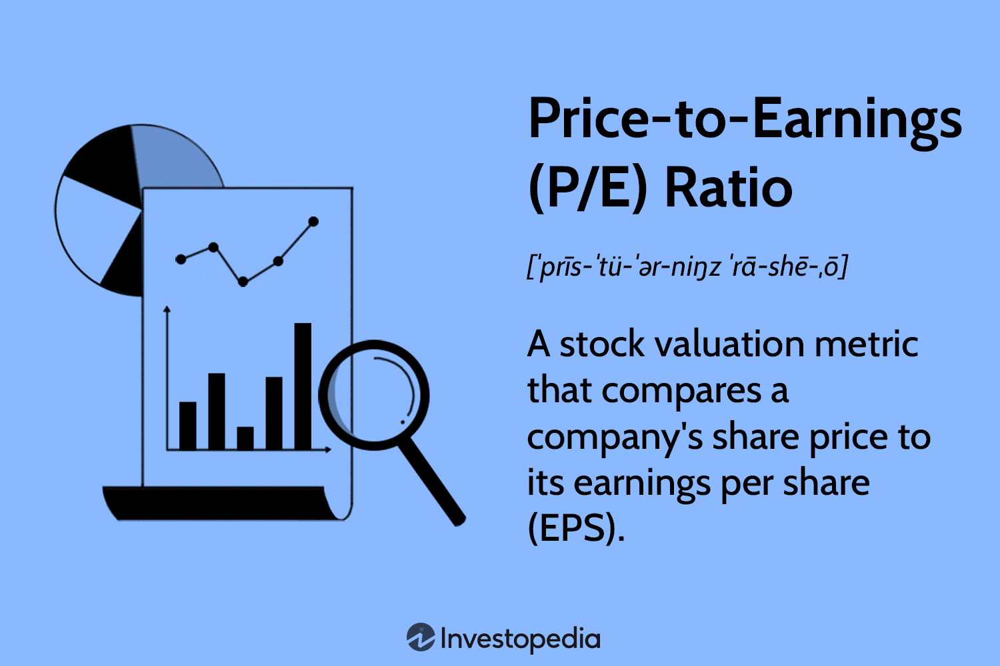

In this article, we examine the financial intricacies of the retail sector, specifically focusing on two pivotal aspects: price-to-earnings (P/E) ratios and algorithmic trading. The retail sector, a vital component of the global economy, frequently relies on P/E ratios to assess its financial health. These ratios are instrumental in evaluating the value of retail companies and their stocks, offering insights into market expectations and valuation relative to earnings.

P/E ratios serve as a fundamental valuation metric when analyzing the performance and potential investment in retail companies. By comparing a company's current share price to its earnings per share (EPS), investors can gauge whether stocks are overvalued or undervalued. This assessment aids in making informed financial decisions, helping investors allocate resources efficiently within the retail sector.



Moreover, algorithmic trading plays a significant role in optimizing investment strategies. By leveraging automated systems, algorithmic trading can enhance market efficiency, reduce transaction costs, and improve liquidity. These systems, often guided by financial ratios such as the P/E ratio, enable rapid and rational trading decisions that align with market conditions and investor strategies.

This comprehensive analysis is designed to provide investors and analysts with valuable insights, empowering them to navigate the complexities of the retail sector with enhanced precision. By understanding and applying these tools, financial stakeholders can make more informed decisions, ultimately contributing to the stability and growth of their investments in the ever-evolving retail market.

## Table of Contents

## Understanding the Price-to-Earnings Ratio

The Price-to-Earnings (P/E) ratio is a fundamental metric used in the financial assessment of corporations, including those in the retail industry. The ratio is calculated by dividing a company's current share price by its earnings per share (EPS). It is expressed by the formula:

$$
\text{P/E Ratio} = \frac{\text{Market Value per Share}}{\text{Earnings per Share (EPS)}}
$$

This calculation provides insights into what the market is willing to pay today for a stock based on its past or future earnings. Analysts and investors interpret the P/E ratio to evaluate whether a stock is overvalued or undervalued compared to its earnings.

A high P/E ratio may suggest that a stock is overvalued or that investors expect high growth rates in the future. In contrast, a low P/E ratio might indicate that the stock is undervalued or that the company is experiencing difficulties. Economic cycles, market conditions, and sector-specific trends can influence these interpretations. 

In the retail sector, comparing P/E ratios can be particularly informative. Retail companies are often assessed relative to their peers, enabling investors to determine if a company is performing above or below industry standards. For instance, a retailer with a P/E ratio significantly higher than the industry average could be seen as having more significant growth prospects or potentially being overvalued.

Despite its utility, the P/E ratio has limitations and should not be used in isolation. It does not consider debt levels, nor does it account for market conditions or growth sustainability. Moreover, earnings can be manipulated through accounting practices, potentially skewing the P/E ratio. Therefore, for a more comprehensive evaluation, it is advisable to analyze P/E ratios alongside other financial metrics such as debt-to-equity ratio, return on equity, and free cash flow. This holistic approach provides a clearer picture of a company's financial health and its stock's investment potential.

## P/E Ratios in the Retail Sector

The retail sector, a multifaceted domain within the global economy, is composed of various subsectors that exhibit distinct Price-to-Earnings (P/E) ratios, each reflecting unique growth prospects and financial health. These subsectors, including automotive, grocery, and online retail, often display varying average P/E ratios due to differing industry-specific factors.

For instance, the automotive retail subsector typically shows lower P/E ratios compared to online retail. This disparity can be attributed to the slower growth expectations in traditional automotive retail, where capital expenditure and inventory costs are substantial. Conversely, online retail often experiences higher P/E ratios, driven by rapid technological advancements and scalability, which provide increased opportunities for growth.

Consider the case of Amazon, a major player in online retail, which consistently presents high P/E ratios. This valuation is indicative of investor confidence in its sustained growth potential, fueled by its global expansion and diversification strategies. In contrast, traditional brick-and-mortar retailers like Walmart may exhibit lower P/E ratios, reflecting steadier growth rates and established market positions.

Current trends in the retail sector's P/E ratios underscore significant shifts in consumer behavior and prevailing economic conditions. The increasing preference for online shopping, accelerated by the COVID-19 pandemic, has inflated the P/E ratios of many e-commerce companies, as investors anticipate sustained demand for digital retail platforms. Additionally, macroeconomic factors such as inflation and supply chain disruptions can impact consumer spending patterns, thereby influencing retail P/E ratios across various subsectors.

Monitoring these P/E ratios is crucial for investment and asset allocation strategies. Investors utilize these metrics to assess the relative value of companies within the sector, comparing them to industry norms and historical averages. This analysis helps investors to identify potentially undervalued stocks or avoid overvalued ones, ensuring informed decision-making.

To enhance this evaluation, investors might employ statistical programming languages like Python to automate the analysis of P/E ratios across the retail sector. The following Python snippet demonstrates how to compute and visualize the P/E ratios of a sample dataset of retail companies:

```python
import pandas as pd
import matplotlib.pyplot as plt

# Sample data for retail companies
data = {
    'Company': ['Amazon', 'Walmart', 'Tesla', 'Costco'],
    'Share Price': [3500, 150, 800, 400],
    'EPS': [15, 5, 10, 8]
}

# Create a DataFrame
df = pd.DataFrame(data)

# Calculate P/E Ratio
df['P/E Ratio'] = df['Share Price'] / df['EPS']

# Plot P/E Ratios
plt.figure(figsize=(10, 6))
plt.bar(df['Company'], df['P/E Ratio'], color='skyblue')
plt.title('P/E Ratios of Retail Companies')
plt.xlabel('Company')
plt.ylabel('P/E Ratio')
plt.show()
```

By analyzing these ratios across different times and in comparison to peers within the retail industry, investors gain a comprehensive view of a company's market performance and potential investment value.

## Algorithmic Trading in the Retail Sector

Algorithmic trading, often termed algo trading, is a sophisticated mechanism that integrates pre-programmed instructions to make trading decisions, encompassing aspects such as timing, price, and [volume](/wiki/volume-trading-strategy). In the retail sector, this method significantly optimizes trading processes. By employing automated systems, algo trading enhances efficiency, reduces transaction costs, and improves overall market [liquidity](/wiki/liquidity-risk-premium). This transition from manual to automated trading processes allows for faster reactions to market fluctuations, which is crucial in the volatile retail market.

At the core of [algorithmic trading](/wiki/algorithmic-trading) systems are various financial ratios, including the price-to-earnings (P/E) ratio. These ratios are essential in making data-driven trading decisions quickly and objectively. With algorithms programmed to analyze P/E ratios, traders can swiftly evaluate whether a retail stock is undervalued or overvalued, thus deciding whether to buy or sell. The rapid processing capabilities of algorithms ensure that such decisions reflect current market conditions, optimizing the allocation of resources and investment portfolios. 

Despite the clear advantages presented by algorithmic trading, its implementation within the retail sector is not without challenges. The foremost challenge is the complexity of developing algorithms that can accurately interpret vast amounts of financial data and market signals. Additionally, algo trading systems must be adaptable to changes in market structure and regulations. There is also the risk of technical glitches or failures, which can lead to substantial financial losses in a short period. Moreover, the competitive nature of financial markets means that maintaining a technological edge is vital.

To harness the full potential of algorithmic trading, investors are increasingly relying on data analytics and [machine learning](/wiki/machine-learning) techniques. These technologies enable traders to refine their algorithms continuously, ensuring that their strategies remain effective amidst evolving market conditions. By analyzing historical trading data and identifying patterns, machine learning models can predict future stock movements and optimal trading opportunities. This real-time optimization of trading strategies, achieved through data-driven insights, provides an invaluable tool for investors looking to maintain a competitive edge in the retail market.

Python is often the preferred language for developing algorithmic trading systems due to its extensive libraries and ease of integration with data analysis tools. For instance, the `pandas` library is frequently used to manipulate financial data, while the `scikit-learn` library supports the implementation of machine learning models. A simple Python snippet for analyzing P/E ratios might look like this:

```python
import pandas as pd

# Sample DataFrame with stock prices and earnings
data = {'stock_price': [120, 150, 180], 'earnings_per_share': [5, 10, 15]}
df = pd.DataFrame(data)

# Calculate P/E ratio
df['pe_ratio'] = df['stock_price'] / df['earnings_per_share']

print(df)
```

This script computes the P/E ratio for each entry, allowing traders to make preliminary assessments based on this fundamental metric. 

In conclusion, algorithmic trading is reshaping how retail investors and institutions approach stock trading, offering tools that can process information and execute trades with unprecedented speed and precision. By leveraging advances in data analytics and machine learning, the retail sector can benefit from more strategic and informed trading decisions, ultimately leading to increased stability and profitability in volatile markets.

## Case Studies: Impact of P/E Ratios and Algo Trading

Case studies of retail companies highlight the significant role P/E ratios play in market valuation, enabling investors to discern market expectations accurately. Consider the example of a major retailer, XYZ Inc., which experienced fluctuations in its P/E ratio due to shifts in consumer demand and economic conditions. A notably high P/E ratio during a period of economic growth suggested that investors expected robust future earnings, leading to an increase in demand for the company's stock. This market perception, driven by optimism about the company's growth prospects, caused XYZ Inc.'s share prices to rise.

Analysts used the company's P/E ratio to compare it against its industry peers. Suppose the industry average P/E was 15, but XYZ Inc.'s was 25. This discrepancy might indicate that the company was either overvalued or expected to deliver exceptional growth compared to competitors. Investors analyzing these metrics would adjust their portfolios either to capture anticipated gains or mitigate potential risks.

Algorithmic trading in the retail sector optimizes trading strategies by rapidly processing vast amounts of financial data, including P/E ratios. For instance, ABC Algorithms, a company specializing in retail sector trades, leveraged algo trading to capitalize on short-term market inefficiencies. By incorporating machine learning models, they refined their trading algorithms to predict price movements based on P/E ratio trends.

One success story of ABC Algorithms involved using a strategy where the algorithm identified undervalued stocks with low P/E ratios relative to their historical averages. This approach enabled the firm to invest in stocks positioned for upward adjustment, leading to profitable trades. A challenge encountered was the need to constantly update models to reflect changing market conditions, a crucial [factor](/wiki/factor-investing) in maintaining algorithmic trading effectiveness.

These case studies provide practical insights into how financial analysis and automated trading technologies promote financial growth and stability in the retail industry. Understanding the interplay between P/E ratios and algorithmic trading equips investors with powerful tools for market analysis and decision-making.

## Conclusion

The integration of price-to-earnings (P/E) ratio analysis and algorithmic trading signifies a noteworthy advancement in financial strategies within the retail sector. Investors, by harnessing these tools, can secure a significant competitive advantage in both market analysis and decision-making processes. This approach allows for a more nuanced understanding of stock valuations and facilitates rapid and informed trading decisions.

The P/E ratio offers a snapshot of valuation, allowing investors to discern if a stock is over or undervalued relative to its peers. On the other hand, algorithmic trading enhances efficiency by executing trades based on pre-determined algorithms, thus reducing human error and transaction costs. When combined, these methodologies offer a comprehensive strategy—where algorithmic systems can be programmed to consider P/E ratios, among other metrics, to make precise and swift trading decisions.

As the retail sector continues to transform amidst evolving consumer behaviors and economic conditions, maintaining awareness of developments in these areas is crucial. Adapting to changes effectively can be the difference between outperforming the market or lagging behind it. By mastering and applying P/E ratio analysis in conjunction with algorithmic trading techniques, investors are well-positioned to navigate the complexities of the retail market successfully. This synergy not only offers a robust framework for investment but also provides the tools necessary to adapt to and thrive in dynamic economic landscapes.

## References & Further Reading

[1]: ["Valuation: Measuring and Managing the Value of Companies"](https://www.amazon.com/Valuation-Measuring-Managing-Companies-Finance/dp/1119610885) by McKinsey & Company Inc.

[2]: ["The Intelligent Investor: The Definitive Book on Value Investing"](https://www.amazon.com/Intelligent-Investor-Third-Definitive-Investing/dp/0063423537) by Benjamin Graham

[3]: ["Algorithmic Trading: Winning Strategies and Their Rationale"](https://books.google.com/books/about/Algorithmic_Trading.html?id=WAlFDwAAQBAJ) by Ernest P. Chan

[4]: ["Python for Finance: Mastering Data-Driven Finance"](https://www.amazon.com/Python-Finance-Mastering-Data-Driven/dp/1492024333) by Yves Hilpisch

[5]: Lo, A. W., & MacKinlay, A. C. (1999). ["A Non-Random Walk Down Wall Street"](https://www.jstor.org/stable/j.ctt7tccx) Princeton University Press.