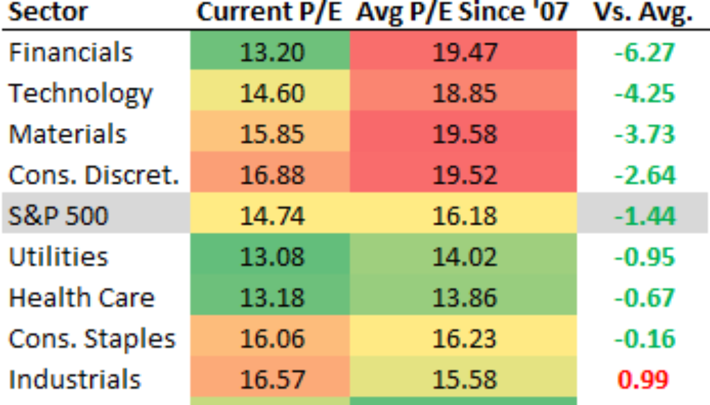

The financial metrics of a sector are critical in evaluating investment opportunities. Among these sectors, the utilities sector—comprising electricity, water, and natural gas services—is particularly noteworthy for its stability and consistent dividend returns, making it a favored choice for conservative investors. A key metric for assessing the value and growth potential of investments within this sector is the Price-to-Earnings (P/E) ratio. This metric is defined as the ratio of a company’s current share price to its earnings per share (EPS), providing insights into how much investors are willing to pay for a dollar of earnings.

The P/E ratio's relevance becomes even more significant when integrated with modern trading technologies. Algorithmic trading, or algo-trading, leverages this and other financial metrics to execute trades based on predefined rules and criteria. By incorporating metrics like the P/E ratio, algo-trading systems can effectively inform trading strategies, optimizing decision-making processes.



Understanding the P/E ratio can reveal significant insights into how the market values a sector and its prospective growth. For investors in the utilities sector, this understanding is crucial, as it can help gauge whether the market is overvaluing or undervaluing utility companies based on their earnings potential. Moreover, algorithmic trading, which relies on data-driven strategies, uses financial metrics to enhance trading efficiency and optimize returns. This approach can offer a competitive edge, providing investors with the tools to navigate and capitalize on market fluctuations with precision.

Overall, while the utilities sector promises stable returns, employing sophisticated tools like the P/E ratio and algorithmic trading systems can significantly enhance investment strategies, ensuring better return optimization and risk management.

## Table of Contents

## Understanding the Price-to-Earnings Ratio

The Price-to-Earnings ratio (P/E) is a vital metric used by investors to determine a company's market value in relation to its earnings. It is a straightforward calculation, obtained by dividing the current market price of a company's shares by its earnings per share (EPS). Mathematically, it is expressed as:

$$
\text{P/E Ratio} = \frac{\text{Market Price per Share}}{\text{Earnings per Share (EPS)}}
$$

A higher P/E ratio suggests that investors expect higher future growth from the company. This anticipation can drive up the stock's price, as it reflects the market's willingness to pay a premium for the anticipated growth. For instance, a P/E ratio of 30 implies that investors are willing to pay $30 for every $1 of earnings, often suggesting confidence in the company’s growth prospects.

Conversely, a lower P/E ratio may indicate that the market is skeptical about a company’s growth potential. Such skepticism can manifest due to various factors, including sector-specific challenges or broader economic concerns. A P/E ratio lower than the industry average can suggest that a stock is undervalued or that there are unforeseen risks affecting the company's [earning](/wiki/earning-announcement) potential.

In the utilities sector, the P/E ratio is a useful indicator of the stability and profitability expected from utility companies. This sector is characterized by predictable demand and steady revenue streams, often resulting in lower P/E ratios compared to more volatile sectors such as technology. Investors often view utilities as stable investments, where the P/E ratio may reflect the balance between steady cash flows and modest growth trajectories.

By understanding the P/E ratio, investors can gain insights into how the market values a company relative to its earnings, heavily influencing investment strategies and decisions within the utilities sector.

## The Utilities Sector and Its P/E Ratio

The utilities sector, comprising electricity, water, and natural gas services, is traditionally valued for its stability and reliable dividend payouts. This attribute stems from the essential nature of the services provided, which ensures a steady demand irrespective of economic cycles. Consequently, the sector is characterized by lower [volatility](/wiki/volatility-trading-strategies) compared to other sectors within the stock market.

In 2020, the average Price-to-Earnings (P/E) ratio for the utilities sector was approximately 26.8. This ratio signifies the sector's reliable income generation and somewhat moderate growth prospects compared to other sectors that may exhibit higher growth potential and, consequently, higher P/E ratios. The utilities sector's P/E ratio tends to be lower than that of the broader market indices, such as the S&P 500. This is primarily due to the sector's constrained growth opportunities, which are a result of extensive regulation and the mature nature of the industry.

Regulated rates in the utilities sector play a significant role in shaping these financial metrics. These regulations ensure that rates for services like electricity and water remain stable, thus limiting drastic income fluctuations. Although this stability is appealing to investors seeking low-risk investments with consistent returns, it also curtails the potential for rapid expansion, thereby influencing the sector's P/E ratios.

Investors examine the P/E ratio as a critical tool for evaluating the attractiveness of utility stocks. A relatively lower P/E ratio within this sector often underscores the potential for stable income, making utility stocks a strategic choice for risk-averse investors. These metrics enable investors to weigh the risk against the predictability of returns, thereby playing a crucial role in portfolio diversification.

Overall, the P/E ratio in the utilities sector not only reflects historical earning performances and future growth expectations but also emphasizes the sector's comparative stability and income reliability, reinforcing its appeal in investment strategies focused on consistent returns.

## Algorithmic Trading in the Utilities Sector

Algorithmic trading, or algo trading, represents a significant advancement in the execution of orders by leveraging computer systems programmed to follow specific criteria. In the utilities sector, [algorithmic trading](/wiki/algorithmic-trading) systems make use of financial metrics, such as the Price-to-Earnings (P/E) ratio, to execute transactions that align with well-defined investment strategies. 

These algorithms are capable of processing substantial amounts of data rapidly, which enables them to discern patterns and make informed trading decisions. Data analyzed includes not just the P/E ratios but also historical price movements, [volume](/wiki/volume-trading-strategy), and market trends. By evaluating these data points, algorithms can anticipate market movements and optimize the timing of trades to enhance portfolio returns.

Given the stable and predictable nature of returns in the utilities sector, algorithmic trading capitalizes on this characteristic to refine investment strategies. The steady income stream combined with lower market volatility makes the utilities sector an attractive area for algo trading. Algorithmic systems can manage and react to real-time stock price changes, adjusting investment strategies efficiently based on the P/E ratio and other relevant financial indicators. This dynamic adjustment allows for optimal timing in buying or selling shares, which is critical in maximizing financial returns.

Incorporating algorithmic trading into the utilities investment framework not only offers the potential for improved performance through predictive analytics but also ensures practical execution of trade decisions. As a result, algo trading facilitates a more systematic and strategic approach, enabling investors to adopt a balanced methodology that merges quantitative analysis with seamless trade execution.

To illustrate how an algorithm might function, consider a simplified Python snippet for a basic algo trading strategy based on the P/E ratio:

```python
class AlgoTrader:
    def __init__(self, pe_threshold):
        self.pe_threshold = pe_threshold

    def analyze_stock(self, stock_data):
        current_pe = stock_data['price'] / stock_data['earnings_per_share']

        if current_pe < self.pe_threshold:
            return "Buy"
        elif current_pe > self.pe_threshold:
            return "Sell"
        else:
            return "Hold"

# Example usage
stock_data = {'price': 100, 'earnings_per_share': 4}
trader = AlgoTrader(pe_threshold=25)
decision = trader.analyze_stock(stock_data)
print(f"Trade decision: {decision}")
```

In this example, the algorithm evaluates a stock based on its P/E ratio compared to a predefined threshold, making a decision to buy, sell, or hold the stock. This basic approach forms the foundation for more complex and nuanced strategies that incorporate a broader range of variables and market conditions.

By integrating algorithmic trading with traditional investment practices, the utilities sector can leverage data-driven insights to enhance decision-making processes, balance risks, and optimize returns over time.

## Conclusion

The price-to-earnings ratio (P/E ratio) remains a pivotal instrument for appraising investments in the utilities sector, offering critical insights into how the market values these companies relative to their earnings and their potential for growth. Despite the inherent stability and lower volatility of the utilities sector, which traditionally deliver consistent dividends, leveraging P/E ratios can greatly refine investment strategies.

The stability of the utilities sector makes it an attractive option for investors seeking predictable returns, yet the application of P/E ratios enables a more nuanced analysis. By understanding the market’s valuation, investors can discern whether utility stocks are overvalued or undervalued. This understanding helps in making informed decisions that align with both short-term trading objectives and long-term investment goals.

Algorithmic trading significantly bolsters the utility of P/E ratios by automating the evaluation process. Algorithms synthesize vast datasets, rapidly assessing P/E fluctuations to execute trades strategically. This capability ensures transactions are conducted at optimal times, maximizing returns while minimizing risk exposure. The automation provided by algorithmic trading not only enhances the precision of trades but also optimizes overall portfolio management.

For investors in the utilities sector, the conjunction of traditional financial analysis and contemporary algorithmic trading methodologies offers a strategic advantage. By integrating robust [fundamental analysis](/wiki/fundamental-analysis) with cutting-edge trading software, investors can achieve a balanced approach that leverages both market stability and technological edge.

Understanding how financial metrics and algorithmic systems work together empowers investors to navigate the utilities market more confidently. This sophisticated approach helps mitigate uncertainties, allowing for more precise and profitable investment decisions. Combining these techniques can transform a stable yet modestly growing sector into a cornerstone of a diversified investment portfolio.

## References & Further Reading

[1]: Sharpe, W. F. (1964). ["Capital Asset Prices: A Theory of Market Equilibrium under Conditions of Risk."](https://onlinelibrary.wiley.com/doi/full/10.1111/j.1540-6261.1964.tb02865.x) Journal of Finance, 19(3), 425-442.

[2]: Gordon, M. J., & Shapiro, E. (1956). ["Capital Equipment Analysis: The Required Rate of Profit."](https://www.jstor.org/stable/2627177) Management Science, 3(1), 102-110.

[3]: Damodaran, A. (2002). ["Investment Valuation: Tools and Techniques for Determining the Value of Any Asset."](https://archive.org/details/investmentvaluat0000damo_n6k9) John Wiley & Sons.

[4]: Lopez de Prado, M. (2018). ["Advances in Financial Machine Learning."](https://www.amazon.com/Advances-Financial-Machine-Learning-Marcos/dp/1119482089) Wiley.

[5]: Chan, E. P. (2008). ["Quantitative Trading: How to Build Your Own Algorithmic Trading Business."](https://github.com/ftvision/quant_trading_echan_book) John Wiley & Sons.

[6]: Jansen, S. (2018). ["Machine Learning for Algorithmic Trading: Predictive Models to Extract Signals from Market and Alternative Data for Systematic Trading Strategies with Python."](https://github.com/stefan-jansen/machine-learning-for-trading) Packt Publishing.