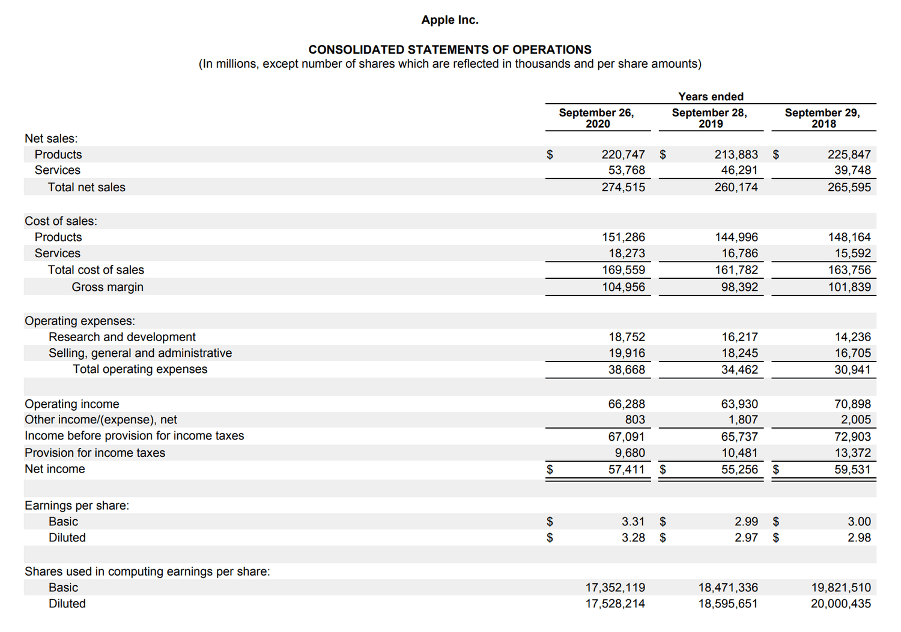

## Table of Contents

## What is a profit margin?

A profit margin is the amount of money a business makes after it pays for all the costs of making and selling its products or services. It is usually shown as a percentage. To find the profit margin, you subtract the total costs from the total sales, and then divide that number by the total sales. The result is then multiplied by 100 to get a percentage.

Knowing the profit margin is important for a business because it shows how well the business is doing. A higher profit margin means the business is making more money from each sale. This can help the business owners decide if they need to change their prices or find ways to lower their costs. A good profit margin can also make it easier for a business to grow and invest in new things.

## Why is understanding profit margins important in the electronics industry?

Understanding profit margins is really important in the electronics industry because this industry often has high costs for making products. Electronics companies need to spend a lot of money on things like research, development, and buying parts. If they don't keep a close eye on their profit margins, they might end up selling their products for less than it costs to make them, which means they lose money. By knowing their profit margins, these companies can set the right prices to make sure they are making a profit.

Also, the electronics industry changes really fast with new technology coming out all the time. Companies need to be able to quickly change their products and prices to stay competitive. If they understand their profit margins well, they can make smart decisions about when to lower prices to sell more products or when to raise prices to make more money. This helps them stay in business and grow even when the market is tough.

## What is the average profit margin for electronics companies?

The average profit margin for electronics companies can change a lot depending on what kind of electronics they make and how big the company is. For big companies that make things like smartphones and computers, the average profit margin might be around 5% to 10%. This means for every dollar they make in sales, they keep 5 to 10 cents as profit after paying all their costs.

For smaller companies or those that make specialized electronics, the profit margins can be different. They might have higher profit margins, sometimes up to 20% or more, because they can charge more for their unique products. But they can also have lower profit margins if they don't sell as many products or if their costs are higher. So, the electronics industry has a wide range of profit margins, and it's important for each company to know their own numbers to do well.

## How do profit margins vary between different segments of the electronics industry?

Profit margins in the electronics industry can be very different depending on what kind of products a company makes. For example, companies that make big things like TVs and computers usually have lower profit margins, around 5% to 10%. This is because these products cost a lot to make, and there are a lot of other companies making similar things, so they have to keep their prices low to stay competitive.

On the other hand, companies that make smaller, specialized electronics like high-end audio equipment or medical devices often have higher profit margins. These can be as high as 20% or more. This is because they can charge more for their unique products, and there might not be as many other companies making the same thing. But, if these companies don't sell a lot of their products, their profit margins can still be low because their costs stay high.

So, in the electronics industry, the type of product a company makes really affects its profit margin. Big, common electronics usually have lower margins, while smaller, specialized electronics can have higher margins if they are sold well. It's important for companies to understand their own profit margins to make good decisions about pricing and costs.

## What factors influence profit margins in the electronics sector?

In the electronics sector, several things can change how much profit a company makes. One big thing is how much it costs to make the products. This includes the price of parts, how much it costs to put the products together, and the money spent on research and development. If these costs go up, the profit margin can go down unless the company can charge more for their products. Another thing that matters is how many products the company can sell. If they sell a lot, they can spread their costs over more items, which can help their profit margin. But if they don't sell enough, their profit margin can be low because their costs stay the same.

Competition also plays a big role in profit margins. If there are a lot of other companies making similar products, they might all have to lower their prices to stay in the game. This can make profit margins smaller. On the other hand, if a company makes something special that not many others make, they can charge more and have a bigger profit margin. The economy can also affect profit margins. When times are good, people might buy more electronics, which can help profit margins. But if the economy is bad, people might not buy as much, and profit margins can go down.

So, profit margins in the electronics sector depend on a mix of things like costs, how many products are sold, competition, and the economy. Companies need to keep an eye on all these things to make sure they can make a good profit. By understanding these factors, they can make smart choices about pricing, costs, and what products to make.

## How have profit margins in the electronics industry changed over the past decade?

Over the past decade, profit margins in the electronics industry have gone through some ups and downs. In the early part of the decade, many companies saw their profit margins get smaller. This was because the cost of making electronics went up, and there was a lot of competition. Companies had to keep their prices low to stay in the game, which made it hard to make a good profit. But as the decade went on, some companies started to do better. They found ways to make their products cheaper and started selling more high-end products that could be sold for more money. This helped some companies in the electronics industry to have better profit margins.

In the last few years, the electronics industry has seen some big changes that have affected profit margins. The rise of new technology, like smartphones and smart home devices, has created new chances for companies to make more money. Some companies have been able to charge more for these new products, which has helped their profit margins. But at the same time, the costs of things like chips and other parts have gone up, which can make it harder to keep profit margins high. Overall, the profit margins in the electronics industry over the past decade have been a mix of challenges and opportunities, depending on what kind of products a company makes and how well they can manage their costs.

## What are the typical profit margins for major electronics manufacturers?

Major electronics manufacturers like Samsung, Apple, and Sony have different profit margins based on what they make and sell. For companies that make a lot of different products, like Samsung, their average profit margin is around 5% to 10%. This is because they make things like TVs, smartphones, and appliances, which have a lot of competition and high costs to make. Apple, on the other hand, focuses on high-end products like iPhones and MacBooks, and they can have profit margins that are higher, often around 20% to 30%. This is because they can charge more for their products and have a strong brand that people are willing to pay more for.

Sony, which makes things like cameras, gaming consoles, and TVs, has profit margins that can be around 10% to 15%. They have a mix of high-end and more common products, so their margins are in between companies like Samsung and Apple. The profit margins for these big companies can change a lot from year to year based on things like how much it costs to make their products, how many they can sell, and what's going on in the economy. But overall, these big electronics manufacturers have to work hard to keep their profit margins healthy in a competitive industry.

## How do economies of scale affect profit margins in the electronics industry?

Economies of scale can really help companies in the electronics industry make more profit. When a company makes a lot of products, they can buy parts in big amounts, which usually costs less per part. They can also use their factories more, which means they don't have to spend as much money to make each product. This can lower their costs a lot, and if they can keep their prices the same, their profit margins go up. Big companies like Samsung and Apple use economies of scale to make their products cheaper and keep their profit margins healthy.

But, economies of scale don't help every company in the same way. Smaller companies might not be able to buy parts in big amounts or use their factories as much, so their costs stay higher. This can make it hard for them to have good profit margins. Also, if a big company grows too fast and their costs go up a lot, their profit margins might not get better. So, while economies of scale can help a lot, companies need to be smart about how they grow and manage their costs to really see their profit margins go up.

## What role do technological advancements play in shaping profit margins?

Technological advancements can help companies in the electronics industry make more profit. When new technology comes out, companies can make better products that people want to buy. This can let them charge more money for their products, which can make their profit margins bigger. Also, new technology can help companies make their products cheaper. For example, if a company finds a new way to make their products that uses less time or fewer parts, their costs go down. If they can keep their prices the same, their profit margins go up because they are spending less to make each product.

But technological advancements can also make things harder for companies. When new technology comes out, it can make older products less popular. Companies might have to lower their prices to sell these older products, which can make their profit margins smaller. Also, keeping up with new technology can cost a lot of money. Companies might have to spend more on research and development to stay ahead, and if their costs go up a lot, their profit margins might not get better even if they can charge more for their new products. So, while new technology can help profit margins, it can also make things more challenging for companies in the electronics industry.

## How do global supply chain issues impact profit margins in electronics?

Global supply chain issues can really hurt profit margins in the electronics industry. When there are problems with getting parts or shipping products, it can make it harder for companies to make their electronics on time. This can lead to delays, and sometimes companies have to pay more to get the parts they need. If the costs go up because of these supply chain issues, but the companies can't charge more for their products, their profit margins go down. It's like trying to make a cake with more expensive ingredients but selling it for the same price; you end up making less money.

On the other hand, some companies might be able to handle supply chain issues better than others. If a company has good relationships with their suppliers or can find other ways to get the parts they need, they might not have to pay as much extra. This can help them keep their costs down and their profit margins healthy. But it's not easy, and many companies in the electronics industry have to work hard to find ways to deal with global supply chain issues and keep making a good profit.

## What strategies can electronics companies use to improve their profit margins?

Electronics companies can improve their profit margins by finding ways to make their products cheaper. One way to do this is by using economies of scale, which means making a lot of products so they can buy parts in big amounts for less money. They can also look for new technology that helps them make their products faster or with fewer parts. This can lower their costs a lot. Another way is to find cheaper suppliers or move some of their production to places where it costs less to make things. By lowering their costs, they can keep their prices the same and make more profit.

Another strategy is to focus on selling high-end products that people are willing to pay more for. If a company can make products that are special or better than what other companies offer, they can charge more money for them. This can help their profit margins because they are making more money from each sale. They can also try to sell more products by marketing them well or finding new ways to reach customers, like selling online. If they can sell more products without their costs going up too much, their profit margins will get better.

Sometimes, companies need to think about changing their prices too. If they can find the right balance between what it costs to make their products and what people are willing to pay, they can improve their profit margins. They might need to raise prices a little bit if their costs go up, or lower them if they want to sell more products. It's all about finding the best way to make more money while keeping costs under control.

## How do regulatory changes and tariffs affect profit margins in the electronics industry?

Regulatory changes and tariffs can make it harder for electronics companies to make a good profit. When governments change the rules about how products can be made or sold, it can cost companies more money to follow these new rules. For example, if there are new rules about using certain materials in electronics, companies might have to find new parts that cost more. Tariffs are like taxes on things that are brought into a country, and if a company has to pay more to get parts from other countries, their costs go up. If they can't charge more for their products because of these higher costs, their profit margins go down.

On the other hand, some companies might find ways to deal with these changes better than others. If a company can move its production to a place where the rules are easier to follow or the tariffs are lower, they might be able to keep their costs down. They might also look for new suppliers in different countries that don't have these extra costs. By being smart about how they handle regulatory changes and tariffs, some companies can keep their profit margins healthy even when things get tough. But it's not easy, and many companies have to work hard to find the best ways to make a good profit in a changing world.

## What is the role of algorithmic trading in modern finance?

Algorithmic trading, commonly referred to as algo trading, has significantly transformed the financial landscape by automating and optimizing the trading process. This approach uses computer algorithms to decide on trade execution, making it faster and more precise than traditional manual methods. 

Various factors often impede trade execution in the manual trading process, including human error and emotional bias. Algo trading mitigates these issues by ensuring decisions are based on stringent, pre-determined criteria. By employing complex algorithms, it capitalizes on real-time market data analysis, enabling trades to be executed at optimal prices, with precise timing, and in large volumes, which can enhance [liquidity](/wiki/liquidity-risk-premium) and market efficiency.

A crucial aspect of evaluating the outcomes of [algorithmic trading](/wiki/algorithmic-trading) is understanding key profitability metrics such as return on assets (ROA) and return on equity (ROE). ROA measures a company's ability to generate profits from its assets and is calculated as:

$$
\text{ROA} = \frac{\text{Net Income}}{\text{Total Assets}}
$$

ROE, on the other hand, provides insight into how effectively a company uses equity to generate profits, calculated as:

$$
\text{ROE} = \frac{\text{Net Income}}{\text{Shareholder's Equity}}
$$

These metrics are essential for aligning trading strategies with broader financial goals, as they reflect a firm's ability to generate sustainable growth and profit through its operational and strategic decisions. When algorithmic trading solutions are employed, they can enable trading firms to better align their strategies with these metrics, ensuring that operations are conducted efficiently and profitably.

Moreover, the adaptability of these algorithms means they can be continually refined and updated to adapt to changing market conditions. By analyzing historical data and [backtesting](/wiki/backtesting), trading algorithms can evolve to maintain their competitive advantage. Leveraging this technology also contributes to economic sustainability by allowing traders to adjust their strategies dynamically, promoting robust financial health and growth.

Overall, algorithmic trading serves as a vital tool in modern finance, streamlining trade execution, reducing inefficiencies, and supporting thorough strategic alignment with profitability objectives. Its integration into financial practices underscores a fundamental shift towards embracing technological advancements to meet modern-day financial challenges and opportunities.

## How can profit margins be integrated with algorithmic trading?

In the pursuit of maximizing financial returns, integrating profit margin analysis with algorithmic trading strategies reveals significant potential. Understanding the impact of algorithmic strategies on company earnings and shareholder value is essential for crafting successful approaches. Algorithmic trading, which involves using complex algorithms to automatically execute trading orders with minimal human intervention, offers speed, precision, and the ability to process vast datasets.

Profit margin analysis provides critical insights into a company’s profitability, allowing traders to align their strategies with broader financial goals. Profit margin, calculated as:

$$
\text{Profit Margin} = \left( \frac{\text{Net Income}}{\text{Revenue}} \right) \times 100
$$

serves as a fundamental metric in evaluating financial performance.

Tools like Python and [machine learning](/wiki/machine-learning) play pivotal roles in evaluating and optimizing trading strategies. Python, with its robust libraries such as Pandas, NumPy, and Scikit-learn, offers a powerful platform for data analysis and the development of predictive models. For instance, traders can use machine learning to predict future price movements based on historical data and profitability metrics.

Consider a basic Python script that calculates profit margins and utilizes machine learning for developing a predictive model:

```python
import pandas as pd
from sklearn.model_selection import train_test_split
from sklearn.ensemble import RandomForestClassifier

# Load financial data including profit margins
data = pd.read_csv('financial_data.csv')

# Calculate profit margin
data['Profit_Margin'] = (data['Net_Income'] / data['Revenue']) * 100

# Train a machine learning model
X = data[['Profit_Margin', 'Other_Features']]
y = data['Stock_Trend']  # Target is the trend or direction of the stock

X_train, X_test, y_train, y_test = train_test_split(X, y, test_size=0.2, random_state=42)

model = RandomForestClassifier()
model.fit(X_train, y_train)

# Evaluate the model
accuracy = model.score(X_test, y_test)
print(f'Model Accuracy: {accuracy*100:.2f}%')
```

Incorporating a feedback loop in the trading strategy is another effective approach. By continuously comparing real-time trading performance with profitability benchmarks, traders can make informed adjustments to their strategies. This adaptive process is crucial for maintaining competitiveness in dynamic financial markets.

By analyzing real-time data against predefined profitability thresholds, algorithmic trading systems can dynamically adjust their trading parameters. This ensures that strategies remain aligned with financial objectives and are adaptable to changing market conditions.

Effective integration of profit margin analysis and algorithmic trading not only informs better financial decision-making but also provides the agility needed to navigate complex and fast-paced trading environments. By leveraging technology, companies can enhance their trading efficiency and sustain competitive advantage in today's markets.

## References & Further Reading

1. **Investopedia's Insights on the Electronics Industry and Algo Trading**  
   Investopedia provides comprehensive insights into the electronics industry's financial dynamics, detailing how businesses manage profitability amid competition and technological advancements. Their resources on algorithmic trading describe how automation technologies simplify trading operations, highlighting key strategies and methodologies for enhancing financial accuracy and efficiency.

2. **CFAJournal Analysis on Average Profit Margins by Industry**  
   The CFAJournal offers in-depth analysis and data regarding average profit margins across various industries, including electronics. By explaining the typical financial benchmarks and their implications, this resource can guide stakeholders in making informed decisions based on industry standards and variations.

3. **Papers with Backtest on Profitability vs. Profit in Algo Trading**  
   This reading provides a thorough examination of profitability metrics versus profit outcomes within algorithmic trading. It features studies and simulations that assess how algorithms can be calibrated to achieve financial goals, offering empirical insights into refining trading strategies.

4. **Industry Reports and Case Studies Relevant to Profit Margins and Trading Strategies**  
   There are numerous industry reports and case studies that discuss profit margins within the electronics sector and the application of trading strategies. These documents present practical examples and analyses of how companies have successfully managed financial challenges and the role of innovative trading methodologies in achieving financial improvements.

5. **Books and Articles on Financial Technology and Modern Trading Practices**  
   A variety of [books](/wiki/algo-trading-books) and scholarly articles explore the intersection of financial technology and contemporary trading practices. These resources provide a theoretical and practical framework for understanding the impact of these technologies on market dynamics and profitability, offering insights into the future directions of business finance.

