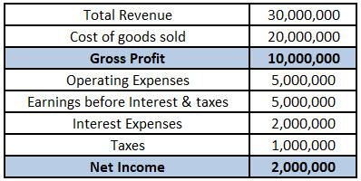

## Table of Contents

## What is a profit margin?

A profit margin is the percentage of money a business keeps as profit from its sales after paying all costs. It shows how well a company is doing at making money. For example, if a business sells a product for $100 and it costs $80 to make and sell it, the profit is $20. The profit margin would be 20% because the profit ($20) is 20% of the selling price ($100).

There are different types of profit margins, like gross profit margin, operating profit margin, and net profit margin. Each type looks at different costs. The gross profit margin only considers the cost of making the product, while the operating profit margin also includes costs like rent and salaries. The net profit margin includes all costs, including taxes. Knowing these different margins helps businesses see where they can save money and make more profit.

## How is profit margin calculated?

Profit margin is calculated by taking the profit made from sales and dividing it by the total sales, then turning that into a percentage. For example, if a business makes $50 in profit from selling a product that was sold for $200, the profit margin is calculated like this: $50 (profit) divided by $200 (total sales) equals 0.25. To turn this into a percentage, you multiply by 100, so the profit margin is 25%.

There are different types of profit margins, and each one is calculated a bit differently. The gross profit margin looks at the profit after subtracting only the cost of goods sold (COGS) from total sales. The operating profit margin goes further by also subtracting operating expenses like rent and salaries from the gross profit. The net profit margin includes all costs, including taxes and interest, to give the final profit. Each type helps businesses understand their financial health in different ways.

## What are utility companies?

Utility companies are businesses that provide essential services to people and other businesses. These services include things like electricity, gas, water, and sometimes even internet and phone services. People need these services every day to live comfortably and run their homes and businesses. Utility companies build and maintain the systems that deliver these services, like power lines, gas pipelines, and water treatment plants.

These companies are often regulated by the government to make sure they provide safe and reliable services at fair prices. In some places, utility companies are owned by the government, while in others they are private businesses. They have to follow rules about how much they can charge and how they treat their customers. Because everyone needs these services, utility companies play a very important role in our daily lives.

## Why is it important to know the average profit margin of utility companies?

Knowing the average profit margin of utility companies is important because it helps us understand how well these companies are doing financially. Utility companies provide essential services like electricity, water, and gas, which we all need every day. If their profit margins are high, it means they are making good money from the services they provide. On the other hand, if their profit margins are low, it might mean they are struggling to make ends meet, which could affect the quality and reliability of the services they offer.

This information is also useful for people who invest in utility companies. Investors want to know if a company is making enough profit to be a good investment. If the average profit margin is healthy, it can attract more investors, which can help the company grow and improve its services. But if the profit margins are too low, investors might look elsewhere, which could make it harder for the utility company to get the money it needs to keep running smoothly.

## What factors influence the profit margins of utility companies?

Many things can change how much profit utility companies make. One big thing is the cost of making and delivering services like electricity, water, and gas. If the price of coal, natural gas, or other things they need goes up, it can make it harder for them to make a profit. Also, if they have to spend a lot of money to fix or build new systems, like power lines or water treatment plants, it can affect their profit margins too. Regulations from the government can also play a role. If the government says they can't charge as much for their services, it can make their profit margins smaller.

Another important factor is how much people use the services. If there's a hot summer and everyone uses more electricity to stay cool, the utility company might make more money. But if people start using less, maybe because they're trying to save money or use more efficient appliances, the company's profits could go down. Competition can also make a difference. In some places, there might be more than one company offering the same service, and they have to keep their prices low to keep customers. This can lead to smaller profit margins.

Overall, the profit margins of utility companies depend on many things, like the cost of their supplies, how much they have to spend on their systems, what the government says they can charge, how much people use their services, and how much competition there is. All these things together decide how much profit these companies can make.

## How do profit margins of utility companies compare to other industries?

Utility companies usually have lower profit margins than many other industries. This is because they provide essential services like electricity, water, and gas, and the government often controls how much they can charge for these services. So, even though they have a lot of customers, they can't make as much money per customer as companies in other industries might. For example, tech companies like Apple or software companies like Microsoft often have much higher profit margins because they can charge more for their products and don't have the same kind of government regulations.

However, utility companies can still be very profitable because they serve so many people and their services are always needed. Their profit margins might be around 5% to 10%, which is lower than the 20% or more that some tech or pharmaceutical companies might see. But because utility companies have a steady stream of customers and their services are essential, they can still make a good amount of money overall. It's a balance between having a lot of customers and not being able to charge as much per customer because of regulations.

## What are the typical profit margins for different types of utility companies (e.g., electricity, water, gas)?

The profit margins for different types of utility companies can vary, but they generally stay within a certain range. Electricity companies often have profit margins around 5% to 10%. This is because they have to deal with high costs for things like coal, natural gas, and building power plants. They also have to follow strict rules from the government about how much they can charge, which can keep their profits from getting too high. 

Water utility companies usually have profit margins that are a bit lower, often around 3% to 8%. They have to spend a lot of money on things like water treatment plants and pipes, and they also have to follow government rules about water quality and pricing. Gas utility companies can have profit margins similar to electricity companies, typically between 5% and 10%. Like electricity companies, they have to manage the cost of natural gas and the infrastructure to deliver it to homes and businesses, all while following regulations about what they can charge.

## How have the profit margins of utility companies changed over the past decade?

Over the past decade, the profit margins of utility companies have seen some changes, but they have mostly stayed within a certain range. For electricity companies, profit margins have been around 5% to 10%. This is because they have to deal with the costs of things like coal and natural gas, and they also have to follow government rules about how much they can charge. These costs and rules have not changed a lot over the years, so their profit margins have stayed pretty steady.

Water utility companies have had profit margins that are a bit lower, usually between 3% and 8%. They have to spend money on water treatment plants and pipes, and they also have to follow strict rules about water quality and pricing. Over the past ten years, these costs and rules have not changed much, so their profit margins have also stayed about the same.

Gas utility companies have had profit margins similar to electricity companies, typically between 5% and 10%. They have to manage the cost of natural gas and the infrastructure to deliver it to homes and businesses. Like electricity companies, they have to follow regulations about what they can charge. Over the past decade, these factors have kept their profit margins pretty stable.

## What regulatory factors affect the profit margins of utility companies?

Government rules play a big role in how much profit utility companies can make. These rules set limits on how much utility companies can charge for things like electricity, water, and gas. If the government says the prices can't go up, even if the costs of running the company go up, the profit margins can get smaller. Also, the government makes sure that utility companies keep their services safe and reliable. This means the companies have to spend money on things like fixing old pipes or power lines, which can also affect their profit margins.

Another important rule is about how much money utility companies can make from their investments. For example, if a company builds a new power plant, the government might only let them charge a certain amount to cover the cost of that plant. This can limit how much extra profit they can make from new projects. Overall, these rules are there to make sure that everyone can afford essential services, but they can make it harder for utility companies to have big profit margins.

## How do economic conditions impact the profit margins of utility companies?

Economic conditions can really change how much money utility companies make. When the economy is doing well, people and businesses use more electricity, water, and gas. This means utility companies can sell more of their services and make more money. But if the economy is not doing well, people might try to save money by using less of these services. This can make the profit margins of utility companies smaller because they are selling less.

Another way economic conditions affect utility companies is through the cost of things they need to run their business. If the price of coal, natural gas, or other supplies goes up because of economic changes, it can make it harder for utility companies to keep their profit margins high. They might have to spend more money to get the same amount of supplies, which leaves them with less profit. So, the economy can make a big difference in how much profit utility companies can make.

## What strategies can utility companies use to improve their profit margins?

Utility companies can improve their profit margins by finding ways to save money and make more from what they sell. One way to save money is by using new technology that makes their systems work better. For example, smart meters can help them see how much electricity people use and fix problems faster. This can lower the cost of running the company. Another way is by making their power plants or water treatment plants work more efficiently. If they use less fuel or chemicals, they can save money and have more profit.

Another strategy is to find new ways to make money. Utility companies can offer new services like energy-saving programs or installing solar panels. These extra services can bring in more money and help boost their profit margins. They can also look for ways to charge customers more fairly. For example, if they use time-of-use pricing, they can charge more during busy times and less when things are quiet. This can help them make more money without raising prices too much for everyone.

Overall, utility companies need to balance saving money and making more from their services. By using new technology, working more efficiently, and offering new services, they can improve their profit margins. It's important for them to keep their services good and affordable while also finding ways to make more money.

## How do international differences affect the profit margins of utility companies?

International differences can change how much profit utility companies make. In different countries, the rules about how much utility companies can charge for services like electricity, water, and gas can be very different. Some places have strict rules that keep prices low, which can make it hard for utility companies to make a lot of profit. In other places, the rules might be more relaxed, so utility companies can charge more and make more money. Also, the cost of things like coal or natural gas can be different in different countries. If a country has a lot of these resources, the cost might be low, which can help utility companies make more profit.

Another way international differences affect profit margins is through how much people use utility services. In some countries, people might use a lot of electricity because it's very hot or cold, which can help utility companies make more money. But in other places, people might use less because they're trying to save money or because they have good energy-saving habits. Also, some countries have a lot of competition between utility companies, which can make them charge less to keep customers. This can make their profit margins smaller. So, the rules, costs, and how people use services can all be different from one country to another, and these differences can change how much profit utility companies make.

## What are the elements and challenges of financial performance?

The financial performance of utility companies is predominantly assessed through several key metrics, including Earnings Before Interest, Taxes, Depreciation, and Amortization (EBITDA) margins, gross margins, and net profit margins. These metrics provide crucial insights into a company's operational efficiency, profitability, and overall financial health.

EBITDA margin is a measure of a company's operating profit as a percentage of its revenue and provides an understanding of its operational performance without the effects of capital structure, tax rates, and non-cash accounting items. Gross margin, on the other hand, represents the difference between revenue and cost of goods sold, expressed as a percentage of revenue and indicates how efficiently a company uses its resources in producing goods or services. Lastly, the net profit margin, calculated by the formula:

$$
\text{Net Profit Margin} = \left(\frac{\text{Net Income}}{\text{Revenue}}\right) \times 100\%
$$

measures the percentage of revenue that remains as profit after all expenses are accounted for. 

Utility companies often face challenges pertaining to high capital investment requirements due to the nature of their infrastructure-intensive operations. These demands can place a significant strain on available financial resources and impact long-term financial stability. Regulatory constraints further compound these challenges, influencing pricing structures and operational regulations which can affect profitability and adaptability in market shifts.

The rate-making process is vital in shaping the revenue models and profitability of utility companies. This involves setting rates that allow the company to cover costs, earn a reasonable return on investment, and ensure fair pricing for consumers. Rate-making is often supervised by regulatory bodies to balance the financial well-being of utility firms with public interest.

Investors and stakeholders rely on understanding these financial performance metrics and challenges to make informed investment decisions. Analyzing these parameters enables a deeper assessment of a utility company's value proposition, risk profile, and potential return on investment. As such, mastery of these financial indicators is essential for navigating the complexities of utility stock investments and ensuring optimal portfolio management.

## What are some Case Studies and Real-World Applications?

Utility companies, essential to the energy sector, can significantly benefit from [algorithmic trading](/wiki/algorithmic-trading) strategies that leverage detailed financial analyses and performance metrics. This section explores specific case studies to illustrate how algorithmic trading, enriched with methodologies like DuPont Analysis, is applied to enhance trade strategies based on insights from profit margins and financial data.

A notable instance is the application of algorithmic trading by Duke Energy, one of the largest electric power holding companies in the United States. By analyzing their financial statements, traders can deploy algorithms to automate investment decisions. For instance, using historical financial data such as return on equity (ROE), profit margins, and operational efficiencies, algorithms can be programmed to trigger buy or sell actions when specific thresholds are met. 

Consider an algorithmic model utilizing the DuPont Analysis framework to assess Duke Energy's financial health. The DuPont Analysis breaks down ROE into several components:

$$
ROE = \text{Profit Margin} \times \text{Asset Turnover} \times \text{Financial Leverage}
$$

Each element provides valuable insight: Profit Margin indicates operational efficiency, Asset Turnover measures asset usage efficiency, and Financial Leverage shows the degree of debt financing. By monitoring these components over time, algorithms can detect changes in financial health, prompting timely trading decisions that might not be evident through traditional analysis.

In another example, Spark Infrastructure Group, an owner of electricity and gas distribution networks in Australia, utilizes algorithmic strategies aligned with their dividend policies and capital projects. Algorithms [factor](/wiki/factor-investing) in expected changes in regulatory environments and operational costs, adjusting investment strategies accordingly. This may include employing Python scripts to simulate different regulatory scenarios and their potential impact on cash flows, which aids in determining the optimal portfolio composition.

For instance, a Python code snippet used for simulating these scenarios might look like this:

```python
import numpy as np

# Simulating different regulatory impacts on cash flow
regulatory_factors = np.random.normal(loc=1.0, scale=0.05, size=1000)  # Normal distribution

# Base cash flows
base_cash_flows = np.array([100, 110, 95, 105, 100])

# Simulated cash flows
simulated_cash_flows = np.array([base_cash_flows * factor for factor in regulatory_factors])

# Determine optimal investment strategy based on simulation
optimal_strategy = simulated_cash_flows.mean(axis=0).argmax()

print(f"Optimal investment strategy index: {optimal_strategy} with projected cash flow: {simulated_cash_flows.mean(axis=0)[optimal_strategy]}")
```

Through this approach, traders and stakeholders can gain insights into high-yield opportunities while safeguarding against potential risks, facilitating more informed and strategic decision-making processes.

In summary, the application of algorithmic trading strategies to utility companies, as seen in the cases of Duke Energy and Spark Infrastructure Group, demonstrates the transformative power of integrating financial analytics into automated trading systems. By leveraging methodologies like DuPont Analysis and simulating regulatory impacts, these strategies not only optimize financial performance but also enhance market predictability and investment outcomes.

## References & Further Reading

[1]: Bergstra, J., Bardenet, R., Bengio, Y., & Kégl, B. (2011). ["Algorithms for Hyper-Parameter Optimization."](https://dl.acm.org/doi/10.5555/2986459.2986743) Advances in Neural Information Processing Systems 24.

[2]: ["Advances in Financial Machine Learning"](https://www.amazon.com/Advances-Financial-Machine-Learning-Marcos/dp/1119482089) by Marcos Lopez de Prado

[3]: ["Evidence-Based Technical Analysis: Applying the Scientific Method and Statistical Inference to Trading Signals"](https://www.amazon.com/Evidence-Based-Technical-Analysis-Scientific-Statistical/dp/0470008741) by David Aronson

[4]: ["Machine Learning for Algorithmic Trading"](https://github.com/stefan-jansen/machine-learning-for-trading) by Stefan Jansen

[5]: ["Quantitative Trading: How to Build Your Own Algorithmic Trading Business"](https://github.com/LucindaYa/quant-resources/blob/master/Quantitative%20Trading%20How%20to%20Build%20Your%20Own%20Algorithmic%20Trading%20Business.pdf) by Ernest P. Chan