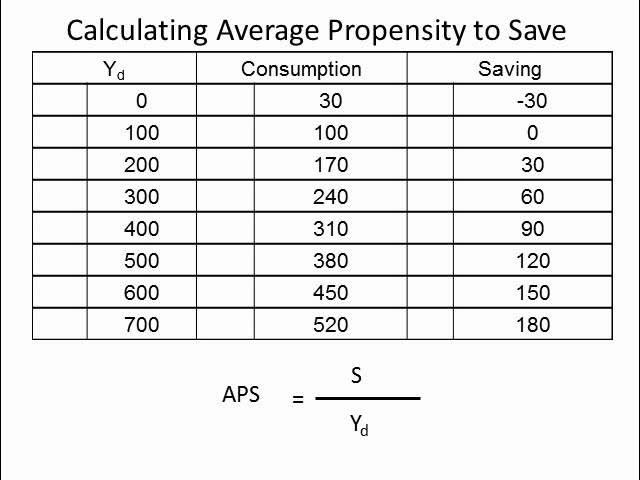

## Table of Contents

## What is the Average Propensity to Save (APS)?

The Average Propensity to Save (APS) is a measure that shows how much of their income people are saving. It is calculated by dividing the total amount of savings by the total income. For example, if a person earns $100 and saves $10, their APS would be 0.10, or 10%. This number helps economists understand how much people are willing to save out of their income.

APS is important because it gives insight into the saving habits of a population. When the APS is high, it means people are saving a larger portion of their income. This can be good for the economy because it means more money is available for investment. However, if the APS is too high, it might mean people are not spending enough, which can slow down economic growth. On the other hand, a low APS means people are spending more of their income, which can boost the economy but might leave less for future savings.

## How is the Average Propensity to Save calculated?

The Average Propensity to Save (APS) is calculated by dividing the total amount of savings by the total income. For example, if someone earns $1000 and saves $200, you would divide $200 by $1000 to get an APS of 0.20, or 20%. This calculation helps us understand how much of their income people are choosing to save rather than spend.

This simple formula can be used for individuals, households, or even entire countries to see their saving habits. If the APS is high, it means people are saving a lot of their income. If it's low, it means they are spending most of it. Economists use this number to learn about how saving and spending affect the economy.

## Why is the Average Propensity to Save important in economics?

The Average Propensity to Save (APS) is important in economics because it helps us understand how people are using their money. If the APS is high, it means people are saving a lot of their income. This can be good for the economy because more savings can lead to more investments in things like businesses and new projects. But if everyone saves too much, it might mean they are not spending enough, which can slow down the economy because businesses need people to buy things to keep growing.

On the other hand, if the APS is low, it means people are spending most of their income. This can help the economy grow because more spending means more money flowing through businesses. However, if people spend too much and save too little, they might not have enough money for the future or for emergencies. So, economists look at the APS to find a good balance between saving and spending that keeps the economy healthy.

## What factors influence an individual's Average Propensity to Save?

Several factors can affect how much a person decides to save out of their income. One big [factor](/wiki/factor-investing) is their income level. People with higher incomes often have more money left over after they pay for what they need, so they might save more. On the other hand, people with lower incomes might have to spend almost all their money on things like food, housing, and other necessities, leaving them with less to save. Another factor is age. Younger people might save less because they have different spending priorities, like going out with friends or buying new gadgets. Older people, especially those nearing retirement, might save more because they want to have enough money to live on after they stop working.

Another important factor is a person's financial goals and habits. If someone wants to buy a house or go on a big trip, they might save more to reach those goals. People who are good at planning and sticking to a budget tend to save more than those who spend money as soon as they get it. Economic conditions also play a role. During times when the economy is doing well, people might feel more confident about their future and save less because they think they can always make more money. But during tough economic times, people might save more because they worry about losing their jobs or not being able to pay their bills.

Lastly, things like interest rates and government policies can affect saving. If banks offer high interest rates on savings accounts, people might be more motivated to save because they can earn more money on their savings. Government policies, like tax breaks for saving in retirement accounts, can also encourage people to save more. All these factors together help determine how much of their income people choose to save.

## How does the Average Propensity to Save differ from the Marginal Propensity to Save?

The Average Propensity to Save (APS) and the Marginal Propensity to Save (MPS) are two ways to look at how people save money, but they focus on different things. APS is about how much of your total income you save. You find it by dividing your total savings by your total income. For example, if you earn $1000 and save $200, your APS is 0.20, or 20%. This tells us how much you save out of everything you earn.

On the other hand, the Marginal Propensity to Save (MPS) looks at how much of any extra money you get you decide to save. It's about the change in savings when your income changes. For example, if you get an extra $100 and you save $30 of it, your MPS is 0.30, or 30%. This helps us understand how you react to changes in your income. Both APS and MPS are important because they give different pieces of information about saving habits, but they measure different things.

## Can the Average Propensity to Save be negative? If so, under what circumstances?

Yes, the Average Propensity to Save (APS) can be negative, but it's not very common. APS is negative when a person or a group of people spend more money than they earn. This means they are using up their savings or going into debt. For example, if someone earns $1000 in a month but spends $1200, their savings would decrease by $200. To find the APS, you divide the change in savings (-$200) by the total income ($1000), which gives you an APS of -0.20, or -20%.

This situation can happen for different reasons. Sometimes people might need to spend more than they earn because of unexpected costs, like medical bills or car repairs. Other times, they might choose to spend more than they earn because they want to buy something big, like a house or a car, and they use loans or their savings to do it. Economists look at negative APS to understand how people are managing their money and what it might mean for the economy.

## How does the Average Propensity to Save vary across different income levels?

The Average Propensity to Save (APS) often changes depending on how much money people make. People with higher incomes usually save a bigger part of their money because they have more left over after paying for what they need. For example, if someone earns a lot, they can easily pay for their house, food, and other bills and still have money to put into savings or investments. On the other hand, people with lower incomes might find it hard to save because most of their money goes to basic needs like food and rent. They might not have any extra money left to save.

But it's not always that simple. Even among people with similar incomes, the APS can be different because of other things like how old they are, what they want to do with their money, and what's happening in the economy. For example, a young person with a good job might spend more on fun things and save less, while an older person with the same income might save more for retirement. Also, if the economy is doing well, people might feel more confident and save less, thinking they can always make more money. But if times are tough, even people with higher incomes might save more to be safe.

## What impact does government policy have on the Average Propensity to Save?

Government policies can make a big difference in how much people save. One way is through tax breaks and incentives. If the government gives people tax breaks for putting money into retirement accounts or savings plans, more people might choose to save more of their money. These policies make saving more attractive because people can keep more of their money instead of paying it in taxes. On the other hand, if the government raises taxes on savings or investments, people might decide to save less because they won't get as much benefit from it.

Another way government policies affect saving is through social programs and economic support. If the government offers strong social safety nets like unemployment benefits or healthcare, people might feel more secure and save less because they know they will be taken care of if something goes wrong. But if these programs are weak or cut back, people might save more to protect themselves against unexpected costs or job loss. Government policies also influence interest rates, which can make saving more or less appealing. If interest rates are high, people might be more motivated to save because they can earn more on their savings. But if rates are low, the incentive to save goes down, and people might spend more instead.

## How does the Average Propensity to Save affect economic growth?

The Average Propensity to Save (APS) can have a big impact on how fast an economy grows. When people save more of their money, they are putting more money into banks and other places where it can be used for investments. These investments can lead to new businesses, more jobs, and new products, which can help the economy grow. So, a high APS can be good for the economy because it means there's more money available for things that can make the economy stronger.

But, if everyone saves too much and doesn't spend enough, it can slow down the economy. When people spend money, businesses make more sales and can grow, which helps the economy. If people save a lot and spend very little, businesses might not make as much money, and they might not be able to grow or hire new workers. So, economists look for a balance where people save enough for the future but also spend enough to keep the economy moving.

## What are the historical trends in the Average Propensity to Save in major economies?

Over the years, the Average Propensity to Save (APS) in major economies has gone up and down for different reasons. In the United States, for example, the APS was pretty high after World War II because people were saving a lot of their money. But as time went on, especially from the 1980s to the early 2000s, people started saving less and spending more. This was because of things like easier access to credit, which meant people could borrow money to buy things instead of saving up for them. Also, as the economy grew, people felt more confident and thought they could always make more money, so they saved less.

In other major economies like Japan, the APS has been different. Japan has often had a higher APS than the U.S. because people there tend to save a lot. This is partly because of cultural reasons and also because Japan has an aging population that saves more for retirement. But even in Japan, the APS has changed over time. For example, during the 1990s, when Japan's economy was not doing well, people started saving even more because they were worried about the future. In Europe, the APS can vary a lot from one country to another, but overall, many European countries have seen a trend similar to the U.S., with people saving less over time as they spend more on things like housing and consumer goods.

## How do cultural differences affect the Average Propensity to Save globally?

Cultural differences play a big role in how much people around the world save. In some countries, like those in East Asia, saving is a big part of the culture. People in places like Japan and China often save a lot of their money because they believe it's important to be ready for the future. They might save for their kids' education or for when they get older and can't work anymore. This is different from some Western countries, where people might spend more of their money on things they want now, like cars or vacations, and save less for later.

But it's not just about what people think is important. The way families work in different cultures can also affect saving. In many Asian cultures, families often live together and help each other out, which can make people feel more secure and save more. In contrast, in many Western countries, people might move out on their own earlier and have to take care of themselves, which can make them spend more on their own needs and save less. So, cultural values and family structures both play a part in how much people save around the world.

## What are the advanced econometric models used to analyze the Average Propensity to Save?

Advanced econometric models help economists understand the Average Propensity to Save (APS) better. One common model is the Life-Cycle Hypothesis (LCH), which says people try to spread out their spending over their whole life. They save more when they are young and working, and then spend those savings when they are older and not working anymore. Another model is the Permanent Income Hypothesis (PIH), which says people save based on what they think their income will be in the future, not just what they earn now. These models use math to look at how things like age, income, and expectations affect how much people save.

Another model economists use is the Keynesian Consumption Function, which focuses on how changes in income affect saving and spending. This model looks at how much of any extra money people save or spend. It helps economists see how people react to changes in the economy. All these models use data and math to predict how much people will save, which helps governments and businesses plan for the future. By understanding these patterns, economists can make better guesses about how the economy will grow or shrink.

## What is the Average Propensity to Save (APS)?

The average propensity to save (APS) is an economic measurement that indicates the portion of household disposable income allocated towards savings rather than consumption. This metric is also commonly referred to as the savings ratio and is expressed as a percentage. By providing a quantitative assessment of saving behavior, APS serves as a vital tool for understanding how different demographics and economic conditions influence the propensity to save.

To calculate APS, the formula used is:

$$
\text{APS} = \frac{\text{Total Savings}}{\text{Disposable Income}} \times 100
$$

Total savings here represent the amount of income that households set aside, and disposable income includes all income available for spending and saving after taxes have been deducted. This calculation helps shed light on the societal trends in saving, which may be shaped by a variety of factors, including age distribution, income levels, cultural attitudes towards saving, and the current economic climate.

Moreover, APS is closely associated with two other vital economic indicators: the average propensity to consume (APC) and the marginal propensity to save (MPS). APC is the fraction of disposable income spent on consumption, while MPS refers to the change in saving resulting from a change in disposable income. These interlinked metrics help paint a comprehensive picture of economic behavior, illustrating the balance or trade-off between savings and consumption.

Analyses based on APS can provide insights into broader economic priorities and the shifting dynamics between saving and consumption. For instance, an increase in APS may indicate a collective preference for future security and investment over immediate consumption, potentially influencing long-term economic planning and development strategies. By examining APS alongside other economic variables, economists and policymakers can better comprehend and predict consumer behavior, monitor economic health, and design effective fiscal policies.

## How do you calculate APS using the formula?

The Average Propensity to Save (APS) is calculated using a simple yet informative formula: 

$$
\text{APS} = \frac{\text{Total Savings}}{\text{Disposable Income}}
$$

This straightforward calculation involves dividing the total amount saved by a household by its disposable income, which is the income remaining after taxes have been deducted. By using post-tax income as the baseline, APS provides an accurate measure of what percentage of income is being saved rather than spent.

A positive APS reflects that savings are occurring, indicating that a portion of the income is reserved for future use. Conversely, a negative APS may emerge when expenditures surpass income, leading to a situation known as dis-saving. Dis-saving can occur in times of economic hardship or when households are drawing on past savings.

Understanding the APS formula is crucial for both financial planning and macroeconomic analysis. On an individual level, knowing one's APS can guide budgeting and savings goals, helping ensure financial security for the future. From a macroeconomic perspective, insights from APS can inform policy decisions and economic projections, particularly regarding consumption and saving patterns within an economy. These calculations are vital for anticipating economic trends and crafting responsive fiscal policies.

## References & Further Reading

[1]: Keynes, J. M. (1936). ["The General Theory of Employment, Interest, and Money"](https://www.files.ethz.ch/isn/125515/1366_KeynesTheoryofEmployment.pdf). Palgrave Macmillan.

[2]: Mankiw, N. G. (2014). ["Principles of Economics"](https://www.amazon.com/Principles-Economics-7th-Gregory-Mankiw/dp/128516587X). Cengage Learning.

[3]: Modigliani, F. (1986). ["Life Cycle, Individual Thrift, and the Wealth of Nations"](https://www.jstor.org/stable/1813352?googleloggedin=true). American Economic Review, 76(3), 297-313.

[4]: Friedman, M. (1957). ["A Theory of the Consumption Function"](https://www.nber.org/books-and-chapters/theory-consumption-function). Princeton University Press.

[5]: Lopez de Prado, M. (2018). ["Advances in Financial Machine Learning"](https://www.amazon.com/Advances-Financial-Machine-Learning-Marcos/dp/1119482089). Wiley.

[6]: Jansen, S. (2018). ["Machine Learning for Algorithmic Trading"](https://github.com/stefan-jansen/machine-learning-for-trading). Packt Publishing.