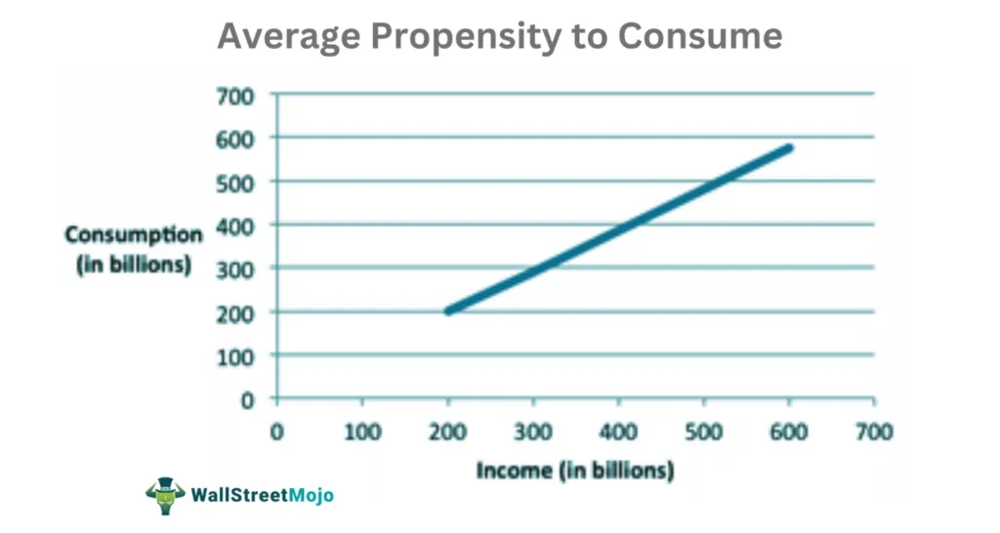

Saving is a crucial component of economic stability and is well-represented by the average propensity to save (APS). This economic term describes the percentage of income saved by households rather than consumed. APS plays a fundamental role in personal finance, economic growth, and investment. It provides insight into how societies allocate resources between present consumption and future investment. By understanding APS, one can gauge the economic health of a society and its tendencies towards saving versus spending.

The concept of APS is essential for identifying saving rates and understanding how various economic factors influence these rates. Not only does APS serve as an indicator of financial prudence on a microeconomic level, but it also impacts macroeconomic policies and strategies. On a broader scale, APS measures inform how economic theories predict consumption patterns and savings behaviors, further influencing fiscal policy and economic forecasts. Additionally, technological advancements in algorithmic trading have incorporated APS metrics to predict market trends, enhancing financial models and strategies. 



This article will explore the APS formula and how it translates into practical implications across different economic and financial contexts. Each component of APS, from its foundational calculation to its application in economic theory and technology, contributes invaluable insights into both individual and collective financial behaviors.

## Table of Contents

## What is the Average Propensity to Save (APS)?

The average propensity to save (APS) is an economic measurement that indicates the portion of household disposable income allocated towards savings rather than consumption. This metric is also commonly referred to as the savings ratio and is expressed as a percentage. By providing a quantitative assessment of saving behavior, APS serves as a vital tool for understanding how different demographics and economic conditions influence the propensity to save.

To calculate APS, the formula used is:

$$
\text{APS} = \frac{\text{Total Savings}}{\text{Disposable Income}} \times 100
$$

Total savings here represent the amount of income that households set aside, and disposable income includes all income available for spending and saving after taxes have been deducted. This calculation helps shed light on the societal trends in saving, which may be shaped by a variety of factors, including age distribution, income levels, cultural attitudes towards saving, and the current economic climate.

Moreover, APS is closely associated with two other vital economic indicators: the average propensity to consume (APC) and the marginal propensity to save (MPS). APC is the fraction of disposable income spent on consumption, while MPS refers to the change in saving resulting from a change in disposable income. These interlinked metrics help paint a comprehensive picture of economic behavior, illustrating the balance or trade-off between savings and consumption.

Analyses based on APS can provide insights into broader economic priorities and the shifting dynamics between saving and consumption. For instance, an increase in APS may indicate a collective preference for future security and investment over immediate consumption, potentially influencing long-term economic planning and development strategies. By examining APS alongside other economic variables, economists and policymakers can better comprehend and predict consumer behavior, monitor economic health, and design effective fiscal policies.

## Factors Influencing APS

The Average Propensity to Save (APS) is influenced by various factors, with inflation and interest rates playing significant roles. Inflation reduces the real value of money, which can either encourage saving as households try to preserve their purchasing power or discourage it if people expect rising prices. Higher interest rates generally incentivize saving by offering greater returns on saved funds, while lower interest rates may deter saving, encouraging spending or investing in other assets instead.

Demographic factors also considerably affect APS, notably through age distribution. Individuals in middle age often have higher savings rates due to peak [earning](/wiki/earning-announcement) periods and preparations for retirement. Younger individuals might save less due to lower earnings and the need to spend on essential goods, while older individuals might draw on savings, leading to a variation in the APS.

Economic outlooks and cultural attitudes are crucial determinants. Positive economic conditions typically boost consumer confidence, leading to increased spending and potentially lowering APS. Conversely, during economic downturns, uncertainty may prompt more saving to safeguard against potential income disruptions. Cultural values can also dictate saving behaviors, with some societies prioritizing savings more than others.

Government policies significantly impact disposable income, thereby influencing APS. Taxation levels and social welfare programs can alter disposable income, affecting the ability and tendency of households to save. Policies promoting saving through tax incentives for saving accounts or retirement funds can also enhance the APS. Shifts in these factors might lead to changes in APS, mirroring economic strategies and consumer confidence trends. Understanding these elements is essential for predicting changes in saving behaviors and formulating effective economic policies.

## Calculating APS: The Formula

The Average Propensity to Save (APS) is calculated using a simple yet informative formula: 

$$
\text{APS} = \frac{\text{Total Savings}}{\text{Disposable Income}}
$$

This straightforward calculation involves dividing the total amount saved by a household by its disposable income, which is the income remaining after taxes have been deducted. By using post-tax income as the baseline, APS provides an accurate measure of what percentage of income is being saved rather than spent.

A positive APS reflects that savings are occurring, indicating that a portion of the income is reserved for future use. Conversely, a negative APS may emerge when expenditures surpass income, leading to a situation known as dis-saving. Dis-saving can occur in times of economic hardship or when households are drawing on past savings.

Understanding the APS formula is crucial for both financial planning and macroeconomic analysis. On an individual level, knowing one's APS can guide budgeting and savings goals, helping ensure financial security for the future. From a macroeconomic perspective, insights from APS can inform policy decisions and economic projections, particularly regarding consumption and saving patterns within an economy. These calculations are vital for anticipating economic trends and crafting responsive fiscal policies.

## APS in Economic Theory

The average propensity to save (APS) plays a crucial role in economic theory by informing macroeconomic models. These models utilize APS to better understand how fiscal policies and consumption patterns are affected by changes in saving behaviors. A higher APS suggests that a community or nation is allocating a greater portion of its income towards savings, which can indicate increased capacity for future investments. This is valuable for ensuring sustainable economic growth, as savings provide the capital necessary for investment in infrastructure, technology, and other growth-driving sectors.

APS is closely related to the average propensity to consume (APC), and both measures are pivotal in formulating governmental policies that strike a balance between encouraging savings and stimulating consumption. When a society exhibits a high APS, it often implies a preference for saving, which can suggest conservative economic conditions or a focus on long-term financial security. In contrast, a low APS may indicate a greater emphasis on immediate consumption, which can be utilized to stimulate short-term economic activity.

Variations in APS across different regions or countries can reveal disparities in economic development and financial health. For instance, developing nations might exhibit different saving behaviors compared to developed nations, due to differences in income levels, financial systems, and cultural attitudes towards saving. These differences necessitate tailored economic policies that consider the unique saving and consumption patterns of each region.

By integrating APS into economic analysis, policymakers can make informed decisions about fiscal policy, taxation, and welfare programs to either encourage increased saving or stimulate consumption as necessary. This makes APS a critical component in the toolkit of economic planners and government officials tasked with maintaining and fostering economic stability and growth.

## Algorithmic Trading and APS

Algorithmic trading has revolutionized the financial markets by employing sophisticated algorithms to execute trades at speeds and frequencies previously unattainable by human traders. An essential aspect of these trading strategies is the incorporation of economic indicators such as the average propensity to save (APS). By understanding APS, financial professionals can better predict consumer behavior and market movements, thereby optimizing trading algorithms.

APS provides insights into the saving patterns of individuals within an economy, which is indicative of how much income is allocated to consumption versus savings. This information is vital for algorithmic models as it helps anticipate shifts in market trends. For instance, a higher APS might indicate that consumers are saving more, potentially leading to lower immediate consumption but higher future investment capacity. This could suggest cautious market sentiment, prompting algorithmic traders to adjust their portfolios towards more conservative assets.

Algorithmic trading systems can integrate APS by incorporating it into economic forecasting models. Python, a preferred language for [algorithmic trading](/wiki/algorithmic-trading) due to its powerful libraries and ease of use, can facilitate this integration. For example, using libraries like pandas for data manipulation and numpy for numerical calculations, one can model the relationship between APS and market indicators to forecast economic trends:
```python
import pandas as pd
import numpy as np

# Sample data: historical APS and market data
data = {
    'Year': [2020, 2021, 2022],
    'APS': [0.12, 0.10, 0.11],
    'Market_Trend': [0.03, 0.04, 0.035]
}

df = pd.DataFrame(data)

# Correlation analysis
correlation = df[['APS', 'Market_Trend']].corr()
print(correlation)

# Assuming a simple linear model for prediction
coefficient = np.polyfit(df['APS'], df['Market_Trend'], 1)
predicted_trend = np.polyval(coefficient, 0.13)  # Predict market trend for APS = 0.13
```
In this snippet, the correlation between APS and market trends is analyzed, and a linear model is used to predict future market behavior based on changes in APS. Incorporating such models into trading algorithms allows for more informed risk assessments and investment strategies.

The fusion of APS with algorithmic trading underscores the adaptability and resilience of modern economic systems. By continuously integrating and analyzing vast amounts of economic data, algorithmic traders can refine their strategies, adjusting to shifts in consumer behavior and macroeconomic environments. This collaboration between economics and technology not only enhances trading efficiency but also contributes to the overall stability and growth of financial markets. Understanding this dynamic interplay equips financial stakeholders with crucial tools to predict and adapt to future economic shifts.

## Conclusion

The average propensity to save (APS) is a critical metric that elucidates the relationship between individual financial behavior and broader economic trends. It provides an insightful perspective into how much of the disposable income within a society is conserved for future use rather than being consumed immediately. This understanding forms a pivotal bridge between personal finance planning and broader economic policy-making.

From a personal finance standpoint, APS assists individuals and households in evaluating their saving habits and future financial security. By calculating the APS using the formula, APS = Total Savings / Disposable Income, individuals can better grasp their saving capacity relative to their income. Its application extends beyond personal finance into economic policies where governments and economists utilize it to gauge national saving trends, influencing fiscal policies that aim to optimize economic growth and stability.

In economic theory, APS has substantial implications. High APS values suggest increased capacity for future investment, driving sustainable economic growth. Such data can guide policy decisions, addressing disparities in economic development and ensuring regions can improve their financial health. APS, therefore, acts as an indicator of economic resilience and long-term strategic planning.

The role of APS extends into practical applications such as algorithmic trading. In financial markets, understanding consumer behavior through APS can inform trading strategies. Predictive models in algorithmic trading might incorporate APS to anticipate market trends, refine risk assessments, and formulate investment strategies, thereby enhancing economic forecasts and financial stability.

Understanding APS thus equips stakeholders—be it individuals, policymakers, or financial professionals—with the necessary tools to make informed decisions. These decisions affect various domains including savings, investment, and policy formulation, thereby shaping economic strategies that align with both personal and national economic objectives.

## References & Further Reading

[1]: Keynes, J. M. (1936). ["The General Theory of Employment, Interest, and Money"](https://www.files.ethz.ch/isn/125515/1366_KeynesTheoryofEmployment.pdf). Palgrave Macmillan.

[2]: Mankiw, N. G. (2014). ["Principles of Economics"](https://www.amazon.com/Principles-Economics-7th-Gregory-Mankiw/dp/128516587X). Cengage Learning.

[3]: Modigliani, F. (1986). ["Life Cycle, Individual Thrift, and the Wealth of Nations"](https://www.jstor.org/stable/1813352?googleloggedin=true). American Economic Review, 76(3), 297-313.

[4]: Friedman, M. (1957). ["A Theory of the Consumption Function"](https://www.nber.org/books-and-chapters/theory-consumption-function). Princeton University Press.

[5]: Lopez de Prado, M. (2018). ["Advances in Financial Machine Learning"](https://www.amazon.com/Advances-Financial-Machine-Learning-Marcos/dp/1119482089). Wiley.

[6]: Jansen, S. (2018). ["Machine Learning for Algorithmic Trading"](https://github.com/stefan-jansen/machine-learning-for-trading). Packt Publishing.