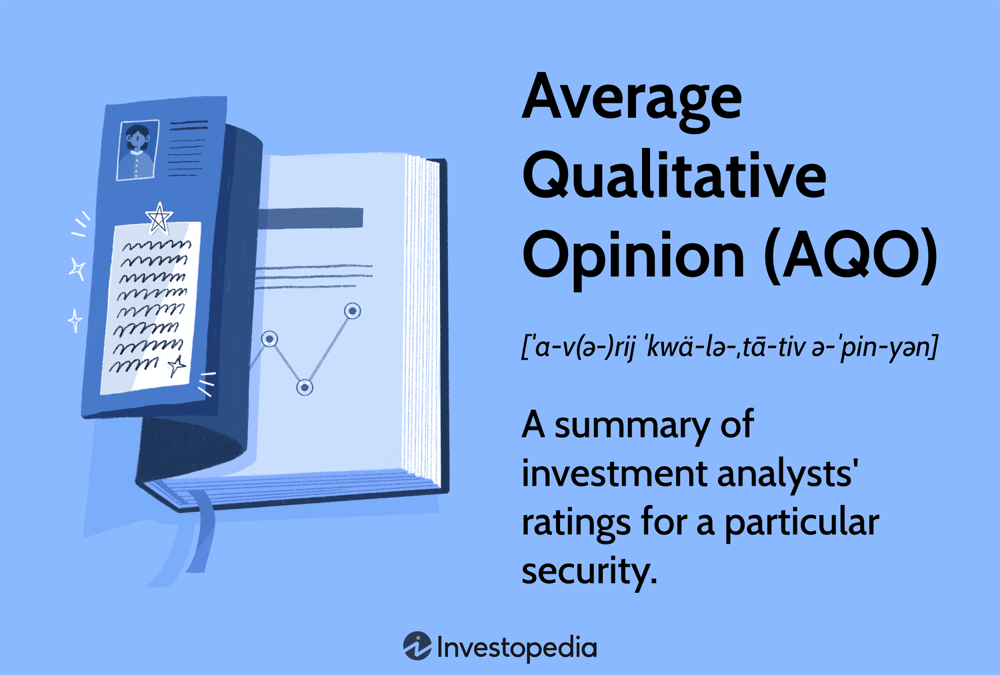

## Table of Contents

## What is meant by 'Average Qualitative Opinion'?

'Average Qualitative Opinion' is a way to measure what people think about something when their thoughts are not just numbers. It's like taking a bunch of people's feelings or opinions about a topic and finding a common ground or average feeling among them. This can be useful when you want to know what most people think about something, like a new movie or a product, but their answers are in words, not numbers.

To find an average qualitative opinion, you might read through what everyone said and look for common themes or feelings. For example, if most people say a movie was "funny" and "entertaining," those words could represent the average opinion. It's different from a simple average because you're dealing with words and feelings instead of numbers, so it requires understanding and interpreting what people mean when they share their thoughts.

## How is an Average Qualitative Opinion different from a quantitative measure?

An Average Qualitative Opinion and a quantitative measure are two different ways to understand information. A quantitative measure uses numbers to show how much or how many of something there is. For example, if you want to know how many people like a movie, you might count the number of people who say "yes" when asked if they liked it. This gives you a clear number that you can use to compare or calculate averages easily.

On the other hand, an Average Qualitative Opinion looks at what people say or feel about something, not just how many of them feel that way. Instead of counting "yes" or "no" answers, you look at the words people use to describe their thoughts or feelings. If people say a movie was "funny" and "entertaining," those words help you understand the general feeling about the movie. This method is trickier because you have to interpret what people mean, but it gives you a richer picture of their opinions.

## What are some common methods used to collect qualitative opinions?

One common way to collect qualitative opinions is through interviews. In an interview, you ask people questions and let them talk about their thoughts and feelings. This can be done face-to-face, over the phone, or even through video calls. The person being interviewed can explain their opinions in detail, which helps you understand their views better. You can ask follow-up questions to get more information or to clarify what they mean.

Another method is using focus groups. In a focus group, you bring a small group of people together to talk about a topic. They share their opinions with each other and discuss them. This can help you see different viewpoints and how people's opinions might change when they hear what others think. It's a good way to get a lot of qualitative data in a short amount of time because people can build on each other's ideas.

Surveys with open-ended questions are also used to gather qualitative opinions. Instead of just choosing from options like "yes" or "no," people can write their answers in their own words. This lets them explain their thoughts fully. You can get a lot of different opinions this way, but it can take more time to read through all the answers and understand them.

## Can you explain how to convert qualitative data into an average opinion?

To convert qualitative data into an average opinion, you first need to read through all the opinions people have shared. Look for common themes or feelings in what they say. For example, if you asked people about a movie, you might see words like "funny," "boring," or "exciting" coming up a lot. These words can help you understand the general feeling about the movie. You can group similar words or feelings together to see which ones are most common.

Once you have identified the common themes, you can decide which one represents the average opinion. This is usually the theme that appears most often or seems to be the strongest feeling among the group. For instance, if most people said the movie was "funny," then "funny" might be the average qualitative opinion. It's not about counting numbers but about understanding what most people felt or thought about the topic.

## What are the challenges in measuring and averaging qualitative opinions?

Measuring and averaging qualitative opinions can be tough because people's feelings and thoughts are not easy to put into numbers. When you read what people say, you have to understand what they mean. Sometimes people use different words to say the same thing, like "funny" and "humorous." You need to figure out if these words mean the same thing or if they are different. Also, people might feel strongly about something but not say it clearly, so you have to read between the lines to get the full picture.

Another challenge is deciding what the average opinion should be. Since you're not counting numbers, you have to look at the common themes or feelings in what people say. But what if there are a lot of different opinions? It can be hard to pick one theme that represents everyone. And sometimes, people's opinions can change when they hear what others think, so you have to be careful about how you group their thoughts together. It's a bit like solving a puzzle to find the average feeling among a bunch of different opinions.

## How can biases affect the calculation of an Average Qualitative Opinion?

Biases can mess up the calculation of an Average Qualitative Opinion. When people have biases, they might see things in a certain way that isn't fair or accurate. For example, if someone really likes a movie, they might focus on the good things and ignore the bad things. This can make the average opinion seem more positive than it really is. Also, if the person collecting the opinions has their own biases, they might pay more attention to the opinions that match what they already think. This can make the average opinion not truly represent what most people think.

Another problem is that biases can come from the group of people whose opinions are being collected. If the group is not diverse, like if everyone is from the same place or the same age, the average opinion might only show what that small group thinks. This can leave out other important opinions that would give a fuller picture. So, when figuring out an Average Qualitative Opinion, it's important to be aware of biases and try to include a wide range of views to make sure the average is as fair and accurate as possible.

## What tools or software are available to help analyze qualitative data for averaging?

There are several tools and software that can help you analyze qualitative data to find an average opinion. One popular tool is NVivo, which helps you organize and analyze text data from interviews, surveys, and more. It can find common themes and words in what people say, making it easier to see what most people think. Another tool is ATLAS.ti, which also helps you code and analyze text to find patterns and common opinions. These tools use special methods to help you understand the words and feelings people share, so you can figure out the average opinion more easily.

Another helpful software is Dedoose, which is good for working with a team to analyze qualitative data. It helps you code data and find common themes, and it's easy to use even if you're not a tech expert. MaxQDA is another tool that can help you with coding and analyzing text to find common opinions. It has features that help you see how often certain words or themes come up, which can show you what the average opinion might be. These tools make it easier to handle a lot of qualitative data and find the average opinion without getting lost in all the words and feelings.

## How does sample size impact the reliability of an Average Qualitative Opinion?

A bigger sample size can make the Average Qualitative Opinion more reliable. When you ask more people for their opinions, you get a better idea of what most people think. It's like having a bigger puzzle with more pieces; it's easier to see the full picture. If you only ask a few people, their opinions might not show what everyone thinks. For example, if you ask 10 people about a movie and they all like it, you might think everyone likes it. But if you ask 100 people, you might find out that only half of them like it, giving you a more accurate average opinion.

However, a bigger sample size doesn't always mean the average opinion is perfect. You still need to make sure the people you ask represent different kinds of people. If you only ask people from one place or one age group, the average opinion might not show what everyone thinks. It's important to have a diverse group of people so that the average opinion is as fair and accurate as possible. So, while a bigger sample size helps, it's also important to have the right mix of people to make the average opinion reliable.

## What are some real-world applications of using Average Qualitative Opinions?

One real-world use of Average Qualitative Opinions is in the movie industry. When a new movie comes out, people share their thoughts and feelings about it. By looking at what many people say, movie makers can find out the average opinion about the movie. This helps them know if people liked it or not, and what they thought was good or bad about it. This information can guide them in making better movies in the future by focusing on what people enjoy and fixing what they don't like.

Another use is in product development. Companies often ask people to try new products and share their thoughts. By collecting these opinions and finding the average feeling, companies can learn what people like about the product and what they don't. This helps them make changes to the product to make it better. For example, if most people say a new snack is too salty, the company might make it less salty next time. This way, they can create products that more people will enjoy.

## How can one validate the accuracy of an Average Qualitative Opinion?

To make sure an Average Qualitative Opinion is accurate, you need to check if the people you asked represent a good mix of different kinds of people. If you only asked people from one place or one age group, the average opinion might not show what everyone thinks. So, it's important to ask a diverse group of people to get a fair and true picture of what most people feel. Also, you can compare the average opinion with other information, like numbers from surveys or what experts say, to see if it matches up. If it does, that can help you trust that the average opinion is right.

Another way to check the accuracy is to ask more people for their opinions. The more people you ask, the better idea you get of what most people think. It's like having more puzzle pieces to see the full picture. But even with a lot of people, you have to be careful about biases. If the person collecting the opinions has their own ideas about the topic, they might only pay attention to the opinions that match what they already think. So, it's good to have different people help with collecting and analyzing the opinions to make sure the average opinion is as fair and accurate as possible.

## What advanced statistical techniques can be applied to refine Average Qualitative Opinions?

One advanced way to make Average Qualitative Opinions better is by using a method called thematic analysis. This means reading through what people said and finding common themes or feelings. You can use special software like NVivo or ATLAS.ti to help with this. These tools can count how often certain words or themes come up, which helps you see what most people think. By grouping similar opinions together, you can get a clearer picture of the average feeling. This method helps make sure the average opinion is based on what a lot of people said, not just a few.

Another way to refine Average Qualitative Opinions is by using a technique called sentiment analysis. This method uses computers to look at what people said and figure out if they feel good, bad, or neutral about something. For example, if people use words like "funny" and "enjoyable" when talking about a movie, the computer can tell they have a positive feeling. By analyzing a lot of opinions this way, you can find out the overall feeling more accurately. This helps make the average opinion more reliable because it's based on a detailed look at what everyone said.

## How do cultural differences influence the interpretation and averaging of qualitative opinions?

Cultural differences can really change how we understand and average qualitative opinions. People from different cultures might use different words or ways to talk about their feelings. For example, someone from one culture might say a movie was "exciting," while someone from another culture might say it was "thrilling." Even though these words mean something similar, they might not be seen as the same thing when figuring out the average opinion. So, it's important to understand what people mean by the words they use, and this can be harder when people come from different places.

Also, what people think is important can be different in different cultures. In some cultures, people might care a lot about how funny a movie is, while in others, they might care more about how the story is told. When you're trying to find the average opinion, you have to think about these differences. If you don't, the average opinion might not show what most people really think. So, to make sure the average opinion is fair and accurate, you need to know about the different cultures of the people whose opinions you're looking at.

## References & Further Reading

[1]: ["Advances in Financial Machine Learning"](https://www.amazon.com/Advances-Financial-Machine-Learning-Marcos/dp/1119482089) by Marcos Lopez de Prado

[2]: ["Machine Learning for Algorithmic Trading"](https://www.amazon.com/Machine-Learning-Algorithmic-Trading-alternative/dp/1839217715) by Stefan Jansen

[3]: ["Evidence-Based Technical Analysis: Applying the Scientific Method and Statistical Inference to Trading Signals"](https://www.amazon.com/Evidence-Based-Technical-Analysis-Scientific-Statistical/dp/0470008741) by David Aronson

[4]: ["Quantitative Trading: How to Build Your Own Algorithmic Trading Business"](https://www.amazon.com/Quantitative-Trading-Build-Algorithmic-Business/dp/1119800064) by Ernest P. Chan