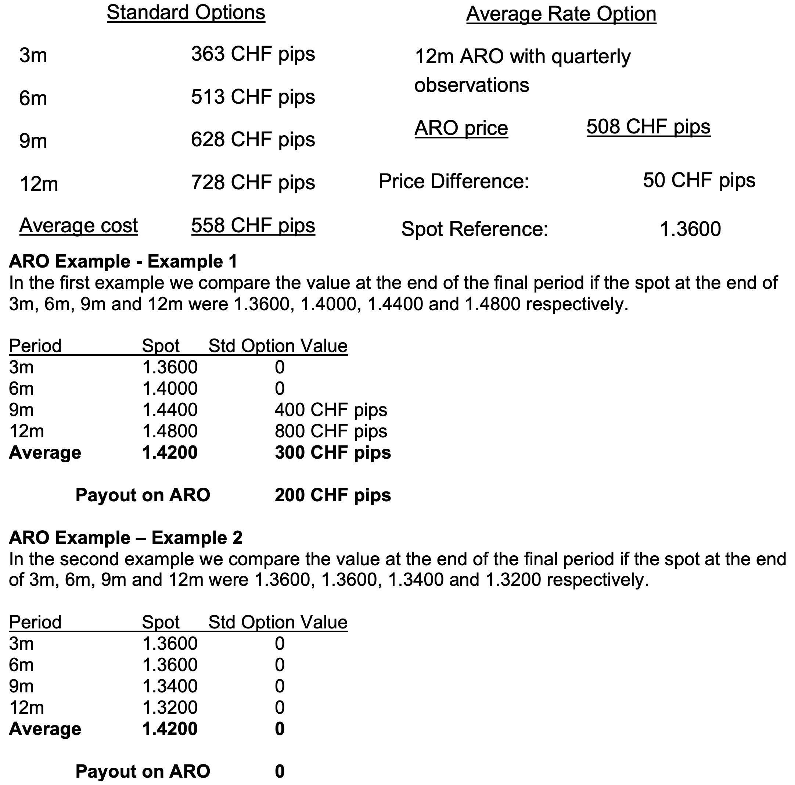

## Table of Contents

## What is an Average Rate Option?

An Average Rate Option, also known as an Asian option, is a type of financial contract where the payoff depends on the average price of the underlying asset over a certain period of time, rather than its price at expiration. This makes it different from regular options, which only look at the price at the end. The average price can be calculated in different ways, like using the arithmetic mean or the geometric mean of the prices.

These options are useful because they can reduce the impact of price swings and manipulation at the expiration date. They are often used in markets where the price of the asset can be very volatile, like commodities or currencies. Because they are based on an average, they can be less risky and sometimes cheaper than regular options.

## How does an Average Rate Option differ from a standard option?

An Average Rate Option, or Asian option, is different from a standard option because it uses the average price of the underlying asset over a period of time instead of just the price at the end. A standard option pays out based on whether the price of the asset is above or below a certain level at the time the option expires. But with an Average Rate Option, the payoff depends on the average price, which could be calculated using the arithmetic mean or geometric mean of the prices during the option's life.

This difference makes Average Rate Options useful in situations where the price of the asset can change a lot. Because they are based on an average, they can help reduce the risk of big price swings or manipulation right at the expiration date. This can make them less risky and sometimes cheaper than standard options, which is why they are often used in markets like commodities or currencies where prices can be very volatile.

## What are the key features of an Average Rate Option?

An Average Rate Option, also known as an Asian option, is a special kind of option where the payout depends on the average price of the underlying asset over a certain time, not just the price at the end. This average can be figured out in different ways, like using the arithmetic mean or the geometric mean of the prices. This makes it different from regular options, which only care about the price when the option expires.

Because Average Rate Options use an average price, they can help reduce the risk of big price changes or someone trying to manipulate the price right at the end. This can make them less risky and sometimes cheaper than regular options. They are often used in markets where prices can jump around a lot, like with commodities or currencies.

## Can you explain the basic mechanics of how an Average Rate Option works?

An Average Rate Option works by using the average price of something, like a stock or a commodity, over a certain time instead of just the price at the end. Let's say you have an option on oil. Instead of the option paying out based on what oil costs on the last day, it pays out based on what oil cost on average over the whole time you had the option. This average can be calculated in different ways, like adding up all the prices and dividing by how many there are, or using a more complicated math formula.

This way of doing things helps because it makes the option less risky. If the price of oil jumps around a lot, or if someone tries to change the price right at the end, it won't affect the option as much because it's based on the average. This can make the option cheaper to buy, too. People often use Average Rate Options in markets where prices can change a lot, like with oil or foreign money, because they help smooth out those big changes.

## What types of underlying assets are commonly used with Average Rate Options?

Average Rate Options are often used with things like oil, where the price can jump around a lot. They help make the option less risky because they use the average price of oil over time, not just the price at the end. This is good for people who want to protect themselves from big price swings in the oil market. 

Another common use is with foreign money, like the euro or the yen. Currencies can change value quickly, and Average Rate Options help smooth out those changes. By using the average price over time, these options can be cheaper and less risky for people who need to deal with currency changes in their business.

## How is the average rate calculated in an Average Rate Option?

The average rate in an Average Rate Option is figured out by taking the prices of the thing you're looking at, like oil or a currency, over a certain time and then finding the average of those prices. There are two main ways to do this. The first way is called the arithmetic mean, where you add up all the prices and then divide by how many prices you have. For example, if the price of oil was $50, $52, and $54 over three days, you would add those up to get $156 and then divide by 3 to get an average of $52.

The second way to calculate the average rate is called the geometric mean. This is a bit more complicated. Instead of just adding up the prices and dividing, you multiply all the prices together and then take the nth root of that number, where n is how many prices you have. So, if you had the same oil prices of $50, $52, and $54, you would multiply them to get $140,640, and then take the cube root of that number to find the geometric mean. Both methods give you an average price, but they can give slightly different results, and which one you use can depend on what you're trying to do with the option.

## What are the benefits of using an Average Rate Option for hedging?

Using an Average Rate Option for hedging can be really helpful, especially when you're dealing with things like oil or foreign money that can change price a lot. These options help because they use the average price over time, not just the price at the end. This means if the price jumps around or someone tries to change it right at the end, it won't mess up your hedge as much. It's like having a safety net that smooths out the big ups and downs, making it easier to plan and protect against sudden price changes.

Another benefit is that Average Rate Options can be cheaper than regular options. Because they are based on an average, they are less risky for the person selling the option, so they might charge you less for it. This can be a big deal if you're trying to manage costs while still protecting yourself from price swings. So, if you're in a business where prices can be all over the place, using an Average Rate Option can help you save money and feel more secure about your financial plans.

## What are the potential risks associated with Average Rate Options?

Average Rate Options can be helpful, but they come with some risks too. One big risk is that if the price of the thing you're looking at, like oil or a currency, moves in a way that's good for you right at the end but not so good over the whole time, you might not get as much money as you hoped. For example, if oil prices go up a lot right at the end but were low most of the time, your option might not pay out as much because it's based on the average price.

Another risk is that calculating the average price can be tricky. There are different ways to do it, like the arithmetic mean or the geometric mean, and which one you use can change how much you get from the option. If you don't understand how the average is being calculated, you might be surprised by the final payout. Also, these options can be less liquid than regular options, which means it might be harder to buy or sell them when you want to, and that can make them riskier to use.

## How do market conditions affect the pricing of Average Rate Options?

Market conditions can really change how much an Average Rate Option costs. If the thing the option is based on, like oil or a currency, is jumping around a lot in price, the option might cost more. That's because it's riskier for the person selling the option. They have to guess what the average price will be over time, and if the price is all over the place, that's harder to do. Also, if interest rates or how much people expect prices to go up or down changes, that can make the option more or less expensive.

Another thing that affects the price is how long the option lasts. The longer you have the option, the more time there is for the price to change, so the option might cost more. And if it's hard to buy or sell the option because not many people are trading it, that can make it more expensive too. So, the price of an Average Rate Option can go up or down based on what's happening in the market, how long the option lasts, and how easy it is to trade.

## What strategies can be employed when trading Average Rate Options?

When trading Average Rate Options, one strategy is to use them for hedging. If you're in a business where prices can change a lot, like oil or foreign money, you can buy an Average Rate Option to protect yourself. This option will pay out based on the average price over time, so even if the price jumps around, you're still covered. It's like having a safety net that smooths out the big ups and downs, making it easier to plan and feel more secure about your financial plans.

Another strategy is to take advantage of market conditions. If you think the price of something is going to be high on average over a certain time, but maybe not at the end, an Average Rate Option can be a good choice. You can buy the option when you think the average price will be good for you, and if you're right, you can make money. But remember, if the price doesn't go the way you expect, you could lose money, so it's important to understand the market and be ready for different outcomes.

Lastly, you can use Average Rate Options for speculation. If you have a good guess about how the average price of something will move over time, you can buy or sell these options to try and make a profit. This can be riskier because you're betting on the average price, not just the price at the end. But if you're good at predicting market trends, it can be a way to make money. Just make sure you understand how the average is calculated and be ready for the price to go up and down.

## How do Average Rate Options fit into a broader investment portfolio?

Average Rate Options can be a useful part of a bigger investment plan, especially if you're dealing with things like oil or foreign money where prices can change a lot. These options help because they use the average price over time, not just the price at the end. This means if the price jumps around or someone tries to change it right at the end, it won't mess up your investment as much. It's like having a safety net that smooths out the big ups and downs, making it easier to plan and feel more secure about your financial plans.

Adding Average Rate Options to your investment mix can also help you balance out risk. If you have other investments that might be affected by big price swings, these options can protect you from those changes. For example, if you own a lot of oil stocks, buying an Average Rate Option on oil can help you if the price of oil goes down. This way, you're not just betting on the price at one point in time, but on how it moves over a period, which can make your overall investment strategy more stable and less risky.

## What advanced valuation models are used for pricing Average Rate Options?

When it comes to figuring out how much an Average Rate Option is worth, people often use something called the Black-Scholes model, but they change it a bit to fit these special options. The Black-Scholes model is usually used for regular options, but for Average Rate Options, it needs to be tweaked because it has to take into account the average price over time, not just the price at the end. So, people add in formulas that help calculate the average price, like the arithmetic mean or the geometric mean, to make sure the model works right for these options.

Another way to value Average Rate Options is by using Monte Carlo simulations. This method involves running a lot of different scenarios to see how the price of the thing the option is based on, like oil or a currency, might change over time. By doing this many times, you can get a good idea of what the average price might be and then use that to figure out how much the option is worth. This method is good because it can handle the tricky parts of calculating the average price and can be adjusted to fit different market conditions.

## What is an Average Rate Option (ARO)?

An Average Rate Option (ARO) is a type of financial derivative used in currency exchange markets for hedging purposes against fluctuations in currency exchange rates. Unlike traditional options, which have a fixed strike price, the strike price for an ARO is variable and determined by the average of the currency spot rates over the life of the option. This unique characteristic of having a floating strike price places AROs within the category of 'exotic options,' which are typically more intricate and tailored compared to standard options.

The primary purpose of an ARO is to provide the holder with a hedge against adverse movements in exchange rates during the option's life span by leveraging the averaging mechanism to smooth out the potential impacts of [volatility](/wiki/volatility-trading-strategies) in the spot rate. This is particularly beneficial when managing financial exposures related to international trade, where exchange rate fluctuations can significantly impact the value of transactions conducted in foreign currencies.

Exotic options like AROs are constructed to provide specific risk management solutions that are not feasible with plain vanilla options. Their complexity often warrants a sophisticated understanding of both the market conditions and the derivative instrument itself, making them more suitable for institutional investors who possess the necessary expertise and resources to utilize these derivatives strategically.

The mathematical representation of an ARO's strike price can be illustrated as follows:

$$
K_{\text{average}} = \frac{1}{N} \sum_{i=1}^{N} S_i
$$

Where $K_{\text{average}}$ is the average strike price of the option, $N$ is the number of observations (or time periods) over which the average is calculated, and $S_i$ represents the spot rate at each observation point. This formulation helps mitigate the risk of sudden adverse movements in spot rates by averaging them over time.

In summary, Average Rate Options offer a strategic approach to currency risk management, providing flexible hedging opportunities tailored to the unique needs of entities engaging in international financial operations. This makes them a significant tool in the toolkit of sophisticated institutional investors and corporations that require nuanced solutions to manage currency exposure effectively.

## What are the Mechanics of ARO Trading?

Average Rate Options (AROs) are specialized derivative instruments that enable entities to hedge against currency exchange rate fluctuations by agreeing upon a strike price computed from the average of currency spot rates over the life of the option. The trading mechanism of AROs involves several key steps that differentiate them from traditional options.

Initially, a contractual agreement is established between the buyer and the seller, specifying a schedule for potential currency exchanges, the method for determining the average rate, and the premium to be paid by the buyer for the option. The premium is typically paid upfront and reflects the inherent risks and benefits of the tailored structure of the ARO. The option's strike price fluctuates based on the average spot rate over a predetermined period rather than being fixed at the time of the contract initiation.

Throughout the duration of the contract, spot rates are recorded at specified intervals, contributing to an average rate calculation. The average rate $R_{\text{avg}}$ is typically computed using the formula:

$$
R_{\text{avg}} = \frac{1}{n} \sum_{i=1}^{n} R_i
$$

where $R_i$ represents the spot rate at each interval $i$ and $n$ is the total number of intervals considered within the contract's term.

At maturity, if the calculated average rate $R_{\text{avg}}$ is advantageous—meaning it compares favorably to the strike rate—the option may be exercised. This typically implies that the average spot rate over the contract's tenure allows the buyer to exchange currencies at a more beneficial rate than the current spot rate at maturity. Conversely, if the average rate is not favorable, the option expires worthless, akin to a regular option expiring out-of-the-money.

This average-based approach in AROs helps mitigate the effect of temporary spikes or drops in exchange rates, thus offering the buyer a form of protection against extreme fluctuations. However, this benefit comes with the additional complexity of accurately predicting and recording relevant market data throughout the option's duration. Such complexity underscores the importance of precise market analysis and careful contract management in ARO trading.

## References & Further Reading

[1]: Fusai, G., & Meucci, A. (2008). ["Pricing Discrete Average Rate Options by a Fully Analytical Approach."](https://openaccess.city.ac.uk/15222/7/Pricing%20Discretely%20monitored%20asian%20Fusai_Meucci_JBF.pdf) Decisions in Economics and Finance, 31.

[2]: Derman, E., & Kani, I. (1994). ["Riding on a Smile."](https://www.researchgate.net/publication/239059413_Riding_on_a_Smile) Risk, 7(2), 32-39.

[3]: ["Risk Management and Financial Institutions"](https://www.amazon.com/Management-Financial-Institutions-Wiley-Finance/dp/1119932483) by John C. Hull

[4]: Glasserman, P. (2004). ["Monte Carlo Methods in Financial Engineering"](https://link.springer.com/book/10.1007/978-0-387-21617-1) Springer.

[5]: ["Algorithmic Trading: Winning Strategies and Their Rationale"](https://www.amazon.com/Algorithmic-Trading-Winning-Strategies-Rationale-ebook/dp/B00CY5HC0U) by Ernie Chan