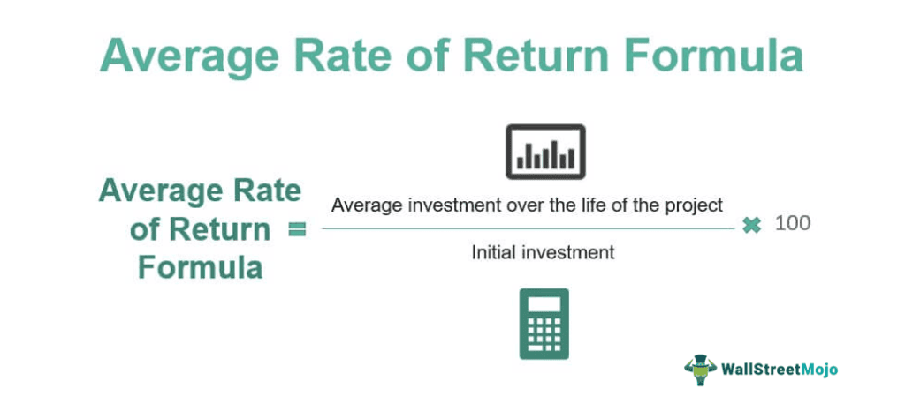

## Table of Contents

## What is the average return in finance?

The average return in finance is a way to measure how much money an investment makes over time. It's like figuring out the total profit from an investment and then dividing it by how long you held onto it. This helps people understand if an investment is good or not. For example, if you invest $100 and it grows to $110 in a year, the average return would be 10% for that year.

Average returns can be calculated for different time periods, like a year, a month, or even a day. It's important because it gives investors a simple number to compare different investments. If one investment has an average return of 5% and another has 7%, most people would choose the one with 7%. But, it's also important to remember that past average returns don't guarantee future results. Investments can go up and down, so it's wise to look at other things too, like how risky the investment is.

## How is the average return different from total return?

The average return and total return are two ways to look at how well an investment is doing, but they show different things. The total return is the full amount of money you make or lose from an investment over a certain time. It includes all the gains, like price increases and any money you get from dividends or interest. If you buy a stock for $100 and sell it for $120, plus you get $5 in dividends, your total return would be $25, or 25%.

On the other hand, the average return breaks down the total return into smaller pieces, usually over time. It tells you how much your investment grew each year, month, or another period. Using the same example, if you held that stock for one year, the average return would be 25% for that year. But if you held it for two years, the average return would be about 12.5% per year. The average return helps you see if the investment is growing at a steady rate, which can be useful for comparing different investments or planning for the future.

## What are the basic steps to calculate the average return of an investment?

To calculate the average return of an investment, first find out the total return. The total return is how much your investment grew from start to finish. Let's say you bought a stock for $100 and sold it for $120 after one year. Your total return would be $20, or 20%. If you also got $5 in dividends, you would add that to your total return, making it $25, or 25%.

Next, you need to know how long you held the investment. If you held it for one year, the average return is the same as the total return, which is 25% in our example. But if you held it for two years, you would divide the total return by two to get the average return per year. So, $25 divided by 2 years gives you an average return of 12.5% per year. This helps you see how much your investment grew each year on average.

## Can you explain the difference between arithmetic and geometric average return?

The arithmetic average return is a simple way to figure out the average return of an investment over time. You add up all the yearly returns and then divide by the number of years. For example, if your investment grew by 10% one year and 20% the next year, you would add those together to get 30%, and then divide by 2 to get an arithmetic average return of 15%. It's easy to calculate, but it can be misleading because it doesn't take into account the effect of compounding, which is when your returns earn returns on themselves.

The geometric average return, on the other hand, does take compounding into account. It's a bit more complicated to calculate, but it gives a more accurate picture of how your investment grows over time. To find the geometric average return, you multiply the returns together and then take the nth root of the product, where n is the number of periods. Using the same example, if your investment grew by 10% one year and 20% the next, you would multiply 1.10 by 1.20 to get 1.32, and then take the square root of 1.32 to get about 1.15, which means a geometric average return of about 15%. The geometric average return is usually lower than the arithmetic average return, but it's a better measure of the true growth of your investment over time.

## How do you calculate the arithmetic average return?

To calculate the arithmetic average return, you first add up all the returns you got from your investment over different periods. Let's say you had a return of 5% in the first year, 10% in the second year, and 15% in the third year. You would add these together to get a total of 30%. Then, you divide this total by the number of periods, which in this case is three years. So, 30% divided by 3 gives you an arithmetic average return of 10% per year.

This method is simple and easy to understand, but it has a downside. It doesn't take into account the effect of compounding, which is when your returns earn returns on themselves. Because of this, the arithmetic average return can sometimes give you a higher number than what you actually experienced. It's good for getting a quick idea of your average returns, but for a more accurate picture of how your investment grows over time, you might want to look at the geometric average return instead.

## How do you calculate the geometric average return?

To calculate the geometric average return, you need to take into account the effect of compounding. Imagine you have returns of 5% in the first year, 10% in the second year, and 15% in the third year. First, you turn these percentages into decimals and add 1 to each, so you get 1.05, 1.10, and 1.15. Then, you multiply these numbers together: 1.05 times 1.10 times 1.15 equals about 1.325. This number represents the total growth of your investment over the three years. Next, you need to find the cube root of 1.325 because you had three years of returns. The cube root of 1.325 is about 1.099. Subtract 1 from this number and then multiply by 100 to get a percentage, which gives you a geometric average return of about 9.9% per year.

The geometric average return is more accurate than the arithmetic average return because it shows how your investment actually grows over time. It takes into account the compounding effect, where your returns earn returns on themselves. This makes it a better measure for understanding the true performance of your investment. While the arithmetic average return is easier to calculate, the geometric average return gives you a more realistic picture of your investment's growth rate over multiple periods.

## What are the advantages and disadvantages of using arithmetic average return?

The arithmetic average return is easy to figure out. You just add up all your returns and divide by how many years you had those returns. It's quick and simple, which makes it good for getting a fast idea of how well your investment is doing. It's also easy to understand, so it's helpful for people who are just starting to learn about investing. When you want to compare different investments quickly, the arithmetic average return can be a handy tool.

But, the arithmetic average return has a big problem: it doesn't show how your money grows over time because it doesn't count compounding. Compounding is when the money you earn starts [earning](/wiki/earning-announcement) more money. Because it doesn't consider this, the arithmetic average return can make your investment look better than it really is. If you're trying to see how much your investment will grow over many years, the arithmetic average return might give you the wrong idea. So, while it's easy to use, it's not the best way to understand the true growth of your investment.

## What are the advantages and disadvantages of using geometric average return?

The geometric average return is really good at showing how your investment grows over time because it takes into account compounding. Compounding is when the money you earn starts earning more money. This makes the geometric average return more accurate than the arithmetic average return. It's a better way to see how much your investment will grow over many years. If you want to know the true performance of your investment, the geometric average return gives you a clearer picture.

But, the geometric average return can be a bit harder to calculate than the arithmetic average return. You need to multiply all your returns together and then take a root based on how many years you had those returns. This might be confusing if you're new to investing. Also, because it considers compounding, the geometric average return is usually lower than the arithmetic average return. This might make your investment look less good, even though it's giving you a more realistic view of how it's doing.

## How does the time period affect the calculation of average return?

The time period you choose can change how you see the average return of your investment. If you look at a short time, like a month or a year, the average return might be different than if you look at a longer time, like five or ten years. Short periods can show big changes because they might catch a time when the market goes up or down a lot. But, if you look at a longer time, those big changes can even out, and you get a better idea of how your investment grows over time.

When you calculate the average return, you divide the total return by the number of periods you're looking at. So, if you have a big total return over a short time, the average return will be high. But if you spread that same total return over a longer time, the average return will be lower. This is why it's important to think about what time period makes sense for your investment goals. If you're saving for something far in the future, looking at longer periods can give you a more accurate picture of how your investment is doing.

## What role does compounding play in calculating average returns?

Compounding is really important when you're figuring out average returns. It's like when your money makes more money, and then that money makes even more money. The geometric average return takes this into account, which makes it a better way to see how your investment grows over time. If you don't consider compounding, like with the arithmetic average return, you might think your investment is doing better than it really is. Compounding shows you the true power of your investment growing over many years.

When you use the geometric average return, you're seeing how your returns build on each other. This is different from the arithmetic average return, which just adds up all your returns and divides by how many years you had them. Because the geometric average return includes compounding, it usually shows a lower number than the arithmetic average return. But that lower number is more realistic and helps you plan better for the future, especially if you're saving for something a long time from now.

## How can average return be used in investment decision-making?

Average return helps you make smart choices about where to put your money. When you're looking at different investments, you can compare their average returns to see which one might grow your money faster. For example, if one investment has an average return of 5% and another has 7%, you might choose the one with 7% because it could make you more money over time. But, it's important to remember that average return is just one piece of the puzzle. You also need to think about how risky the investment is and how long you plan to keep your money in it.

Using average return can also help you set realistic goals for your investments. If you know the average return of an investment, you can guess how much your money might grow in the future. This can help you plan for things like buying a house or saving for retirement. But remember, past average returns don't promise what will happen in the future. The market can go up and down, so it's good to keep checking your investments and be ready to change your plans if things don't go as expected.

## What are some advanced methods or models for estimating future average returns?

One advanced method for estimating future average returns is using the Capital Asset Pricing Model (CAPM). CAPM helps you figure out what return you might expect from an investment by looking at how risky it is compared to the whole market. It uses something called the "beta" of an investment, which shows how much the investment moves with the market. If an investment has a high beta, it might go up or down more than the market, so you might expect a higher return to make up for the extra risk. CAPM also uses the risk-free rate, like what you might get from a safe investment like a government bond, and the expected return of the market. By putting these together, CAPM gives you a number that can help you guess what return you might get from an investment in the future.

Another way to estimate future average returns is by using the Dividend Discount Model (DDM). This model is especially useful for stocks that pay dividends. The idea is that the value of a stock is based on the future dividends it will pay out. You add up all the expected future dividends and then figure out what those dividends are worth today by using a discount rate, which is kind of like the [interest rate](/wiki/interest-rate-trading-strategies) you might get from a safe investment. If you think the dividends will grow over time, you can use a version of the DDM called the Gordon Growth Model, which helps you estimate future returns by assuming the dividends will keep growing at a steady rate. Both CAPM and DDM can help you make smarter guesses about what returns you might get from your investments in the future.

## What are the Fundamentals of Investment Returns?

Investment returns are a central concept in financial markets, representing the monetary gain or loss generated by an investment over a given period. Understanding what constitutes a 'return' in financial investments is pivotal for investors aiming to evaluate and compare the performance of different investment vehicles.

### Defining Investment Returns

Investment returns can be defined in terms of the change in value of an investment, including income received, such as interest or dividends. This change is often expressed as a percentage of the initial investment. The formula for calculating simple returns is:

$$
\text{Return} = \left( \frac{\text{Ending Value} - \text{Initial Value} + \text{Income}}{\text{Initial Value}} \right) \times 100\%
$$

### Different Types of Returns

1. **Nominal vs. Real Returns**: 
   - **Nominal returns** refer to the raw percentage increase in value of an investment without accounting for inflation.
   - **Real returns**, on the other hand, are adjusted for inflation, providing a more accurate picture of the investment's purchasing power over time. The real return can be calculated using the formula:

   \[ \text{Real Return} = \left( \frac{1 + \text{Nominal Return}}{1 + \text{Inflation Rate}} \right) - 1
$$

2. **Absolute vs. Relative Returns**:
   - **Absolute returns** measure the percentage gain or loss on an investment without comparing it to any benchmark or index.
   - **Relative returns** compare the performance of an investment against a benchmark or index, providing context on how well the investment has performed in relation to broader market movements.

### The Significance of Calculating Returns

Calculating returns accurately is crucial for investors as it provides insights into the performance of their investments. It enables them to understand the scale of their profit or loss. Returns are indicative of the success or failure of a particular investment strategy, informing decisions such as whether to hold, sell, or purchase more of an investment.

### Influence on Investor Decisions and Portfolio Management

Investment returns are a critical [factor](/wiki/factor-investing) in shaping investor decisions and managing portfolios. They inform investors about how an asset or portfolio is performing relative to expectations and risk tolerance. High returns may attract investors, but they must be balanced against the associated risk. Additionally, understanding returns helps in diversification, risk management, and strategic allocation of assets within a portfolio to optimize performance and achieve financial goals.

In summary, comprehending the fundamentals of investment returns is essential for investors to make informed decisions and effectively manage their portfolios. By analyzing various forms of returns and their implications, investors can better assess their financial strategies and position themselves for long-term success.

## How do you calculate average returns?

Average returns are a fundamental component of financial analysis and are essential for investors seeking to evaluate the performance of their investments. Essentially, average returns provide a summary measure of investment performance over a specified period. Understanding average returns helps investors make informed decisions by assessing how well their investments have performed and predicting future performance.

### Different Methods for Calculating Average Returns

#### Arithmetic Mean

The arithmetic mean is the simplest form of calculating average returns. It is the sum of returns over a period divided by the number of periods. This method is suitable for analyzing returns in cases where each period's return is independent of the others.

The formula for the arithmetic mean is:

$$
R_{a} = \frac{R_1 + R_2 + \ldots + R_n}{n}
$$

Where:
- $R_{a}$ is the arithmetic mean return.
- $R_1, R_2, \ldots, R_n$ are the individual returns for each period.
- $n$ is the number of periods.

#### Geometric Mean

The geometric mean is more accurate for measuring average returns, as it accounts for the compounding effect of returns over multiple periods.

The formula for the geometric mean is:

$$
R_{g} = \left(\prod_{i=1}^{n} (1 + R_i)\right)^{\frac{1}{n}} - 1
$$

Where:
- $R_{g}$ is the geometric mean return.
- $R_i$ are the individual returns for each period.
- $n$ is the number of periods.

### Step-by-Step Guide on Calculating Average Returns in a Portfolio

1. **Identify Periodic Returns:**
   - Gather historical data of the portfolio's periodic returns. These can be monthly, quarterly, or annually.

2. **Choose the Method:**
   - Determine whether to use the arithmetic or geometric mean based on the nature of the investment and the need for compounding effect consideration.

3. **Calculate the Mean:**
   - Use the appropriate formula to calculate the average return.

4. **Interpret the Results:**
   - Compare the calculated average return to benchmark indices or expected returns to evaluate performance.

### Practical Examples

#### Example 1: Arithmetic Mean

Consider a portfolio with annual returns of 5%, 7%, and 6% over three years. The arithmetic mean is calculated as follows:

$$
R_{a} = \frac{5\% + 7\% + 6\%}{3} = \frac{18\%}{3} = 6\%
$$

This indicates that, on average, the portfolio returned 6% per year over the three years.

#### Example 2: Geometric Mean

Using the same returns: 5%, 7%, and 6%, the geometric mean would be:

$$
R_{g} = \left((1 + 0.05)(1 + 0.07)(1 + 0.06)\right)^{\frac{1}{3}} - 1
$$
$$
R_{g} = (1.05 \times 1.07 \times 1.06)^{\frac{1}{3}} - 1
$$
$$
R_{g} = (1.18743)^{\frac{1}{3}} - 1 \approx 0.0599 = 5.99\%
$$

The geometric mean is slightly lower than the arithmetic mean, reflecting the compounding effect.

### Conclusion for Calculating Average Returns

Average returns, whether computed using the arithmetic mean or geometric mean, play a crucial role in investment analysis. They allow investors to summarize performance effectively and set realistic expectations for future returns. However, the choice between arithmetic and geometric means should consider the investment’s specific context, particularly the effects of compounding. By using these methods, investors can obtain a clearer picture of their portfolio performance over time and adjust their investment strategies accordingly.

## What is Risk Assessment and Management?

Understanding risk is crucial in investment as it directly impacts the potential for returns and loss within a portfolio. Risk-adjusted returns allow investors to measure the return on an investment considering the risk taken to achieve it. The most common measure of risk-adjusted return is the Sharpe Ratio, which is calculated as follows:

$$
\text{Sharpe Ratio} = \frac{R_p - R_f}{\sigma_p}
$$

Where $R_p$ is the expected portfolio return, $R_f$ is the risk-free rate, and $\sigma_p$ is the standard deviation of the portfolio's excess return. A higher Sharpe Ratio indicates a better risk-adjusted return.

In [algorithmic trading](/wiki/algorithmic-trading), effectively incorporating risk management strategies is fundamental to safeguarding investments and optimizing performance. One approach is to set predefined risk limits through stop-loss orders, which automatically sell a security when it reaches a certain price point, minimizing potential losses.

Tools and techniques for monitoring and managing financial risk include Value at Risk (VaR), which quantifies the potential loss in the value of a portfolio with a given confidence interval over a specific timeframe. Another tool is stress testing, which simulates extreme market conditions to assess the impact on the portfolio.

Algorithmic trading environments require careful balancing of risk and return, which can be achieved through diversification strategies that spread investments across various assets to mitigate unsystematic risk. Additionally, leveraging [machine learning](/wiki/machine-learning) algorithms can enhance the prediction of market trends and improve responses to volatile conditions.

In a practical sense, Python can be utilized to implement risk management techniques, such as calculating the Sharpe Ratio or conducting stress tests. Here is an example of how to compute the Sharpe Ratio using Python:

```python
import numpy as np

# Example portfolio returns
portfolio_returns = np.array([0.01, 0.02, 0.015, -0.005, 0.03])
risk_free_rate = 0.005

# Calculate the average excess return
excess_return = portfolio_returns - risk_free_rate
average_excess_return = np.mean(excess_return)

# Calculate the standard deviation of excess returns
std_dev = np.std(excess_return)

# Calculate Sharpe Ratio
sharpe_ratio = average_excess_return / std_dev
print("Sharpe Ratio:", sharpe_ratio)
```

Balances between mitigating risk and striving for returns are continuously evaluated in algorithmic trading, where advancements in technology and data analytics offer increasingly sophisticated risk management strategies. This ensures that algorithmic traders can achieve optimal investment outcomes while managing associated risks effectively.

## References & Further Reading

[1]: Bergstra, J., Bardenet, R., Bengio, Y., & Kégl, B. (2011). ["Algorithms for Hyper-Parameter Optimization."](https://dl.acm.org/doi/10.5555/2986459.2986743) Advances in Neural Information Processing Systems 24.

[2]: ["Advances in Financial Machine Learning"](https://www.amazon.com/Advances-Financial-Machine-Learning-Marcos/dp/1119482089) by Marcos Lopez de Prado

[3]: ["Evidence-Based Technical Analysis: Applying the Scientific Method and Statistical Inference to Trading Signals"](https://www.amazon.com/Evidence-Based-Technical-Analysis-Scientific-Statistical/dp/0470008741) by David Aronson

[4]: ["Machine Learning for Algorithmic Trading"](https://github.com/stefan-jansen/machine-learning-for-trading) by Stefan Jansen

[5]: ["Quantitative Trading: How to Build Your Own Algorithmic Trading Business"](https://www.amazon.com/Quantitative-Trading-Build-Algorithmic-Business/dp/1119800064) by Ernest P. Chan