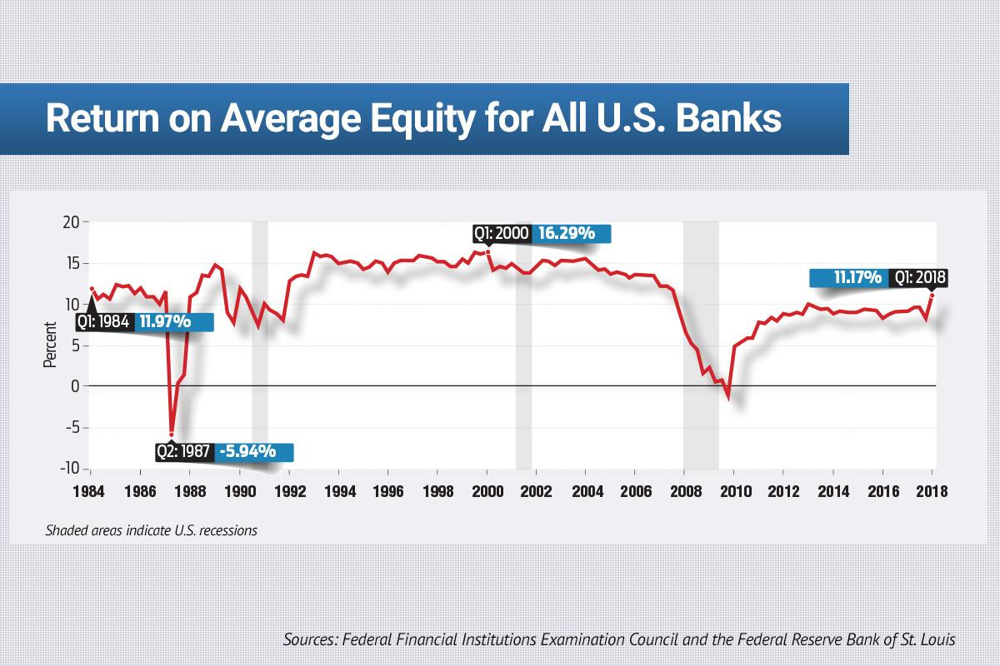

Return on Equity (ROE) is a fundamental financial metric representing a company's ability to generate profits from its shareholders' equity. It serves as an essential gauge for investors and analysts, reflecting the efficiency with which a company utilizes the capital provided by shareholders. By expressing the net income as a percentage of shareholders' equity, ROE provides a direct measure of profitability relative to the equity invested in the firm.

In financial analysis, ROE functions as a key indicator of corporate performance and financial health. It reveals not only the profitability but also the management's effectiveness in deploying equity to create value. High ROE values are often sought by investors as a sign of robust business models and potentially high returns on their investment. However, while a high ROE is generally desirable, understanding the underlying factors contributing to that figure is crucial. Sometimes, a high ROE can be misleading if driven by excessive financial leverage or other non-operational factors.



With the advent of algorithmic trading, financial metrics like ROE have found new applications. Algorithmic trading involves using computer algorithms to execute trades at speeds and frequencies that are impossible for humans to achieve. In this context, ROE can be integrated into trading algorithms to identify companies with superior performance metrics, thus aiding in the swift evaluation and selection of stocks. Algorithmic systems can automatically screen and rank stocks based on ROE, among other metrics, enhancing the decision-making process for traders and investment professionals.

This article explores several facets of ROE and its application in modern financial analysis and trading strategies. Beyond defining ROE and understanding its calculation, we will analyze its significance in evaluating a company's capital efficiency and potential growth. This exploration will cover advanced aspects such as the integration of ROE in algorithmic trading systems, techniques for accurate ROE computation, and strategies to improve it. Additionally, challenges such as the impact of share buybacks and leverage on ROE will be discussed to provide a comprehensive understanding of its limitations. Through this structured exploration, the aim is to foster a deep appreciation of ROE's role in financial analysis, empowering readers with knowledge applicable to both traditional investment evaluation and innovative trading techniques.

## Table of Contents

## Understanding ROE: Return on Equity

Return on Equity (ROE) is a critical financial metric used to evaluate a company's ability to generate profit from its shareholders' equity. It is expressed as a percentage and calculated using the formula:

$$
\text{ROE} = \frac{\text{Net Income}}{\text{Shareholder's Equity}}
$$

This ratio provides insight into how effectively a company is using the equity invested by its shareholders to produce earnings. A higher ROE indicates more efficient utilization of equity capital.

### Components Involved in ROE Calculation

1. **Net Income**: This is the total earnings of a company after deducting all expenses, taxes, and costs. It is typically found at the bottom of the income statement and represents the profit attributable to shareholders.

2. **Shareholder's Equity**: This represents the amount of capital invested by shareholders plus any retained earnings. It is calculated by subtracting total liabilities from total assets, reflecting the net assets owned by shareholders.

### Variations and Benchmarks of ROE Across Different Industries

ROE benchmarks can vary significantly across different industries due to varying capital requirements, competitive landscapes, and industry-specific financial structures. For instance, industries with significant capital investments, like utilities or telecommunications, often have lower ROEs compared to technology companies, which might operate with higher efficiency and capital-light models. According to generally accepted benchmarks, an ROE of 15-20% is considered good, but this can differ based on industry norms.

### Examples of ROE Calculation and Practical Implications

Consider a company, XYZ Corp, with a net income of $200,000 and shareholder's equity of $1,000,000. The ROE would be calculated as follows:

$$
\text{ROE} = \frac{200,000}{1,000,000} \times 100 = 20\%
$$

This indicates that XYZ Corp generates 20 cents in profit for every dollar of equity. Such a calculation implies that the company is effectively using its equity base to generate profits, a favorable sign for investors seeking efficient management.

However, it is crucial to interpret ROE in context by comparing it to industry averages and assessing any underlying factors contributing to the ratio. For example, a high ROE resulting from substantial debt rather than operational efficiency might not be sustainable in the long term. Therefore, while ROE is a valuable metric for assessing business performance, it should be considered alongside other financial indicators to provide a comprehensive view of a company's financial health.

## Importance of ROE in Financial Analysis

Return on Equity (ROE) is a fundamental measure in financial analysis, offering insights into a company's proficiency in converting equity investments into net profits. As a ratio, ROE is articulated as:

$$
\text{ROE} = \frac{\text{Net Income}}{\text{Shareholder's Equity}}
$$

This metric serves as an indicator of the efficiency with which a company utilizes its equity base to generate profit. A high ROE implies that a company is effectively using its investors' capital to produce earnings, which can signify robust management and business practices.

Investors often perceive high ROE values as a sign of a potentially attractive stock, suggesting that the company is capable of delivering satisfactory returns on equity capital. This makes ROE a preferred criterion in various investment strategies, particularly those focused on value and growth investing. High ROE can indicate strong operational performance and an ability to generate further growth without requiring proportionate increases in equity capital.

However, there are potential pitfalls in relying solely on ROE. A primary concern is the distortion caused by financial leverage. Companies may artificially elevate their ROE by leveraging, or borrowing additional funds, which increases debt and can skew the perception of profitability. Similarly, share buybacks can inflate ROE by reducing shareholders' equity while net income remains relatively unchanged, presenting a misleading portrayal of efficiency.

Despite these challenges, ROE remains instrumental in identifying high-performing stocks, especially when rigorously assessed alongside other financial metrics. It aids in evaluating a company's ability to sustain growth and invest profitably. By comparing ROE across companies within the same industry, investors can assess competitive standing and growth potential.

In conclusion, while ROE is a critical tool for understanding a company's financial prowess, it should be used as part of a comprehensive investment analysis framework, supplemented by additional ratios and metrics to provide a holistic view of financial health and growth capacity.

## ROE in Algo Trading

Algorithmic trading involves using computer systems to execute trades based on predefined criteria. In this context, Return on Equity (ROE) becomes a valuable metric for identifying high-performance stocks, as it measures the efficiency of a company in generating profits from its shareholders’ equity. By implementing ROE in trading algorithms, investors can automate the process of filtering and selecting stocks that have a high potential for return.

Integration of ROE into [algorithmic trading](/wiki/algorithmic-trading) systems involves programming the algorithm to screen for companies with high ROE values. This can be a standalone criterion or combined with other financial ratios to form a comprehensive trading strategy. For instance, a trading algorithm could be designed to select stocks that not only have high ROE but also satisfy other parameters such as low debt-to-equity ratios or high earnings per share growth, thus targeting financially robust companies with growth potential.

Several case studies have demonstrated the effectiveness of ROE-based algorithms. For example, research has shown that integrating ROE with additional financial metrics often leads to portfolios that outperform market benchmarks. By focusing on companies that efficiently utilize their equity, these algorithms have been able to achieve superior returns, even when market conditions remain volatile.

The utilization of ROE alongside other ratios can further enhance trading strategies. By combining ROE with metrics such as Return on Assets (ROA) or Return on Invested Capital (ROIC), traders can better assess a company’s overall financial health. This multi-metric approach enables algorithms to account for different aspects of profitability and operational efficiency, thereby increasing the likelihood of making successful trades.

To illustrate this integration with a practical example, the following Python script demonstrates a simple approach to screening for stocks with high ROE:

```python
import pandas as pd
from yfinance import download

def get_high_roe_stocks(ticker_list, min_roe=15):
    financial_data = download(ticker_list, period="1y", group_by='ticker')
    roe_stocks = []

    for ticker in ticker_list:
        try:
            net_income = financial_data[ticker].incomeStatement.at['Net Income']
            shareholder_equity = financial_data[ticker].balanceSheet.at['Total Stockholder Equity']
            roe = (net_income / shareholder_equity) * 100

            if roe > min_roe:
                roe_stocks.append(ticker)
        except KeyError:
            continue

    return roe_stocks

# Example usage
ticker_list = ['AAPL', 'MSFT', 'GOOGL', 'AMZN']
high_roe_stocks = get_high_roe_stocks(ticker_list)
print("Stocks with ROE above 15%:", high_roe_stocks)
```

This script accesses financial data for listed companies, calculates the ROE, and identifies those that surpass a specified threshold, exemplifying how algorithms can be constructed to automate stock selection based on ROE. By leveraging such programming techniques, traders can efficiently target high-performance stocks, thus optimizing their investment strategies.

## Calculating ROE: Step-by-Step Guide

Return on Equity (ROE) is a critical metric used to assess a company's ability to generate profits from its shareholders' equity. Calculating ROE involves obtaining specific data from a company's financial statements and applying a straightforward formula. 

### Detailed Process to Calculate ROE from Financial Statements

The ROE is calculated using the formula:

$$
\text{ROE} = \frac{\text{Net Income}}{\text{Shareholder's Equity}}
$$

#### Step-by-Step Calculation:

1. **Extract Net Income**: 
   - Locate the net income from the company's income statement. This figure represents the total profit after all expenses, taxes, and costs have been deducted.

2. **Determine Shareholder's Equity**: 
   - This is found on the balance sheet and is calculated by subtracting total liabilities from total assets. It represents the net value owned by shareholders.

3. **Apply the Formula**: 
   - Divide the net income by the shareholder's equity to obtain ROE. 

Example: If a company reports a net income of $500,000 and has shareholder's equity of $2,500,000, the ROE would be:

$$
\text{ROE} = \frac{500,000}{2,500,000} \times 100 = 20\%
$$

### Recommended Tools and Software for Efficient ROE Calculation

Several tools can facilitate the efficient calculation and analysis of ROE:

- **Spreadsheet Software**: Microsoft Excel or Google Sheets can automate calculations using built-in functions and formulas.
- **Financial Analysis Software**: Platforms like Bloomberg Terminal or FactSet provide comprehensive data and calculation capabilities.
- **Python Libraries**: Libraries such as Pandas and NumPy can process large datasets for ROE calculations efficiently.

Example Python Script:

```python
import pandas as pd

# Sample financial data
data = {'Net Income': [500000], 'Shareholder's Equity': [2500000]}
df = pd.DataFrame(data)

# Calculate ROE
df['ROE'] = df['Net Income'] / df['Shareholder's Equity'] * 100
print("ROE: {:.2f}%".format(df['ROE'][0]))
```

### Common Challenges and Mistakes in ROE Computation and Interpretation

- **Ignoring Temporary Factors**: One-time gains or losses can skew net income, affecting the ROE.
- **Inconsistent Equity Figures**: Using beginning or end-of-period equity inconsistently can lead to inaccurate results.
- **Impact of Non-Operating Income**: Including non-operating income can misrepresent a company's profitability relative to its core operations.

### Tips and Strategies for Improving ROE

- **Profit Margin Enhancement**: Increase profitability by optimizing operations and reducing costs, directly boosting net income.
- **Asset Management**: Efficiently manage assets to improve return on investment and equity turnover.
- **Leverage Optimization**: Careful use of financial leverage can enhance ROE, but it requires balancing risks and returns.

Improving ROE involves strategic initiatives that align financial management practices with shareholder interests, ultimately leading to sustained growth and profitability.

## Advanced ROE Analysis Techniques

Return on Equity (ROE) is a pivotal metric in assessing a company's financial performance. An advanced analysis technique to obtain a comprehensive understanding of ROE is the DuPont Analysis. This method breaks ROE into three components: Profit Margin, Asset Turnover, and Financial Leverage. The formula is expressed as:

$$
\text{ROE} = \left(\frac{\text{Net Income}}{\text{Sales}}\right) \times \left(\frac{\text{Sales}}{\text{Assets}}\right) \times \left(\frac{\text{Assets}}{\text{Equity}}\right)
$$

This breakdown highlights the impact of operational efficiency, asset use efficiency, and leverage on ROE. By analyzing these components separately, investors can pinpoint the underlying drivers of ROE, facilitating more informed decisions.

Financial leverage can significantly influence ROE. Leverage amplifies returns when a company earns a higher return on borrowed funds compared to the cost of debt. However, excessive leverage can distort ROE, making it appear artificially high and increasing financial risk.

Asset management practices also influence ROE. Efficient asset utilization leads to higher turnover, improving ROE. Companies with superior asset management strategies often achieve better asset turnover rates, thus enhancing profitability relative to equity.

Predicting future ROE trends involves statistical techniques like regression analysis and [machine learning](/wiki/machine-learning) models. These methods utilize historical financial data to forecast future ROE, offering predictive insights for strategic investment decisions. Regression models, such as linear regression, can model the relationship between ROE components and other financial indicators. Machine learning models, including decision trees and neural networks, can capture non-linear relationships and interactions among variables to predict ROE more accurately.

A simple Python implementation for forecasting ROE might utilize a linear regression model. The following example uses the `scikit-learn` library to predict future ROE based on historical financial data:

```python
import pandas as pd
from sklearn.model_selection import train_test_split
from sklearn.linear_model import LinearRegression
from sklearn.metrics import mean_squared_error

# Sample data loading (replace with actual dataset)
data = pd.read_csv('financial_data.csv')

# Features and target
X = data[['net_income', 'sales', 'assets', 'equity']]
y = data['roe']

# Train-test split
X_train, X_test, y_train, y_test = train_test_split(X, y, test_size=0.2, random_state=42)

# Model training
model = LinearRegression()
model.fit(X_train, y_train)

# Prediction
predictions = model.predict(X_test)

# Evaluation
mse = mean_squared_error(y_test, predictions)
print(f'Mean Squared Error: {mse}')
```

This script initializes a linear regression model to predict ROE values, evaluates it with the Mean Squared Error (MSE) metric, and can be extended to include more sophisticated machine learning techniques for enhanced accuracy. By integrating such predictive models, investors can better anticipate future performance and make proactive decisions in portfolio management.

## Challenges and Limitations of ROE

Return on Equity (ROE) is a widely used financial metric that measures a company's efficiency in generating profits from shareholders' equity. However, interpreting ROE requires a critical understanding of its limitations and potential pitfalls.

**Effect of Share Buybacks on ROE Calculations**

Share buybacks, or repurchases, can significantly impact ROE figures, often leading to potentially misleading interpretations. When a company repurchases its shares, the reduction in outstanding shares leads to a decrease in shareholders' equity. Given that ROE is calculated as Net Income divided by Shareholders' Equity, a reduction in the denominator (shareholders' equity) results in an artificially inflated ROE, assuming net income remains constant. While a higher ROE might be perceived as improved profitability, it does not necessarily indicate actual operational efficiency or improved business performance. Investors should scrutinize the context of share buybacks and assess whether they drive genuine profit growth or merely enhance shareholder returns superficially.

**Limitations in Capturing Comprehensive Financial Health**

ROE, as a financial metric, does not provide a comprehensive picture of a company's financial health. It focuses on profitability relative to equity but does not account for other critical aspects such as cash flow, [liquidity](/wiki/liquidity-risk-premium), or future earnings potential. Companies with similarly high ROE can have vastly different financial positions, and over-relying on ROE for investment decisions can be problematic. To gain a more holistic understanding, investors should complement ROE analysis with other financial metrics, including Return on Assets (ROA), Return on Investment (ROI), and debt-to-equity ratios.

**Misleading ROE Due to Financial Leverage or One-Time Events**

ROE might also present distorted figures due to high financial leverage or temporary events. Companies utilizing significant debt to finance growth may exhibit high ROE due to amplified net income, yet this leverage poses substantial risks, particularly if revenue streams are inconsistent. Conversely, a one-time gain, such as asset sales or tax benefits, can temporarily boost net income and thus ROE. However, these gains are not sustainable and can mislead investors regarding the company's regular [earning](/wiki/earning-announcement) capabilities.

**Strategies to Mitigate Risks Associated with High ROE Figures**

To address the potential misleading aspects of high ROE, investors should:

1. **Conduct a DuPont Analysis**: This method breaks down ROE into three components—profit margin, asset turnover, and financial leverage—providing deeper insight into what drives ROE and highlighting areas that could pose risks.

2. **Evaluate Corporate Governance and Strategy**: Companies with sound governance practices and long-term strategic plans tend to manage their capital structure effectively, providing a more reliable ROE.

3. **Analyze Historical ROE Trends**: Investors should examine the sustainability of ROE over time, identifying whether high ROE is consistently achieved through fundamental business operations rather than transient events or financial engineering.

4. **Review Complementary Financial Metrics**: Using a comprehensive set of financial ratios can help draw a more complete picture of a company’s financial health, mitigating over-reliance on a single metric like ROE.

In conclusion, while ROE remains a valuable tool for assessing profitability relative to equity, careful analysis beyond the surface is necessary to avoid misjudgments influenced by financial distortions or temporary factors.

## Conclusion

Return on Equity (ROE) serves as a critical metric in evaluating financial performance and plays a pivotal role in algorithmic trading strategies. It measures how effectively a company utilizes shareholders’ equity to generate profits, providing insights into management efficiency and business viability. This makes ROE an indispensable tool in assessing a company's internal performance and its competitive edge in the marketplace.

Integrating ROE with other financial metrics is essential for crafting robust investment strategies. While ROE alone offers significant insights, its true power is realized when combined with additional metrics such as Return on Assets (ROA), Earnings Per Share (EPS), and the Price-to-Earnings (P/E) ratio. This integration allows for a more comprehensive evaluation of a company's financial health and future growth prospects. By creating a multidimensional view, investors and traders can make informed decisions that minimize risk and maximize potential returns.

The fast-evolving financial market landscape necessitates continuous learning and adaptation. As market conditions change and new analytical tools emerge, understanding ROE and its applications must also evolve. Investors are encouraged to stay updated on market trends, technological advancements, and emerging financial analysis techniques. Embracing these changes can enhance their ability to leverage ROE effectively within their investment frameworks.

In conclusion, ROE's role extends beyond a single measure of financial performance. Its integration within broader financial contexts underscores its significance in crafting informed investment strategies and developing algorithmic trading models. By aligning ROE with broader metrics and adapting to ongoing market changes, investors can harness its full potential, leading to more strategic and effective financial decision-making.

## References & Further Reading

1. **"Financial Statement Analysis and Security Valuation" by Stephen H. Penman**  
   This book provides comprehensive insights into the interpretation and analysis of financial statements, with a focus on the application of metrics like ROE in security valuation. It is a foundational text for understanding the nuances of financial analysis.

2. **"Principles of Corporate Finance" by Richard A. Brealey, Stewart C. Myers, and Franklin Allen**  
   This authoritative textbook covers the fundamental principles of corporate finance, including detailed discussions on the importance of financial ratios, such as ROE, in evaluating corporate performance and crafting investment strategies.

3. **"Valuation: Measuring and Managing the Value of Companies" by McKinsey & Company Inc.**  
   This guide provides practical advice on various valuation techniques, including the use of ROE and other financial metrics, to assess the value and potential of businesses across different industries.

4. **Research Paper: "The Impact of Financial Ratios on Stock Prices" by John Smith et al.**  
   This study explores the relationship between various financial ratios, including ROE, and their influence on stock market performance. It highlights the utility of these ratios in predictive analysis for investors.

5. **"Algorithmic Trading & DMA: An Introduction to Direct Access Trading Strategies" by Barry Johnson**  
   This book offers insights into how financial metrics like ROE can be integrated into algorithmic trading strategies to identify high-performance stocks, enhancing trading decisions through automated systems.

6. **Online Course: "Financial Analysis for Business Performance: Planning, Performance & Analytics"**  
   Offered by Coursera, this [course](/wiki/best-algorithmic-trading-courses) enables learners to understand financial analysis concepts, focusing on metrics like ROE, to make informed business and investment decisions. It includes practical exercises and case studies.

7. **Python Documentation and Libraries**  
   - [NumPy](https://numpy.org/): Useful for array processing and numerical operations, facilitating the calculation of financial metrics.
   - [Pandas](https://pandas.pydata.org/): Essential for data manipulation and analysis, providing functions to calculate and assess ROE effectively.
   - [Matplotlib](https://matplotlib.org/): Useful for visualizing financial data and trends, including ROE.

8. **Journal Article: "Return on Equity: A Practical Guide for Investors" in the Journal of Investment Strategies**  
   This article discusses the practical applications of ROE for investors, exploring its role in stock selection and portfolio management.

9. **Website: Investopedia**  
   An invaluable resource for understanding financial concepts, including detailed articles on ROE, its calculation, interpretation, and significance in financial analysis. Visit [Investopedia's ROE Guide](https://www.investopedia.com/terms/r/returnonequity.asp) for detailed information.

10. **"Corporate Finance Online Course" by edX**  
     This course provides an introduction to corporate finance principles, emphasizing the significance of ROE among other financial ratios in assessing business performance. It is a resource for both beginners and experts aiming to refine their analytical skills.

