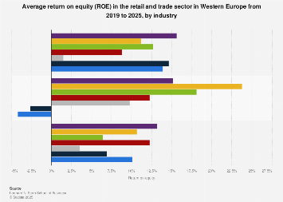

## Table of Contents

## What is Return on Equity (ROE)?

Return on Equity (ROE) is a financial ratio that shows how well a company is using the money invested by its shareholders to generate profit. It is calculated by dividing the company's net income by the shareholders' equity. This ratio is expressed as a percentage and helps investors understand how efficiently their capital is being used.

ROE is important because it gives investors an idea of how well a company is performing compared to others in the same industry. A higher ROE indicates that the company is more effective at turning shareholder investments into profits. However, it's also important to look at other factors like debt levels and industry standards, as a high ROE alone doesn't guarantee a good investment.

## Why is ROE important in the retail sector?

ROE is important in the retail sector because it shows how well a retail company is using the money from its shareholders to make profits. In retail, where competition is high and margins can be low, it's crucial for companies to use their resources wisely. A high ROE means the company is good at turning the money it gets from shareholders into more money through sales and profits.

Retail companies often need a lot of money to buy inventory, run stores, and keep up with technology. ROE helps investors see if the company is doing a good job with this money. If a retail company has a high ROE, it might mean they are managing their stores well, choosing the right products to sell, and keeping costs down. This makes ROE a useful tool for investors to compare different retail companies and decide where to put their money.

## How is ROE calculated?

Return on Equity, or ROE, is a way to see how good a company is at making money from the cash its owners put in. To figure out ROE, you take the company's net income, which is how much money they made after paying all their bills, and divide it by the shareholders' equity. Shareholders' equity is what's left if you take away all the company's debts from what it owns. Then, you turn this number into a percentage by multiplying by 100.

For example, if a company made $1 million in net income and had $10 million in shareholders' equity, you would divide $1 million by $10 million to get 0.1. Multiply that by 100, and you find the ROE is 10%. This means the company made 10 cents of profit for every dollar the shareholders invested. It's a simple way to check if a company is doing a good job with the money it gets from its owners.

## What is considered a good ROE in the retail industry?

In the retail industry, a good ROE is usually around 15% to 20%. This means that for every dollar shareholders put into the company, it makes 15 to 20 cents in profit. Retail can be tough because there are a lot of stores competing for customers, and the profit from selling things can be small. So, if a retail company can get an ROE in this range, it's doing a pretty good job at using the money from its owners to make more money.

But, what's considered good can change depending on the specific part of retail a company is in. For example, luxury goods might have a higher ROE than discount stores because they can charge more for their products. Also, it's smart to compare a company's ROE with other companies in the same type of retail to see if it's doing better or worse than its competition.

## How does the average ROE in retail compare to other sectors?

The average ROE in the retail sector is generally lower than in some other sectors because retail often works with small profit margins. Retail companies have to spend a lot on things like inventory, store leases, and employees, which can eat into their profits. So, an ROE of around 15% to 20% is considered good in retail, but this might be seen as average or even low in other sectors like technology or finance, where companies can have ROEs of 20% to 30% or even higher.

In the technology sector, for example, companies can have high ROEs because they can make a lot of money from software or digital services without needing to spend as much on physical stuff. Financial companies like banks can also have high ROEs because they make money from interest on loans and investments. So, while a 15% to 20% ROE might be good in retail, in other sectors, investors might expect higher returns because the nature of the business allows for it.

## What factors influence ROE in the retail sector?

In the retail sector, ROE is influenced by how well a company manages its money and operations. Retail companies need to buy a lot of products to sell, and if they buy the right things at good prices, they can sell them for more and make a bigger profit. They also have to pay for stores, employees, and other costs. If they can keep these costs low while selling a lot of products, their profit goes up, and so does their ROE. Using technology to keep track of what customers want and to make shopping easier can also help increase sales and profits.

Another big factor is how well a company uses the money it gets from its owners. If a retail company can grow and make more money without needing a lot more cash from shareholders, its ROE will be higher. For example, if a company can open new stores or start selling online without borrowing a lot of money or selling more shares, it keeps its equity the same while increasing its profits. Competition also plays a role because if there are a lot of other stores selling similar things, it can be harder to make a big profit, which affects ROE.

## How has the average ROE in the retail sector changed over the past decade?

Over the past decade, the average ROE in the retail sector has seen some ups and downs. At the start of the decade, many retail companies were doing okay, with ROEs around 15% to 20%. But then, things got tougher. More people started shopping online, and big companies like Amazon grew a lot. This made it harder for traditional retail stores to make as much money as before. So, the average ROE started to go down a bit, sometimes dipping below 15%.

In the last few years, the retail sector has been trying to catch up. Many stores have started selling things online too, and they've been working on making their stores nicer places to shop. Some companies have done better than others, and the average ROE has started to climb back up a little. But it's still not as high as it was at the beginning of the decade. Overall, the average ROE in retail has been around 10% to 15% in recent years, showing that it's still a tough business but with some signs of getting better.

## Can you provide examples of retail companies with high and low ROE?

A good example of a retail company with a high ROE is TJX Companies, the company that owns stores like TJ Maxx and Marshalls. TJX has done a great job at buying products at low prices and selling them for more, which has helped them make a lot of profit. Their ROE has been around 50% to 60% in recent years, which is much higher than the average for retail. This shows that TJX is very good at using the money from its owners to make more money.

On the other hand, a retail company with a lower ROE is Macy's. Macy's has been struggling because more people are shopping online instead of going to big department stores. Their ROE has been around 5% to 10% in recent years, which is lower than the average for retail. This means Macy's is not as good at turning the money from its owners into profit, showing that they have a harder time making money in the current retail environment.

## How do different retail sub-sectors (e.g., apparel, electronics) compare in terms of ROE?

Different retail sub-sectors can have very different ROEs because they sell different things and have different ways of making money. For example, the apparel sub-sector, which includes clothing stores, often has a lower ROE. This is because clothes have to be sold at a discount if they don't sell quickly, and there are a lot of other stores selling similar things. So, apparel companies like Gap or H&M might have ROEs around 10% to 15%. They have to work hard to keep their costs down and find new ways to attract customers to make a good profit.

On the other hand, the electronics sub-sector, which includes stores selling things like TVs and computers, can have higher ROEs. Electronics can be sold for more money, and companies like Best Buy have been good at selling them online and in stores. This has helped them get ROEs around 20% to 30%. Electronics companies have to keep up with new technology and make sure they have the newest products, but if they do it right, they can make a lot more profit than apparel stores.

## What strategies can retail companies employ to improve their ROE?

Retail companies can improve their ROE by focusing on selling more products and keeping their costs down. One way to do this is by choosing the right things to sell. If a store can buy products at a low price and sell them for a higher price, it can make a bigger profit. Also, using technology to keep track of what customers want and making shopping easier can help sell more stuff. For example, having a good website where people can buy things online can bring in more customers and increase sales. Another way is to make the stores nicer places to shop, so people want to come back and buy more.

Another strategy is to manage the money from shareholders better. If a retail company can grow without needing a lot more money from its owners, it can keep its equity the same while making more profit. This means opening new stores or starting to sell online without borrowing a lot of money or selling more shares. Keeping costs low is also important. If a company can pay less for things like rent, employees, and inventory, it can make more money from each sale. By doing these things, a retail company can improve its ROE and show that it's good at using the money from its owners to make more money.

## How does debt impact ROE in retail businesses?

Debt can change a retail company's ROE in big ways. When a company borrows money, it has to pay it back with interest. If the company uses the borrowed money to make more profit than the cost of the interest, it can make its ROE go up. For example, if a retail store borrows money to open new stores and those stores make a lot of money, the company can end up with a higher ROE. But if the company can't make enough money to pay back the debt and the interest, its profits go down, and so does its ROE.

Debt also changes how much money a company has from its owners. When a company borrows money, its total equity doesn't change right away, but its profits might go up or down because of the debt. If the company makes more money with the borrowed cash, the ROE goes up because the profit is divided by the same amount of equity. But if the company can't make enough money to cover the debt, the profits drop, and when you divide a smaller profit by the same equity, the ROE goes down. So, using debt can be a good way to grow and improve ROE, but it's risky if the company can't make the extra money it needs.

## What are the limitations of using ROE as a performance metric in the retail sector?

ROE is a helpful way to see how well a retail company is using the money from its owners to make profits, but it has some limits. One big problem is that ROE doesn't tell the whole story about how a company is doing. For example, a company might have a high ROE because it's using a lot of debt to make more money. But if it can't pay back that debt, the company could be in trouble even if the ROE looks good. Also, ROE doesn't show if a company is growing or if it's just making the same amount of money every year.

Another limit of ROE is that it can be different in different parts of the retail world. A clothing store might have a lower ROE than an electronics store because the profit from selling clothes is usually smaller. So, comparing ROEs from different types of retail stores might not be fair. Also, ROE doesn't tell you about other important things like how happy customers are or how well a company is doing with new technology. These things can be just as important for a retail company's success but won't show up in the ROE number.

## What is Return on Equity (ROE) and how can it be understood?

Return on Equity (ROE) is a vital financial metric used to assess the profitability and efficiency of a company's use of its equity base. It is calculated by dividing the company's net income by its shareholders' equity, as expressed in the formula:

$$

\text{ROE} = \frac{\text{Net Income}}{\text{Shareholders' Equity}} 
$$

This ratio provides insight into how effectively a company is converting the capital invested by its shareholders into net income. Essentially, it reflects the ability of the management to generate earnings from the equity financing it has received.

A higher ROE value is generally indicative of a company that is using its equity effectively to generate profits. This efficiency in capital utilization means that the company can produce a higher return for every dollar of equity it holds. Consequently, this makes ROE a useful tool for investors looking to compare the financial performance of companies within the same industry. By analyzing ROE, investors can identify firms that leverage their equity more adeptly to achieve better financial outcomes.

For instance, if two companies operate within the same industry, the one with the higher ROE is generally seen as more efficient in generating profits relative to its equity. This efficiency is often a result of streamlined operations, superior management strategies, or advantageous market positions that allow the company to outperform its peers. Therefore, ROE is not just a measure of past performance, but also a diagnostic tool that can help project future profitability and guide investment decisions.

## References & Further Reading

[1]: McKinsey & Company. (2020). ["The future of work in retail: Winning amid disruption."](https://www.mckinsey.com/featured-insights/future-of-work)

[2]: Return on Equity (ROE) - Corporate Finance Institute. ["Accessing the Return on Equity for Investment Evaluation."](https://corporatefinanceinstitute.com/resources/accounting/what-is-return-on-equity-roe/)

[3]: Agapova, A., & McNenly, L. (2015). ["The Role of ROE in the Evaluation of Retail Financial Performance"](https://papers.ssrn.com/sol3/cf_dev/AbsByAuth.cfm?per_id=595042). Journal of Corporate Finance.

[4]: Zook, C., & Allen, J. (2016). ["The Founder’s Mentality: How to Overcome the Predictable Crises of Growth"](https://archive.org/details/foundersmentalit0000zook) - Harvard Business Review Press.

[5]: Chande, T. (2019). ["Beyond Technical Analysis: How to Develop and Implement a Winning Trading System,"](https://www.amazon.com/Beyond-Technical-Analysis-Develop-Implement/dp/0471415677) 2nd Edition.

[6]: "Algorithmic Trading Analysis." Algorithmic Trading & DMA: An Introduction to Direct Access Trading Strategies. ["Exploring Trading Models and Market Mechanics."](https://admarkon.medium.com/data-science-techniques-in-algorithmic-trading-an-in-depth-analysis-eb54392506ca)