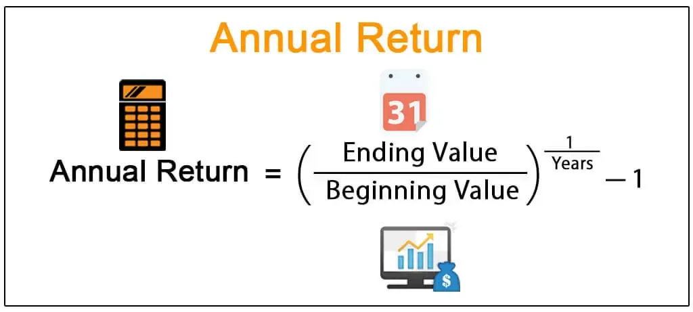

The retail sector is a multifaceted industry that encompasses a wide range of segments, including automotive, grocery, online retail, apparel, and specialty stores. Each segment has its unique attributes and challenges, contributing to the sector's dynamic nature. A critical metric for assessing the financial performance of companies within this sector is Return on Equity (ROE). ROE is calculated as:

$$
\text{ROE} = \frac{\text{Net Income}}{\text{Shareholders' Equity}}
$$



This metric provides insights into how efficiently a company can generate profits from its shareholders' equity. A higher ROE signifies that a company is effectively utilizing its equity base to produce earnings, which is particularly valuable when comparing companies within the same industry.

This article endeavors to analyze the average ROE within the retail sector, discerning variations across its different sub-sectors. Retail segments such as automotive and grocery differ in terms of operational structure and market dynamics, influencing their respective ROEs. Understanding these differences is crucial for investors seeking to evaluate the financial health and performance potential of companies in the sector.

Moreover, the article will explore the growing influence of algorithmic trading in the investment landscape of retail stocks. Algorithmic trading leverages advanced computer algorithms to execute trades based on specific criteria, allowing traders to exploit market inefficiencies and patterns identified through metrics like ROE. By integrating detailed financial metrics with sophisticated trading strategies, algorithmic trading provides a competitive edge, potentially enhancing investment outcomes.

Our aim is to elucidate why ROE remains a pivotal metric for investors and to demonstrate how algorithmic trading can significantly optimize investment strategies by capitalizing on insights derived from ROE analyses.

## Table of Contents

## Understanding Return on Equity (ROE)

Return on Equity (ROE) is a vital financial metric used to assess the profitability and efficiency of a company's use of its equity base. It is calculated by dividing the company's net income by its shareholders' equity, as expressed in the formula:

$$

\text{ROE} = \frac{\text{Net Income}}{\text{Shareholders' Equity}} 
$$

This ratio provides insight into how effectively a company is converting the capital invested by its shareholders into net income. Essentially, it reflects the ability of the management to generate earnings from the equity financing it has received.

A higher ROE value is generally indicative of a company that is using its equity effectively to generate profits. This efficiency in capital utilization means that the company can produce a higher return for every dollar of equity it holds. Consequently, this makes ROE a useful tool for investors looking to compare the financial performance of companies within the same industry. By analyzing ROE, investors can identify firms that leverage their equity more adeptly to achieve better financial outcomes.

For instance, if two companies operate within the same industry, the one with the higher ROE is generally seen as more efficient in generating profits relative to its equity. This efficiency is often a result of streamlined operations, superior management strategies, or advantageous market positions that allow the company to outperform its peers. Therefore, ROE is not just a measure of past performance, but also a diagnostic tool that can help project future profitability and guide investment decisions.

## Average ROE in the Retail Sector

The retail sector encompasses a range of sub-sectors, each presenting its own distinctive financial characteristics. A critical measure used to evaluate the financial performance within this industry is the Return on Equity (ROE). This indicator illustrates how effectively a company utilizes its shareholders' equity to generate profits. The ROE across the retail sector is not uniform, reflecting the diverse nature of its sub-sectors.

Historically, the average ROE for the retail sector is approximately 26%. This figure, however, represents an aggregate view and masks the variations that exist among different retail segments. For example, automotive retail generally achieves higher ROEs, attributed to its capital-intensive operations that lead to significant profit margins once substantial initial investments are accounted for. This sector's capital intensity allows companies to leverage investments, thus raising their ROE.

Other retail sub-sectors, such as grocery stores and specialty lines, showcase different ROE values. Grocery stores typically operate with lower margins, as they face intense competition and price sensitivity. Consequently, their ROE may be lower compared to more specialized retail avenues. Specialty retailers, on the other hand, often achieve higher ROEs due to their ability to command premium prices for niche products, resulting in higher profit margins.

Several factors influence these ROE differences, including market competition, operational efficiency, and scale of operations. Companies in highly competitive markets may struggle to maintain high ROEs, as competitive pricing can impact margins. Conversely, firms that achieve operational efficiencies through cost management or optimized supply chains may enjoy higher ROEs due to reduced overhead costs.

In summary, while the retail sector's average ROE hovers around 26%, it is essential for investors to consider the nuanced ROE variations across different retail sub-sectors. Understanding these distinctions allows for more informed investment decisions, particularly when comparing companies' financial metrics within the broader retail landscape.

## Algorithmic Trading in the Retail Sector

Algorithmic trading, or algo trading, refers to the use of computer algorithms to execute trades based on predefined rules. These algorithms are designed to efficiently and accurately process large volumes of market data, identifying trading opportunities that may be difficult for human traders to spot. In the retail sector, algo trading can be a powerful tool for exploiting price inefficiencies and patterns manifested through Return on Equity (ROE) metrics.

The application of [algorithmic trading](/wiki/algorithmic-trading) in the retail sector revolves around the ability to analyze historical ROE data and peer comparisons to identify stocks that are mispriced or have the potential for higher returns. For example, if a retail company's ROE suddenly deviates from its long-term average or from the average of its peers, this might signal either an overvaluation or undervaluation, prompting a trade.

A typical algorithm designed for trading based on ROE metrics might include conditions such as:

1. **ROE Deviation:** Monitor a company's ROE against its historical norms. If the ROE exceeds a certain threshold above or below this norm, the algorithm could trigger a buy or sell order. This threshold can be predetermined based on historical ROE volatility or sector benchmarks.

2. **Peer Comparison:** Compare the ROE of a company to the average ROE of its closest competitors. A significant deviation might suggest an emerging trend or anomaly within the company, warranting further investigation and potential trade actions.

3. **Pattern Recognition:** Utilize machine learning techniques to detect patterns associated with ROE changes, such as recurring seasonal increases in ROE for certain retail segments. If a pattern is detected, this can inform future trading strategies.

The execution of such strategies is often carried out using programming languages such as Python, given its extensive libraries for data analysis and [machine learning](/wiki/machine-learning). A basic example of an algorithm designed to monitor and trade based on ROE might look like this:

```python
import pandas as pd
import numpy as np

# Load historical ROE data
roe_data = pd.read_csv('roe_historical_data.csv')

# Function to identify deviation from historical average
def identify_deviation(row, threshold=0.05):
    historical_avg = roe_data[roe_data['company'] == row['company']]['roe'].mean()
    if abs((row['roe'] - historical_avg) / historical_avg) > threshold:
        return True
    return False

# Apply the function to identify trading opportunities
roe_data['trade_signal'] = roe_data.apply(identify_deviation, axis=1)

# Filter data to show trade signals
trade_opportunities = roe_data[roe_data['trade_signal'] == True]

print(trade_opportunities)
```

Algorithmic trading tailored around ROE metrics provides investors with quantitative tools to make objective, data-driven trading decisions in the retail sector. By leveraging algo trading strategies, investors can enhance their trading efficiency and potentially achieve superior returns based on strategic insights derived from ROE fluctuations.

## Case Studies: High ROE Retail Companies

Analyzing retail companies with high Return on Equity (ROE) offers valuable insights into their successful business strategies and operational efficiencies. Two notable examples in this context are Walmart and Macy's, both of which have demonstrated significant ROE through various strategic initiatives.

Walmart, a leader in the retail sector, achieves a high ROE by leveraging its scale. The company's vast network of global operations allows it to benefit from economies of scale, reducing costs per unit as production increases. This efficiency is further enhanced by Walmart's sophisticated supply chain management, which ensures low inventory costs and minimizes waste. Additionally, Walmart's investment in technology and data analytics has optimized its stock management and pricing strategies, thereby improving profitability. Such operational efficiencies directly contribute to Walmart's ROE, as they enhance profit margins while using equity which is consistently reinvested in the business for expansion and technological upgrades.

Macy's, on the other hand, demonstrates a high ROE through a differentiated strategy. The company focuses on creating a distinct customer experience through diverse product offerings and personalized services. Macy's has invested in digital transformation to integrate its online and physical stores, optimizing the customer journey and boosting sales. This strategic focus on omnichannel retailing has resulted in increased sales per store and higher inventory turnover rates. Furthermore, Macy's strategic management of shareholder equity, through measures like share buybacks, reduces the equity base and effectively enhances the ROE.

For algorithmic trading models, the success of Walmart and Macy's can serve as a benchmark. Algo trading can incorporate these insights by developing algorithms that identify retail stocks exhibiting similar operational efficiencies or strategic initiatives. For example, a Python-based algorithm could analyze trends in inventory turnover rates and digital integration efforts, comparing these metrics against historical data to predict stock performance.

```python
import yfinance as yf  # For more datasets, visit: https://paperswithbacktest.com/datasets
import pandas as pd

# Define function to calculate ROE
def calculate_roe(stock):
    data = yf.Ticker(stock)
    financials = data.financials
    balance_sheet = data.balance_sheet

    net_income = financials.loc['Net Income'][-1]
    total_equity = balance_sheet.loc['Total Stockholder Equity'][-1]

    roe = net_income / total_equity
    return roe

# Example usage
walmart_roe = calculate_roe('WMT')
macys_roe = calculate_roe('M')
print(f"Walmart ROE: {walmart_roe:.2%}")
print(f"Macy's ROE: {macys_roe:.2%}")
```

This script utilizes Yahoo Finance data to compute ROE, which traders might use to identify high-performing stocks by comparing them to successful benchmarks like Walmart and Macy's. By focusing on companies with similar strategic focuses and operational efficiencies, traders can better position themselves in the retail sector market.

## Conclusion

Return on Equity (ROE) plays an essential role in evaluating the performance and potential of investments within the retail sector. By quantifying how efficiently a company employs its shareholders' capital to generate profits, ROE serves as a critical metric for investors looking to identify financially robust enterprises. The calculation of ROE, expressed as $\text{ROE} = \frac{\text{Net Income}}{\text{Shareholders' Equity}}$, facilitates straightforward comparisons among different companies within the same industry, highlighting those that achieve superior profitability.

Understanding the average ROE in the retail sector provides investors with a foundational benchmark from which to assess individual companies. As retail is comprised of diverse sub-sectors with varying capital structures and market dynamics, knowing the average ROE allows for more informed investment decisions. For example, sectors such as automotive retail typically showcase higher average ROEs due to their capital-intensive nature. An awareness of these nuances enables investors to appreciate the relative performance of retail companies.

Algorithmic trading has emerged as a valuable tool for leveraging insights derived from ROE metrics. By employing sophisticated algorithms to analyze historical ROE data and identify deviations from established norms, traders can gain a competitive edge. These automated trading systems can be programmed to execute buy or sell orders when a company's ROE analysis suggests potential for above-average returns. The integration of algorithmic trading with ROE analysis empowers investors to capitalize on price inefficiencies and anticipated market movements, thereby enhancing the efficacy of trading strategies focused on the retail sector.

In conclusion, ROE is indispensable for investors assessing the viability and attractiveness of retail investments. It not only provides a measurable indicator of financial health and efficiency but also serves as a catalyst for advanced trading techniques such as algorithmic trading. By understanding and utilizing ROE, investors can make strategically informed decisions and potentially achieve superior returns in the complex landscape of retail stocks.

## References & Further Reading

[1]: McKinsey & Company. (2020). ["The future of work in retail: Winning amid disruption."](https://www.mckinsey.com/featured-insights/future-of-work)

[2]: Return on Equity (ROE) - Corporate Finance Institute. ["Accessing the Return on Equity for Investment Evaluation."](https://corporatefinanceinstitute.com/resources/accounting/what-is-return-on-equity-roe/)

[3]: Agapova, A., & McNenly, L. (2015). ["The Role of ROE in the Evaluation of Retail Financial Performance"](https://papers.ssrn.com/sol3/cf_dev/AbsByAuth.cfm?per_id=595042). Journal of Corporate Finance.

[4]: Zook, C., & Allen, J. (2016). ["The Founder’s Mentality: How to Overcome the Predictable Crises of Growth"](https://archive.org/details/foundersmentalit0000zook) - Harvard Business Review Press.

[5]: Chande, T. (2019). ["Beyond Technical Analysis: How to Develop and Implement a Winning Trading System,"](https://www.amazon.com/Beyond-Technical-Analysis-Develop-Implement/dp/0471415677) 2nd Edition.

[6]: "Algorithmic Trading Analysis." Algorithmic Trading & DMA: An Introduction to Direct Access Trading Strategies. ["Exploring Trading Models and Market Mechanics."](https://admarkon.medium.com/data-science-techniques-in-algorithmic-trading-an-in-depth-analysis-eb54392506ca)