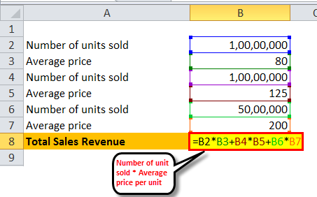

Average Revenue Per User (ARPU) is a fundamental financial metric that captures the average revenue generated per user or unit. It is widely used across various industries, providing a clear indicator of how much revenue each customer or user contributes to a company within a specific period. ARPU is calculated by dividing the total revenue by the number of users, typically expressed over a monthly or quarterly timeframe. This metric is particularly crucial for subscription-based businesses, telecommunications, internet services, and increasingly in financial services, where user engagement and monetization are key drivers of success.

In the technology and finance sectors, ARPU serves as a critical metric for assessing business performance and profitability. For technology firms, especially those offering software as a service (SaaS), ARPU helps in understanding the value derived from each customer and in strategizing on how to enhance user engagement and retention. In the financial industry, ARPU is crucial for measuring the economic return per client, particularly for services that depend on transactional or recurring revenues.

Algorithmic trading, a significant innovation in modern financial markets, refers to the use of computer algorithms to automate the process of trading financial instruments. These algorithms execute trades at speeds and frequencies that are impossible for human traders. Algorithmic trading is used extensively by institutional investors to optimize trading strategies and enhance market efficiencies. Its significance lies in improving liquidity, reducing transaction costs, and minimizing the impact of human emotions on trading decisions. As the financial markets continue to evolve with technology, the adoption of algorithmic trading strategies has grown, becoming an indispensable part of modern trading ecosystems.

The relationship between ARPU and algorithmic trading platforms is increasingly relevant as financial services shift towards digitization and automation. Algorithmic trading platforms, which often operate on subscription or fee-based models, depend heavily on ARPU to measure their financial health and investor value. The ARPU metric provides insights into the effectiveness of these platforms in generating revenue per user, helping businesses optimize their pricing strategies and user engagement.

Understanding and analyzing ARPU within algorithmic trading setups can reveal growth opportunities and operational efficiencies, providing a more focused direction for enhancing profitability. The evolution of financial technologies and the expansion of trading platforms emphasize the need for a robust understanding of ARPU as a tool for strategic decision-making in the competitive landscape of financial services.

## Table of Contents

## Understanding Average Revenue Per User (ARPU)

Average Revenue Per User (ARPU) is a key financial metric used to assess how much revenue a company generates from each user or customer on average. Calculating ARPU is straightforward and involves dividing the total revenue by the number of users or subscribers. The formula for ARPU is:

$$
\text{ARPU} = \frac{\text{Total Revenue}}{\text{Number of Users}}
$$

ARPU is crucial for measuring business performance as it provides insights into a company's ability to extract economic value from its user base. It helps companies assess the profitability derived from each user and allows them to monitor growth or decline trends over time. A rising ARPU indicates that a company is becoming more effective at generating revenue per user, which can signal successful monetization strategies or improvements in the pricing model.

Companies leverage ARPU to gauge profitability per user, which is vital for understanding the economic contribution of their customer base. This understanding helps in assessing whether the costs associated with acquiring and servicing users are justified by the revenue they generate. By analyzing ARPU, companies can make informed decisions about customer acquisition strategies, retention efforts, and product pricing.

ARPU is a critical metric across various industries. In telecommunications, for example, ARPU is used to evaluate the profitability of data and voice services offered to customers. In the tech sector, particularly for software-as-a-service (SaaS) companies, ARPU helps determine the success of subscription models by showing how much each subscriber contributes financially. Similarly, in media and entertainment, companies use ARPU to assess revenue generated from users consuming digital content, such as streaming services.

In strategic decision-making, ARPU plays a pivotal role by guiding companies in resource allocation, marketing strategies, and service enhancements. A thorough understanding of ARPU enables businesses to fine-tune their offerings to maximize revenue while maintaining customer satisfaction. For instance, if a company notices a decline in ARPU, it may opt to introduce new features, adjust pricing, or implement customer retention programs to bolster user engagement and increase profitability per user.

Overall, ARPU is an integral part of financial analysis and management, providing companies a clear picture of revenue generation efficiency per customer. This metric not only aids in evaluating current performance but also forms the basis for strategic planning and forecasting future revenue growth.

## Algorithmic Trading: An Overview

Algorithmic trading is a method of executing orders using automated pre-programmed trading instructions that account for variables such as time, price, and [volume](/wiki/volume-trading-strategy). This type of trading, also known as algo trading, is pivotal in financial markets as it allows for executing complex strategies with speed and accuracy unattainable by human traders. Algorithmic trading systems essentially rely on a set of rules, guidelines, and strategies encoded in computer programs to conduct large volumes of trades.

For both retail and institutional investors, the advantages of [algorithmic trading](/wiki/algorithmic-trading) are significant. Retail investors can access advanced trading strategies that can help level the playing field against larger institutional investors. For institutional investors, algorithms provide the benefit of executing trades at the most optimal times, minimizing market impact and reducing transaction costs. Furthermore, algorithmic trading facilitates improved [liquidity](/wiki/liquidity-risk-premium), as algorithms can perpetually scan markets to seek matching buy and sell orders, thus aiding in effective price discovery.

Several strategies are employed in algorithmic trading. High-frequency trading ([HFT](/wiki/high-frequency-trading-strategies)) is one of the most common, characterized by rapid execution of a large number of trades on very short timeframes. Market making involves providing liquidity to the market by quoting buy and sell orders and profiting from the bid-ask spread. Statistical [arbitrage](/wiki/arbitrage) exploits pricing inefficiencies between related financial instruments using complex mathematical models. These strategies, among others, are executed in milliseconds, taking advantage of brief opportunities in the market that are not visible to human traders.

Technology is the backbone of algorithmic trading, enhancing its processes and efficacy. From sophisticated software platforms to high-speed internet connections, technology enables traders to analyze and act upon market data in real-time. Machine learning and [artificial intelligence](/wiki/ai-artificial-intelligence) are progressively playing bigger roles in refining algorithmic trading strategies, enabling systems to learn and adapt based on historical data to predict future price movements more accurately.

Despite its advantages, algorithmic trading is not without risks. Systematic risks can arise from software glitches, while market risks can arise from unusually volatile market conditions. These risks are often mitigated by rigorous [backtesting](/wiki/backtesting) using historical data and employing risk management tools such as stop-loss orders and position limits. Additionally, regulatory bodies impose rules to ensure that algorithmic trading does not destabilize financial markets, such as circuit breakers to halt trading in the event of excessive [volatility](/wiki/volatility-trading-strategies).

Overall, algorithmic trading's ability to optimize trade execution by leveraging technology presents significant opportunities across the financial landscape, while its inherent risks necessitate careful management and oversight.

## Calculating ARPU for Algorithmic Trading Platforms

Average Revenue Per User (ARPU) is a vital financial metric for algorithmic trading platforms, reflecting their ability to generate revenue from clients. The calculation of ARPU for these platforms involves some unique considerations compared to other businesses due to the nature of financial trading and the specific services provided.

One fundamental aspect affecting ARPU in algorithmic trading platforms is trading volume. Higher trading volume usually translates to increased transaction fees, which are a primary revenue source for trading platforms. Consequently, platforms strive to encourage high-frequency and high-volume trading to boost ARPU. Transaction fees, typically charged on every trade executed through the platform, are crucial determinate factors. These fees can vary based on the trade volume, the asset class, and the market conditions, thereby directly impacting the ARPU.

Client retention also plays a significant role in influencing ARPU. Long-term clients frequently contribute to a more stable revenue stream, allowing platforms to maintain or increase their average revenue per user. Successful retention strategies often focus on improving user experience, offering advanced trading features, and maintaining competitive fee structures.

Algorithmic trading platforms leverage vast amounts of financial data generated from trading activities to assess ARPU. This data provides insights into trade frequencies, user engagement levels, and revenue generated from transaction fees, assisting in the precise calculation of ARPU. Platforms utilize advanced analytics and data processing technologies to analyze these datasets, thereby gaining valuable insights into user behavior and optimizing their strategies for ARPU enhancement.

The process of calculating ARPU for algorithmic trading platforms typically involves the following steps:

1. **Total Revenue Calculation**: Aggregate the total revenue generated over a specific period, usually from transaction fees and other services offered.

2. **Active User Count**: Identify and count the number of active users during that same period. For algorithmic trading platforms, "active" might define users who have executed trades or engaged with the platform in other meaningful ways.

3. **ARPU Formula Application**: Apply the ARPU formula: 
$$
   \text{ARPU} = \frac{\text{Total Revenue}}{\text{Number of Active Users}}

$$

This process helps to calculate the mean revenue generated per user, providing insights into the platform's revenue efficiency.

However, measuring ARPU in algorithmic trading is not without challenges. The volatile nature of financial markets can lead to fluctuations in trading activities and transaction fees, impacting revenue unpredictably. Furthermore, differentiating between various types of trades, such as those executed automatically by algorithms or manually by users, can complicate the calculation process.

Nonetheless, there are also opportunities for platforms to enhance ARPU by fostering deeper client engagement, incentivizing high-frequency trading, and adopting differentiated fee structures to capitalize on diverse trading behaviors. Embracing cutting-edge technologies like artificial intelligence and [machine learning](/wiki/machine-learning) can further optimize trading strategies, streamline operations, and contribute positively to ARPU metrics.

In summary, while calculating ARPU for algorithmic trading platforms entails unique complexities compared to traditional businesses, it remains a valuable metric, helping these platforms assess their financial health and strategize for revenue growth.

## Improving ARPU in Algorithmic Trading

Improving Average Revenue Per User (ARPU) in algorithmic trading platforms is pivotal for enhancing profitability and ensuring sustainable business growth. Several strategies can be employed to augment ARPU effectively.

Firstly, increasing user engagement and trading activity is a critical focus area. Platforms can implement gamification techniques, such as leaderboards, trading competitions, or achievement badges, to incentivize users to trade more frequently. By creating a more engaging and interactive trading environment, platforms can boost user activity, thereby increasing ARPU.

In addition to engagement, customer service and user experience play significant roles in improving ARPU. High-quality customer service ensures that users feel supported and can resolve issues swiftly, enhancing overall satisfaction and loyalty. User experience improvements, such as intuitive interfaces, personalized recommendations, and faster transaction processing, can also help in retaining users and encouraging higher trading volumes.

Leveraging data analytics is another potent strategy to uncover new revenue streams and optimize existing ones. By analyzing user behavior and trading patterns, platforms can identify upselling opportunities or develop tailored financial products that meet specific user needs. Predictive analytics can also be utilized to anticipate market trends, enabling more informed and strategic trading decisions.

Several companies have successfully improved their ARPU through strategic measures. For instance, Robinhood, a renowned trading platform, has significantly increased engagement through a user-friendly design and zero-commission trading, attracting a vast user base. Similarly, [Interactive Brokers](/wiki/interactive-brokers-api) has enhanced its customer service and trading platform features, contributing to higher ARPU by maintaining a loyal and active clientele.

In summary, boosting ARPU in algorithmic trading requires a multifaceted approach, integrating user engagement, superior customer service, advanced data analytics, and strategic innovation. These elements not only drive higher revenue per user but also solidify a platform's competitive position in the financial markets.

## Future Trends in ARPU and Algo Trading

Predicting future trends in Average Revenue Per User (ARPU) metrics within the algorithmic trading sector requires an understanding of the evolving technological, regulatory, and market landscapes.

Emerging technologies, particularly artificial intelligence (AI) and machine learning (ML), are poised to significantly impact ARPU and algorithmic trading strategies. AI and ML can enhance trading algorithms by improving data analysis, risk assessment, and decision-making processes. These technologies enable the development of more sophisticated trading models that can more accurately predict market movements and optimize trading strategies. Consequently, platforms utilizing AI and ML could experience increased trading volumes and user engagement, thereby boosting ARPU. For example, AI-driven algorithms can analyze large datasets faster and more efficiently than traditional methods, identifying profitable trading opportunities that might be overlooked by human traders.

Regulatory changes also have the potential to affect ARPU calculations and strategies in algorithmic trading. As financial markets become increasingly digitized, regulators worldwide are adapting and implementing new rules to ensure fair and transparent trading practices. These regulations could introduce additional compliance costs for algorithmic trading platforms, impacting their profitability and, thereby, the ARPU. However, regulatory changes could also level the playing field, increasing trust and attracting more users to compliant platforms, ultimately enhancing ARPU.

Global market trends are another [factor](/wiki/factor-investing) influencing ARPU in algorithmic trading. The rise of cryptocurrencies and decentralized finance (DeFi), for instance, presents new revenue opportunities for trading platforms. As these markets continue to grow, platforms that adapt their algorithms to capitalize on crypto trading could see a rise in ARPU. Additionally, macroeconomic factors such as [interest rate](/wiki/interest-rate-trading-strategies) fluctuations, economic growth patterns, and geopolitical events could affect trading volumes and user behavior, impacting ARPU positively or negatively.

The future competitive landscape in the algorithmic trading sector will have implications for ARPU growth. As more companies enter the market, the competition for users will intensify, leading platforms to innovate continuously to maintain or increase their ARPU. This competition may spur developments in user interface design, customer service, and trading functionalities, all aimed at improving user retention and maximizing revenue per user. Platforms that successfully leverage technology and strategic partnerships to differentiate themselves could achieve higher ARPU and gain a larger market share.

In summary, the future of ARPU in algorithmic trading is shaped by technological advancements, regulatory evolutions, global market influences, and competitive dynamics. Platforms that remain agile and adaptable in these rapidly changing environments are likely to optimize ARPU through innovation and strategic foresight.

## Conclusion

Average Revenue Per User (ARPU) has emerged as a critical metric in assessing the financial vitality of businesses, particularly within algorithmic trading platforms. As markets increasingly rely on technology and data, ARPU offers a concise measure of revenue efficiency per user, highlighting how well a company converts user activity into revenue. This is vital for business success, serving as both a performance indicator and a tool for strategic planning.

Businesses are therefore encouraged to focus on innovative strategies to enhance ARPU. This includes personalizing user experiences, optimizing trading algorithms to cater to diverse user needs, and employing advanced data analytics to identify new revenue streams. By refining user engagement and boosting trading activity, platforms not only elevate their ARPU but also strengthen their competitive positions.

Algorithmic trading continues to evolve, characterized by rapid technological advancements and shifting regulatory landscapes. These changes can influence revenue metrics, challenging companies to adapt and innovate continually. ARPU must reflect these transformations, accommodating factors like increased automation, enhanced data processing capabilities, and the integration of machine learning to predict market trends more accurately.

The strategic significance of ARPU is underscored by its predictive power in the dynamic financial landscape. As algorithmic trading intricacies grow, ARPU serves as a benchmark against which companies can measure their adaptability and foresight. Such adaptability is essential for maintaining relevance in fast-paced markets and achieving sustained growth.

In conclusion, ARPU is a vital metric for gauging business success in algorithmic trading. Its role as a strategic tool cannot be understated, as it guides companies in optimizing operations and fostering growth amid an ever-changing financial ecosystem.

## References & Further Reading

[1]: Bergstra, J., Bardenet, R., Bengio, Y., & Kégl, B. (2011). ["Algorithms for Hyper-Parameter Optimization."](https://papers.nips.cc/paper/4443-algorithms-for-hyper-parameter-optimization) Advances in Neural Information Processing Systems 24.

[2]: ["Advances in Financial Machine Learning"](https://www.amazon.com/Advances-Financial-Machine-Learning-Marcos/dp/1119482089) by Marcos Lopez de Prado

[3]: ["Evidence-Based Technical Analysis: Applying the Scientific Method and Statistical Inference to Trading Signals"](https://www.amazon.com/Evidence-Based-Technical-Analysis-Scientific-Statistical/dp/0470008741) by David Aronson

[4]: ["Machine Learning for Algorithmic Trading"](https://github.com/PacktPublishing/Machine-Learning-for-Algorithmic-Trading-Second-Edition) by Stefan Jansen

[5]: ["Quantitative Trading: How to Build Your Own Algorithmic Trading Business"](https://books.google.com/books/about/Quantitative_Trading.html?id=j70yEAAAQBAJ) by Ernest P. Chan