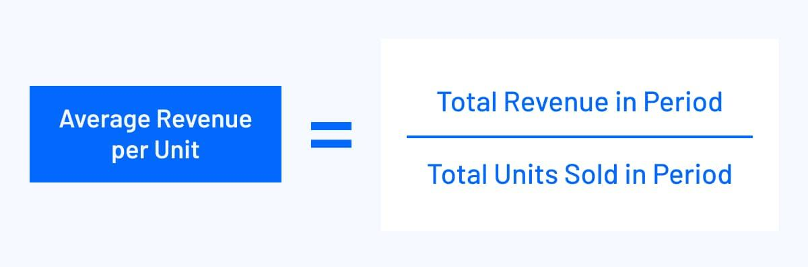

## Table of Contents

## What is Average Revenue Per Unit (ARPU)?

Average Revenue Per Unit (ARPU) is a way to measure how much money a business makes from each customer or user over a certain time, usually a month or a year. It's a simple calculation where you take the total revenue of the company and divide it by the number of customers or users. This number helps businesses understand how well they are doing in making money from each person they serve.

ARPU is really useful for companies, especially those in telecom, internet services, and subscription-based businesses. By knowing their ARPU, these companies can see if their pricing strategies are working or if they need to make changes. It also helps them compare their performance with other companies in the same industry. If the ARPU goes up, it might mean that customers are happy with the service and willing to pay more, or that the company has found a good way to increase its prices without losing customers.

## Why is ARPU important for businesses?

ARPU is important for businesses because it shows how much money they make from each customer. This helps them see if their pricing is right. If the ARPU is high, it means customers are willing to pay more for the service, which is good for the business. If it's low, the business might need to change its prices or find ways to get customers to spend more.

Businesses also use ARPU to compare themselves with others in the same industry. If a company's ARPU is higher than its competitors, it might be doing a better job at making money from each customer. This can help the company decide if it needs to change its strategy or if it's doing well. Keeping track of ARPU over time also helps businesses see if their efforts to increase revenue are working.

## How do you calculate ARPU?

To calculate Average Revenue Per Unit (ARPU), you take the total revenue a company makes and divide it by the number of customers or users. For example, if a company makes $10,000 in a month and has 1,000 customers, the ARPU would be $10,000 divided by 1,000, which equals $10 per customer.

ARPU is usually calculated over a specific period, like a month or a year. This helps businesses see how much money they are making from each customer during that time. It's a simple way to understand if the business is doing well at making money from its customers.

## What data is needed to calculate ARPU?

To calculate ARPU, you need two main pieces of data: the total revenue and the number of customers or users. Total revenue is all the money the company makes in a certain time, like a month or a year. The number of customers or users is how many people are using the company's services or products during that same time.

Once you have this data, you can find the ARPU by dividing the total revenue by the number of customers or users. For example, if a company makes $5,000 in a month and has 500 customers, the ARPU would be $5,000 divided by 500, which is $10 per customer. This simple calculation helps businesses understand how much money they are making from each person they serve.

## Can ARPU be used for both products and services?

Yes, ARPU can be used for both products and services. It helps businesses understand how much money they make from each customer, no matter what they are selling. For products, like a company that sells phones, ARPU shows how much money they make per phone sold to each customer. For services, like a company that provides internet, ARPU shows how much money they make per customer who uses their service.

Using ARPU for both products and services helps companies see if their pricing is right and if customers are happy with what they are getting. If the ARPU is high, it means customers are willing to pay more for the product or service, which is good for the business. If it's low, the business might need to change its prices or find ways to get customers to spend more. This way, ARPU is a useful tool for all kinds of businesses to see how well they are doing.

## How does ARPU differ from other metrics like ARPPU (Average Revenue Per Paying User)?

ARPU and ARPPU are both ways to measure how much money a business makes, but they look at different things. ARPU, or Average Revenue Per Unit, takes the total revenue of a company and divides it by the total number of customers or users, including those who don't pay anything. This means ARPU gives you an overall picture of how much money the company makes from everyone, even if some customers don't spend any money.

On the other hand, ARPPU, or Average Revenue Per Paying User, only looks at the customers who actually pay for the product or service. It divides the total revenue by the number of paying customers. This makes ARPPU a better measure of how much money the company makes from the people who are willing to spend money. By comparing ARPU and ARPPU, a business can see the difference between what they make from all customers and what they make from just the paying ones, which can help them make better decisions about pricing and customer engagement.

## What are common mistakes to avoid when calculating ARPU?

When calculating ARPU, a common mistake is mixing up the time periods. If you want to find out the ARPU for a month, you need to use the total revenue and the number of customers for that same month. If you use the revenue from one month and the number of customers from another month, your ARPU will be wrong. It's important to make sure all the numbers you use are from the same time period.

Another mistake is not including all sources of revenue. Sometimes businesses forget to add in money from things like ads or extra fees when they calculate their total revenue. This can make the ARPU lower than it really is. To get the right ARPU, you need to count all the money the business makes, no matter where it comes from.

Lastly, some businesses might not count all their customers correctly. If you only count the customers who pay and leave out the ones who don't, your ARPU will be too high. ARPU should include everyone who uses your product or service, even if they don't pay anything. This gives you a true picture of how much money you make from each person.

## How can ARPU be used to compare performance across different time periods?

ARPU can help businesses see how they are doing over time by comparing the ARPU from different months or years. If the ARPU goes up, it means the business is making more money from each customer than before. This could be because they raised their prices, got more people to buy extra things, or because they have fewer customers who don't pay. If the ARPU goes down, it might mean the business needs to look at their prices or find new ways to make money from their customers.

By looking at ARPU over time, a business can also see if their strategies to increase revenue are working. For example, if they start a new ad campaign or change their pricing, they can compare the ARPU before and after to see if it made a difference. This helps them make smart choices about what to do next to keep making more money from each customer.

## What are the industry benchmarks for ARPU in various sectors?

ARPU, or Average Revenue Per Unit, can be different in various industries. In the telecom industry, ARPU can range from $10 to $50 per month, depending on the country and the type of service. For example, in the United States, the ARPU for mobile services might be around $40 to $50, while in some developing countries, it might be closer to $10. This difference shows how much people are willing to pay for phone and internet services in different places.

In the streaming services industry, like Netflix or Spotify, ARPU is usually between $8 and $15 per month. This can change depending on the country and if the service offers different pricing plans. For example, in the United States, Netflix's ARPU might be around $12 to $15, while in other countries, it could be lower. Streaming services often try to increase their ARPU by offering different levels of service, like ad-free options or higher quality video.

In the gaming industry, ARPU can vary a lot, from less than $1 to over $10 per month. This depends on whether the games are free to play with in-app purchases or if they are paid games. For example, mobile games might have an ARPU of around $1 to $2, while console or PC games could be higher, especially if they have ongoing subscriptions or in-game purchases. Knowing these benchmarks helps companies see how they are doing compared to others in their industry.

## How can businesses improve their ARPU?

Businesses can improve their ARPU by finding ways to get more money from each customer. One way is to offer different levels of service or products at different prices. For example, a streaming service might have a basic plan and a premium plan that costs more but gives customers extra features like no ads or better video quality. By getting some customers to choose the more expensive plan, the business can increase its ARPU. Another way is to add extra things that customers can buy, like in-app purchases in a game or add-ons for a service. If more customers buy these extras, the business makes more money from each person.

Another way to improve ARPU is to focus on keeping the customers who spend the most money. Businesses can do this by giving special deals or rewards to their best customers, making them want to keep using the service and spend more. It's also important to keep all customers happy so they don't leave. If a business loses a lot of customers, especially the ones who pay a lot, the ARPU can go down. By making sure customers are happy and feel like they are getting good value, the business can keep its ARPU high.

## What are the limitations of using ARPU as a performance metric?

ARPU can be a helpful way to see how much money a business makes from each customer, but it has some limitations. One problem is that ARPU looks at all customers together, so it doesn't show how much money the business makes from different types of customers. For example, if a business has a lot of customers who don't pay anything, the ARPU might look low even if the paying customers are spending a lot. This can make it hard for the business to see if they are doing well with the customers who matter most for their revenue.

Another limitation is that ARPU doesn't tell you why it changes. If the ARPU goes up, it could be because the business raised prices, got more people to buy extra things, or lost some customers who don't pay. Without looking at other numbers, like how many customers there are or what they are buying, it's hard to know what's really happening. This means businesses need to use ARPU with other metrics to get a full picture of how they are doing.

## How can advanced analytics enhance the insights gained from ARPU?

Advanced analytics can help businesses learn more from ARPU by looking at different groups of customers. Instead of just seeing the average for everyone, analytics can show how much money the business makes from different types of customers, like new ones versus old ones, or people who use different services. This helps the business see which customers are the most important for their revenue and how they can get more money from each group. For example, if analytics show that customers who use a certain service spend more, the business might focus on getting more people to use that service.

Using advanced analytics also helps businesses understand why ARPU changes over time. By looking at other data, like how many customers there are, what they are buying, and how often they use the service, analytics can show what's really happening. If ARPU goes up, analytics might show it's because more people are buying extra things, not just because prices went up. This helps the business make better decisions about how to keep ARPU high, like offering new products or services that customers want.

## What is the Understanding of Average Revenue Per User (ARPU)?

Average Revenue Per User (ARPU) is a key financial metric used to assess how much revenue a company generates from each user or customer on average. Calculating ARPU is straightforward and involves dividing the total revenue by the number of users or subscribers. The formula for ARPU is:

$$
\text{ARPU} = \frac{\text{Total Revenue}}{\text{Number of Users}}
$$

ARPU is crucial for measuring business performance as it provides insights into a company's ability to extract economic value from its user base. It helps companies assess the profitability derived from each user and allows them to monitor growth or decline trends over time. A rising ARPU indicates that a company is becoming more effective at generating revenue per user, which can signal successful monetization strategies or improvements in the pricing model.

Companies leverage ARPU to gauge profitability per user, which is vital for understanding the economic contribution of their customer base. This understanding helps in assessing whether the costs associated with acquiring and servicing users are justified by the revenue they generate. By analyzing ARPU, companies can make informed decisions about customer acquisition strategies, retention efforts, and product pricing.

ARPU is a critical metric across various industries. In telecommunications, for example, ARPU is used to evaluate the profitability of data and voice services offered to customers. In the tech sector, particularly for software-as-a-service (SaaS) companies, ARPU helps determine the success of subscription models by showing how much each subscriber contributes financially. Similarly, in media and entertainment, companies use ARPU to assess revenue generated from users consuming digital content, such as streaming services.

In strategic decision-making, ARPU plays a pivotal role by guiding companies in resource allocation, marketing strategies, and service enhancements. A thorough understanding of ARPU enables businesses to fine-tune their offerings to maximize revenue while maintaining customer satisfaction. For instance, if a company notices a decline in ARPU, it may opt to introduce new features, adjust pricing, or implement customer retention programs to bolster user engagement and increase profitability per user.

Overall, ARPU is an integral part of financial analysis and management, providing companies a clear picture of revenue generation efficiency per customer. This metric not only aids in evaluating current performance but also forms the basis for strategic planning and forecasting future revenue growth.

## How do you calculate ARPU for Algorithmic Trading Platforms?

Average Revenue Per User (ARPU) is a vital financial metric for algorithmic trading platforms, reflecting their ability to generate revenue from clients. The calculation of ARPU for these platforms involves some unique considerations compared to other businesses due to the nature of financial trading and the specific services provided.

One fundamental aspect affecting ARPU in algorithmic trading platforms is trading volume. Higher trading volume usually translates to increased transaction fees, which are a primary revenue source for trading platforms. Consequently, platforms strive to encourage high-frequency and high-volume trading to boost ARPU. Transaction fees, typically charged on every trade executed through the platform, are crucial determinate factors. These fees can vary based on the trade volume, the asset class, and the market conditions, thereby directly impacting the ARPU.

Client retention also plays a significant role in influencing ARPU. Long-term clients frequently contribute to a more stable revenue stream, allowing platforms to maintain or increase their average revenue per user. Successful retention strategies often focus on improving user experience, offering advanced trading features, and maintaining competitive fee structures.

Algorithmic trading platforms leverage vast amounts of financial data generated from trading activities to assess ARPU. This data provides insights into trade frequencies, user engagement levels, and revenue generated from transaction fees, assisting in the precise calculation of ARPU. Platforms utilize advanced analytics and data processing technologies to analyze these datasets, thereby gaining valuable insights into user behavior and optimizing their strategies for ARPU enhancement.

The process of calculating ARPU for algorithmic trading platforms typically involves the following steps:

1. **Total Revenue Calculation**: Aggregate the total revenue generated over a specific period, usually from transaction fees and other services offered.

2. **Active User Count**: Identify and count the number of active users during that same period. For algorithmic trading platforms, "active" might define users who have executed trades or engaged with the platform in other meaningful ways.

3. **ARPU Formula Application**: Apply the ARPU formula: 
$$
   \text{ARPU} = \frac{\text{Total Revenue}}{\text{Number of Active Users}}

$$

This process helps to calculate the mean revenue generated per user, providing insights into the platform's revenue efficiency.

However, measuring ARPU in algorithmic trading is not without challenges. The volatile nature of financial markets can lead to fluctuations in trading activities and transaction fees, impacting revenue unpredictably. Furthermore, differentiating between various types of trades, such as those executed automatically by algorithms or manually by users, can complicate the calculation process.

Nonetheless, there are also opportunities for platforms to enhance ARPU by fostering deeper client engagement, incentivizing high-frequency trading, and adopting differentiated fee structures to capitalize on diverse trading behaviors. Embracing cutting-edge technologies like artificial intelligence and [machine learning](/wiki/machine-learning) can further optimize trading strategies, streamline operations, and contribute positively to ARPU metrics.

In summary, while calculating ARPU for algorithmic trading platforms entails unique complexities compared to traditional businesses, it remains a valuable metric, helping these platforms assess their financial health and strategize for revenue growth.

## References & Further Reading

[1]: Bergstra, J., Bardenet, R., Bengio, Y., & Kégl, B. (2011). ["Algorithms for Hyper-Parameter Optimization."](https://papers.nips.cc/paper/4443-algorithms-for-hyper-parameter-optimization) Advances in Neural Information Processing Systems 24.

[2]: ["Advances in Financial Machine Learning"](https://www.amazon.com/Advances-Financial-Machine-Learning-Marcos/dp/1119482089) by Marcos Lopez de Prado

[3]: ["Evidence-Based Technical Analysis: Applying the Scientific Method and Statistical Inference to Trading Signals"](https://www.amazon.com/Evidence-Based-Technical-Analysis-Scientific-Statistical/dp/0470008741) by David Aronson

[4]: ["Machine Learning for Algorithmic Trading"](https://github.com/PacktPublishing/Machine-Learning-for-Algorithmic-Trading-Second-Edition) by Stefan Jansen

[5]: ["Quantitative Trading: How to Build Your Own Algorithmic Trading Business"](https://books.google.com/books/about/Quantitative_Trading.html?id=j70yEAAAQBAJ) by Ernest P. Chan