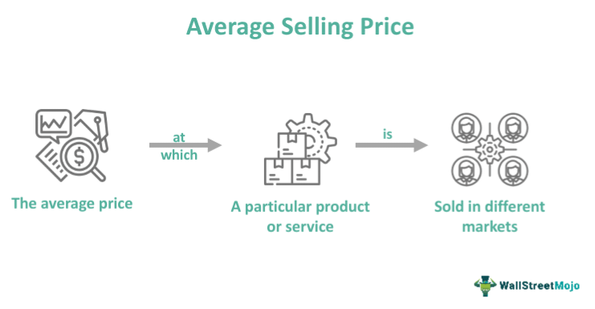

The business world constantly evolves, with pricing strategies playing a critical role in determining the profitability and competitiveness of products and services. Central to these strategies is the concept of Average Selling Price (ASP), a pivotal metric in assessing pricing across various industries. ASP is not only a benchmark for setting and evaluating prices but also reflects market dynamics, consumer behavior, and competitive positioning.

In today's fast-paced markets, the introduction of algorithmic trading has further underscored the importance of ASP. Algorithmic trading, which utilizes computer algorithms to execute trading decisions based on predetermined criteria, requires a deep understanding of price metrics, including ASP, to optimize trading outcomes. The synergy between ASP and algorithmic trading offers a powerful tool for enhancing both strategic pricing decisions and investment strategies.



This article will explore how pricing strategy, ASP calculation, and algorithmic trading intersect to provide valuable insights into market positioning and strategic decision-making. Through a comprehensive understanding of these fundamentals, whether you are involved in financial markets or broader business strategy, you can enhance your decision-making processes effectively.

## Table of Contents

## Understanding Average Selling Price (ASP)

Average Selling Price (ASP) represents the average price at which a product or service is sold across different markets over a certain period. This metric is fundamental for businesses in gauging their pricing efficiency and in evaluating economic performance over specified periods. ASP is calculated by dividing the total revenue by the total number of units sold. Mathematically, it is represented as:

$$
\text{ASP} = \frac{\text{Total Revenue}}{\text{Total Units Sold}}
$$

For instance, if a company reports $200,000 in revenue from sales of 4,000 units, the ASP would be $50 per unit. This simple calculation can reveal valuable insights into how well a product is performing in the market, providing a straightforward indicator of pricing strategy effectiveness.

The ASP serves as a critical benchmark that aids businesses in setting competitive prices that align with their financial objectives. By understanding the ASP, companies can assess the appropriateness of their pricing strategies and their products' positioning in the marketplace. An increase in ASP might indicate a successful brand positioning towards a more premium market, whereas a decrease might suggest strategies aimed at boosting [volume](/wiki/volume-trading-strategy) sales through competitive pricing.

Several factors can affect the ASP, highlighting its dynamic nature. Market demand significantly influences ASP; as demand increases, companies may adjust prices upward, resulting in a higher ASP. Conversely, during periods of decreased demand, ASP might decline as businesses lower prices to stimulate sales. Seasonal fluctuations also impact ASP. For example, products that sell well during specific times of the year, such as holiday-themed items, might experience a temporary increase in ASP during peak seasons. Competitive pricing strategies implemented by other firms in the market can force businesses to adjust their prices to maintain competitiveness, thereby influencing ASP.

By monitoring and analyzing ASP, businesses can gather strategic insights that inform not only pricing decisions but also broader business strategies, including marketing and production planning. Understanding ASP's role as a financial indicator and its influencing factors is essential for optimizing pricing strategies and ensuring sustainable economic performance.

## The Role of ASP in Pricing Strategy

ASP is integral to developing a competitive pricing strategy, allowing businesses to position their products effectively in the market. By understanding the Average Selling Price, firms can align their pricing approaches with market demands and consumer preferences. A high ASP typically suggests premium product positioning, attracting customers willing to pay for higher perceived value or quality. Conversely, a low ASP may imply greater market accessibility, appealing to a broader customer base seeking affordability.

Analyzing ASP trends provides valuable insights that help businesses adjust their pricing strategies in response to market dynamics. These trends can reveal how consumer preferences shift over time, prompting changes in pricing to maintain competitiveness. For example, if ASP trends indicate increasing consumer willingness to spend more on sustainability, a company might consider adjusting its pricing strategy to highlight eco-friendly attributes.

Product life cycle stages significantly impact ASP. During the introduction stage, businesses may adopt a skimming strategy, setting higher ASPs to recoup investment costs quickly. As the product moves to the growth stage, competitive pressures may necessitate price adjustments, potentially lowering ASP to capture a larger market share. In the maturity stage, maintaining the ASP becomes crucial as businesses aim to differentiate their products amidst heightened competition. Finally, during the decline stage, ASP might reduce to encourage sales and clear inventories.

Charting ASP over time can be achieved through Python using libraries such as Matplotlib or Pandas, enabling visualization of trends and aiding decision-making. Here is a simple Python script demonstrating how to plot ASP trends:

```python
import matplotlib.pyplot as plt
import pandas as pd

# Sample data: product's ASP over time
data = {'Month': ['Jan', 'Feb', 'Mar', 'Apr', 'May', 'Jun'],
        'ASP': [150, 145, 142, 138, 135, 130]}  # Example ASP values

df = pd.DataFrame(data)

# Plotting ASP over time
plt.plot(df['Month'], df['ASP'], marker='o')
plt.title('ASP Trends Over Time')
plt.xlabel('Month')
plt.ylabel('Average Selling Price ($)')
plt.grid(True)
plt.show()
```

Through consistent monitoring and adjusting of ASP figures, businesses can better align their products' market positioning with their strategic goals.

## Algorithmic Trading and ASP

Algorithmic trading utilizes computer algorithms to automate and optimize trade execution based on predetermined criteria. This approach significantly improves efficiency and precision in trading, especially in fast-paced markets. Average Selling Price (ASP) data is a valuable input for [algorithmic trading](/wiki/algorithmic-trading) models, as it helps inform decisions related to buying and selling securities.

ASP data assists in constructing trading strategies by providing insights into market dynamics and pricing trends. By integrating ASP into algorithmic systems, traders can design algorithms that respond more effectively to market conditions. For instance, when ASP indicates a declining trend, an algorithm may be programmed to trigger sell orders to minimize potential losses. Conversely, a rising ASP trend could suggest initiating buy orders to capitalize on favorable conditions.

Incorporating ASP data into algorithmic strategies can optimize trade execution. By analyzing fluctuations in ASP, algorithms can adapt trading strategies to align with current market behaviors, enhancing the precision of entry and [exit](/wiki/exit-strategy) points. This adaptability is particularly beneficial in volatile markets, where swift decision-making is crucial.

Moreover, employing ASP insights in algorithmic trading can improve investment outcomes by aligning trades with broader market trends and pricing strategies. For example, in a scenario where ASP reflects strong demand for a particular security, algorithms can prioritize such securities, potentially yielding higher returns. This alignment ensures that trading decisions are not only responsive to immediate market changes but also informed by long-term pricing trends.

Implementing ASP within algorithmic trading necessitates robust computational tools. Programming languages like Python are commonly used to develop trading algorithms due to their versatility and extensive libraries that facilitate data analysis. For instance, libraries such as Pandas enable the manipulation and analysis of ASP data, while packages like NumPy support complex mathematical computations.

In conclusion, the integration of ASP data with algorithmic trading strategies offers a powerful means to optimize financial decision-making. This synergy not only enhances trade execution but also positions traders to better navigate the complexities of modern markets. As market environments continue to evolve, leveraging ASP insights within algorithmic frameworks will remain a crucial element of competitive trading strategies.

## Calculating ASP: A Practical Approach

To calculate the Average Selling Price (ASP), one must divide the total revenue by the total number of units sold during a given period. This simple yet effective formula provides invaluable insight into pricing strategies and can guide decision-making. For instance, if a company records $200,000 in revenue from selling 4,000 units, the ASP would be calculated as follows:

$$
\text{ASP} = \frac{\text{Total Revenue}}{\text{Total Units Sold}} = \frac{200,000}{4,000} = 50
$$

This means that, on average, each unit was sold for $50. The ASP offers a benchmark for determining whether pricing strategies are aligning with revenue expectations and market positioning. 

In today's digital age, tools and software are available to automate ASP calculations, ensuring businesses maintain accurate and timely pricing data. These automated systems can integrate with various financial platforms to continuously monitor sales and revenue data, providing real-time ASP insights.

Regular ASP monitoring is critical for businesses to swiftly adapt to market changes. By keeping a close eye on ASP trends, companies can make informed decisions about necessary price adjustments to stay competitive and respond to fluctuating demand. Attempting to manually calculate and monitor ASP without technological support could lead to delays in strategic adaptations, potentially impacting competitiveness and profitability. 

For those interested in implementing automated ASP calculations, below is a simple example using Python:

```python
def calculate_asp(total_revenue, units_sold):
    if units_sold == 0:
        return "Units sold cannot be zero"
    return total_revenue / units_sold

total_revenue = 200000  # Total revenue in dollars
units_sold = 4000       # Total units sold

asp = calculate_asp(total_revenue, units_sold)
print(f"The Average Selling Price is ${asp}")
```

This code snippet defines a function to calculate ASP by dividing the total revenue by the units sold, providing a straightforward method to automate this calculation. Regularly updating these input values allows for continuous monitoring and swift adaptations to pricing strategies as required by market conditions.

## Leveraging ASP for Business Decisions

Average Selling Price (ASP) is a critical metric for businesses aiming to optimize their operations and strategy. By analyzing ASP data, businesses can refine their marketing strategies, optimize inventory levels, and set realistic sales projections. ASP serves as a reflection of the market's response to a company's pricing strategy, allowing businesses to align supply with demand. 

For instance, precise ASP analysis helps identify pricing trends and shifts in consumer demand. A sudden drop in ASP might indicate a decline in demand or increased competition, prompting a strategic reassessment. Conversely, a rising ASP could signal successful value proposition or increased market demand, encouraging potential price adjustments or expanded production.

Understanding ASP data enables informed decisions on product development. Companies can use ASP insights to gauge the market's receptiveness to new products, refine product offerings, or even phase out underperforming items. Data-driven analysis of ASP can also guide market expansion efforts by identifying regions with higher ASP and potential for increased profitability.

Competitive positioning greatly benefits from ASP analysis. A consistent ASP above competitors might affirm a premium positioning strategy, while a lower ASP could suggest a cost-leadership approach. By analyzing ASP trends, businesses can adjust pricing to optimize market positioning and competitiveness.

Additionally, ASP plays a vital role in aligning business operations with financial goals. Regular ASP monitoring ensures that pricing strategies are effectively contributing to maximized profitability. Adjustments in ASP reflect broader financial objectives, helping to maintain a balance between revenue generation and market presence.

Incorporating ASP data into strategic planning fosters a responsive and agile business model. Software tools and automated systems enhance ASP tracking, allowing businesses to swiftly adapt to market fluctuations. Consistent ASP analysis ensures that businesses remain competitive, uphold financial health, and achieve strategic objectives. This informed approach empowers companies to maintain and enhance their market position, ultimately leading to sustained growth and success.

## Conclusion

Average Selling Price (ASP) serves as a powerful analytical tool that provides critical insights into the efficacy of pricing strategies and the positioning of products in the market. Its ability to encapsulate various aspects of market dynamics makes it indispensable for businesses seeking to maintain competitiveness and profitability in fluctuating environments. 

Integrating ASP data into algorithmic trading can significantly enhance financial decision-making processes. Algorithmic trading, which relies on sophisticated mathematical models and vast amounts of data, benefits from the inclusion of ASP metrics as a stable indicator of price trends. By leveraging this data, traders can achieve optimal trade execution, ensuring both buy and sell decisions are informed by comprehensive pricing information. This integration fosters a more nuanced understanding of market behaviors, ultimately improving the outcomes of trading strategies.

Consistent analysis of ASP is crucial for businesses aiming to outpace competitors. By routinely examining ASP trends, companies can adeptly adjust their pricing strategies to reflect current market conditions and consumer preferences. This ongoing adaptation not only aids in retaining market share but also ensures long-term growth and financial stability. Regular monitoring allows companies to swiftly respond to changes such as competitive pricing moves or significant shifts in consumer demand.

As markets continue to evolve, the ability to refine pricing strategies using ASP insights provides a distinct advantage. Businesses that harness the full potential of ASP data are better equipped to align their operations with market trends and financial goals. This strategic alignment empowers them to navigate the complexities of competitive landscapes effectively, safeguarding their market position amid continuous transformation. By positioning ASP as a core component of their strategic toolkit, companies can cultivate a robust framework for decision-making that maximizes both current success and future potential.

## References & Further Reading

[1]: [Chakraborty, U. K., & Mukhopadhyay, A. (2014). "Algorithmic Trading and DMA: An Introduction to Direct Access Trading Strategies."](https://www.semanticscholar.org/paper/Algorithmic-trading-%26-DMA-%3A-an-introduction-to-Johnson/aa5de1ab883d5e23b6651faa7c1807586d688e4b) 4Myeloma Press.

[2]: ["Advances in Financial Machine Learning"](https://www.amazon.com/Advances-Financial-Machine-Learning-Marcos/dp/1119482089) by Marcos Lopez de Prado

[3]: ["Algorithmic and High-Frequency Trading"](https://www.amazon.com/Algorithmic-High-Frequency-Trading-Mathematics-Finance/dp/1107091144) by Álvaro Cartea, Sebastian Jaimungal, and José Penalva

[4]: ["Quantitative Trading: How to Build Your Own Algorithmic Trading Business"](https://www.amazon.com/Quantitative-Trading-Build-Algorithmic-Business/dp/1119800064) by Ernest P. Chan

[5]: ["Machine Learning for Algorithmic Trading"](https://github.com/stefan-jansen/machine-learning-for-trading) by Stefan Jansen