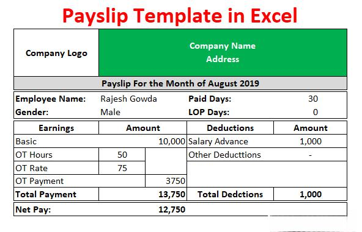

Algorithmic trading, commonly referred to as algo trading, has transformed the landscape of financial markets by automating trading processes and enhancing the speed and efficiency of trade executions. This technological advancement leverages computer algorithms to execute pre-determined trading strategies at speeds and frequencies impossible for human traders, thus capitalizing on even the smallest market inefficiencies. However, despite its benefits, algorithmic trading is not devoid of challenges.

One of the significant obstacles that traders encounter in this domain is slippage. Slippage refers to the difference between the price at which a trader expects to execute a trade and the actual price at which the trade is completed. This disparity often occurs due to market volatility, order size, timing, and liquidity issues, resulting in unanticipated costs that can erode the profitability of trading strategies.

In order to quantify and manage this phenomenon, traders have developed the concept of average slippage per turnover. This metric provides insights into how slippage affects trading performance, allowing traders to adjust and refine their strategies for optimal execution. By understanding and effectively managing slippage, traders can significantly enhance the efficiency and effectiveness of their algorithmic trading operations. This article investigates into the intricacies of average slippage per turnover, examining its implications for trading strategies and overall performance in the market.

## Table of Contents

## Understanding Slippage in Algo Trading

Slippage in [algorithmic trading](/wiki/algorithmic-trading) refers to the situation where a trade is executed at a price that differs from the originally anticipated or requested price. This phenomenon is commonly attributed to factors such as market [volatility](/wiki/volatility-trading-strategies) and execution delays. Slippage can have considerable implications on the profitability of trading strategies, particularly those operating in rapidly moving markets where price fluctuations are more prevalent.

In quickly oscillating markets, the difference between the expected and actual execution prices can widen, leading to increased costs and potentially diminished returns for traders relying on algorithms. This price discrepancy can result from the sheer speed at which orders are processed and the time it takes to match buy and sell requests in congested market conditions.

Various contributory factors to slippage include high trading volumes, fluctuating [liquidity](/wiki/liquidity-risk-premium), and order fulfillment mechanisms. For instance, when a large number of market participants are attempting to execute trades simultaneously, the likelihood of price shifts before order completion increases. Additionally, during periods of market instability or when trading less liquid assets, slippage becomes more pronounced as the lack of readily available counterparties to a trade can result in executions at less favorable prices.

Understanding the mechanisms behind slippage is crucial for traders aiming to refine their algorithmic strategies. By acknowledging the circumstances that lead to slippage, traders can adjust their trading algorithms to accommodate potential slippage factors, ultimately working towards enhanced strategy performance. Quantifying slippage can involve calculating the average difference between expected and actual trade prices across numerous transactions, allowing traders to identify patterns and make data-driven adjustments to mitigate slippage effects.

## Calculating Average Slippage Per Turnover

Average slippage per turnover is an essential metric in algorithmic trading, enabling traders to assess the effectiveness of their strategies. It is calculated by dividing the total slippage encountered over a sequence of trades by the total turnover generated within the same period. This calculation is crucial for understanding how much slippage is proportionate to the total trading [volume](/wiki/volume-trading-strategy), allowing traders to gauge the efficiency of their trade execution.

Mathematically, this can be expressed as:

$$
\text{Average Slippage per Turnover} = \frac{\text{Total Slippage}}{\text{Total Turnover}}
$$

Where:
- **Total Slippage** is the cumulative difference between the expected and actual execution prices of trades.
- **Total Turnover** refers to the total value of all trades executed during the period considered.

The average slippage per turnover provides insights into how trading conditions, such as market volatility and liquidity, affect the trading outcome. By analyzing this metric, traders can identify recurring patterns in slippage, often correlated with specific market conditions or times of day. This awareness allows traders to fine-tune their algorithmic strategies, such as adjusting the size of their trades or the timing of order execution, to minimize slippage effectively.

Moreover, tracking average slippage per turnover over time can help traders assess whether their changes to a trading algorithm are yielding improvements in execution efficiency. This continuous analysis and adjustment process is vital for maintaining competitiveness and achieving consistent trading performance in the ever-evolving financial markets.

## Factors Influencing Slippage

Slippage in algorithmic trading can be significantly influenced by several key factors, primarily liquidity, order size, and market volatility. Each of these elements plays a crucial role in determining the extent to which slippage might occur during the execution of trades.

**Liquidity:** The liquidity of a market is a primary determinant of slippage levels. In highly liquid markets, where there is a high volume of buy and sell orders, slippage tends to be lower because there are more counterparties available to match trades at near-expected prices. Conversely, in low liquidity environments, the lack of sufficient counterparties can lead to larger price movements when executing trades. This is because a single large order can shift the market price substantially, resulting in greater slippage. Liquidity is often measured by the bid-ask spread and market depth, which together give an indication of the ease with which a trade can be executed without affecting the market price.

**Order Size:** The size of the order being executed is another critical factor affecting slippage. Large orders are more likely to cause slippage than smaller ones, primarily due to their potential to alter market prices as they consume available buy or sell offers. For example, a large buy order might exhaust the available sell orders at the current ask price, causing the remaining portion of the order to be filled at higher prices, thereby increasing slippage. Traders can manage order size and reduce slippage by breaking down large orders into smaller, more manageable chunks, often referred to as "iceberg" orders, which are executed incrementally over time.

**Market Volatility:** Market volatility describes the rate at which prices of securities increase or decrease for a given set of returns. In volatile markets, prices can shift rapidly and unexpectedly, increasing the likelihood of slippage. High volatility often leads to wider bid-ask spreads and less predictable price movement, resulting in challenges in achieving the desired execution price. To account for this, traders might incorporate volatility forecasts into their algorithms to adjust their execution strategies dynamically according to current market conditions.

Understanding these factors allows traders to develop more effective strategies for mitigating slippage. Employing techniques such as using limit orders, optimizing algorithms, and constantly analyzing market conditions can help manage slippage risks. By considering liquidity, order size, and market volatility, traders can enhance their execution strategies and potentially improve their overall trading performance.

## Strategies to Mitigate Slippage

Strategies to mitigate slippage in algorithmic trading are crucial for optimizing trade execution and minimizing the financial costs associated with unexpected price changes. Effective methods include the application of limit orders, ongoing algorithm optimization, and comprehensive market analysis.

Limit orders are a fundamental strategy for controlling slippage. By setting a maximum or minimum price at which trades can be executed, limit orders provide traders with the ability to specify the acceptable price range for each transaction. This approach minimizes the risk of trades being executed at unfavorable prices during periods of high volatility. For example, if a trader sets a limit order to buy a stock at $100, the order will only be executed if the stock can be purchased at that price or lower, thus securing control over transaction costs.

Algorithm optimization is another critical [factor](/wiki/factor-investing) in reducing slippage. Traders can achieve better market prediction and execution efficiency by continuously refining and [backtesting](/wiki/backtesting) their trading algorithms. This process involves adjusting algorithm parameters and incorporating advanced modeling techniques such as [machine learning](/wiki/machine-learning) to enhance the algorithm’s responsiveness to market movements. Backtesting allows traders to evaluate the performance of their algorithms under different market conditions, enabling them to identify and address weaknesses that contribute to slippage.

Regular market analysis is essential for anticipating fluctuations that may lead to slippage. Traders must keep abreast of economic indicators, news events, and other factors that influence market dynamics. By understanding these variables, traders can modify their strategies to align with current market conditions, reducing the likelihood of slippage. Furthermore, integrating real-time data feeds into trading algorithms can provide immediate insights into market shifts, allowing for swift strategy adjustments.

Incorporating these strategies into trading practices helps traders efficiently manage slippage. Each component, whether it is the strategic setting of limit orders, ongoing algorithmic refinement, or thorough market analysis, plays an integral role in enhancing trade execution and achieving optimal trading outcomes.

## Conclusion

Slippage is a significant challenge faced by traders engaged in algorithmic trading; however, it can be managed through informed strategy development and precise execution. By quantifying slippage using metrics such as average slippage per turnover, traders gain valuable insights into how their strategies perform under varying market conditions. This metric allows traders to identify patterns of inefficiency and adjust their approaches to improve execution.

Active monitoring of market conditions and regular algorithm optimization are essential to mitigating slippage, as they enable traders to adapt swiftly to changes in liquidity, order size effects, and volatility. Algorithms need constant tuning to align with current market dynamics, which involves both backtesting with historical data and forward-testing in real-time market scenarios. This iterative process aids in refining prediction capabilities, thus reducing slippage.

For traders seeking long-term success, continuously updating their knowledge of market conditions, incorporating advanced analytical tools, and fostering an adaptive approach to algorithm design are crucial. By maintaining a proactive stance, traders can enhance execution efficiency, minimize the adverse effects of slippage, and enhance the overall profitability of their trading strategies.

## References & Further Reading

[1]: Almgren, R., & Chriss, N. (2000). ["Optimal Execution of Portfolio Transactions."](https://smallake.kr/wp-content/uploads/2016/03/optliq.pdf) The Journal of Risk.

[2]: Kissell, R. (2014). ["The Science of Algorithmic Trading and Portfolio Management"](https://www.sciencedirect.com/book/9780124016897/the-science-of-algorithmic-trading-and-portfolio-management) Academic Press.

[3]: Lopez de Prado, M. (2018). ["Advances in Financial Machine Learning"](https://www.amazon.com/Advances-Financial-Machine-Learning-Marcos/dp/1119482089) John Wiley & Sons.

[4]: Bouchaud, J-P., Farmer, J.D., & Lillo, F. (2009). ["How Markets Slowly Digest Changes in Supply and Demand."](https://arxiv.org/abs/0809.0822) In Handbook of Financial Markets: Dynamics and Evolution.

[5]: Kissell, R. (2013). ["The Impact of Algorithmic Trading Strategies on Trading Costs."](https://www.sciencedirect.com/book/9780124016897/the-science-of-algorithmic-trading-and-portfolio-management) Journal of Trading.