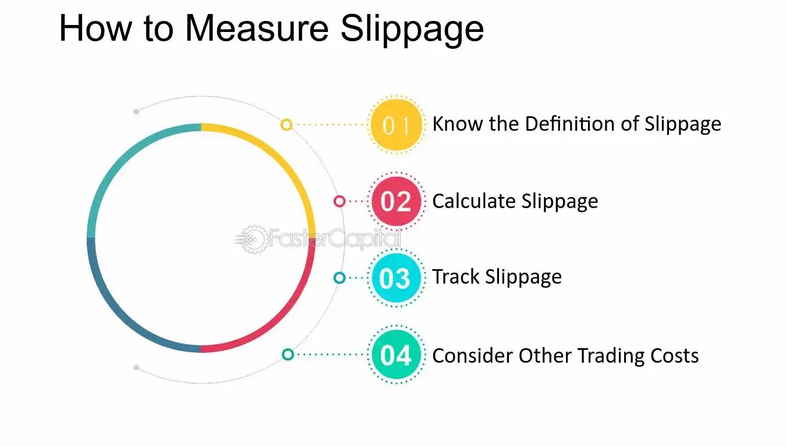

## Table of Contents

## What is slippage in trading?

Slippage in trading happens when the price at which you want to buy or sell a stock or another asset is different from the price at which your trade actually happens. This difference can occur because of delays between when you place your order and when it gets filled, or because the market is moving quickly and the price changes before your order is completed.

Slippage can be good or bad for you. If the price moves in your favor, you might buy or sell at a better price than you expected, which is positive slippage. But if the price moves against you, you might end up buying at a higher price or selling at a lower price than you planned, which is negative slippage. It's important for traders to understand slippage because it can affect how much money they make or lose.

## What is a turnover in trading?

Turnover in trading is the total value of all the trades made in a certain time period, like a day or a year. It shows how active the market is. If the turnover is high, it means a lot of buying and selling is happening. If it's low, it means the market is not very active.

For example, if you and your friends are trading cards, and you all trade a lot of cards in one day, the turnover for that day would be high. Turnover is important because it can tell you how liquid a market is. A market with high turnover usually has more buyers and sellers, making it easier to trade without affecting the price too much.

## How is average slippage per turnover calculated?

To find the average slippage per turnover, you need to know the total slippage and the total turnover for a certain time. First, add up all the slippage from each trade. Slippage is the difference between the price you wanted and the price you actually got. Then, add up the total value of all the trades, which is the turnover. Once you have these two numbers, divide the total slippage by the total turnover.

This calculation gives you a number that shows how much slippage happens on average for each dollar of trading. It helps traders understand how much they might lose or gain because of slippage when they make trades. If the number is small, it means slippage is not a big problem. If it's large, traders need to be more careful about how they place their orders.

## Why is understanding average slippage important for traders?

Understanding average slippage is important for traders because it helps them know how much the price might change between when they place an order and when it gets filled. If the average slippage is high, it means the price can move a lot, which can affect how much money they make or lose. Traders need to think about this when they decide how to trade, so they can try to reduce the bad effects of slippage.

By knowing the average slippage, traders can also plan their trades better. They might choose to use different types of orders, like limit orders, to control slippage. This can help them get closer to the price they want and avoid big surprises. Overall, understanding average slippage helps traders make smarter choices and manage their risks better.

## What factors can influence slippage in a trade?

Slippage can happen because of many things. One big reason is how fast the market is moving. If prices are changing a lot and quickly, it's harder to buy or sell at the price you want. Another reason is how many people are trading. If there are not many buyers or sellers, it can be tough to find someone to trade with at your desired price. Also, the size of your trade matters. If you want to buy or sell a lot of something, it might move the price before you finish your trade.

Another [factor](/wiki/factor-investing) is the type of order you use. A market order tries to trade right away at the best price available, but that price might be different from what you expected. A limit order lets you set a specific price, but it might not get filled if the market doesn't reach that price. Lastly, delays in the trading system or internet connection can cause slippage. If your order takes a bit longer to go through, the price might change before it's completed. Understanding these factors helps traders manage slippage better.

## How can a trader minimize slippage?

To minimize slippage, traders can use limit orders instead of market orders. A limit order lets you set the exact price you want to buy or sell at. This means you won't get a surprise if the price moves a lot. But, there's a chance your order won't get filled if the market doesn't reach your price. Another way is to trade when the market is not moving too fast. If the market is calm, there's less chance of big price changes while your order is being filled.

Also, traders can break big orders into smaller ones. If you want to buy or sell a lot, doing it in smaller pieces can help. This way, each piece has less impact on the price. It's also good to check how many people are trading. If there are a lot of buyers and sellers, it's easier to trade without moving the price too much. Lastly, make sure your internet and trading system are fast. Any delay can cause slippage, so a quick connection helps your orders go through at the right time.

## What is the difference between positive and negative slippage?

Positive slippage happens when the price moves in your favor after you place your order. For example, if you want to buy a stock at $100 and the price drops to $99 before your order is filled, you get a better deal than you expected. This means you save money because you buy at a lower price. Positive slippage is good for you because it can increase your profits or reduce your costs.

Negative slippage is the opposite. It happens when the price moves against you after you place your order. For instance, if you want to sell a stock at $100 but the price falls to $98 before your order is filled, you end up selling at a lower price than you wanted. This means you lose money because you don't get as much as you hoped. Negative slippage can decrease your profits or increase your losses, so it's something traders try to avoid.

## How does market volatility affect slippage?

Market [volatility](/wiki/volatility-trading-strategies) means the price of something can change a lot and fast. When the market is very volatile, it's harder to buy or sell at the price you want. This is because the price can move a lot between the time you place your order and the time it gets filled. If the market is jumping around a lot, your order might get filled at a price that's different from what you expected. This difference is called slippage.

When the market is calm and not moving much, there's less chance of big price changes, so slippage is usually smaller. But when things are wild and prices are swinging all over the place, slippage can be bigger. Traders need to watch the market and think about how much it might move when they place their orders. If they know the market is going to be volatile, they might use different kinds of orders or trade at different times to try and keep slippage low.

## Can slippage be predicted, and if so, how?

Slippage can be hard to predict exactly, but traders can guess how much it might happen by looking at some things. One thing to look at is how much the market moves around. If the market is very jumpy and prices change a lot, there's a good chance slippage will be bigger. Also, traders can check how many people are buying and selling. If there are not many traders, it's harder to buy or sell at the price you want, which can cause more slippage. By watching these things, traders can get a better idea of what might happen.

Another way to predict slippage is by looking at past trades. Traders can look at how much slippage happened before in similar situations. If they see that slippage was big when the market was acting a certain way, they might expect it to happen again. Using this information, traders can plan their orders better. They might choose to use different kinds of orders or wait for a calmer time to trade, which can help them avoid big surprises from slippage.

## What role does the choice of broker play in slippage?

The choice of broker can really affect how much slippage happens when you trade. Different brokers have different systems and speeds. If a broker's system is slow or not working well, it can take longer for your order to go through. This delay can make the price change before your trade happens, causing more slippage. Also, some brokers might not have as many people trading on their platform, which can make it harder to buy or sell at the price you want.

To reduce slippage, it's a good idea to pick a broker that is known for being fast and reliable. A good broker will have a strong connection and a system that works smoothly. They should also have a lot of traders on their platform, so there are always people to trade with. This can help you get your orders filled at better prices and with less slippage.

## How do different trading strategies impact average slippage per turnover?

Different trading strategies can affect how much slippage happens for each dollar you trade. If you use a strategy that involves trading a lot of stocks or other things quickly, like [day trading](/wiki/day-trading-spy), you might see more slippage. This is because you're trying to buy and sell fast, and the market can move a lot in a short time. Also, if your strategy makes you trade when the market is really busy or moving a lot, like during big news events, you might see more slippage because prices can change quickly.

On the other hand, if your strategy is to trade less often and hold onto your investments for a longer time, like in a buy-and-hold approach, you might see less slippage. This is because you're not trying to buy and sell at exact moments when the market is moving fast. Instead, you're waiting for the right time to make fewer trades, which can help keep slippage down. So, the way you choose to trade can really change how much slippage you deal with for each trade you make.

## What advanced tools or algorithms can be used to manage and analyze slippage?

Advanced tools like [algorithmic trading](/wiki/algorithmic-trading) platforms can help traders manage and analyze slippage. These platforms use math formulas to decide when to buy or sell. They can look at past data to guess how much slippage might happen and then try to place orders at times when slippage will be less. Some platforms also let you use different types of orders, like iceberg orders, which can hide part of your order to avoid moving the price too much. This can help keep slippage down.

Another tool is slippage analysis software. This software looks at all your past trades and figures out how much slippage happened in each one. It can show you graphs and numbers to help you see when and why slippage was high or low. By understanding this, you can change your trading strategy to try and avoid times when slippage might be bad. Some software even uses [machine learning](/wiki/machine-learning) to get better at predicting slippage over time, which can help you make smarter trades.

## How do you calculate the average slippage per turnover?

Average slippage per turnover is an essential metric in algorithmic trading, enabling traders to assess the effectiveness of their strategies. It is calculated by dividing the total slippage encountered over a sequence of trades by the total turnover generated within the same period. This calculation is crucial for understanding how much slippage is proportionate to the total trading [volume](/wiki/volume-trading-strategy), allowing traders to gauge the efficiency of their trade execution.

Mathematically, this can be expressed as:

$$
\text{Average Slippage per Turnover} = \frac{\text{Total Slippage}}{\text{Total Turnover}}
$$

Where:
- **Total Slippage** is the cumulative difference between the expected and actual execution prices of trades.
- **Total Turnover** refers to the total value of all trades executed during the period considered.

The average slippage per turnover provides insights into how trading conditions, such as market volatility and [liquidity](/wiki/liquidity-risk-premium), affect the trading outcome. By analyzing this metric, traders can identify recurring patterns in slippage, often correlated with specific market conditions or times of day. This awareness allows traders to fine-tune their algorithmic strategies, such as adjusting the size of their trades or the timing of order execution, to minimize slippage effectively.

Moreover, tracking average slippage per turnover over time can help traders assess whether their changes to a trading algorithm are yielding improvements in execution efficiency. This continuous analysis and adjustment process is vital for maintaining competitiveness and achieving consistent trading performance in the ever-evolving financial markets.

## References & Further Reading

[1]: Almgren, R., & Chriss, N. (2000). ["Optimal Execution of Portfolio Transactions."](https://smallake.kr/wp-content/uploads/2016/03/optliq.pdf) The Journal of Risk.

[2]: Kissell, R. (2014). ["The Science of Algorithmic Trading and Portfolio Management"](https://www.sciencedirect.com/book/9780124016897/the-science-of-algorithmic-trading-and-portfolio-management) Academic Press.

[3]: Lopez de Prado, M. (2018). ["Advances in Financial Machine Learning"](https://www.amazon.com/Advances-Financial-Machine-Learning-Marcos/dp/1119482089) John Wiley & Sons.

[4]: Bouchaud, J-P., Farmer, J.D., & Lillo, F. (2009). ["How Markets Slowly Digest Changes in Supply and Demand."](https://arxiv.org/abs/0809.0822) In Handbook of Financial Markets: Dynamics and Evolution.

[5]: Kissell, R. (2013). ["The Impact of Algorithmic Trading Strategies on Trading Costs."](https://www.sciencedirect.com/book/9780124016897/the-science-of-algorithmic-trading-and-portfolio-management) Journal of Trading.