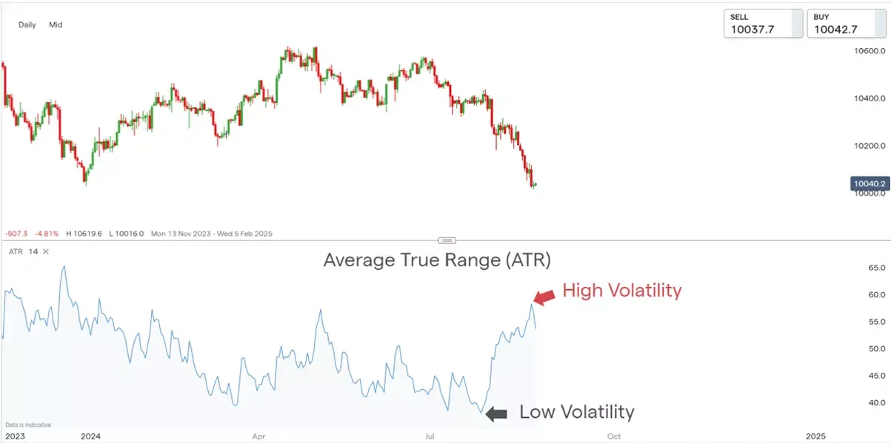

## Table of Contents

## What is the Average True Range (ATR) in trading?

The Average True Range (ATR) is a tool used in trading to measure how much the price of a stock or other financial asset moves on average. It helps traders understand the volatility of an asset, which is how much its price goes up and down. The ATR is calculated by taking the average of the true ranges over a certain number of periods, usually 14 days. The true range is the greatest of the following: the current high minus the current low, the absolute value of the current high minus the previous close, or the absolute value of the current low minus the previous close.

Traders use the ATR to make decisions about when to buy or sell an asset. If the ATR is high, it means the price is moving a lot, and the asset is considered more volatile. This might make traders more cautious because the price could change a lot in a short time. On the other hand, if the ATR is low, the price is not moving as much, and the asset is considered less volatile. This might make traders feel more confident about their trades. The ATR doesn't tell traders which direction the price will move, just how much it might move.

## How is the Average True Range calculated?

The Average True Range (ATR) is calculated by first finding the True Range for each period. The True Range is the biggest difference between the current high and low, the absolute value of the current high minus the previous close, or the absolute value of the current low minus the previous close. Once you have the True Range for each period, you then take an average of these True Ranges over a set number of periods, usually 14 days.

To calculate the ATR, you start by finding the True Range for the first period. Then, for the next period, you find the True Range again and use it to calculate a new ATR. The formula for the new ATR is: (Previous ATR * 13 + Current True Range) / 14. This smooths out the ATR over time, giving you a good idea of the average [volatility](/wiki/volatility-trading-strategies) of the asset. By repeating this process for each new period, you keep the ATR up to date and can use it to make trading decisions.

## What does the ATR indicator measure?

The ATR indicator measures how much the price of a stock or other financial asset moves on average. It helps traders see how volatile, or how much the price goes up and down, an asset is. The ATR is calculated by taking the average of the true ranges over a certain number of periods, usually 14 days. The true range is the biggest difference between the current high and low, the absolute value of the current high minus the previous close, or the absolute value of the current low minus the previous close.

Traders use the ATR to make decisions about when to buy or sell an asset. If the ATR is high, it means the price is moving a lot, and the asset is considered more volatile. This might make traders more cautious because the price could change a lot in a short time. If the ATR is low, the price is not moving as much, and the asset is considered less volatile. This might make traders feel more confident about their trades. The ATR doesn't tell traders which direction the price will move, just how much it might move.

## Why is the ATR useful for traders?

The ATR is useful for traders because it shows how much the price of an asset moves on average. This helps traders understand how volatile the asset is. If the ATR is high, it means the price is moving a lot, and the asset is more risky. Traders might be more careful when the ATR is high because the price could change a lot in a short time. On the other hand, if the ATR is low, the price isn't moving as much, so the asset is less risky. Traders might feel more confident when the ATR is low because the price is more stable.

Traders use the ATR to make decisions about when to buy or sell an asset. For example, a trader might use the ATR to set stop-loss orders, which are orders to sell an asset if its price drops to a certain level. If the ATR is high, a trader might set a wider stop-loss to avoid being stopped out by normal price movements. If the ATR is low, a trader might set a tighter stop-loss because the price isn't moving as much. The ATR doesn't tell traders which way the price will move, just how much it might move, so it's a helpful tool for managing risk.

## How can beginners use ATR to manage risk?

Beginners can use the Average True Range (ATR) to manage risk by understanding how much the price of an asset moves on average. If the ATR is high, it means the price is moving a lot, so the asset is more risky. Beginners should be careful when the ATR is high because the price could change a lot in a short time. They might want to use a wider stop-loss order, which is an order to sell the asset if its price drops to a certain level. A wider stop-loss helps avoid selling the asset too soon because of normal price movements.

On the other hand, if the ATR is low, the price isn't moving as much, so the asset is less risky. Beginners might feel more confident when the ATR is low because the price is more stable. They can use a tighter stop-loss order because the price isn't moving as much. By using the ATR to set stop-loss orders, beginners can manage their risk better and avoid big losses. The ATR doesn't tell beginners which way the price will move, just how much it might move, so it's a helpful tool for managing risk.

## Can ATR be used to set stop-loss orders? If so, how?

Yes, ATR can be used to set stop-loss orders. A stop-loss order is like a safety net that tells your broker to sell your asset if the price drops to a certain level. To use ATR for setting stop-loss orders, you look at the ATR value of the asset you're trading. If the ATR is high, it means the price is moving a lot, so you might want to set a wider stop-loss. This helps you avoid selling your asset too soon because of normal price movements. If the ATR is low, the price isn't moving as much, so you can set a tighter stop-loss.

For example, if the ATR of a stock is $1, you might decide to set your stop-loss at a distance of 2 times the ATR, which would be $2 away from your entry price. This way, you're giving the stock enough room to move without getting stopped out by normal price fluctuations. By using the ATR to set your stop-loss orders, you can manage your risk better and avoid big losses. It's a simple but effective way to protect your investments.

## What are the limitations of using ATR in trading?

The Average True Range (ATR) has some limitations that traders should be aware of. One big limitation is that ATR only tells you how much the price is moving, not which way it's going. So, while it can help you understand the volatility of an asset, it won't tell you if the price is going up or down. This means you need to use other tools or indicators along with ATR to make good trading decisions. Another limitation is that ATR doesn't change quickly with sudden market moves. It's an average, so it takes time to adjust to new price movements. This can be a problem if the market suddenly becomes more volatile.

Another issue with ATR is that it can give different results depending on the time frame you use. For example, the ATR might be very different if you look at it over 14 days compared to 20 days. This means you have to choose the right time frame for your trading strategy, which can be tricky for beginners. Also, ATR doesn't work the same for all types of assets. Stocks, [forex](/wiki/forex-system), and commodities can all have different levels of volatility, so what works for one might not work for another. So, while ATR is a helpful tool, it's important to understand its limits and use it along with other tools to make the best trading decisions.

## How does ATR differ from other volatility indicators?

The Average True Range (ATR) is different from other volatility indicators because it focuses on the true range of price movements. The true range is the biggest difference between the current high and low, the absolute value of the current high minus the previous close, or the absolute value of the current low minus the previous close. This makes ATR a good measure of how much the price is moving on average. Other volatility indicators, like the Bollinger Bands, look at the standard deviation of price movements. Bollinger Bands create a band around the price that gets wider when the price is more volatile and narrower when it's less volatile. So, while ATR gives you an average of price movements, Bollinger Bands show you how the price is moving around its average.

Another difference is that ATR is simpler and easier to understand than some other volatility indicators. For example, the Volatility Index (VIX) measures the market's expectation of volatility over the next 30 days, which can be more complex because it's based on options prices. ATR, on the other hand, is just an average of the true ranges over a certain number of periods, usually 14 days. This makes it easier for beginners to use. However, because ATR is an average, it doesn't change as quickly as some other indicators when the market suddenly becomes more volatile. So, while ATR is a helpful tool for understanding volatility, it's important to use it along with other indicators to get a full picture of the market.

## How can advanced traders incorporate ATR into their trading strategies?

Advanced traders can incorporate ATR into their trading strategies in several ways. One way is to use ATR to set dynamic stop-loss orders. By setting the stop-loss at a multiple of the ATR, traders can adjust their stop-loss levels based on the current volatility of the market. For example, if the ATR is high, indicating higher volatility, a trader might set a wider stop-loss to avoid being stopped out by normal price fluctuations. This helps them stay in a trade longer and potentially capture larger gains. Conversely, if the ATR is low, indicating lower volatility, a trader might set a tighter stop-loss, allowing them to [exit](/wiki/exit-strategy) a trade quickly if the price moves against them.

Another way advanced traders can use ATR is to help with position sizing. By understanding the average volatility of an asset, traders can decide how much of that asset to buy or sell. If the ATR is high, indicating a more volatile asset, a trader might choose to trade a smaller position size to manage risk. If the ATR is low, indicating a less volatile asset, a trader might feel more comfortable trading a larger position size. This approach helps traders balance their potential gains with their risk tolerance. By incorporating ATR into their trading strategies, advanced traders can make more informed decisions and better manage their risk in the market.

## What are some common misconceptions about the ATR?

One common misconception about the Average True Range (ATR) is that it can predict the direction of price movements. Many people think that if the ATR is high, the price will definitely go up or down. But the ATR only tells you how much the price is moving on average, not which way it's going. It measures volatility, not direction. So, traders need to use other tools along with the ATR to make good decisions about buying or selling.

Another misconception is that the ATR can give you a perfect stop-loss level. Some people think that if they set their stop-loss based on the ATR, they'll never lose money. But the ATR is just an average, so it doesn't change quickly with sudden market moves. This means that even if you set your stop-loss using the ATR, the price can still move against you and hit your stop-loss. So, while the ATR can help you manage risk, it's not a magic solution that will always protect your investments.

## How can ATR be used in different market conditions?

In calm market conditions, the ATR is usually low because the price isn't moving around a lot. This can help traders feel more confident because the market is more stable. If you're trading in a calm market, you might use a smaller stop-loss order based on the ATR. This means you can exit a trade quickly if the price moves against you, but you won't get stopped out by small price changes. Calm markets are good for strategies that need steady, predictable price movements, like trend-following strategies.

In volatile market conditions, the ATR is usually high because the price is moving a lot. This can make trading riskier because the price can change a lot in a short time. If you're trading in a volatile market, you might use a wider stop-loss order based on the ATR. This helps you stay in a trade longer without getting stopped out by normal price movements. Volatile markets are good for strategies that can take advantage of big price swings, like [breakout](/wiki/breakout-trading) strategies. By understanding how the ATR changes with different market conditions, traders can adjust their strategies to manage risk better.

## What are the best practices for adjusting ATR settings for various timeframes?

When adjusting the ATR settings for different timeframes, it's important to think about how long you plan to hold your trades. If you're a day trader and you're looking at short timeframes like 5 or 15 minutes, you might want to use a shorter ATR period, like 7 or 10 periods. This helps you get a quick read on the volatility of the market, which is important when you're making fast trades. On the other hand, if you're a swing trader and you're looking at longer timeframes like daily or weekly charts, you might want to use a longer ATR period, like 14 or 20 periods. This gives you a smoother average that's better for longer-term trading decisions.

No matter what timeframe you're using, it's a good idea to test different ATR settings to see what works best for your trading strategy. You can try different periods and see how they affect your trading results. This helps you find the right balance between getting a quick read on volatility and getting a smooth average that's useful for your trades. By adjusting the ATR settings based on your timeframe and testing different options, you can make the most of this helpful tool.

## What is the ATR Formula?

The ATR calculation begins with determining the True Range (TR), a measure of market volatility. The True Range considers three potential ranges for each trading period: the difference between the current high and the current low, the absolute value of the difference between the current high and the previous close, and the absolute value of the difference between the current low and the previous close. The True Range is the greatest of these three values:

$$
\text{TR} = \max(\text{Current High} - \text{Current Low}, |\text{Current High} - \text{Previous Close}|, |\text{Current Low} - \text{Previous Close}|)
$$

Once the True Range is determined, the Average True Range (ATR) is calculated as a moving average of these True Range values over a specified period. This period is typically 14 days, as recommended by J. Welles Wilder Jr., the developer of the ATR. The ATR formula is expressed as:

$$
\text{ATR}_n = \frac{(\text{ATR}_{n-1} \times (n-1) + \text{TR}_n)}{n}
$$

Here, $\text{ATR}_n$ is the current ATR, $\text{ATR}_{n-1}$ is the preceding ATR, $\text{TR}_n$ is the current True Range, and $n$ represents the number of periods considered. This formula uses an exponentially smoothed moving average, which gives more weight to recent data.

Understanding this formula allows traders to adjust the ATR to suit their trading objectives. For instance, modifying the number of periods can make the ATR more responsive or stable, depending on the trader's strategy. Below is a simple Python code snippet to calculate the ATR for a list of price data:

```python
def calculate_atr(highs, lows, closes, period=14):
    tr = [max(h - l, abs(h - p), abs(l - p)) for h, l, p in zip(highs, lows, closes[:-1])]
    atr = [sum(tr[:period]) / period]

    for i in range(period, len(tr)):
        current_tr = tr[i]
        previous_atr = atr[-1]
        new_atr = (previous_atr * (period - 1) + current_tr) / period
        atr.append(new_atr)

    return atr

# Example usage:
# highs, lows, and closes are lists of stock price highs, lows, and closing prices respectively
highs = [/* high prices data */]
lows = [/* low prices data */]
closes = [/* closing prices data */]
atr_values = calculate_atr(highs, lows, closes)
```

This code calculates the ATR using a specified period, defaulting to 14, and can be adapted to accommodate different time frames or datasets, providing flexibility for diverse trading needs.

## References & Further Reading

[1]: Wilder, J. Welles. ["New Concepts in Technical Trading Systems"](https://archive.org/details/newconceptsintec00wild) by J. Welles Wilder Jr.

[2]: Aronson, D. R. ["Evidence-Based Technical Analysis: Applying the Scientific Method and Statistical Inference to Trading Signals"](https://www.amazon.com/Evidence-Based-Technical-Analysis-Scientific-Statistical/dp/0470008741)

[3]: Chan, E. P. ["Quantitative Trading: How to Build Your Own Algorithmic Trading Business"](https://github.com/ftvision/quant_trading_echan_book)

[4]: Murphy, J. J. ["Technical Analysis of the Financial Markets: A Comprehensive Guide to Trading Methods and Applications"](https://archive.org/details/technicalanalysi0000murp)

[5]: Sweeney, J. ["Maximum Adverse Excursion: Analyzing Price Fluctuations for Trade Management"](https://www.wiley.com/en-us/Maximum+Adverse+Excursion%3A+Analyzing+Price+Fluctuations+for+Trading+Management-p-9780471141525)

[6]: Lopez de Prado, M. ["Advances in Financial Machine Learning"](https://www.amazon.com/Advances-Financial-Machine-Learning-Marcos/dp/1119482089)

[7]: Jansen, S. ["Machine Learning for Algorithmic Trading"](https://github.com/stefan-jansen/machine-learning-for-trading)