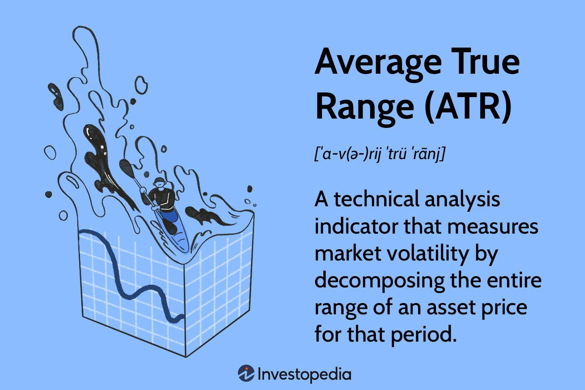

## Table of Contents

## What is the Average True Range (ATR) and why is it important in trading?

The Average True Range (ATR) is a technical indicator used in trading to measure how much an asset's price moves on average over a certain period. It was developed by J. Welles Wilder and is typically calculated over 14 days. The ATR takes into account the range between the high and low prices of each day, as well as any gaps from the previous day's close to the current day's open. This makes it a useful tool for understanding the volatility of an asset, showing traders how much the price is likely to fluctuate.

ATR is important in trading because it helps traders manage risk and set appropriate stop-loss orders. By understanding the average movement of an asset's price, traders can better predict potential price swings and adjust their trading strategies accordingly. For example, if the ATR is high, it suggests that the asset is more volatile, and traders might set wider stop-losses to avoid being stopped out by normal market fluctuations. Conversely, a low ATR indicates less volatility, allowing for tighter stop-losses. This way, ATR helps traders make more informed decisions and manage their trades more effectively.

## How is the ATR calculated?

The Average True Range (ATR) is calculated by first finding the True Range (TR) for each day. The True Range is the greatest of three values: the difference between the current day's high and low, the difference between the current day's high and the previous day's close, or the difference between the current day's low and the previous day's close. Once you have the True Range for each day, you then take an average of these values over a set period, usually 14 days.

To calculate the ATR, you start with the first True Range value and then use a smoothing formula to average the subsequent True Range values. The formula for the first ATR value is the average of the first 14 True Range values. After that, each new ATR value is calculated using the formula: ATR = [(Previous ATR) x 13 + Current TR] / 14. This method ensures that the ATR reflects the most recent price movements while still considering the historical volatility of the asset.

## What does the ATR tell us about market volatility?

The Average True Range (ATR) tells us how much the price of an asset is moving on average. It shows the level of volatility in the market. If the ATR is high, it means the price is moving a lot, and the market is more volatile. If the ATR is low, it means the price is not moving much, and the market is less volatile.

Traders use the ATR to understand how much risk they are taking. When the ATR is high, traders know that the price can change a lot in a short time, so they need to be careful. They might set bigger stop-losses to protect their trades from big price swings. When the ATR is low, traders can use smaller stop-losses because the price is not moving as much. This helps them manage their trades better and make safer decisions.

## Can you explain how to use the ATR in a basic trading strategy?

Using the ATR in a basic trading strategy can help you manage your trades better. One way to use it is by setting your stop-loss orders. When you see that the ATR is high, it means the market is moving a lot. So, you might want to set your stop-loss a bit farther away from your entry price. This gives your trade more room to move without getting stopped out too early. If the ATR is low, you can set your stop-loss closer because the market isn't moving as much.

Another way to use the ATR is to help decide how big your trades should be. If the ATR is high, the market is more risky, so you might want to trade smaller amounts to protect your money. When the ATR is low, the market is less risky, and you might feel more comfortable trading bigger amounts. By looking at the ATR, you can adjust your trading size to match the market's volatility, helping you keep your trades safe and steady.

## What are the common time periods used for calculating the ATR?

The most common time period used for calculating the Average True Range (ATR) is 14 days. This means you look at the price movements over the last 14 days to figure out how much the price usually moves. Traders like this time period because it gives a good balance between showing recent changes and the overall trend of the market.

Some traders might use different time periods depending on what they are trying to do. For short-term trading, they might use a shorter time period like 10 days to see quicker changes in the market. For longer-term trading, they might use a longer time period like 20 days to get a better idea of the bigger trends. No matter the time period, the ATR helps traders understand how much the price is moving and plan their trades better.

## How can the ATR be used to set stop-loss orders?

The ATR can help you set stop-loss orders by showing you how much the price usually moves. If the ATR is high, it means the price can change a lot. So, you might want to set your stop-loss farther away from your entry price. This gives your trade more room to move without getting stopped out too early. For example, if the ATR is 100 points, you might set your stop-loss 150 points away to give your trade enough space.

If the ATR is low, it means the price isn't moving as much. So, you can set your stop-loss closer to your entry price. This helps you keep your losses small because the market isn't as jumpy. For example, if the ATR is 20 points, you might set your stop-loss 30 points away. By using the ATR to set your stop-loss, you can better manage your trades and protect your money.

## What are the limitations of using the ATR in trading strategies?

Using the ATR in trading strategies has some limitations. One big problem is that the ATR only tells you how much the price is moving, but it doesn't tell you which way the price is going. So, you might know the market is moving a lot, but you won't know if it's going up or down. This can make it hard to decide when to buy or sell just based on the ATR alone.

Another limitation is that the ATR can give false signals if the market changes quickly. If there's a sudden big move in the market, the ATR might show a high number, but that big move might not last. Traders might set their stop-losses too far away because of a high ATR, and then the market calms down, leaving their trades open to bigger losses if the price moves against them. It's important to use the ATR along with other indicators and not rely on it completely for making trading decisions.

## How does the ATR compare to other volatility indicators like Bollinger Bands?

The Average True Range (ATR) and Bollinger Bands both help traders understand how much an asset's price is moving, but they do it in different ways. The ATR gives you a single number that shows the average size of price movements over a set time, usually 14 days. It tells you how much the price typically changes, which can help you set stop-losses and manage your trades. But the ATR doesn't tell you anything about where the price is going, just how much it's moving.

Bollinger Bands, on the other hand, show you a range of prices around the moving average of an asset. They use two lines, one above and one below the moving average, to show where the price might go. The space between these lines gets wider when the market is moving a lot and narrower when it's not. Unlike the ATR, Bollinger Bands can give you hints about the direction of the price, not just how much it's moving. Traders often use Bollinger Bands to spot when the price might be ready to change direction or break out of its current range.

## Can the ATR be effectively used in different market conditions, such as trending vs. ranging markets?

The ATR can be used effectively in both trending and ranging markets, but how you use it can be a bit different. In a trending market, where the price is clearly moving up or down, the ATR can help you see how strong the trend is. If the ATR is high, it means the price is moving a lot, and the trend might be strong. You might want to set your stop-loss farther away to stay in the trade longer and catch more of the trend. If the ATR is low, the trend might be weaker, and you might set your stop-loss closer to protect your money.

In a ranging market, where the price is moving sideways, the ATR can help you see how much the price is bouncing around within the range. If the ATR is high, the price might be hitting the top and bottom of the range more often, and you might set your stop-loss farther away to avoid getting stopped out by these big swings. If the ATR is low, the price might be moving less within the range, so you can set your stop-loss closer. By understanding how the ATR changes in different market conditions, you can adjust your trading strategy to fit what the market is doing.

## How can traders adjust the ATR settings for different trading instruments?

Traders can adjust the ATR settings to fit different trading instruments by changing the time period they use to calculate it. For example, if you're trading a fast-moving stock, you might want to use a shorter time period like 10 days to see quicker changes in the market. If you're trading a slower-moving asset like a commodity, you might use a longer time period like 20 days to get a better sense of the bigger trends. By choosing the right time period, you can make the ATR more useful for the specific instrument you're trading.

Another way to adjust the ATR settings is by looking at how volatile the instrument usually is. Some instruments, like [forex](/wiki/forex-system) pairs, can be very volatile, so you might want to use a higher ATR value to set your stop-losses. Other instruments, like bonds, might not move as much, so a lower ATR value could work better. By understanding the typical volatility of the instrument you're trading, you can fine-tune the ATR to help you make better trading decisions.

## What advanced strategies involve combining the ATR with other technical indicators?

One advanced strategy that traders use is combining the ATR with the Moving Average Convergence Divergence (MACD). The MACD helps traders see when the price might be ready to change direction. By using the ATR along with the MACD, traders can get a better idea of not just where the price might go, but also how much it might move. If the MACD shows a strong signal and the ATR is high, traders might feel more confident in their trade because they know the price could move a lot in the direction they expect. This can help them set their stop-losses and take-profit levels more accurately.

Another strategy involves using the ATR with Bollinger Bands. Bollinger Bands show a range where the price is likely to stay, and when the price moves outside this range, it might be ready for a big move. By looking at the ATR, traders can see how big that move might be. If the ATR is high and the price breaks out of the Bollinger Bands, traders might expect a bigger move and adjust their trade size and stop-losses accordingly. This combination helps traders understand both the potential direction and size of price movements, making their trading decisions more informed and strategic.

## How can historical ATR data be used to predict future market movements?

Historical ATR data can help traders guess how much the price might move in the future. By looking at the past ATR values, traders can see how much the price usually changes over time. If the historical ATR has been high, it might mean the market will keep moving a lot. If the historical ATR has been low, the market might stay calm. This helps traders set their stop-losses and decide how big their trades should be.

Using historical ATR data also helps traders spot when the market might be getting more or less volatile. If the ATR starts to go up after being low for a while, it might mean the market is about to get more exciting, with bigger price swings. If the ATR goes down after being high, the market might be calming down. By watching these changes, traders can adjust their strategies to match what the market is doing, making their trades safer and more likely to succeed.

## What is the Understanding of Average True Range (ATR)?

The Average True Range (ATR) is a pivotal volatility indicator introduced by J. Welles Wilder in his 1978 book, "New Concepts in Technical Trading Systems." This tool aids traders by quantifying market volatility through the analysis of price fluctuations over a specific number of periods. Unlike some indicators that hint at price direction, the ATR purely measures volatility, providing traders with a sense of how much an asset's price could move.

To calculate the ATR, one must first determine the True Range (TR) for a given period. The TR is the greatest of the following:

1. The difference between the current high and current low.
2. The absolute value of the difference between the current high and the previous close.
3. The absolute value of the difference between the current low and the previous close.

Mathematically, this can be represented as:

$$
TR = \max(\text{Current High} - \text{Current Low}, |\text{Current High} - \text{Previous Close}|, |\text{Current Low} - \text{Previous Close}|)
$$

Once the TR is calculated for each period, the ATR is found by averaging these TR values over a selected number of periods, typically 14 as suggested by Wilder. The ATR is calculated using the following formula:

$$
ATR = \frac{\sum_{i=1}^{n} TR_i}{n}
$$

where $n$ denotes the number of periods.

This indicator offers substantial benefits for traders by providing insights into the extent of market movement. The ATR serves as an essential tool in configuring strategies that adapt to market [volatility](/wiki/volatility-trading-strategies) without being misled by the directional trends, helping traders manage expectations and risks associated with price movements.

## How does ATR Stop Loss work?

To implement an ATR stop loss, traders begin by calculating the Average True Range (ATR) over a chosen number of periods. The ATR value is then multiplied by a specified multiplier to determine the distance at which to set the stop-loss order from the entry price. For example, if a trader decides on a multiplier of 1.5 and the ATR value is 10, the stop-loss would be set at a distance of 15 units from the entry price. This calculation helps in accounting for typical price volatility and prevents stop-loss orders from being triggered prematurely due to normal market fluctuations.

This approach is versatile, accommodating both long and short trading positions. In a long position, the stop-loss level is set below the entry price, calculated as:

$$
\text{Stop-Loss}_{\text{long}} = \text{Entry Price} - \left(\text{Multiplier} \times \text{ATR}\right)
$$

Conversely, for a short position, the stop-loss is set above the entry price:

$$
\text{Stop-Loss}_{\text{short}} = \text{Entry Price} + \left(\text{Multiplier} \times \text{ATR}\right)
$$

This adaptability ensures that the stop-loss mechanism sensitively reacts to market volatility, allowing for greater preservation of capital across various market conditions. Here is a simple Python function that calculates the stop-loss level for both long and short positions using ATR:

```python
def calculate_atr_stop_loss(entry_price, atr, multiplier, position_type='long'):
    stop_loss_distance = multiplier * atr
    if position_type == 'long':
        return entry_price - stop_loss_distance
    elif position_type == 'short':
        return entry_price + stop_loss_distance
    else:
        raise ValueError("Position type must be 'long' or 'short'.")

# Example usage:
entry_price = 100
atr = 10
multiplier = 1.5
print("Long position stop-loss:", calculate_atr_stop_loss(entry_price, atr, multiplier, 'long'))
print("Short position stop-loss:", calculate_atr_stop_loss(entry_price, atr, multiplier, 'short'))
```

Implementing ATR-based stop-loss strategies requires traders to carefully choose an appropriate multiplier that reflects their risk tolerance and market conditions. By using a dynamic stop-loss mechanism that adjusts to volatility, traders can effectively guard against excessive losses while allowing trades the necessary room to develop into profitable positions.

## What is the case study about the ATR Stop Loss in action?

In this case study, we analyze the application of the Average True Range (ATR) stop-loss strategy by a trader managing S&P 500 positions. The trader utilizes a 14-day ATR to account for the average volatility over approximately two weeks and applies a multiplier of 2x to set the stop-loss levels. This approach aims to provide sufficient room for the trades to experience normal market fluctuations without triggering the stop-loss too early, thus preserving the potential for profitability during trending market conditions.

The 14-day ATR is calculated by taking the average of the true range over the past 14 days. The true range for any given day can be defined as:

$$
\text{True Range (TR)} = \max(\text{High} - \text{Low}, |\text{High} - \text{Previous Close}|, |\text{Low} - \text{Previous Close}|)
$$

Where:
- High and Low are the highest and lowest prices of the day, respectively.
- Previous Close is the closing price of the previous day.

Average True Range is then computed as:

$$
\text{ATR} = \frac{1}{n} \sum_{i=1}^{n} \text{TR}_i
$$

Here, $n = 14$ for a 14-day ATR.

To apply the ATR-based stop loss, the trader determines the stop-loss level using the entry price and the ATR value, factoring in the selected multiplier:

$$
\text{Stop-Loss Level} = \text{Entry Price} \pm (2 \times \text{ATR})
$$

For example, if the entry price of a long position is 4,000 points on the S&P 500 and the 14-day ATR is 50 points, the stop-loss level would be:

$$
\text{Stop-Loss Level} = 4,000 - (2 \times 50) = 3,900
$$

This calculated stop-loss level of 3,900 points allows the position to withstand short-term volatility and remain open during potential upward trends.

This case study clearly demonstrates the adaptability of ATR stop-loss mechanisms. By adjusting to varying market volatility, the trader enhances their ability to capture significant market movements while simultaneously managing risk effectively. The dynamic nature of ATR stop-loss strategies provides an essential risk management framework that can lead to more consistent results in both stable and volatile market conditions.

## References & Further Reading

[1]: Wilder, J. W. (1978). ["New Concepts in Technical Trading Systems"](https://www.amazon.com/New-Concepts-Technical-Trading-Systems/dp/0894590278). Trend Research.

[2]: Lopez de Prado, M. (2018). ["Advances in Financial Machine Learning"](https://www.amazon.com/Advances-Financial-Machine-Learning-Marcos/dp/1119482089). Wiley.

[3]: Aronson, D. R. (2006). ["Evidence-Based Technical Analysis: Applying the Scientific Method and Statistical Inference to Trading Signals"](https://www.amazon.com/Evidence-Based-Technical-Analysis-Scientific-Statistical/dp/0470008741). Wiley.

[4]: Chan, E. P. (2009). ["Quantitative Trading: How to Build Your Own Algorithmic Trading Business"](https://github.com/ftvision/quant_trading_echan_book). Wiley.

[5]: Jansen, S. (2018). ["Machine Learning for Algorithmic Trading"](https://www.amazon.com/Hands-Machine-Learning-Algorithmic-Trading/dp/178934641X). Packt Publishing.