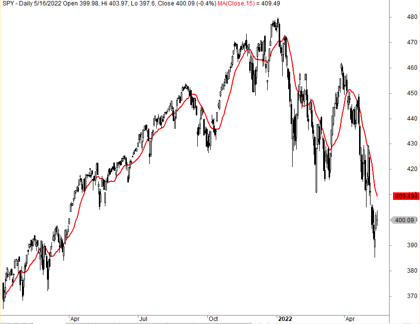

## Table of Contents

## What is the Average Up Trading Strategy?

The Average Up Trading Strategy is a method where you buy more of a stock as its price goes up. The idea is to increase your position in a stock that is doing well, hoping that the price will keep rising. Instead of waiting for a dip to buy more, you buy more shares as the price increases. This strategy can be risky because if the price suddenly drops, you could lose more money since you bought at higher prices.

However, if the stock continues to go up, you can make more profit because you have more shares at different, higher prices. This strategy works well in strong bull markets where prices keep going up. It's important to have a clear plan and know when to stop buying more shares. You should also set stop-loss orders to limit potential losses if the market turns against you.

## How does the Average Up Trading Strategy differ from other trading strategies?

The Average Up Trading Strategy is different from other trading strategies because it focuses on buying more of a stock as its price goes up. In contrast, many other strategies, like dollar-cost averaging, involve buying at regular intervals regardless of price, or waiting for a dip to buy more shares. With average up, you believe the stock will keep rising, so you increase your position as it goes up. This can lead to higher profits if the stock keeps going up, but it's riskier because you're buying at higher prices.

Other common strategies include the Average Down Strategy, where you buy more shares as the price goes down, hoping to lower your average cost per share. This is the opposite of average up and is used when you think the stock is undervalued and will recover. Another strategy is the Buy and Hold Strategy, where you buy a stock and hold onto it for a long time, regardless of short-term price changes. Each of these strategies has its own risks and benefits, and the choice depends on your belief about the stock's future and your risk tolerance.

## What are the basic principles behind the Average Up Trading Strategy?

The Average Up Trading Strategy is all about buying more of a stock as its price goes up. You do this because you think the stock will keep going up in the future. Instead of waiting for the price to drop to buy more, you buy more when the price is high. This can be risky because if the price suddenly goes down, you could lose more money since you bought at higher prices.

However, if the stock keeps going up, you can make more money because you have more shares at different, higher prices. This strategy works well when the market is doing really well and prices are going up a lot. It's important to have a clear plan and know when to stop buying more shares. You should also set stop-loss orders to limit how much you could lose if the market turns against you.

## Who should consider using the Average Up Trading Strategy?

People who should consider using the Average Up Trading Strategy are those who believe strongly in the growth potential of a stock. This strategy works best for investors who are confident that the stock will keep going up in price. If you think a stock is on a strong upward trend and you want to increase your investment as it grows, this could be a good strategy for you.

However, this strategy is not for everyone. It's riskier than other strategies because you're buying more shares at higher prices. If the stock suddenly drops, you could lose more money. So, it's important to be ready for that risk and have a plan in place. This strategy might be good for experienced investors who can handle the risk and know when to stop buying more shares.

## What are the potential risks associated with the Average Up Trading Strategy?

The Average Up Trading Strategy can be risky because you're buying more of a stock as its price goes up. If the stock suddenly drops, you could lose a lot of money because you bought at higher prices. This is different from other strategies where you might buy more when the price goes down. With average up, if your prediction about the stock going up is wrong, you could end up with a big loss.

Another risk is that you might keep buying more shares as the price goes up, thinking it will keep going up forever. But no stock goes up forever, and if you don't have a clear plan to stop buying more shares, you could end up buying at the peak right before a big drop. It's important to set limits on how much you're willing to spend and to use stop-loss orders to protect yourself from big losses if the market turns against you.

## How can one identify the right stocks or assets for the Average Up Trading Strategy?

To identify the right stocks or assets for the Average Up Trading Strategy, you need to look for stocks that are showing strong upward trends. This means the stock's price is going up over time, and it looks like it will keep going up. You can use charts and technical analysis to see if the stock is in a strong bull market. It's also good to look at the company's news and earnings reports to see if they are doing well and if people are excited about their future.

Another way to find the right stocks is to look at market trends and what other investors are doing. If a lot of people are buying a certain stock and pushing its price up, it might be a good candidate for the Average Up Strategy. But you need to be careful and do your own research. Just because a stock is popular doesn't mean it will keep going up. Make sure you understand the company and why its stock is going up before you start buying more as the price increases.

## What are some common entry and exit signals for the Average Up Trading Strategy?

For the Average Up Trading Strategy, entry signals are all about seeing a stock's price going up and thinking it will keep going up. You might decide to start buying more shares when you see the stock breaking through a resistance level, or when it's showing a strong upward trend on a chart. Another good entry signal could be when the company releases good news or earnings, and the stock price jumps up because of that. The key is to look for signs that the stock is in a strong bull market and has the [momentum](/wiki/momentum) to keep rising.

Exit signals for this strategy are important because they help you stop buying more shares and maybe even sell some to lock in profits. A common [exit](/wiki/exit-strategy) signal is when the stock hits a new resistance level and starts to slow down or reverse. You might also decide to exit if the stock's price starts to go down after you've been buying more as it went up. Setting a stop-loss order can be a good way to automatically exit if the stock drops to a certain price, helping you limit your losses. The main thing is to have a clear plan for when to stop buying more and when to sell, so you don't keep buying at higher and higher prices if the stock suddenly turns around.

## Can the Average Up Trading Strategy be automated, and if so, how?

Yes, the Average Up Trading Strategy can be automated using trading software or platforms that allow you to set up rules for buying and selling stocks. You can program the software to buy more shares of a stock as its price goes up, based on certain conditions you set. For example, you might tell the software to buy more shares every time the stock price increases by a certain percentage or breaks through a specific resistance level. This way, you don't have to watch the stock all the time and can still follow the strategy.

To set up the automation, you'll need to use a platform that supports [algorithmic trading](/wiki/algorithmic-trading). You'll input your rules into the system, like buying more shares when the stock goes up by 5% or setting a stop-loss order to sell if the stock drops by 10%. The software will then execute these trades automatically, following your strategy without your constant input. This can help you stick to your plan and take emotion out of the trading process, but it's still important to keep an eye on your investments and adjust your rules if needed.

## What historical performance data supports the effectiveness of the Average Up Trading Strategy?

The Average Up Trading Strategy can work well in strong bull markets where stock prices keep going up. For example, during the tech boom of the late 1990s, many investors used this strategy with tech stocks like Microsoft and Cisco. As these stocks kept rising, buying more shares as the price went up would have led to big profits. Historical data from that time shows that stocks like these could double or triple in value over short periods, rewarding those who kept buying as the price increased.

However, the strategy can also lead to big losses if the market suddenly turns down. The same tech stocks that soared in the late 1990s crashed in the early 2000s during the dot-com bust. Investors who kept buying more shares as prices went up were hit hard when the market reversed. This shows that while the Average Up Strategy can be very effective in the right conditions, it's also risky and depends a lot on timing and market conditions.

## How does market volatility affect the Average Up Trading Strategy?

Market [volatility](/wiki/volatility-trading-strategies) can make the Average Up Trading Strategy riskier. When the market is going up and down a lot, it's harder to tell if a stock will keep going up. You might buy more shares as the price goes up, but then the price could drop suddenly because of the volatility. This means you could lose money if you bought at a high price right before a big drop. So, you need to be careful and watch the market closely when it's volatile.

On the other hand, if the market is going up a lot even with some volatility, the Average Up Strategy can still work well. If the stock keeps going up over time, buying more shares as the price rises can lead to bigger profits. But you need to be ready for the ups and downs and have a good plan to know when to stop buying more shares. Setting stop-loss orders can help protect you from big losses if the market suddenly turns down.

## What advanced techniques can enhance the Average Up Trading Strategy?

One advanced technique to enhance the Average Up Trading Strategy is using technical analysis to spot trends and patterns. You can look at charts to see if a stock is in a strong upward trend and use indicators like moving averages to confirm that trend. For example, if a stock's price stays above its 50-day moving average and keeps going up, that's a good sign to keep buying more shares. You can also use tools like the Relative Strength Index (RSI) to see if a stock is overbought or oversold, helping you decide when to buy more or when to stop.

Another technique is to use [fundamental analysis](/wiki/fundamental-analysis) to understand the company's health and growth potential. This means looking at the company's earnings, revenue growth, and other financial metrics to see if the stock's upward movement is backed by strong fundamentals. If the company is doing well and likely to keep growing, it might be a good candidate for the Average Up Strategy. Combining both technical and fundamental analysis can give you a better idea of whether to keep buying more shares as the price goes up, and help you make more informed decisions.

## How can the Average Up Trading Strategy be integrated with other investment approaches for optimal results?

You can make the Average Up Trading Strategy work better by using it with other investment methods. One way is to use it with dollar-cost averaging, where you invest a fixed amount of money at regular times. This can help smooth out the ups and downs of the market. When the market is going up, you can use the Average Up Strategy to buy more shares as the price rises. But when the market is not doing well, you can stick to your regular dollar-cost averaging plan and buy at lower prices. This way, you can take advantage of the good times and protect yourself during the bad times.

Another way to combine the Average Up Strategy with other approaches is to use it with a diversified portfolio. Instead of putting all your money into one stock and trying to average up, you can spread your investments across different stocks or even different types of investments like bonds or real estate. This can reduce your risk because if one investment goes down, the others might go up. When you see a particular stock in your portfolio doing really well, you can use the Average Up Strategy to buy more of that stock. But you'll still have other investments to fall back on if the market turns against you.

## References & Further Reading

[1]: Bergstra, J., Bardenet, R., Bengio, Y., & Kégl, B. (2011). ["Algorithms for Hyper-Parameter Optimization."](https://dl.acm.org/doi/10.5555/2986459.2986743) Advances in Neural Information Processing Systems 24.

[2]: ["Advances in Financial Machine Learning"](https://www.amazon.com/Advances-Financial-Machine-Learning-Marcos/dp/1119482089) by Marcos Lopez de Prado

[3]: ["Evidence-Based Technical Analysis: Applying the Scientific Method and Statistical Inference to Trading Signals"](https://www.amazon.com/Evidence-Based-Technical-Analysis-Scientific-Statistical/dp/0470008741) by David Aronson

[4]: ["Machine Learning for Algorithmic Trading"](https://github.com/stefan-jansen/machine-learning-for-trading) by Stefan Jansen

[5]: ["Quantitative Trading: How to Build Your Own Algorithmic Trading Business"](https://www.amazon.com/Quantitative-Trading-Build-Algorithmic-Business/dp/1119800064) by Ernest P. Chan