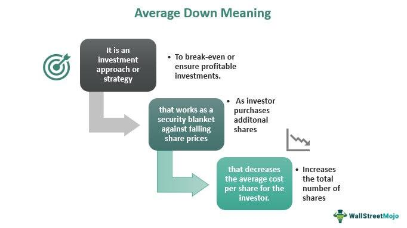

## Table of Contents

## What is averaging down in investing?

Averaging down in investing is when you buy more of a stock or investment that has gone down in price. Instead of selling it when the price drops, you buy more shares at the lower price. This can lower the average price you paid for each share. For example, if you bought a stock at $10 per share and it drops to $5, you might buy more shares at $5. This brings your average cost per share down.

However, averaging down can be risky. Just because a stock's price is lower doesn't mean it will go back up. Sometimes, a falling price can be a sign that the company is not doing well. If the stock keeps dropping, you could lose more money. It's important to research and understand why the stock's price is falling before deciding to buy more. Always think carefully before averaging down.

## Why do investors consider averaging down?

Investors consider averaging down because it can lower the average cost of their investment. If a stock they own goes down in price, buying more shares at the lower price can reduce the overall cost per share. This might seem like a good way to save money and potentially make a bigger profit if the stock price goes back up. For example, if an investor bought a stock at $10 and it drops to $5, buying more at $5 can make their average cost lower than $10.

However, averaging down can be risky. Just because a stock's price is lower does not mean it will go back up. Sometimes, a falling price is a sign that the company is having problems. If the stock keeps dropping, the investor could lose even more money. It's important for investors to understand why the stock's price is falling before deciding to buy more. They should think carefully and do their research before choosing to average down.

## What are the potential risks of averaging down?

Averaging down can be risky because it means buying more of a stock that is already losing value. If the stock keeps going down, you could lose even more money. For example, if you bought a stock at $10 and it drops to $5, buying more at $5 might seem like a good idea. But if the stock keeps falling, say to $2, you'll have more shares losing value, making your total loss bigger.

Another risk is that a falling stock price can be a sign that the company is in trouble. Maybe it's losing money, or people don't want to buy its products anymore. If you buy more shares without understanding why the price is dropping, you might be investing in a company that won't recover. It's important to do your research and understand the company's situation before deciding to average down.

Lastly, averaging down can lead to emotional investing. When you see your investment losing value, it can be hard to stay calm. You might feel pressured to buy more shares to "fix" the situation, but this can lead to bad decisions. It's better to think carefully and not let your emotions control your investing choices.

## Can you provide an example of averaging down with a stock?

Imagine you bought 100 shares of a company called ABC Corp at $10 each. So, you spent $1,000 in total. After a few months, the price of ABC Corp drops to $5 per share. You believe in the company and think the price will go back up, so you decide to buy 100 more shares at $5 each. Now, you have 200 shares, but you spent an extra $500. Your total cost is $1,500 for 200 shares.

After buying more shares at the lower price, your average cost per share is now $7.50. You calculate this by dividing your total cost ($1,500) by the total number of shares (200). If the stock price goes back up to $10, you'll make a profit because your average cost is lower than $10. But if the stock keeps going down, say to $2, you'll lose more money because you have more shares losing value. So, averaging down can be risky if the stock doesn't recover.

## How does averaging down affect the cost basis of an investment?

Averaging down changes the cost basis of your investment. The cost basis is the average price you paid for each share of a stock. When you buy more shares at a lower price, it lowers your overall average cost per share. For example, if you bought 100 shares at $10 each, your cost basis is $10. If the price drops to $5 and you buy 100 more shares, your new cost basis is $7.50 because you spent a total of $1,500 for 200 shares.

Lowering your cost basis can be good if the stock price goes back up. If the stock goes back to $10, you'll make a profit because your new average cost is $7.50, which is less than $10. But it can also be risky. If the stock keeps going down, you'll lose more money because you have more shares at a lower price. So, it's important to think carefully before deciding to average down and to understand why the stock's price is falling.

## What psychological factors influence the decision to average down?

When people decide to average down, their feelings often play a big role. One common feeling is hope. They might hope that the stock will go back up, so they buy more shares at a lower price. They might also feel attached to the stock because they already own it. This can make them want to keep investing in it, even if it's losing value. Another feeling is fear of missing out. If they think the stock will go back up soon, they might rush to buy more shares so they don't miss the chance to make a profit.

Another psychological [factor](/wiki/factor-investing) is loss aversion. This means people feel the pain of losing money more than the joy of making money. So, when a stock they own goes down, they might buy more shares to try to make up for the loss. They think that by lowering their average cost, they can turn their loss into a win. But this can be risky because they might be ignoring signs that the stock is in trouble. It's important for people to think carefully and not let their emotions control their decisions when it comes to averaging down.

## In what scenarios is averaging down considered a good strategy?

Averaging down can be a good strategy if you believe the stock's price will go back up. This might happen if the company is strong and the price drop was just a short-term problem. For example, maybe the stock went down because of a bad news story, but the company is still making good products and [earning](/wiki/earning-announcement) money. If you understand the company well and think the price will recover, buying more shares at a lower price can help you make more money when the stock goes back up.

But, it's important to be careful. Averaging down is not a good idea if the company is having big problems. If the stock price is falling because the company is losing money or people don't want its products anymore, buying more shares can make your losses bigger. Always do your research and make sure you know why the stock's price is dropping before you decide to average down. It's better to think carefully and not let your emotions control your investing choices.

## How does averaging down differ from dollar-cost averaging?

Averaging down and dollar-cost averaging are two different ways to invest in stocks. Averaging down means buying more of a stock that has gone down in price. You do this because you think the stock will go back up, and by buying more at a lower price, you can lower your average cost per share. For example, if you bought a stock at $10 and it drops to $5, you might buy more at $5 to lower your average cost. But this can be risky if the stock keeps going down.

Dollar-cost averaging is a different strategy. It means you invest a fixed amount of money in a stock or fund at regular times, no matter what the price is. For example, you might put $100 into a stock every month. If the price is high, you get fewer shares, but if the price is low, you get more shares. This can help you avoid trying to guess when the price will be at its best. It's a way to spread out your investment over time and can be less risky than averaging down.

## What are the tax implications of averaging down?

When you average down, you buy more shares of a stock at a lower price. This changes your cost basis, which is the average price you paid for each share. The tax implications depend on how you handle these shares when you sell them. If you sell the shares for more than your new average cost, you'll have a capital gain. You'll need to pay taxes on this gain. The tax rate depends on how long you held the shares. If you held them for more than a year, it's a long-term capital gain, which usually has a lower tax rate. If you held them for less than a year, it's a short-term capital gain, which is taxed at your regular income tax rate.

If you sell the shares for less than your new average cost, you'll have a capital loss. You can use this loss to reduce your taxable income. You can deduct up to $3,000 of capital losses from your income each year. If your losses are more than $3,000, you can [carry](/wiki/carry-trading) the extra over to future years. It's important to keep good records of your purchases and sales so you can figure out your cost basis and any gains or losses correctly. Always talk to a tax professional to make sure you're doing everything right and taking advantage of all the tax benefits you can.

## How can averaging down impact portfolio diversification?

When you average down, you buy more of a stock that has gone down in price. This can make your portfolio less diverse if you keep putting more money into the same stock. If you already have a lot of money in one stock and it keeps going down, buying even more of it means you're putting more of your money into that one stock. This can be risky because if that stock keeps losing value, your whole portfolio could be in trouble.

Diversification means spreading your money across different types of investments. This can help lower your risk because if one investment goes down, others might go up. When you average down, you're focusing on one stock instead of spreading your money out. So, it's important to think about how averaging down might affect your overall investment strategy. Make sure you're not putting too many eggs in one basket by buying more of a falling stock.

## What advanced strategies can be used in conjunction with averaging down?

One advanced strategy that can be used with averaging down is setting stop-loss orders. A stop-loss order is like a safety net. It tells your broker to sell a stock if it drops to a certain price. This can help you limit your losses if the stock keeps going down after you average down. For example, if you buy more shares at $5, you might set a stop-loss at $4. This way, if the stock falls to $4, it will be sold automatically, and you won't lose more money.

Another strategy is to use technical analysis to help decide when to average down. Technical analysis looks at past stock prices and trading volumes to predict future movements. By studying charts and patterns, you might see signs that a stock is about to go back up. If you see these signs, you might feel more confident about buying more shares at a lower price. But remember, technical analysis is not always right, so it's important to use it carefully and not rely on it too much.

## How do market conditions influence the effectiveness of averaging down?

Market conditions can really change how well averaging down works. If the market is going up, or if it's just a small dip, averaging down might be a good idea. When the market is strong, a stock that goes down a little might go back up soon. So, buying more shares at a lower price can help you make more money when the stock goes back up. But you need to know why the stock went down in the first place. If it's just a small problem and the company is still doing well, averaging down can be a smart move.

On the other hand, if the market is going down a lot, or if there's a big problem with the company, averaging down can be risky. When the whole market is falling, a stock that goes down might keep going down. If you buy more shares at a lower price, you could lose even more money if the stock keeps dropping. It's important to look at the bigger picture and understand what's happening in the market before you decide to average down. Always think carefully and do your research before making any decisions.

## What is Understanding Averaging Down?

Averaging down is an investment strategy utilized by investors to reduce the average cost of ownership of a stock by purchasing additional shares as the stock's price declines. By employing this approach, an investor is effectively betting that the decrease in share price is temporary and that the stock will eventually recover. This strategy is predicated on the assumption that the investor has confidence in the intrinsic value of the stock and its potential for rebound.

The mathematical foundation of averaging down can be depicted as follows: suppose an investor buys a certain number of shares $n_1$ at an initial price $p_1$. If the share price drops to $p_2$ and the investor purchases an additional $n_2$ shares, the new average purchase price $\bar{p}$ is given by:

$$
\bar{p} = \frac{n_1 \times p_1 + n_2 \times p_2}{n_1 + n_2}
$$

This formula illustrates how the average purchase price decreases when more shares are bought at the reduced price $p_2$.

Averaging down can provide a psychological advantage by offering a sense of control during market declines, as it allows investors to maintain their position with the potential for profit when prices ascend. However, it is crucial for investors to understand the inherent risks involved. If the stock price continues to fall, investors could face substantial losses, particularly if the price fails to recover. This underscores the importance of exercising due diligence and having a strong [fundamental analysis](/wiki/fundamental-analysis) backing the decision to average down.

Moreover, successful deployment of this strategy requires a disciplined approach, as well as a clear understanding of the underlying reasons behind the stock's price decline. External factors such as shifts in the company's financial health, industry changes, or broader economic impacts must be considered to avoid exacerbating potential losses.

In sum, averaging down can be a robust strategy when executed with care and proper analysis. It necessitates an investor's confidence in the long-term value of the investment and a comprehensive understanding of the stock market's dynamics.

## References & Further Reading

[1]: Bergstra, J., Bardenet, R., Bengio, Y., & Kégl, B. (2011). ["Algorithms for Hyper-Parameter Optimization."](https://dl.acm.org/doi/10.5555/2986459.2986743) Advances in Neural Information Processing Systems 24.

[2]: ["Advances in Financial Machine Learning"](https://www.amazon.com/Advances-Financial-Machine-Learning-Marcos/dp/1119482089) by Marcos Lopez de Prado

[3]: ["Evidence-Based Technical Analysis: Applying the Scientific Method and Statistical Inference to Trading Signals"](https://www.amazon.com/Evidence-Based-Technical-Analysis-Scientific-Statistical/dp/0470008741) by David Aronson

[4]: ["Machine Learning for Algorithmic Trading"](https://github.com/stefan-jansen/machine-learning-for-trading) by Stefan Jansen

[5]: ["Quantitative Trading: How to Build Your Own Algorithmic Trading Business"](https://books.google.com/books/about/Quantitative_Trading.html?id=j70yEAAAQBAJ) by Ernest P. Chan

[6]: Brooks, C. (2019). ["Introductory Econometrics for Finance."](https://www.cambridge.org/highereducation/books/introductory-econometrics-for-finance/75E9C608EA95A3AD87FB3BC683B9EBBF) Cambridge University Press.

[7]: Dixon, M., Klabjan, D., & Bang, J. H. (2018). ["Backtesting in Automated Trading: A Professional Approach to Algorithmic Trading."](https://www.semanticscholar.org/paper/Classification-Based-Financial-Markets-Prediction-Dixon-Klabjan/2ce382de24b859862aa87e53cce4e97c24591439) Quantitative Finance and Economics.