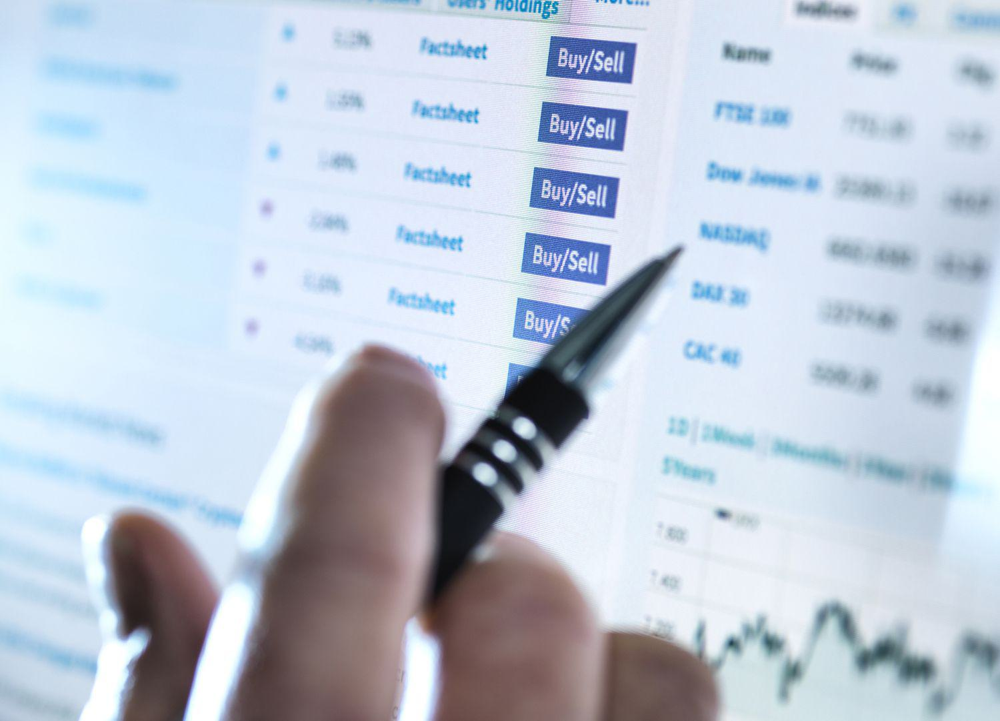

Investment strategies in the stock market serve as a crucial foundation for investors seeking to optimize their returns and minimize risks. Among these, averaging down and algorithmic trading represent two distinct approaches, each with its own set of principles and applications.

Averaging down is an investment strategy where an investor purchases additional shares of a stock as its price declines. The intent is to lower the average cost per share, potentially positioning the investor for larger gains when the stock price rebounds. For example, if an investor initially buys 100 shares at $10 each, spending a total of $1,000, and then another 100 shares at $8 each, the average price per share becomes $9: 



$$
\text{Average Price} = \frac{(100 \times 10) + (100 \times 8)}{200} = 9
$$

In contrast, algorithmic trading, often referred to as algo trading, employs computer algorithms to execute trades based on pre-defined criteria such as timing, price, and volume. These algorithms can analyze vast datasets at high speeds, enabling traders to exploit market inefficiencies with precision and speed that far exceed human capability. Algorithmic trading systems can operate on strategies like trend-following, arbitrage, and yes, even averaging down, to make emotion-free decisions.

Understanding these strategies is essential not only because they offer different pathways to manage investments but also because their applications can substantially impact portfolio performance. By exploring various strategies like averaging down and algorithmic trading, investors can better align their investments with their risk tolerance and financial goals. Such knowledge is especially crucial in today's dynamic market environment, where informed decision-making is key to capitalizing on investment opportunities while mitigating potential losses.

For investors, grasping the nuances of averaging down and algorithmic trading is more relevant than ever. With technological advancements changing the landscape of stock trading and increasing market volatility, the ability to integrate well-informed strategies into an investment plan can significantly enhance one's financial success. As these strategies continue to evolve, staying educated and adaptive remains a pivotal [factor](/wiki/factor-investing) for achieving long-term financial stability and growth in the stock market.

## Table of Contents

## What is Averaging Down?

Averaging down is an investment strategy used in stock trading where an investor purchases additional shares of a stock after its price has declined. By acquiring more shares at a lower price, the investor reduces the average cost per share of their total investment. This strategy is particularly appealing to investors who believe that the price drop is temporary and that the stock will rebound in the future.

For example, if an investor initially buys 100 shares of a stock at $50 each and the stock price falls to $40, they might decide to purchase an additional 100 shares. The average purchase price is recalculated as follows:

$$
\text{Average Price} = \frac{(100 \times 50) + (100 \times 40)}{200} = \frac{5000 + 4000}{200} = 45
$$

In this scenario, the average purchase price has decreased from $50 to $45, which can improve the return on investment if the stock's price rebounds above $45.

Averaging down is often compared to dollar-cost averaging, another investment strategy where an investor purchases a fixed dollar amount of a particular stock at regular intervals, regardless of its price. The key difference is that averaging down is a reactive strategy, implemented when the stock price falls, while dollar-cost averaging is proactive and systematic, aiming to spread risk over time.

The potential benefits of averaging down include reducing the overall cost of the investment and potentially enhancing returns if the stock price recovers. However, it also poses significant risks. Continuously purchasing stock as prices decline can lead to substantial financial exposure, especially if the price continues to fall and the initial investment thesis proves incorrect. This strategy can result in larger losses if the company faces serious financial troubles or if the market conditions remain unfavorable.

Investors considering this strategy should weigh these benefits and risks carefully, ensuring that they have strong confidence in the company's fundamentals and a robust risk management plan in place.

## Investment Timing and Averaging Down

Implementing an averaging down strategy in stock trading hinges critically on the timing of investment decisions. This strategy involves purchasing additional shares of a stock when its price declines. The objective is to reduce the average cost per share, thereby enhancing potential profitability when the stock's price rebounds. However, the efficacy and risks of this approach can vary significantly based on several factors, including company fundamentals and prevailing market conditions.

**Factors to Consider**

1. **Company Fundamentals**: Before deciding to average down, investors should analyze the company's fundamentals. Key indicators include earnings growth, debt levels, management effectiveness, and industry position. A strong fundamental foundation might justify averaging down, as it suggests the stock price dip could be temporary.

2. **Market Conditions**: The broader economic and market environment also influences the decision to average down. In a bull market, where prices generally rise, averaging down on a temporarily undervalued stock can be beneficial. Conversely, during bear markets, further declines are possible, and averaging down might exacerbate losses.

**Beneficial Situations for Averaging Down**

Averaging down can be advantageous in situations where a stock is undervalued due to temporary setbacks that do not affect its long-term viability. For instance, regulatory changes affecting the short-term operational environment, yet leaving the core business intact, might support such a strategy. Additionally, when a company's stock price drops following an earnings miss, yet analysts maintain robust future earnings forecasts, averaging down may be warranted.

**Risks of Misjudgment**

There are inherent risks if the factors leading to a price drop are misunderstood or underestimated. Misjudging a situation can lead to compounded losses, as continuing to invest in a declining stock equates to chasing losses. This scenario can be particularly perilous if the stock is in a sector undergoing structural changes or if the company faces existential threats, such as declining market share or increased regulatory pressures.

Investors must integrate robust risk management strategies, including establishing stop-loss levels and maintaining a diversified portfolio to mitigate these risks. Consistent reevaluation of the investment thesis, particularly in light of new information, is critical to navigate the potential pitfalls of an averaging down approach effectively.

## Algorithmic Trading and Averaging Down

Algorithmic trading, a prominent innovation in modern finance, utilizes computer algorithms to automatically execute trading orders at rapid speeds and with precision. These computer programs determine the timing, price, and quantity of orders, allowing traders to capitalize on market conditions without manual intervention. The integration of [algorithmic trading](/wiki/algorithmic-trading) into financial markets has grown significantly due to its potential to improve efficiency, reduce transaction costs, and facilitate complex trading strategies, such as averaging down.

Averaging down in the stock market involves purchasing additional shares of a stock as its price declines, thereby lowering the average purchase cost of the investment. While this strategy can mitigate losses, it requires meticulous timing and discipline, areas where algorithmic systems excel. Algorithmic systems can systematically implement averaging down by setting predetermined rules, such as buying a specific number of shares each time a stock drops by a certain percentage. This precision allows for consistent application of the strategy without the influence of emotional biases that often affect human traders.

One significant advantage of algorithms is their ability to manage trade execution efficiently. By leveraging historical data and real-time market analysis, algorithms can identify optimal entry points for averaging down. For example, an algorithm might be programmed to average down only if a stock's price falls by 10% and the company's fundamentals remain strong. This ensures that the strategy is executed under conditions likely to yield favorable results, reducing the risk of poor decision-making based on human emotion.

Several algorithmic strategies incorporate averaging down, such as mean reversion algorithms and [volatility](/wiki/volatility-trading-strategies)-based systems. Mean reversion strategies operate on the premise that prices will revert to their mean over time, thus buying more shares as prices decline is expected to be profitable. Volatility-based algorithms might average down during periods of high volatility, taking advantage of price swings to accumulate shares at lower averages.

The key benefits of using algorithms for averaging down are consistency and emotion-free decision-making. Algorithms follow predetermined rules without deviation, providing a disciplined approach that human traders may struggle to maintain, especially under stress. Furthermore, algorithms can backtest averaging down strategies across various market conditions, offering valuable insights into potential outcomes and helping to fine-tune the strategy.

In summary, the integration of averaging down with algorithmic trading presents an opportunity to enhance investment strategies by utilizing systematic, disciplined approaches that remove the emotional component of trading. This can result in more consistent, data-driven outcomes, aligning trading decisions with carefully analyzed market data and predefined criteria.

## Challenges and Considerations

Averaging down, while potentially lowering the average cost per share, carries several challenges and considerations, particularly in volatile markets. One of the primary pitfalls is the increased risk exposure that arises from acquiring additional shares as prices fall. This approach assumes that the price decline is temporary and ignores the possibility of a prolonged downturn, which can exacerbate losses if the security's value continues to diminish.

To mitigate these risks, it is crucial to establish robust risk management protocols and stop-loss levels. A stop-loss order, which automatically sells the security when it reaches a certain price, can prevent further losses. For instance, if a stock purchased at $50 declines to $25, the investor might set a stop-loss at $20 to limit potential downside. This predefined [exit](/wiki/exit-strategy) strategy is essential for capital preservation, especially in erratic market conditions.

Thorough [backtesting](/wiki/backtesting) and analysis are also fundamental in assessing the viability of averaging down as a strategy. Backtesting involves simulating the strategy using historical data to evaluate its potential effectiveness. By analyzing metrics such as the win rate, drawdown, and Sharpe ratio, investors can gain insights into how the strategy would have performed in different market environments. However, it is important to remember that past performance is not necessarily indicative of future results, particularly in unpredictable markets.

Incorporating human intuition in algorithmic strategies is another consideration when implementing averaging down. While algorithms offer consistency and emotion-free decision-making, they may lack the flexibility to adapt to unforeseen circumstances or nuanced market signals that a human trader might detect. Balancing algorithmic precision with human judgment could enhance decision-making processes. For example, a hybrid model could involve algorithms for executing trades under normalized conditions, while allowing human intervention during extraordinary market events.

In summary, while averaging down might offer opportunities to reduce the average purchase price, it requires careful consideration of risk exposure, disciplined risk management, thorough backtesting, and potentially the integration of human intuition to effectively navigate the complexities of volatile markets.

## Backtesting Averaging Down Strategies

Backtesting plays a crucial role in validating the effectiveness of trading strategies by simulating how these strategies would have performed with historical data. This process helps traders assess the potential viability of an averaging down strategy before putting real money at risk.

**Methods and Tools for Backtesting Averaging Down Strategies**

To backtest an averaging down strategy, traders require access to historical stock price data and a robust backtesting platform. Tools like Python, along with libraries such as Pandas for data manipulation and Backtrader or Zipline for backtesting, provide a comprehensive environment for testing strategies.

A simple Python script can illustrate how an averaging down strategy might be backtested:

```python
import backtrader as bt

class AverageDownStrategy(bt.Strategy):
    def __init__(self):
        self.order = None
        self.price = None  # To store purchase price
        self.count = 0  # To track number of purchases

    def next(self):
        if self.order:
            return  # Waiting for pending orders

        if self.data.close < self.price * 0.95:  # If price drops 5% below purchase
            self.count += 1
            self.order = self.buy(size=10)
            self.price = self.data.close

        if not self.position:
            self.order = self.buy(size=10)  # Start with an initial purchase
            self.price = self.data.close

cerebro = bt.Cerebro()
cerebro.addstrategy(AverageDownStrategy)
data = bt.feeds.YahooFinanceData(dataname='AAPL', fromdate=datetime(2020, 1, 1), todate=datetime(2021, 1, 1))
cerebro.adddata(data)
cerebro.run()
```

**Key Metrics to Assess**

Several key performance metrics provide insight into the effectiveness of a backtested strategy:

1. **Win Rate**: The percentage of trades that lead to a profit. It helps evaluate the strategy's historical success rate.
2. **Drawdown**: The largest drop from a peak to a trough in the account balance, offering a measure of potential risk.
3. **Time in the Market**: The duration over which trades are held to assess how well the strategy manages market exposure.
4. **Sharpe Ratio**: Calculated as the difference between the strategy's return and the risk-free rate divided by the standard deviation of returns. It gauges risk-adjusted performance.

**Best Practices for Maximizing Backtesting Results**

1. **Data Quality**: Ensure data used for testing is clean and adjusted for corporate actions like splits and dividends.
2. **No Overfitting**: Avoid fitting the strategy too closely to historical data. A complex model that performs well historically may not do so in the future.
3. **Walk-Forward Analysis**: Rather than using all historical data for a single backtest, perform multiple tests across different time periods to see how the strategy adapts.
4. **Sensitivity Analysis**: Explore how changes in parameters affect strategy performance, ensuring robustness.

**Real-World Examples of Backtested Strategies and Their Outcomes**

Averaging down has been backtested in various contexts with mixed results. For instance, studies have indicated that while averaging down can be effective during broad market uptrends or when deploying in fundamentally strong companies, it can exacerbate losses during protracted market declines. A balanced approach incorporating stringent risk management protocols and continuous evaluation may serve investors best.

Overall, backtesting a strategy like averaging down provides valuable insights into its potential effectiveness and enables strategic adjustments before engaging in live trading scenarios.

## Conclusion: Is Averaging Down Worth It in Algo Trading?

Averaging down, as an investment strategy, involves buying more of an asset as its price decreases. This reduces the average purchase price of the asset in an investor's portfolio, potentially positioning the investor for greater gains when the price rebounds. However, this strategy is not without its risks and requires careful consideration, especially when integrated with algorithmic trading systems.

### Benefits and Risks of Averaging Down

The primary benefit of averaging down is the reduced average cost per share, which can increase returns if the stock price recovers. However, this strategy also amplifies exposure to declining assets, potentially compounding losses if the market continues to fall or if the underlying asset deteriorates.

### Conditions Favoring Averaging Down

Averaging down might be most advantageous when an investor is confident in the long-term fundamentals of a company, but the stock is experiencing temporary difficulties—situations often driven by broader market volatility rather than company-specific issues. Investors employing this tactic should ensure their decisions align with both market conditions and sound company analysis to enhance the strategy's efficacy.

### Alignment with Market Conditions and Investment Goals

Integrating an averaging down approach into a broader investment strategy requires alignment with the investor's risk tolerance, investment horizon, and market conditions. Algorithmic trading can enhance this alignment by systematically executing trades based on pre-defined criteria, removing emotional biases while allowing adjustments based on real-time data and [machine learning](/wiki/machine-learning) insights.

### The Role of Algorithmic Trading

Algorithmic trading systems can enhance the effectiveness of averaging down by offering consistency and precision. They can structure averaging down strategies to execute only when certain market condition criteria are met, such as technical indicators signaling potential reversals or when [fundamental analysis](/wiki/fundamental-analysis) suggests undervaluation. Here is a simple Python code snippet illustrating how an algorithm might manage an averaging down strategy:

```python
def should_average_down(current_price, average_cost, fundamental_score):
    return current_price < average_cost and fundamental_score > threshold

current_price = 95  # current asset price
average_cost = 100  # average purchase price
fundamental_score = get_fundamental_score(stock_symbol)  # pseudo-function
threshold = 7  # example threshold based on analysis

if should_average_down(current_price, average_cost, fundamental_score):
    execute_buy_order(stock_symbol, amount)
```

### Future Potential and Final Thoughts

The integration of averaging down into algorithmic trading strategies could continue to evolve with advances in predictive analytics, [artificial intelligence](/wiki/ai-artificial-intelligence), and machine learning. These technologies promise to refine how strategies react to dynamic markets, offering the potential for improved timing and position sizing.

Ultimately, incorporating averaging down into an investment strategy hinges on a thorough understanding of both its benefits and risks. This approach should be part of a disciplined investment plan that considers overall market conditions and aligns with individual investment goals. Investors must remain vigilant and adaptable, continually reassessing the strategies in light of market changes and personal financial objectives.

In conclusion, while averaging down can yield significant advantages when used judiciously within algorithmic trading, it requires careful execution and robust risk management protocols to mitigate potential downsides. Continued innovation in algorithmic trading holds promise for enhancing the strategic implementation of averaging down, potentially leading to more refined and adaptive investment strategies.

## References & Further Reading

1. *"Algorithmic Trading: Winning Strategies and Their Rationale"* by Ernie Chan provides an in-depth exploration of the strategies employed in algorithmic trading, including backtesting methods and risk management principles. This book covers real-world examples and uses Python for implementation.

2. The article *"Averaging Down Explained: Strategy and Risks in Detail"* on Investopedia offers a comprehensive overview of the averaging down strategy, including its benefits, potential risks, and how it compares with other investment strategies such as dollar-cost averaging. Available at: [Investopedia](https://www.investopedia.com/terms/a/averagingdown.asp).

3. *"Principles: Life and Work"* by Ray Dalio discusses foundational principles in investment management and decision-making processes which can be beneficial in understanding broader investment strategies and the role of discipline in trading.

4. The National Bureau of Economic Research (NBER) working paper, *"Machine Trading: The Role of Traders in Financial Markets,"* examines the influence of algorithmic trading on the financial markets and explores how these systems are implemented to manage trades and reduce emotional bias.

5. *"Python for Finance: Analyze Big Financial Data"* by Yves Hilpisch offers practical insights into how Python can be leveraged to implement financial trading algorithms, including techniques for backtesting and analyzing trading strategies like averaging down.

6. The research paper *"Algorithmic Trading Strategies and Market Efficiency"* from the Journal of Financial Markets discusses the implications of algorithmic trading on market efficiency and highlights diverse algorithmic strategies that are used to enhance trade execution.

7. *"Flash Boys: A Wall Street Revolt"* by Michael Lewis provides a narrative on high-frequency trading and its significant impact on the stock markets. It offers a glimpse into the advantages and any controversial aspects of algorithm-based trading systems.

8. For those interested in furthering their understanding of trading strategies, the online course *"Algorithmic Trading Strategies"* by Coursera is a structured educational resource that covers various aspects of algorithmic trading, including strategy development and backtesting.

9. *"The Execution Premium: Linking Strategy to Operations for Competitive Advantage"* by Robert S. Kaplan and David P. Norton outlines comprehensive approaches to integrating strategic management processes, which are applicable in aligning trading strategies with investment goals.

10. For a practical guide on developing algorithmic trading systems, *"Building Winning Algorithmic Trading Systems"* by Kevin Davey provides a step-by-step framework, from idea generation to live trading, incorporating risk management and strategy optimization techniques.