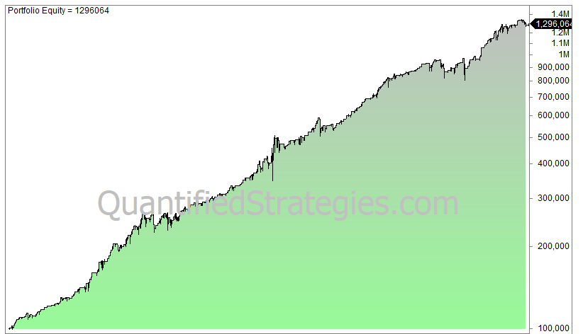

## Table of Contents

## What is the averaging down trading strategy?

Averaging down is a trading strategy where an investor buys more of a stock as its price goes down. The idea is to lower the average cost per share of the investment. For example, if you bought a stock at $10 per share and it drops to $8, you might buy more shares at $8. This would bring your average cost per share down, making it easier to make a profit if the stock price goes back up.

This strategy can be risky because it assumes the stock will eventually recover. If the stock keeps falling, the investor could lose more money. It's important to do research and understand why the stock price is dropping before deciding to buy more. Some investors use this strategy successfully, but it's not right for everyone and can lead to big losses if the stock doesn't recover.

## How does averaging down work in stock trading?

Averaging down in stock trading means buying more shares of a stock when its price goes down. If you bought a stock at $10 per share and it drops to $8, you might buy more shares at $8. This lowers your average cost per share. For example, if you bought 100 shares at $10 and then bought another 100 shares at $8, your total cost would be $1,800 for 200 shares. Your average cost per share would be $9 ($1,800 divided by 200 shares).

This strategy can be good if the stock price goes back up because you bought more shares at a lower price. But it's risky because the stock might keep going down. If you keep buying more shares as the price falls, you could lose a lot of money if the stock never recovers. It's important to think about why the stock price is dropping and if it's likely to go back up before you decide to average down.

## What are the potential benefits of using the averaging down strategy?

One benefit of using the averaging down strategy is that it can lower your average cost per share. If you buy more shares of a stock when its price goes down, you spend less money for each new share. This means that if the stock price goes back up, you might make more money because you bought some shares at a lower price. For example, if you bought a stock at $10 and it drops to $8, buying more at $8 lowers your average cost. If the stock goes back to $10, you make more profit on the shares you bought at $8.

Another benefit is that it can help you stay calm during market dips. When stock prices go down, it can be scary. But if you believe in the company and think the price will go back up, averaging down can make you feel better. Instead of selling your shares and losing money, you buy more and wait for the price to recover. This can be a good way to stick with your investment plan and not make quick decisions based on fear.

## What are the risks associated with averaging down?

Averaging down can be risky because it assumes that the stock price will go back up. If the stock keeps going down, you could lose more money. When you buy more shares at a lower price, you are putting more money into a stock that is already losing value. If the stock never recovers, you could end up losing a lot more than if you had just sold your original shares.

Another risk is that you might not understand why the stock price is dropping. If the company is having serious problems, like losing money or facing lawsuits, the stock might not go back up. By averaging down, you are betting that these problems will go away, but they might not. It's important to do your research and understand the reasons behind the price drop before deciding to buy more shares.

Lastly, averaging down can lead to emotional investing. It can be hard to watch your investment lose value, and buying more shares might make you feel like you are doing something to fix the problem. But this can lead to a cycle of buying more and more shares as the price keeps falling, which can be dangerous. Emotional decisions can cloud your judgment and lead to bigger losses.

## Can you provide an example of averaging down in action?

Imagine you bought 100 shares of a company called XYZ at $10 each. So, you spent $1,000 in total. A few weeks later, the price of XYZ drops to $8 per share. You believe in the company and think the price will go back up, so you decide to buy more shares. You buy another 100 shares at $8, spending another $800. Now, you have 200 shares and have spent a total of $1,800. Your average cost per share is now $9 ($1,800 divided by 200 shares).

A few months later, the price of XYZ goes back up to $10 per share. If you sell all your shares at $10, you will get $2,000 (200 shares times $10). After subtracting your total cost of $1,800, you make a profit of $200. If you had not bought more shares at $8, you would have only had 100 shares to sell at $10, making a profit of just $0 (selling for $1,000 minus your original cost of $1,000). By averaging down, you made more money because you bought more shares at a lower price.

## How does averaging down differ from other investment strategies?

Averaging down is different from other investment strategies because it involves buying more of a stock when its price goes down. Other strategies might focus on buying stocks when they are going up or selling stocks to take profits. For example, with a strategy called "buying the dip," you might wait for a small drop in price before buying, but you don't keep buying as the price keeps falling like you do with averaging down. Another strategy, called "dollar-cost averaging," involves investing a fixed amount of money at regular intervals, regardless of the price, which can lower your average cost over time but doesn't focus on buying more when the price is falling.

Averaging down can also be compared to strategies like "cutting losses," where you sell a stock if it drops below a certain price to avoid losing more money. With averaging down, you do the opposite—you buy more of the stock to try to lower your average cost and wait for the price to go back up. This makes averaging down a more aggressive strategy because it involves putting more money into a losing investment, hoping it will recover. Other strategies might be more cautious, focusing on minimizing losses or spreading investments across different stocks to reduce risk.

## What psychological factors should be considered when using the averaging down strategy?

When using the averaging down strategy, it's important to think about how you feel. Buying more of a stock when its price is going down can be scary. It might make you feel like you are doing something to fix the problem, but it can also make you feel more worried if the price keeps falling. This strategy can lead to emotional decisions, where you buy more shares because you are feeling anxious or hopeful, instead of making choices based on careful thinking.

It's also important to think about how much you believe in the company. If you really believe the stock will go back up, you might feel more comfortable buying more shares. But if you are not sure, it can be hard to keep putting more money into a stock that is losing value. It's a good idea to think about your feelings and make sure you are not letting them control your decisions. Taking a step back and thinking clearly can help you decide if averaging down is the right choice for you.

## In what market conditions is averaging down most effective?

Averaging down works best when the stock market is going through a short-term dip. This happens when the whole market or a certain industry is facing a temporary problem, but things are expected to get better soon. If you believe the stock you own will recover quickly, buying more shares at a lower price can help you make more money when the price goes back up. It's like buying something on sale, knowing it will be worth more later.

But, it's important to be careful. Averaging down can be risky if the market is in a long-term downturn or if the company you're investing in has big problems. If the stock keeps going down because of serious issues, buying more shares might just make your losses bigger. So, it's best to use this strategy when you're sure the dip is short and the stock will go back up.

## How can investors manage their risk when employing the averaging down strategy?

When using the averaging down strategy, investors can manage their risk by doing a lot of research before buying more shares. It's important to understand why the stock price is going down. If the company is having big problems, like losing money or facing lawsuits, it might be better to sell the stock instead of buying more. But if the price drop is because of a short-term problem that will go away soon, averaging down might be a good idea. By knowing the reasons behind the price drop, investors can make smarter choices and avoid big losses.

Another way to manage risk is by setting a limit on how much money you are willing to put into the stock. Decide ahead of time how many more shares you will buy and at what price. This helps stop you from buying too many shares if the price keeps falling. It's also a good idea to have a plan for when you will sell the stock, whether it goes up or keeps going down. By setting these limits, you can control your risk and make sure you don't lose more money than you can handle.

## What are the key indicators that suggest it's time to stop averaging down?

It's time to stop averaging down when the stock keeps going down and doesn't seem like it will go back up soon. If the company is having big problems, like losing a lot of money or facing serious lawsuits, it's a sign that the stock might not recover. These problems can make the stock price keep falling, and buying more shares could just make your losses bigger. It's important to watch the news and understand why the stock is going down. If it's because of something that won't go away quickly, it's better to stop averaging down and maybe even sell your shares to avoid losing more money.

Another sign to stop averaging down is if you've already spent a lot of money trying to lower your average cost. If you set a limit on how much you would spend and you've reached that limit, it's time to stop buying more shares. It's easy to get caught up in hoping the stock will go back up, but if you keep buying more and more as the price falls, you could end up losing a lot. It's important to stick to your plan and not let your emotions make you spend more than you can afford to lose.

## How does tax treatment affect the averaging down strategy?

When you use the averaging down strategy, tax treatment can affect how much money you keep after selling your stocks. If you sell your stocks for more than you paid, you have to pay capital gains tax on the profit. But if you bought more shares at a lower price, your average cost per share goes down. This means your profit might be bigger when you sell, so you could end up paying more in taxes. It's important to think about taxes when deciding to average down because it can change how much money you actually make.

Also, if the stock price keeps going down and you decide to sell at a loss, you can use that loss to lower your taxes. This is called a tax loss harvest. If you bought more shares at a lower price and then sold them all at a loss, you could use that loss to reduce the taxes you owe on other investments or income. But you need to be careful because tax rules can be complicated, and it's a good idea to talk to a tax advisor to make sure you're doing everything right.

## What advanced techniques can experts use to optimize the averaging down strategy?

Experts can use a technique called "dollar-cost averaging" along with averaging down to make their strategy better. Instead of putting all their money into a stock at once, they can spread out their investments over time. This means buying a fixed amount of the stock at regular times, no matter what the price is. By doing this, they can lower their average cost per share even more. If the stock price goes down, they buy more shares at the lower price, which can help them make more money if the price goes back up.

Another way experts can optimize averaging down is by using stop-loss orders. A stop-loss order is a way to tell your broker to sell the stock if it goes below a certain price. This can help limit how much money you lose if the stock keeps going down. Experts might set a stop-loss order after buying more shares at a lower price, so they don't lose too much if the stock doesn't go back up. By combining these techniques, experts can manage their risk better and maybe make more money with the averaging down strategy.

## What is Understanding Averaging Down in Algo Trading?

Averaging down in stock trading is a strategy where an investor buys more shares of a stock after its price has fallen since the initial purchase. This technique reduces the average purchase price of the shares, rather than fixing it at the original buying cost. Its application in [algorithmic trading](/wiki/algorithmic-trading) systems enhances strategic consistency, allowing traders to systematically undertake multiple purchases without succumbing to emotional biases.

The role of averaging down is particularly significant in algorithmic trading due to its potential to improve investment outcomes by lowering the required rebound for profitability. In mathematical terms, if an investor initially purchases a stock at price $P_1$ and later buys the same stock at a lower price $P_2$, the average cost per share $\bar{P}$ can be computed as:

$$
\bar{P} = \frac{n_1 \cdot P_1 + n_2 \cdot P_2}{n_1 + n_2}
$$

where $n_1$ and $n_2$ are the number of shares bought at prices $P_1$ and $P_2$, respectively. The aim is to decrease $\bar{P}$, thus requiring a lesser rise in stock price to reach a break-even point or achieve profitability.

Algorithmic systems manage this process automatically by implementing predefined rules to execute trades when certain market conditions are met. These systems assess stock prices, trading volumes, and other market indicators to determine optimal times to average down. This automated approach offers key advantages, including reduced average purchase costs and enhanced risk management, as it shields traders from emotional decision-making errors that can occur in volatile markets.

Algorithms apply various statistical and [machine learning](/wiki/machine-learning) models to evaluate patterns and trends, allowing for a disciplined application of the averaging-down strategy. For instance, algorithms may integrate indicators such as moving averages to signal buy points or use regression models to estimate potential price reversals.

Related strategies often include dollar-cost averaging, a technique where a fixed amount is invested regularly, regardless of market prices. This approach inherently involves some element of averaging down when prices decline. Trend-following and mean-reversion strategies also intersect with averaging down, as they attempt to capitalize on market fluctuations and corrections.

In summary, averaging down, when employed through algorithmic trading systems, can optimize purchasing strategies by reducing costs and managing risks with greater precision and efficiency. This methodical process aids traders in navigating dynamic market conditions while adhering to their investment parameters.

## References & Further Reading

[1]: Bergstra, J., Bardenet, R., Bengio, Y., & Kégl, B. (2011). ["Algorithms for Hyper-Parameter Optimization."](https://papers.nips.cc/paper/4443-algorithms-for-hyper-parameter-optimization) Advances in Neural Information Processing Systems 24.

[2]: ["Advances in Financial Machine Learning"](https://www.amazon.com/Advances-Financial-Machine-Learning-Marcos/dp/1119482089) by Marcos Lopez de Prado

[3]: ["Evidence-Based Technical Analysis: Applying the Scientific Method and Statistical Inference to Trading Signals"](https://www.amazon.com/Evidence-Based-Technical-Analysis-Scientific-Statistical/dp/0470008741) by David Aronson

[4]: ["Machine Learning for Algorithmic Trading"](https://github.com/stefan-jansen/machine-learning-for-trading) by Stefan Jansen

[5]: ["Quantitative Trading: How to Build Your Own Algorithmic Trading Business"](https://books.google.com/books/about/Quantitative_Trading.html?id=j70yEAAAQBAJ) by Ernest P. Chan