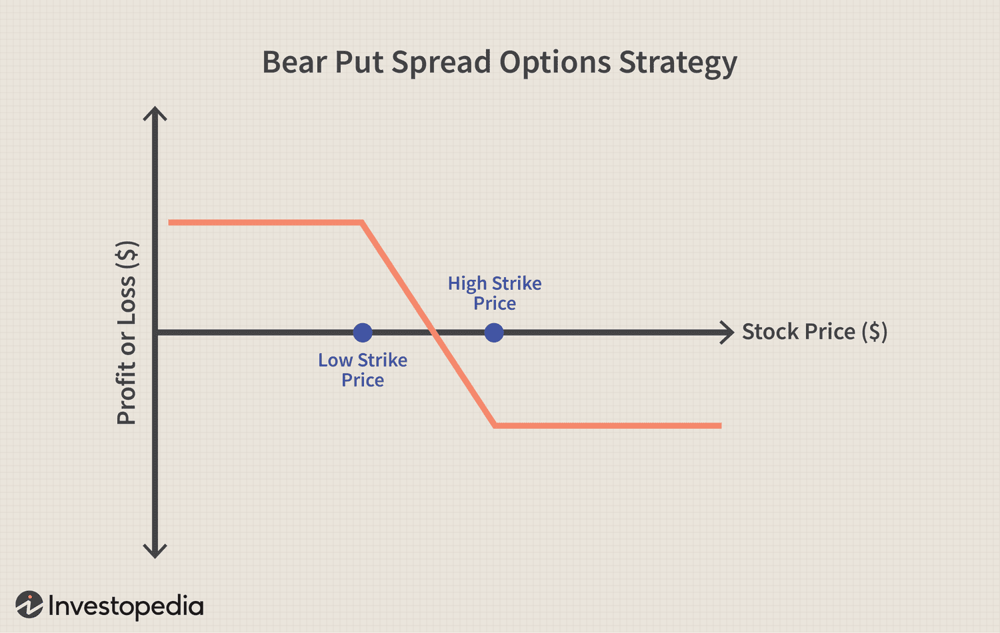

## Table of Contents

## What is an equity bear market?

An equity bear market is when the stock market goes down a lot for a long time. Usually, it means that stock prices drop by at least 20% from their highest point. This can make people feel worried and less likely to buy stocks. Instead, they might sell their stocks to avoid losing more money.

Bear markets can happen for many reasons, like problems in the economy, high interest rates, or big events like a financial crisis. When people think the economy will get worse, they often sell their stocks, which makes the bear market even worse. It's important for investors to stay calm and think about their long-term goals, even when the market is going down.

## What is market timing and how does it work?

Market timing is when people try to guess the best times to buy and sell stocks to make more money. They look at things like stock prices, economic news, and other signs to decide when to buy low and sell high. The idea is to get into the market when prices are low and get out before they start to drop. It sounds easy, but it's really hard to do well because nobody can predict the future perfectly.

A lot of people try market timing, but it often doesn't work out as planned. The stock market can be unpredictable, and even experts can get it wrong. Missing just a few good days in the market can make a big difference in how much money you make. That's why many people think it's better to invest for the long term instead of trying to time the market. They believe in staying invested and not trying to guess when to buy or sell.

## Why might someone want to avoid equity bear markets?

Someone might want to avoid equity bear markets because they can lose a lot of money. When stock prices drop by 20% or more, the value of their investments goes down a lot. This can be really stressful and scary, especially if they need that money soon. If they have to sell their stocks during a bear market, they might get less money than they hoped for.

Also, bear markets can make people feel worried and unsure about the future. When the market is going down, it's easy to start thinking that things will keep getting worse. This can make people want to sell their stocks quickly, even if it's not the best choice for the long run. Staying calm and not making quick decisions can be really hard during a bear market, so many people try to avoid them if they can.

## What are the basic principles of a market timing strategy?

Market timing is when people try to guess the best times to buy and sell stocks to make more money. They look at things like stock prices, economic news, and other signs to decide when to buy low and sell high. The idea is to get into the market when prices are low and get out before they start to drop. It sounds easy, but it's really hard to do well because nobody can predict the future perfectly.

A lot of people try market timing, but it often doesn't work out as planned. The stock market can be unpredictable, and even experts can get it wrong. Missing just a few good days in the market can make a big difference in how much money you make. That's why many people think it's better to invest for the long term instead of trying to time the market. They believe in staying invested and not trying to guess when to buy or sell.

## How can market timing help in avoiding bear markets?

Market timing can help people try to avoid bear markets by watching the market closely and making guesses about when it might go down. If someone thinks a bear market is coming, they might sell their stocks before the prices drop a lot. This way, they can keep their money safe and wait to buy stocks again when the market starts to go up.

But market timing is really hard to do right. Nobody can predict the future perfectly, and even experts can make mistakes. If someone sells their stocks too early or too late, they might miss out on good times in the market or lose money. That's why a lot of people think it's better to keep their money in the market for the long term instead of trying to guess when to buy and sell.

## What are the common indicators used in market timing strategies?

People who try to time the market often look at different signs to help them decide when to buy and sell stocks. One common sign is the price of stocks. They watch how stock prices are moving and try to spot patterns that might mean the market is going up or down. Another sign is economic news, like reports about jobs, inflation, or how the economy is doing overall. If the news is good, people might think the market will go up, but if it's bad, they might think it will go down.

Another thing people look at is something called technical indicators. These are special tools that help people see trends in the market. For example, moving averages can show if a stock's price is going up or down over time. The Relative Strength Index (RSI) can tell if a stock is being bought or sold a lot, which might mean it's time to buy or sell. People also pay attention to things like interest rates and big events in the world, because these can affect the market too.

Even though these signs can be helpful, they don't always work perfectly. The market can be unpredictable, and what worked in the past might not work in the future. That's why some people think it's better to invest for the long term and not try to guess when to buy and sell. They believe that staying in the market, even when it goes down, can be a better way to make money over time.

## What are the risks associated with market timing?

Market timing can be risky because it's really hard to guess when the market will go up or down. If someone sells their stocks too early, they might miss out on good times when the market goes up. This is called missing the "best days" in the market. Even missing just a few good days can make a big difference in how much money someone makes over time. On the other hand, if someone waits too long to sell, they might lose a lot of money when the market goes down. It's like trying to jump on and off a moving train without getting hurt.

Another risk is that market timing can make people feel stressed and worried. When they're always trying to guess what the market will do next, it can be hard to stay calm. This might make them make quick decisions that aren't good for their long-term goals. For example, they might sell their stocks when the market is going down, even though it might be better to wait. Trying to time the market can also lead to a lot of buying and selling, which can cost a lot in fees and taxes. So, while market timing sounds like a good idea, it can be risky and stressful.

## How does historical data support the effectiveness of market timing in avoiding bear markets?

Historical data shows that market timing is really hard to do well. Even experts who try to guess when the market will go up or down often get it wrong. For example, if someone tries to sell their stocks before a bear market starts, they might sell too early and miss out on good days when the market is still going up. Or, they might wait too long and lose a lot of money when the market finally goes down. Studies have shown that missing just a few of the best days in the market can make a big difference in how much money someone makes over time. So, while some people might get lucky with market timing, the data suggests it's not a reliable way to avoid bear markets.

On the other hand, historical data also shows that staying invested for the long term can be a better strategy. Over many years, the stock market has gone up more often than it has gone down. Even though bear markets happen, the market usually recovers and goes on to reach new highs. People who stay invested through the ups and downs tend to do better than those who try to time the market. This is because they don't miss out on the good days that can make up for the bad days. So, while market timing might sound like a good idea, the historical data supports the idea that it's better to stay in the market for the long run instead of trying to guess when to buy and sell.

## What advanced techniques can be used to enhance market timing strategies?

Advanced techniques for market timing can include using computer programs that look at a lot of data very quickly. These programs, called algorithms, can spot patterns in the market that might be hard for people to see. They can also use something called [machine learning](/wiki/machine-learning), which means the computer gets better at guessing what the market will do next by learning from past data. Another technique is to use what's called sentiment analysis, which looks at what people are saying on social media and news websites to guess how they feel about the market. If a lot of people are feeling worried, it might mean a bear market is coming.

Another way to improve market timing is by using more detailed technical indicators. For example, people might use something called the Bollinger Bands, which show if a stock's price is moving a lot or staying the same. They can also use the Fibonacci retracement levels, which help guess where the market might go next based on past price movements. These tools can give more information than just looking at simple moving averages or the RSI. But even with these advanced techniques, market timing is still really hard to do well. The market can be unpredictable, and what worked in the past might not work in the future.

## How can one evaluate the performance of a market timing strategy?

Evaluating the performance of a market timing strategy involves looking at how well it does over time compared to just staying invested. One way to do this is by checking the returns. If someone using market timing makes more money than someone who just keeps their money in the market, the strategy might be working well. But it's also important to look at how much risk they took. Did they make more money because they took bigger chances? If so, the strategy might not be as good as it seems because bigger risks can lead to bigger losses.

Another way to evaluate a market timing strategy is by looking at how often it gets things right. Did the strategy correctly guess when to buy and sell? If it guessed wrong a lot, it might not be very reliable. People can also use something called a benchmark, like the S&P 500, to see how their strategy compares to the overall market. If the strategy does better than the benchmark, it might be a good one. But if it does worse, it might be better to just stay invested in the market instead of trying to time it.

## What are the psychological challenges of implementing a market timing strategy?

Trying to time the market can be really hard on your mind. When you're always trying to guess when the market will go up or down, it can make you feel stressed and worried. If you make a wrong guess, you might lose money, and that can make you feel even worse. It's easy to start second-guessing yourself and feeling unsure about what to do next. This can lead to quick decisions that aren't good for your long-term goals, like selling your stocks when the market is going down just because you're scared.

Staying calm and not making quick decisions can be really tough during a bear market. When you see your investments losing value, it's hard not to panic. You might feel like you need to do something right away, even if it's not the best choice. This pressure can make it hard to stick to your market timing strategy. Even if you have a plan, the stress and fear can make you want to change it or give up on it altogether. That's why a lot of people find it easier to just stay invested for the long term instead of trying to time the market.

## How can machine learning and AI be integrated into market timing strategies to improve outcomes?

Machine learning and AI can help with market timing by looking at a lot of data really fast. These smart computer programs can spot patterns in the market that might be hard for people to see. They can learn from past data and get better at guessing what the market will do next. For example, AI can look at things like stock prices, economic news, and what people are saying on social media to make better guesses about when to buy and sell. This can help people avoid bear markets by selling their stocks before prices drop a lot.

Even though AI and machine learning can make better guesses, they're not perfect. The market can still be unpredictable, and what worked in the past might not work in the future. But using these smart tools can help people make more informed decisions and maybe avoid some of the big mistakes that come with trying to time the market. By using AI, people might feel less stressed and worried because they have a computer helping them make choices based on a lot of data.

## What is an Overview of the Market Timing Strategy?

The market timing strategy known as TrendYCMacro was developed to mitigate the risks associated with bear markets while aiming to achieve returns that surpass those of the broader stock market. This strategy employs a combination of indicators categorized into three groups: price-based, macroeconomic, and leading indicators. Each group plays a crucial role in providing signals to either enter or [exit](/wiki/exit-strategy) equity markets based on current and forecasted conditions.

Price-based indicators primarily focus on historical price movements and trends, utilizing metrics such as moving averages, [momentum](/wiki/momentum), and relative strength indices. These indicators help identify current market trends and potential reversals, serving as the fundamental backbone of the strategy.

Macroeconomic indicators, such as GDP growth rates, inflation rates, and unemployment levels, offer insights into the broader economic environment that can influence market dynamics. By incorporating these variables, TrendYCMacro aligns its timing strategy with prevailing economic circumstances, enhancing the predictive accuracy of market movements.

Leading indicators, often serving as predictive signals for economic activity, include metrics such as housing starts, consumer sentiment indices, and new orders for durable goods. These indicators provide early signals of economic shifts, allowing the strategy to anticipate market upswings or downturns before they occur.

The performance of the TrendYCMacro strategy is evaluated using key metrics, including annual returns, the Sharpe ratio, and maximum drawdown. The annual return is a measure of the percentage increase in the strategy's value over a year. The Sharpe ratio assesses the risk-adjusted return, calculated as:

$$
\text{Sharpe Ratio} = \frac{R_p - R_f}{\sigma_p}
$$

where $R_p$ is the expected portfolio return, $R_f$ is the risk-free rate, and $\sigma_p$ is the standard deviation of the portfolio's excess return. A higher Sharpe ratio implies better risk-adjusted performance. Maximum drawdown, the largest peak-to-trough decline, indicates the strategy's vulnerability in adverse market conditions.

TrendYCMacro's primary goal is to outperform the stock market's annual return while minimizing exposure to significant downturns. By systematically analyzing multiple data points across economic and technical dimensions, this strategy seeks to provide a robust framework for navigating equity markets effectively.

## References & Further Reading

[1]: Bergstra, J., Bardenet, R., Bengio, Y., & Kégl, B. (2011). ["Algorithms for Hyper-Parameter Optimization."](https://papers.nips.cc/paper/4443-algorithms-for-hyper-parameter-optimization) Advances in Neural Information Processing Systems 24.

[2]: ["Advances in Financial Machine Learning"](https://www.amazon.com/Advances-Financial-Machine-Learning-Marcos/dp/1119482089) by Marcos Lopez de Prado

[3]: ["Evidence-Based Technical Analysis: Applying the Scientific Method and Statistical Inference to Trading Signals"](https://www.amazon.com/Evidence-Based-Technical-Analysis-Scientific-Statistical/dp/0470008741) by David Aronson

[4]: ["Machine Learning for Algorithmic Trading"](https://github.com/stefan-jansen/machine-learning-for-trading) by Stefan Jansen

[5]: ["Quantitative Trading: How to Build Your Own Algorithmic Trading Business"](https://books.google.com/books/about/Quantitative_Trading.html?id=j70yEAAAQBAJ) by Ernest P. Chan