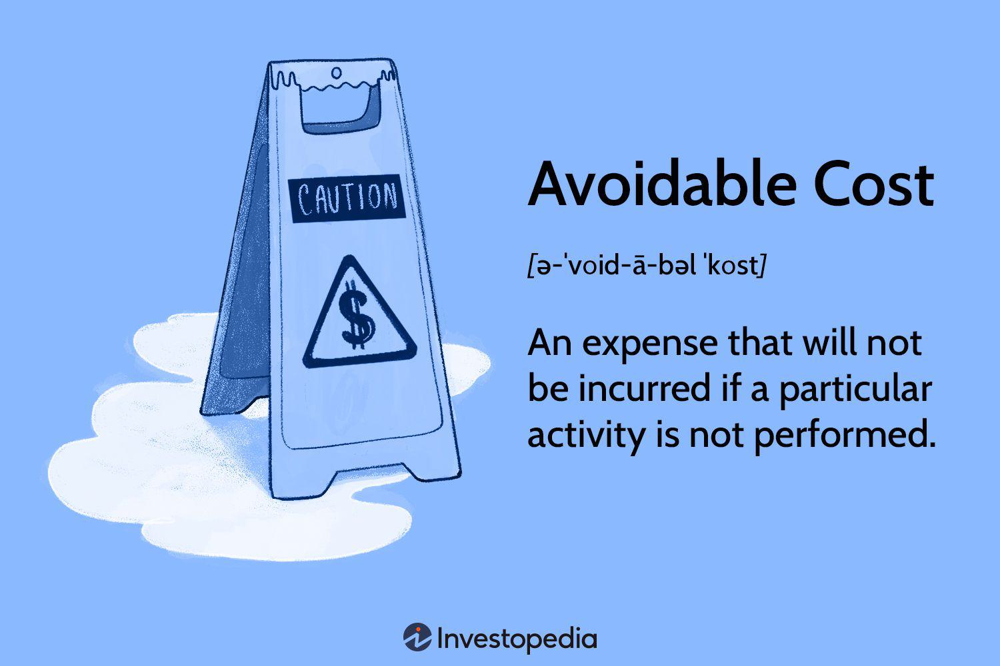

## Table of Contents

## What are avoidable costs?

Avoidable costs are expenses that a business can eliminate by changing its operations or decisions. For example, if a company decides to stop making a certain product, the costs associated with producing that product, like materials and labor, become avoidable costs. These costs are important for businesses to identify because they can help improve profitability by cutting unnecessary expenses.

Understanding avoidable costs helps businesses make better decisions about where to focus their resources. If a company can see that certain costs can be avoided without hurting their main business activities, they might choose to cut those costs. This can lead to more efficient operations and higher profits. For instance, if a business finds that it spends a lot on travel for meetings that could be done online, switching to virtual meetings could save money and time.

## How do avoidable costs differ from unavoidable costs?

Avoidable costs are costs that a business can get rid of if it makes certain changes. For example, if a company stops making a product, the costs to make that product, like the materials and the workers' pay, can be avoided. These costs are important because businesses can save money by not spending on things they don't need.

Unavoidable costs are costs that a business has to pay no matter what it does. These are costs that the business can't get rid of, like rent for the building or basic utilities. Even if the business makes changes, these costs will still be there. Knowing the difference helps businesses plan better and focus on what they can change to save money.

## Can you provide some basic examples of avoidable costs in a business?

Avoidable costs are expenses that a business can stop if it makes different choices. For example, if a company decides to no longer sell a certain type of product, it can avoid the costs of making that product. This includes the money spent on materials like fabric or metal, and the wages paid to workers who make the product. By stopping the production of that item, the business no longer has to pay for these things.

Another example of an avoidable cost is the expense of travel for business meetings. If a company decides to hold meetings online instead of traveling, it can save money on flights, hotels, and meals. These costs are avoidable because the business can choose a different way to meet that doesn't require spending money on travel. By switching to virtual meetings, the company can cut these expenses and use the money for something else.

## What are the main strategies for identifying avoidable costs?

One way to find avoidable costs is to look at each part of the business and see what costs are tied to specific activities or products. For example, if a company makes different products, it can look at the costs for each product separately. If they stop making one product, they won't need to spend money on the materials and labor for that product anymore. This helps the company see which costs can be cut if they make changes.

Another strategy is to review the business's expenses regularly. By doing this, the company can spot costs that are not necessary for the main business activities. For instance, if a business spends a lot on travel for meetings, they might find that switching to online meetings can save money. Regular reviews help the business stay on top of its spending and find ways to reduce costs that are not needed.

Lastly, talking to employees and getting their input can also help identify avoidable costs. Workers often know where money is being wasted because they see the day-to-day operations. They might suggest ways to cut costs, like using less expensive materials or finding more efficient ways to do things. Listening to their ideas can lead to finding costs that the business can avoid.

## How can a company implement cost avoidance measures?

To implement cost avoidance measures, a company first needs to look closely at its spending. They should check each part of the business to see where money is going and if any costs can be cut without hurting the main work. For example, if a company makes different products, they can stop making the ones that don't make much profit. By stopping those products, they won't need to spend money on materials and labor for them anymore. This helps the company save money and use it for more important things.

Another way to avoid costs is by changing how the business does things. For instance, if a company spends a lot on travel for meetings, they could switch to online meetings instead. This can save money on flights, hotels, and meals. The company should also talk to its workers because they might have good ideas on where to save money. Maybe they know of cheaper materials or better ways to do things. By listening to employees and making smart changes, the company can avoid unnecessary costs and keep more money in the business.

## What role does budgeting play in managing avoidable costs?

Budgeting helps a business see where its money is going and find costs it can avoid. When a company makes a budget, it looks at all its expenses and figures out how much it expects to spend in the future. This helps them spot costs that are not needed for the main work of the business. For example, if a company sees it's spending a lot on travel for meetings, they might decide to switch to online meetings to save money. By planning their spending carefully, a business can find and cut avoidable costs.

Using a budget also helps a company keep track of its spending over time. If they notice that certain costs keep going up, they can look into why and see if those costs can be avoided. For instance, if the cost of materials for a product is rising, the company might decide to stop making that product if it's not making enough profit. By regularly checking the budget, a business can make smart choices about where to cut costs and avoid spending money on things they don't need.

## How can technology help in tracking and reducing avoidable costs?

Technology can help businesses track and reduce avoidable costs by making it easier to keep an eye on spending. Special software can gather all the financial data in one place, so it's simple to see where money is going. For example, if a company uses an accounting program, it can quickly find out if they're spending too much on things like travel or office supplies. This helps them see which costs they can cut without hurting the main work of the business.

Once a business knows where it's spending too much, technology can help them find ways to spend less. For instance, if a company sees it's spending a lot on travel, they can use video conferencing tools to have meetings online instead. This saves money on flights and hotels. Also, technology can help automate tasks, like ordering supplies, which can cut down on labor costs. By using technology to track and manage spending, a business can avoid unnecessary costs and use its money more wisely.

## What are some advanced techniques for analyzing avoidable costs?

One advanced technique for analyzing avoidable costs is using data analytics. This means using special computer programs to look at a lot of financial information at once. These programs can find patterns and trends that might be hard to see just by looking at numbers on paper. For example, a company might use data analytics to see if they're spending more on certain materials at certain times of the year. If they find they're spending too much, they can look for cheaper options or decide to stop using those materials altogether.

Another technique is activity-based costing (ABC). This method looks at the costs of each activity in the business, not just the overall costs. By breaking down costs this way, a company can see which activities are costing more than they should. For instance, if a business finds that one part of making a product is very expensive, they might decide to change how they do that part or stop making that product. ABC helps businesses understand where their money is going and find ways to cut costs that aren't needed.

## Can you discuss case studies where companies successfully managed avoidable costs?

One well-known case is how General Electric (GE) managed to cut avoidable costs by using a program called "Work-Out." In the late 1980s, GE was facing high costs and needed to find ways to save money. They started the Work-Out program, which got employees involved in finding ways to cut costs. Employees suggested many ways to make things more efficient, like reducing unnecessary meetings and using cheaper materials. By listening to their workers, GE was able to avoid a lot of costs and save billions of dollars.

Another example is how Southwest Airlines managed to keep their costs low by focusing on avoidable expenses. Southwest decided to fly only one type of airplane, the Boeing 737. This choice helped them avoid the costs of training staff on different planes and keeping extra parts for different models. They also chose to fly to smaller airports, which are usually cheaper to use than big airports. By making these smart choices, Southwest was able to keep their costs down and offer cheaper flights to their customers.

## How do avoidable costs impact long-term financial planning and strategy?

Managing avoidable costs is important for a company's long-term financial planning and strategy. When a business can find and cut these costs, it can save money that can be used for other important things, like growing the business or investing in new projects. For example, if a company stops making a product that isn't making much profit, they can avoid the costs of materials and labor for that product. This saved money can then be used to make other products that do make a profit, helping the business grow over time.

Avoidable costs also help a company stay flexible and ready for changes in the market. If a business knows which costs it can cut, it can quickly adjust its spending when things change, like if there's a sudden drop in sales or if prices for materials go up. By keeping an eye on avoidable costs, a company can make smart choices about where to spend its money, making sure it stays strong and able to handle whatever comes its way in the future.

## What are the potential pitfalls in focusing too heavily on cost avoidance?

Focusing too much on avoiding costs can make a business miss out on important things. For example, if a company cuts costs too much, it might stop spending money on things like training or new technology. These things can help the business grow and stay ahead of others. If the business only thinks about saving money, it might not be ready for new chances to make more money or improve how it works.

Also, cutting costs too much can make workers unhappy. If a company always tries to spend less, it might lower wages or make people work longer hours. This can make employees feel bad and less likely to do their best work. In the end, this can hurt the business because happy workers usually do a better job and help the company do well. So, while it's good to save money, a business should also think about how its choices affect the people who work there and the chances it has to grow.

## How can a company balance cost avoidance with necessary investments for growth?

A company can balance cost avoidance with necessary investments for growth by carefully planning its budget. They should look at all their costs and see which ones they can cut without hurting the main work of the business. For example, if they find they're spending too much on travel, they might switch to online meetings to save money. At the same time, they need to make sure they're still spending money on things that help the business grow, like new technology or training for employees. By finding the right balance, the company can save money and still invest in its future.

It's also important for a company to listen to its employees when making these decisions. Workers often have good ideas about where to save money and where to spend it. For instance, they might know of cheaper materials that can be used without lowering the quality of the product. By talking to employees and getting their input, the company can make smart choices about where to cut costs and where to invest. This way, they can avoid unnecessary expenses while still making sure they have the resources they need to grow and succeed in the long run.

## What is the Detailed Analysis of Key Costs in Algo Trading?

Algorithmic trading involves several key cost components that significantly impact the profitability and efficiency of trading strategies. Understanding these costs is essential for optimizing operations and maximizing returns.

**Transaction Costs**

Transaction costs are the direct expenses incurred when executing trades, encompassing brokerage commissions and fees on each transaction. These costs can accumulate rapidly, especially for high-frequency trading systems that execute numerous trades daily. To illustrate, if a trading strategy involves 1,000 transactions per day with an average commission of $0.005 per trade, the daily transaction cost would be $1{,}000 \times 0.005 = \$5$, which equates to approximately $1,250 per month. Effective management of transaction costs involves negotiating lower commission rates with brokers or employing smart order routing to realize cost savings.

**Market Impact Costs**

Market impact costs occur when large trades influence the market price of the security being traded, thereby increasing the cost of the trade execution. This cost is particularly relevant for institutional or large [volume](/wiki/volume-trading-strategy) traders. The market impact is often described by the slippage rate, which is the difference between the expected price of a trade and the actual price at which the trade is executed. Mathematically, if $P_{\text{expected}}$ is the expected price and $P_{\text{actual}}$ is the actual price, then the slippage cost is calculated as:

$$
\text{Slippage Cost} = (P_{\text{actual}} - P_{\text{expected}}) \times \text{Trade Volume}
$$

Traders can mitigate market impact costs by dividing large orders into smaller trades and executing them over time or using algorithmic strategies like incremental execution to minimize market disturbance.

**Opportunity Costs**

Opportunity costs represent potential profits lost when a trading opportunity is missed or delayed. These costs are typically incurred due to inefficiencies in trading systems or delays in decision-making processes. For example, suppose a trader identifies a potential profit of $10,000 from a trade opportunity, but due to latency or processing delays, the trade is not executed in time. The entire $10,000 could be considered an opportunity cost. 

Reducing opportunity costs involves improving algorithmic decision-making speed and ensuring robust network infrastructure to decrease latency. Advanced monitoring systems and [machine learning](/wiki/machine-learning) models that predict and act on trading signals promptly are effective tools in minimizing these costs.

By meticulously analyzing and managing these key costs—transaction, market impact, and opportunity costs—traders can enhance their [algorithmic trading](/wiki/algorithmic-trading) performance, ultimately leading to greater efficiency and profitability.

## References & Further Reading

[1]: Bergstra, J., Bardenet, R., Bengio, Y., & Kégl, B. (2011). ["Algorithms for Hyper-Parameter Optimization."](https://dl.acm.org/doi/10.5555/2986459.2986743) Advances in Neural Information Processing Systems 24.

[2]: ["Advances in Financial Machine Learning"](https://www.amazon.com/Advances-Financial-Machine-Learning-Marcos/dp/1119482089) by Marcos Lopez de Prado

[3]: ["Evidence-Based Technical Analysis: Applying the Scientific Method and Statistical Inference to Trading Signals"](https://www.amazon.com/Evidence-Based-Technical-Analysis-Scientific-Statistical/dp/0470008741) by David Aronson

[4]: ["Machine Learning for Algorithmic Trading"](https://github.com/stefan-jansen/machine-learning-for-trading) by Stefan Jansen

[5]: ["Quantitative Trading: How to Build Your Own Algorithmic Trading Business"](https://www.amazon.com/Quantitative-Trading-Build-Algorithmic-Business/dp/1119800064) by Ernest P. Chan