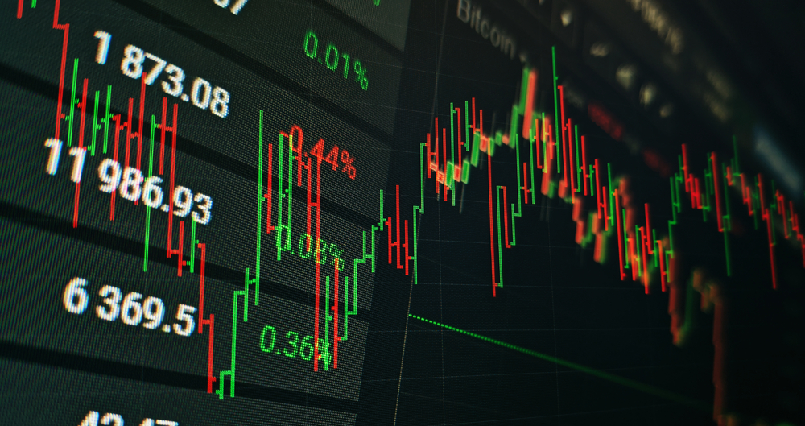

## Table of Contents

## What is an away-from-the-market trade?

An away-from-the-market trade is when someone buys or sells a stock at a price that is different from the current market price. This can happen for many reasons, like if a big investor wants to buy a lot of shares without changing the market price too much. They might agree to buy the shares at a slightly higher or lower price than what is currently shown on the market.

These trades can happen on special platforms or through private agreements between buyers and sellers. They are not as common as regular trades that happen on the main stock exchanges. Away-from-the-market trades can be useful for big investors who want to keep their trading activities private and avoid affecting the market price too much with their large orders.

## How does an away-from-the-market trade differ from a market trade?

An away-from-the-market trade is when someone buys or sells a stock at a price that is not the same as the current market price. This is different from a market trade, where the stock is bought or sold at the price that is currently shown on the stock exchange. In a market trade, the price you see is the price you get, and it happens right away on the main stock exchange.

Away-from-the-market trades can happen because someone wants to buy or sell a lot of shares without changing the market price too much. They might agree to a different price in private, away from the main stock exchange. This can be helpful for big investors who want to keep their trades secret and not affect the market price with their big orders. Market trades, on the other hand, are more common and happen openly on the stock exchange, where everyone can see the price and the trade.

## What are the common reasons for executing away-from-the-market trades?

Away-from-the-market trades are often used when someone wants to buy or sell a lot of shares without causing big changes in the market price. Big investors might do this because they know that if they put in a huge order on the main stock exchange, it could make the price go up or down a lot. By agreeing to trade at a different price away from the market, they can keep their big orders secret and avoid making the market price move too much.

Another reason for away-from-the-market trades is to keep trading activities private. Some investors might not want everyone to know what they are doing, so they use these special trades to keep their plans secret. This can be important for them because it helps them make better decisions without other people copying their moves or trying to take advantage of their trades.

## Can you explain the process of executing an away-from-the-market trade?

To execute an away-from-the-market trade, the first step is usually for the buyer and seller to agree on a price that is different from the current market price. They might do this because one of them wants to buy or sell a lot of shares without making the market price change too much. They can talk to each other directly or use special platforms that are not the main stock exchange. Once they agree on the price, they make a private agreement. This agreement says how many shares they will trade and at what price.

After the agreement is made, they can go ahead with the trade. Instead of sending the order to the main stock exchange where everyone can see it, they use a different system or a private deal to complete the trade. This way, the trade happens away from the market, and it does not affect the market price right away. The trade is then reported to the proper places, but it is done in a way that keeps the details private and does not cause big changes in the market.

## What are the potential benefits of away-from-the-market trades for investors?

Away-from-the-market trades can help big investors buy or sell a lot of shares without making the market price go up or down too much. If a big investor wants to buy a lot of shares, putting in a big order on the main stock exchange could make the price go up. By agreeing to trade at a different price away from the market, they can keep their big orders secret and avoid changing the market price too much. This can be good for them because they can get the shares they want without making the price go up.

Another benefit is that away-from-the-market trades can keep trading activities private. Some investors might not want everyone to know what they are doing. By using these special trades, they can keep their plans secret. This can be important for them because it helps them make better decisions without other people copying their moves or trying to take advantage of their trades. Keeping things private can give them a better chance to do well in the market.

## What risks are associated with away-from-the-market trades?

Away-from-the-market trades can be risky because they happen at prices that are not the same as the current market price. If the price they agree on is very different from the market price, one side might end up losing money. For example, if someone agrees to buy shares at a higher price than the market, they might pay more than they need to. On the other hand, if they agree to sell at a lower price, they might get less money than they could have.

Another risk is that these trades are not as open as regular market trades. Because they happen away from the main stock exchange, it can be harder to make sure everything is fair and honest. If something goes wrong, it might be harder to fix or get help. Also, because these trades are private, other investors might not know about them, which can make the market less fair for everyone.

## How do regulations affect away-from-the-market trades?

Regulations can make away-from-the-market trades safer and more fair. They set rules that everyone has to follow, even when trading away from the main stock exchange. These rules can say things like how trades need to be reported and what information has to be shared. This helps make sure that even though the trades happen privately, they are still honest and do not hurt the market. Regulations can also help stop people from using away-from-the-market trades to do things that are not allowed, like insider trading.

However, regulations can also make away-from-the-market trades harder to do. Some rules might say that trades have to be reported quickly, which can be tricky if you want to keep your trades secret. Other rules might limit how much you can trade away from the market or what kinds of trades you can do. This can make it harder for big investors to use away-from-the-market trades to buy or sell a lot of shares without changing the market price. So, while regulations help keep things fair, they can also make it more difficult to use these special trades.

## What role do dark pools play in away-from-the-market trading?

Dark pools are special places where away-from-the-market trades can happen. They are like private trading spots where big investors can buy and sell shares without everyone knowing about it. This helps them keep their big orders secret and not change the market price too much. Dark pools are different from the main stock exchange because they do not show the prices and orders to everyone. Instead, they keep the details of the trades private, which can be good for big investors who want to trade a lot without making the market move.

However, dark pools can also make things less fair for other investors. Because the trades happen in secret, it can be hard for others to know what is going on in the market. This can make it harder for them to make good trading decisions. Also, dark pools have to follow rules to make sure they are not used for bad things like insider trading. These rules can make it harder to use dark pools, but they help keep the market honest and fair for everyone.

## How can an investor identify if a trade was executed away from the market?

An investor can find out if a trade was done away from the market by looking at the trade details. If the trade price is different from the current market price, it might be an away-from-the-market trade. Also, these trades might not show up right away on the main stock exchange's records. Instead, they might be reported later, and sometimes with less detail than regular trades.

Another way to tell is by checking if the trade happened on a special platform or in a dark pool. These are places where trades can happen privately, away from the main stock exchange. If an investor sees that a trade was done through one of these, it's likely an away-from-the-market trade. By looking at where and how the trade was done, an investor can figure out if it was away from the market.

## What strategies can traders use to optimize away-from-the-market trades?

Traders can use different strategies to make away-from-the-market trades work better for them. One way is to use dark pools, which are private places where big trades can happen without everyone knowing about them. This can help traders keep their big orders secret and not change the market price too much. Another strategy is to carefully pick the right time to trade. If they wait for a time when the market is less busy, they might be able to agree on a better price away from the market without causing big changes in the market price.

Traders can also work with other traders or use special platforms to find the best price for their trades. By talking to other traders directly, they might be able to agree on a price that is better than the market price. Using special platforms can also help them find other traders who want to buy or sell at a price away from the market. This can help them get the best deal possible without making the market price move too much.

## How do away-from-the-market trades impact market transparency and efficiency?

Away-from-the-market trades can make the market less clear because they happen in private. When big trades happen away from the main stock exchange, other investors might not know about them right away. This can make it hard for them to understand what is really going on in the market. If a lot of trades happen in secret, it can be harder for everyone to make good decisions because they do not have all the information they need.

However, away-from-the-market trades can also help the market work better in some ways. Big investors might use these trades to buy or sell a lot of shares without making the market price change too much. This can keep the market stable and help big investors do what they need to do without causing big swings in prices. So, while these trades can make the market less clear, they can also help it run more smoothly by letting big investors trade without rocking the boat too much.

## What are the future trends and technological advancements expected in away-from-the-market trading?

In the future, away-from-the-market trading is likely to see more use of technology to make these trades easier and safer. One big trend could be the use of better computer systems and [artificial intelligence](/wiki/ai-artificial-intelligence) to help find the best prices for trades away from the market. These systems can look at a lot of information quickly and help traders agree on prices that are good for both sides. Also, new technology might make it easier to keep track of these trades and make sure they follow the rules, which can help keep the market fair and honest.

Another trend could be more use of blockchain technology for away-from-the-market trades. Blockchain can make these trades more secure and transparent because it keeps a record of every trade that cannot be changed. This can help build trust in these private trades and make it easier for everyone to see what is happening, even if the trades are not on the main stock exchange. As technology keeps getting better, away-from-the-market trading might become more common and easier for more people to use.

## References & Further Reading

[1]: Bergstra, J., Bardenet, R., Bengio, Y., & Kégl, B. (2011). ["Algorithms for Hyper-Parameter Optimization."](https://dl.acm.org/doi/10.5555/2986459.2986743) Advances in Neural Information Processing Systems 24.

[2]: ["Advances in Financial Machine Learning"](https://www.amazon.com/Advances-Financial-Machine-Learning-Marcos/dp/1119482089) by Marcos Lopez de Prado

[3]: ["Evidence-Based Technical Analysis: Applying the Scientific Method and Statistical Inference to Trading Signals"](https://www.amazon.com/Evidence-Based-Technical-Analysis-Scientific-Statistical/dp/0470008741) by David Aronson

[4]: ["Machine Learning for Algorithmic Trading"](https://github.com/stefan-jansen/machine-learning-for-trading) by Stefan Jansen

[5]: ["Quantitative Trading: How to Build Your Own Algorithmic Trading Business"](https://www.amazon.com/Quantitative-Trading-Build-Algorithmic-Business/dp/1119800064) by Ernest P. Chan