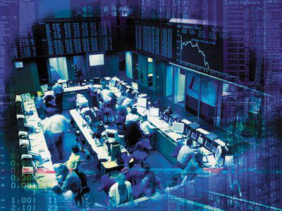

## Table of Contents

## What is an ax in the context of market making?

In the context of market making, an ax refers to the specific security or financial instrument that a market maker is most interested in trading at any given time. Market makers are firms or individuals who provide liquidity to the market by buying and selling securities, and they often have a particular focus or preference for certain securities. This focus can be influenced by various factors such as market conditions, the market maker's inventory, and their trading strategy.

Knowing a market maker's ax can be useful for other traders and investors. If you know which security a market maker is keen on trading, you can potentially get better prices or more favorable terms when dealing with that security. For example, if a market maker has an ax in a particular stock, they might be more willing to buy or sell that stock at competitive prices to manage their inventory and meet their trading goals.

## How does an ax help in determining market trends?

An ax can help in determining market trends by showing which securities market makers are focusing on. When a market maker has an ax in a certain security, it means they are actively trading it more than others. This can tell us that the market maker thinks this security is important or that there might be big changes coming for it. By watching which securities have an ax, traders can get clues about where the market might be heading.

For example, if many market makers have an ax in tech stocks, it might mean that they expect tech stocks to do well soon. This can be a sign that the market trend is shifting towards technology. By paying attention to these patterns, traders can make better guesses about future market movements and adjust their own trading plans accordingly.

## What are the basic functionalities of an ax for a market maker?

An ax is a term used by market makers to show which security they want to trade the most at a certain time. It helps them focus their trading efforts on one or a few securities. This can make their job easier because they don't have to watch all securities at once. Instead, they can put more attention on the ones they think are important or where they expect to make the most money.

Knowing a market maker's ax can also help other traders. If other traders know which security a market maker is focused on, they can use this information to their advantage. They might get better prices or trade more easily with the market maker on that security. This can help them make better trading decisions and possibly make more money.

## How does an ax influence the liquidity in a market?

An ax influences the [liquidity](/wiki/liquidity-risk-premium) in a market by showing which security a market maker wants to trade the most. When a market maker has an ax in a certain security, they are more likely to buy and sell that security quickly. This can make it easier for other traders to trade that security because there is someone ready to take the other side of the trade. More trading means more liquidity, which means it's easier for everyone to buy and sell.

If many market makers have an ax in the same security, it can make that security even more liquid. This is because there are more people ready to trade it. On the other hand, if market makers have axes in different securities, it might spread out the liquidity across the market. This can make some securities more liquid and others less liquid, depending on where the market makers are focusing their attention.

## What strategies do market makers use with an ax to manage risk?

Market makers use their ax to help manage risk by focusing on trading a specific security that they know well. By concentrating on one security, they can better understand its price movements and the risks involved. For example, if they have an ax in a stock, they can closely monitor its performance and make quick decisions to buy or sell based on their predictions. This focused approach helps them manage their inventory and reduce the risk of holding onto securities that might lose value.

Another strategy market makers use with their ax is to balance their positions. If they have too much of one security, they can use their ax to sell it off quickly and reduce their exposure. By doing this, they can avoid big losses if the security's price drops suddenly. At the same time, they can use their ax to buy more of a security they think will go up in value, helping them to spread out their risk across different investments. This way, they can keep their portfolio balanced and manage risk more effectively.

## How can an ax be used to predict price movements?

An ax can help predict price movements because it shows which security a market maker is focusing on. If a market maker has an ax in a certain stock, it means they are watching it closely and think it might do something important soon. Other traders can use this information to guess where the price of that stock might go. For example, if a market maker is buying a lot of a certain stock, it might mean they think the price will go up, so other traders might buy it too.

By watching the axes of many market makers, traders can see patterns. If lots of market makers have an ax in the same stock, it might mean that stock is about to have a big price change. This can help traders decide whether to buy or sell that stock. So, knowing where market makers are focusing their attention can give clues about future price movements and help traders make better decisions.

## What are the advanced techniques for optimizing an ax in high-frequency trading?

In high-frequency trading, optimizing an ax involves using advanced algorithms and data analysis to quickly identify which securities are the best to focus on. High-frequency traders use real-time data to see which securities are being traded a lot and which ones are moving in price. They can then adjust their ax to the securities that are most active or likely to change in price soon. This quick adjustment helps them make more trades and possibly more money. They also use [machine learning](/wiki/machine-learning) to predict which securities will be the best to focus on in the future, based on past data.

Another technique is to use market sentiment analysis. High-frequency traders look at news, social media, and other sources to see what people are saying about different securities. If a lot of people are talking about a certain stock, it might be a good one to focus on. They can then set their ax to that stock and trade it quickly. By combining these advanced techniques, high-frequency traders can optimize their ax to make the most of the fast-paced trading environment and stay ahead of the competition.

## How does the use of an ax affect market efficiency?

When market makers use an ax, it helps make the market more efficient. An ax shows which security a market maker wants to trade the most. This means they are ready to buy or sell that security quickly, which can make it easier for other traders to trade too. When there are more people ready to trade a security, it becomes more liquid. More liquidity means that prices can change more smoothly and accurately, reflecting what people really think the security is worth. So, by focusing on a specific security, market makers can help the market work better.

However, if too many market makers focus on the same security, it might make other securities less liquid. This can make the market less efficient for those other securities because it's harder to trade them. But overall, the use of an ax can still help because it shows where the market's attention is and helps prices adjust more quickly to new information. By using their ax wisely, market makers can help keep the market running smoothly and efficiently.

## What are the regulatory considerations when using an ax in market making?

When market makers use an ax, they need to follow rules set by regulators to make sure the market stays fair and transparent. Regulators want to make sure that market makers don't use their ax to trick other traders or to make the market less fair. For example, market makers have to report their trades and show their prices clearly so everyone can see them. They also have to be careful not to use inside information or do anything that could be seen as cheating.

Another important rule is that market makers need to keep the market liquid and fair for everyone. This means they can't just focus on their ax and ignore other securities. They have to be ready to trade other securities too, so the market stays balanced. Regulators watch to make sure market makers are doing their job properly and not just trying to make money for themselves in a way that hurts others. By following these rules, market makers can use their ax to help the market work better without causing problems.

## How do market makers integrate ax data with other financial tools?

Market makers use ax data along with other financial tools to make better trading decisions. They combine ax data with real-time market data, like stock prices and trading volumes, to see which securities are moving a lot. By looking at this information together, they can decide which security to focus on as their ax. They also use tools like order [books](/wiki/algo-trading-books), which show all the buy and sell orders for a security, to understand the demand and supply. This helps them set the right price for their ax and make sure they can trade it quickly.

In addition to these tools, market makers use algorithms and computer programs to analyze data faster. These programs can look at past price movements and other market signals to predict where prices might go next. By integrating ax data with these predictions, market makers can adjust their focus quickly and stay ahead of the market. They also use risk management tools to keep track of how much of the ax security they are holding, making sure they don't take on too much risk. By using all these tools together, market makers can make the most of their ax and help keep the market running smoothly.

## What case studies illustrate the successful use of an ax in market making?

One case study that shows how an ax can be used well in [market making](/wiki/market-making) comes from a big investment bank. They noticed that a certain tech stock was becoming very popular, with a lot of people wanting to buy and sell it. The market makers at the bank decided to make this tech stock their ax. They focused on trading this stock a lot, which made it easier for other traders to buy and sell it too. Because the bank was ready to trade the stock quickly, the price stayed stable and the market worked better. This helped the bank make more money and also helped the market stay efficient.

Another example is from a smaller trading firm that used an ax to predict a big price change in a healthcare company's stock. The firm's market makers saw that many other market makers were focusing on this stock too, which made them think something important was about to happen. They set their ax to this stock and started trading it a lot. When the healthcare company announced good news, the stock price went up quickly. Because the firm had been ready with their ax, they were able to buy and sell the stock at the best prices and make a good profit. This shows how paying attention to where other market makers are focusing can help predict price movements and use an ax successfully.

## What future developments might impact the role of an ax in market making?

In the future, technology will play a big role in changing how market makers use an ax. Computers and [artificial intelligence](/wiki/ai-artificial-intelligence) (AI) will get better at analyzing lots of data quickly. This means market makers can use their ax more smartly. They will be able to see which securities are important faster and make better guesses about where prices are going. This can help them make more money and keep the market running smoothly. Also, new trading platforms might come out that make it easier to trade securities with an ax, making the market even more efficient.

Another thing that might change is the rules that market makers have to follow. Governments and other groups that watch over the market might make new rules to make sure everyone is playing fair. This could mean market makers need to be more careful about how they use their ax. They might have to share more information about their ax with others, which could make the market more open and honest. But it could also make it harder for market makers to use their ax to make money. So, the future of an ax in market making will depend a lot on new technology and new rules.

## References & Further Reading

[1]: Bergstra, J., Bardenet, R., Bengio, Y., & Kégl, B. (2011). ["Algorithms for Hyper-Parameter Optimization."](https://papers.nips.cc/paper/4443-algorithms-for-hyper-parameter-optimization) Advances in Neural Information Processing Systems 24.

[2]: ["Advances in Financial Machine Learning"](https://www.amazon.com/Advances-Financial-Machine-Learning-Marcos/dp/1119482089) by Marcos Lopez de Prado

[3]: ["Evidence-Based Technical Analysis: Applying the Scientific Method and Statistical Inference to Trading Signals"](https://www.amazon.com/Evidence-Based-Technical-Analysis-Scientific-Statistical/dp/0470008741) by David Aronson

[4]: ["Machine Learning for Algorithmic Trading"](https://github.com/stefan-jansen/machine-learning-for-trading) by Stefan Jansen

[5]: ["Quantitative Trading: How to Build Your Own Algorithmic Trading Business"](https://books.google.com/books/about/Quantitative_Trading.html?id=j70yEAAAQBAJ) by Ernest P. Chan