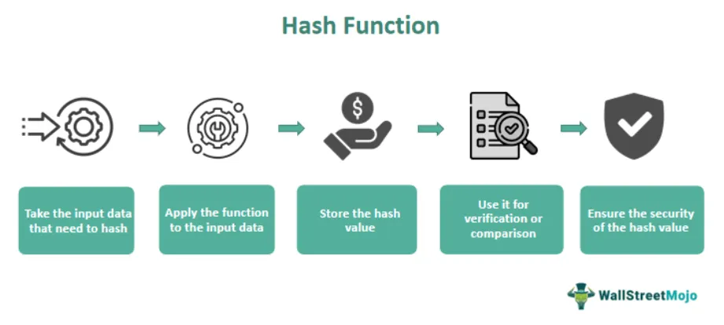

Blockchain technology has rapidly evolved since its inception, profoundly transforming various industries by enabling secure, transparent, and decentralized systems. Breaking free from traditional centralized frameworks, blockchain promotes enhanced efficiency and trust in sectors such as finance, healthcare, supply chain management, and more. One of the most significant developments is the advent of blockchain gaming—a fusion of entertainment and technology that is reshaping the digital landscape.

Blockchain gaming stands out by incorporating decentralized principles into the gaming environment, permitting true ownership and control over digital assets through the use of Non-Fungible Tokens (NFTs). Unlike traditional gaming assets, which are usually confined to closed ecosystems, NFTs provide unique properties such as verifiable ownership and provable scarcity. These digital assets are stored on the blockchain, allowing gamers to own, trade, and even profit from their in-game items. By introducing a layer of economic incentives, NFTs are enriching the gaming experience, offering unprecedented opportunities for monetization and asset management.

Among the pioneering entities leveraging NFTs in gaming is Axie Infinity. This platform has emerged as a hallmark in the blockchain gaming sector, capitalizing on the play-to-earn model where players can earn real income through engaging gameplay. Axie Infinity not only employs NFTs for its diverse range of game assets but has also stimulated a burgeoning ecosystem of players, developers, and investors, fostering a vibrant community around its innovative concept.

The integration of NFTs in gaming has opened new frontiers, including the development of algorithmic trading within this nascent ecosystem. Algorithmic trading, traditionally used in financial markets to execute orders based on pre-set criteria, presents a compelling opportunity in NFT and gaming markets. By applying automated, data-driven trading models, participants can optimize the buying and selling of NFTs and game-related cryptocurrencies. This approach can enhance market analytics, liquidity, and efficiency, offering novel ways to navigate and benefit from the dynamic NFT landscape.

In summary, the convergence of blockchain technology and gaming, bolstered by NFTs and innovative mechanisms like algorithmic trading, underscores a significant shift in digital culture. As developers and players redefine their roles and possibilities in this new era, the potential for blockchain gaming to revolutionize the entertainment industry and create enduring impacts on global gaming culture becomes increasingly evident.

## Table of Contents

## Understanding Blockchain Gaming and NFTs

Blockchain gaming represents a transformative evolution in the gaming industry, capitalizing on decentralized networks to offer new dimensions of gameplay and asset ownership. Unlike traditional gaming, where game assets and progress are controlled by centralized authorities, blockchain gaming allows players to own, trade, and sell in-game items independently. This ownership is validated through blockchain technology, which ensures transparency and security in gaming transactions.

Non-fungible tokens, or NFTs, are pivotal to this new gaming paradigm. Defined by their uniqueness and indivisibility, NFTs are digital certificates representing ownership of a specific asset, be it art, music, or in-game items. Unlike cryptocurrencies such as Bitcoin or Ethereum, which are fungible and can be exchanged on a one-to-one basis, NFTs possess distinct characteristics that make each token unique. Their properties of scarcity, verifiable ownership, and indivisibility drive their integration into blockchain gaming, offering gamers an unprecedented level of control and interaction with their digital assets.

In blockchain gaming platforms, NFTs serve as the backbone for various elements such as characters, skins, weapons, and other in-game items. These tokens are stored on a blockchain, allowing gamers to buy, sell, and trade these digital assets not only within the game environment but also across different platforms that support the underlying blockchain. This integration propels a new economic model in gaming, wherein gamers can potentially earn real-world value through their participation.

The benefits of NFTs for gamers are substantial. They provide a mechanism for monetization through the play-to-earn model, enabling gamers to earn tokens or other cryptocurrencies through gameplay. This model allows players to generate income by engaging in gaming activities, incentivizing participation and amplifying the gaming experience. Additionally, the concept of true asset ownership afforded by NFTs empowers gamers, granting them the freedom to manage their virtual goods as they please, including selling them in secondary markets for profit.

However, blockchain gaming is not without its challenges. Scalability remains a pressing issue, as the current infrastructure of many blockchain networks can hinder the seamless experience expected in gaming environments. Network congestion and high transaction fees can pose barriers to entry, particularly in popular games with high transaction volumes. Moreover, regulatory aspects represent another pertinent challenge. The rise of digital assets in gaming necessitates a framework to address potential legal issues, including intellectual property rights, taxation, and consumer protection, which are often complex and vary significantly across jurisdictions.

In conclusion, the emergence of blockchain gaming and NFTs signifies a fundamental shift in the gaming industry, offering players more control and opportunities for monetization. While the challenges of scalability and regulation persist, ongoing technological advancements and policy development promise to address these concerns, potentially paving the way for a more integrated and expansive digital gaming ecosystem.

## Axie Infinity: A Pioneer in Blockchain Gaming

Axie Infinity is a prominent example in the blockchain gaming sector, combining elements of gaming, collectibles, and blockchain technology to create a unique economic ecosystem. Launched by Sky Mavis in 2018, Axie Infinity has grown into a popular decentralized gaming platform. It operates on the Ethereum blockchain, employing non-fungible tokens (NFTs) to represent its digital assets, including characters known as Axies, land, and other in-game items.

Axie Infinity utilizes NFTs to ensure unique ownership of these in-game assets. Each Axie is a tokenized creature that exhibits distinct characteristics and abilities, making them valuable in the game's ecosystem. Players can breed, battle, and trade these Axies, and the use of NFTs guarantees transparent asset ownership and trading.

The game's significant appeal lies in its play-to-earn model, which has had a substantial impact on the gaming community. In this model, players can earn [cryptocurrency](/wiki/cryptocurrency) by participating in the game's ecosystem, whether through battling, breeding Axies, or completing challenges. This economic framework provides players with an opportunity to monetize their time and skills, attracting a global user base, particularly in countries with limited economic opportunities. 

Success stories from Axie Infinity have highlighted the transformative potential of this model. Notable examples include players who have generated significant income through gameplay, enabling financial independence and improved livelihoods. According to reports, at its peak, Axie Infinity generated revenues exceeding $2 billion in a single year, and players could earn several times the minimum wage in regions like Southeast Asia.

The community built around Axie Infinity is robust and diverse, fostering an ecosystem of players, developers, and investors. This community-driven approach is pivotal to the game's success, with user participation extending beyond gameplay to governance and development initiatives. The DAO (Decentralized Autonomous Organization) structure enables players to contribute to the platform's evolution, enhancing its sustainability and appeal.

Axie Infinity's ecosystem is a testament to blockchain gaming's potential to integrate economic incentives within digital environments. It illustrates a shift in gaming paradigms, where players are active stakeholders contributing to the growth and governance of gaming platforms.

## Algorithmic Trading in NFT Gaming

Algorithmic trading involves using computer algorithms to execute trading strategies based on pre-defined criteria and is a prevalent practice in traditional financial markets. These algorithms are designed to monitor market conditions, identify trading opportunities, and execute buy or sell orders automatically, often without human intervention. The primary advantage of [algorithmic trading](/wiki/algorithmic-trading) is its ability to process vast amounts of market data quickly, thus enabling traders to capitalize on price discrepancies and [volatility](/wiki/volatility-trading-strategies) more effectively than manual trading methods.

In the NFT gaming market, the application of algorithmic trading presents exciting opportunities for efficiency and profit maximization. With the increasing tokenization of digital gaming assets, algorithmic systems can be deployed to trade NFTs and gaming tokens, capturing potential gains through rapid decision-making and execution. The benefits in this context include enhanced [liquidity](/wiki/liquidity-risk-premium), the ability to manage large-scale trading activities, and the potential to reduce market manipulation through consistent and unbiased trade execution.

Strategies employed in algorithmic trading of game assets and cryptocurrencies include statistical [arbitrage](/wiki/arbitrage), [trend following](/wiki/trend-following), and [market making](/wiki/market-making). Statistical arbitrage exploits price inefficiencies between correlated assets, which can be achieved through a quantitative model that identifies mispricing based on historical data. Trend following strategies focus on identifying and riding market trends, using predefined indicators such as moving averages to determine entry and [exit](/wiki/exit-strategy) points. Market making provides liquidity to the market by quoting both buy and sell prices, thus profiting from the bid-ask spread.

In the context of Axie Infinity and similar games, trading models that could be employed include [momentum](/wiki/momentum)-based strategies, where algorithms detect and exploit price movements of in-game assets, and [machine learning](/wiki/machine-learning) models that predict price changes based on historical patterns and market behaviors. For example, an algorithm could be programmed to identify when the price of Axie NFTs is likely to rise due to in-game events or updates, enabling traders to make timely purchases or sales.

However, the use of algorithmic trading in NFT gaming is not without risks and ethical concerns. The volatility of gaming assets and the lack of historical data pose significant challenges to the reliability of algorithmic models. Additionally, there are concerns about the potential for unfair advantage and market manipulation, where sophisticated algorithms could be used to exploit less-informed participants. This raises questions about fairness and the need for regulatory oversight to ensure a level playing field. Furthermore, the ethical implications of employing algorithms purely for profit in a game environment, where the social and cultural aspects are critical, cannot be overlooked.

In summary, while algorithmic trading offers substantial benefits in terms of efficiency and potential returns in the NFT gaming market, it also requires careful consideration of legal, ethical, and technical challenges to ensure its fair and sustainable integration into this rapidly evolving ecosystem.

## Future Prospects of Blockchain Gaming and NFTs

The blockchain gaming industry is poised for significant growth, driven by increasing adoption and technological advancements. As blockchain technology continues to mature, the prospects for gaming within this framework are becoming more pronounced, allowing for innovative developments that can revolutionize the sector.

**Growth Potential of Blockchain Gaming**

Blockchain gaming offers unique features such as enhanced security, transparency, and true ownership of digital assets. These elements contribute to the projection of substantial market growth. According to industry reports, the blockchain gaming market is anticipated to grow rapidly due to these benefits, coupled with an increasing interest in decentralized applications. The integration of blockchain into gaming not only enhances user experiences but also opens up new economic models like play-to-earn, which are becoming increasingly popular.

**Future Trends and Technological Advancements**

Emerging technologies are expected to reshape the blockchain gaming landscape. Improvements in blockchain scalability, such as layer-2 solutions and advancements in consensus algorithms, will likely address current challenges related to transaction speed and cost. As these technologies evolve, they will facilitate more seamless gaming experiences, expand the possibilities for game developers, and increase accessibility for a broader audience.

Artificial intelligence (AI) and machine learning (ML) are expected to play a pivotal role in future gaming. By incorporating AI, games can offer more personalized experiences and sophisticated in-game economics, enhancing player engagement and satisfaction.

**Evolution and Contribution of NFTs**

Non-fungible tokens (NFTs) are central to the growth of blockchain gaming due to their ability to verify ownership and provenance of digital assets. In the future, NFTs could evolve to include more complex attributes, allowing for richer interactions and more diversified asset portfolios within games.

Furthermore, NFTs hold the potential to branch into other entertainment sectors beyond gaming. They could enable new forms of media, interactive storytelling, and even virtual reality experiences, creating an interconnected ecosystem of digital entertainment.

**Regulation and Security Measures**

The advancement of blockchain gaming and NFTs will inevitably attract regulatory scrutiny. Regulators are likely to focus on aspects such as consumer protection, intellectual property rights, and the transparency of market operations. The implementation of clear regulatory frameworks will be crucial in fostering innovation while safeguarding user interests.

Security will remain a paramount concern as the sector grows. Developers and platforms will need to prioritize robust security measures to protect against hacking and fraud, ensuring the integrity of both digital assets and the platforms themselves.

**Role of Communities and Developers**

The sustainability of blockchain gaming ecosystems heavily relies on active and engaged communities, alongside dedicated developers. Community-driven initiatives can fuel innovation and drive the adoption of new technologies, providing valuable feedback and content creation that expand the game universe. 

Developers, on the other hand, are tasked with pushing technological boundaries and ensuring the stability and usability of blockchain platforms. Their contributions are essential in enhancing the scalability and efficiency of games, paving the way for mass adoption.

In conclusion, the future of blockchain gaming and NFTs appears promising, with considerable potential for technological innovation and market growth. As the industry evolves, it will require a balanced approach that embraces innovation while adhering to regulatory standards to thrive sustainably in the global digital entertainment landscape.

## Conclusion

Blockchain gaming and NFTs have paved the way for innovative transformations in the digital entertainment landscape. By leveraging the core principles of blockchain technology, this new gaming paradigm emphasizes decentralized ownership, with NFTs providing gamers unique assets that are both scarce and verifiable. This evolution not only redefines how players engage with games but also offers opportunities for monetization and genuine asset ownership, setting a precedent for future developments in the sector.

Algorithmic trading, typically associated with financial markets, emerges as a significant enhancer in the NFT gaming space. Its adaptative strategies contribute to optimizing the valuation and liquidity of NFTs, thus intensifying economic activities within gaming ecosystems. The ability to predict market trends and automate transactions could potentially maximize the benefits for both traders and gamers, emphasizing its sizable impact on the digital commodity marketplace.

Future exploration and investment in blockchain gaming projects are highly encouraged given the current trajectory. As the technology matures, there is an evident opportunity for stakeholders—from developers to investors—to push boundaries and innovate beyond current limitations. This proactive involvement is crucial to sustain momentum and address challenges like scalability and regulatory compliance.

The long-term impact of blockchain gaming and NFTs on global gaming culture holds transformative potential. As these innovations continue to integrate with our digital lives, they promise to fundamentally alter social interactions, economies, and entertainment consumption patterns. Embracing these changes, while being mindful of ethical and security implications, is essential as the gaming industry embarks on this unprecedented journey of evolution and discovery.

## References & Further Reading

[1]: Castronova, E. (2005). ["Synthetic Worlds: The Business and Culture of Online Games"](https://archive.org/details/syntheticworlds00edwa). University of Chicago Press.

[2]: Dapp, T. F., & Kappus, T. (2021). ["The Future of Blockchain Gaming: Assessing the global potential of blockchain-based games to reshape the gaming landscape."](https://www.dbresearch.com/PROD/RPS_EN-PROD/PROD0000000000529116/The_Future_of_Blockchain_Gaming__How_blockchain_t.pdf). Deutsche Bank Research.

[3]: Haber, S., & Stornetta, W. S. (1991). ["How to Time-Stamp a Digital Document"](https://link.springer.com/article/10.1007/BF00196791). Journal of Cryptology, 3, 99–111.

[4]: Wood, G. (2014). ["Ethereum: A Secure Decentralised Generalised Transaction Ledger"](https://ethereum.github.io/yellowpaper/paper.pdf). Ethereum Project Yellow Paper.

[5]: Zadeh, A. H., Hengartner, U., & Goldberg, I. (2021). ["Decentralized Game Design in Blockchain Ecosystems."](https://scholar.google.com/citations?user=S6H-0RAAAAAJ) Proceedings of the 20th ACM Workshop on Privacy in the Electronic Society.

[6]: Tapscott, D., & Tapscott, A. (2018). ["Blockchain Revolution: How the Technology Behind Bitcoin and Other Cryptocurrencies is Changing the World"](https://www.amazon.com/Blockchain-Revolution-Technology-Cryptocurrencies-Changing/dp/1101980141). Penguin Books.

[7]: CoinDesk Research (2021). ["NFTs — Trends and Opportunities in Digital Art and Gaming"](https://www.coindesk.com/research/). CoinDesk.