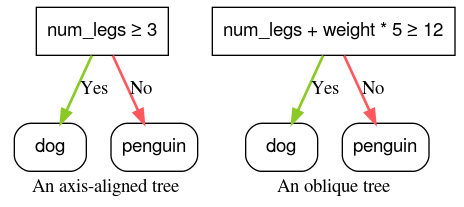

## Table of Contents

## What is an Axis-Aligned Condition in the context of machine learning?

An Axis-Aligned Condition in machine learning refers to a type of decision rule used in decision trees and other similar algorithms. It is called "axis-aligned" because it involves making a decision based on a single feature or attribute at a time. For example, if you're trying to decide whether an email is spam or not, an axis-aligned condition might be something like "if the number of exclamation marks in the email is greater than 5, then classify it as spam." This means the decision boundary is parallel to the axes of the feature space, hence the term "axis-aligned."

These conditions are simple and easy to interpret, which makes them popular in many decision tree algorithms. They work by splitting the data along one feature at a time, which can be visualized as drawing a line perpendicular to one of the axes in a graph. While axis-aligned conditions are straightforward, they can sometimes struggle with more complex data patterns that are not aligned with the axes. In such cases, more advanced techniques like oblique decision trees, which allow for decision boundaries at any angle, might be more effective.

## How does an Axis-Aligned Condition differ from other types of conditions in decision trees?

An Axis-Aligned Condition in decision trees is a simple rule that looks at just one feature at a time to make a decision. Imagine you're sorting fruits into apples and oranges. An axis-aligned condition might be something like "if the fruit is red, it's an apple." This means you're drawing a line to separate the fruits based on their color, and this line is straight up and down, or parallel to the axes on a graph. These conditions are easy to understand and work well when the data naturally separates along one feature.

Other types of conditions, like oblique conditions, are more complex. Instead of looking at just one feature, they can look at a combination of features to make a decision. For example, an oblique condition might say "if the fruit is red and round, it's an apple." This allows for more flexible decision boundaries that can be at any angle, not just parallel to the axes. While these conditions can be more powerful and better at handling complex data, they can also be harder to interpret and might take more time to compute.

In summary, axis-aligned conditions are simpler and easier to understand but might not capture all the patterns in the data. Oblique conditions, on the other hand, can capture more complex patterns but are more complicated to use and interpret. The choice between them depends on the specific problem and the trade-offs you're willing to make between simplicity and accuracy.

## Can you explain the concept of axis alignment in feature space?

Axis alignment in feature space is a way to describe how we split data in [machine learning](/wiki/machine-learning). Imagine you have a graph where each point represents a piece of data, and the axes of the graph represent different features of that data. For example, if you're looking at houses, one axis might represent the size of the house, and another axis might represent the price. When we talk about axis alignment, we mean drawing a line to split the data, and this line goes straight up and down or straight left to right, parallel to the axes of the graph. This is called an axis-aligned split because it follows the direction of the axes.

This type of split is simple and easy to understand. If you're trying to decide whether a house is expensive or not, you might draw a line at a certain price point and say all houses above this line are expensive. This line would be parallel to the size axis, so it's an axis-aligned split. While this method works well for many situations, it can struggle with data that doesn't separate neatly along the axes. In such cases, more complex methods that allow for splits at any angle might be needed, but they are harder to interpret and compute.

## What are the advantages of using Axis-Aligned Conditions in decision tree algorithms?

Axis-Aligned Conditions in decision tree algorithms are easy to understand and use. When you make a decision based on just one feature at a time, like deciding if a fruit is an apple by checking if it's red, it's simple for people to follow along. This makes the decision tree easy to explain to others. Also, these conditions are quick to calculate because they only need to look at one piece of information at a time. This can make the whole process of building and using the decision tree faster, which is helpful when you have a lot of data.

Another advantage is that Axis-Aligned Conditions work well with many types of data. For example, if you're trying to sort animals into groups based on their size and weight, an axis-aligned split might be to say all animals over 100 pounds go into one group. This type of split can often capture the main differences in the data without needing more complex rules. While these conditions might not be perfect for every situation, they are a good starting point and can handle a lot of common problems effectively.

## How do Axis-Aligned Conditions impact the interpretability of a decision tree model?

Axis-Aligned Conditions make decision tree models easier to understand. When a decision tree uses these conditions, it makes decisions based on one feature at a time. For example, if you're sorting fruits, the tree might say, "If the fruit is red, it's an apple." This is simple and clear because people can easily follow the logic of checking one thing at a time. It's like following a recipe where each step is straightforward and easy to understand.

This simplicity also helps when you need to explain the model to others. If someone asks why a certain decision was made, you can point to a specific rule in the tree, like "The email was classified as spam because it had more than 5 exclamation marks." This makes the decision tree more transparent and trustworthy, as people can see exactly how decisions are being made. While more complex conditions might capture more details in the data, the ease of understanding Axis-Aligned Conditions often makes them a good choice for many applications.

## What are the potential limitations or drawbacks of using Axis-Aligned Conditions?

One limitation of using Axis-Aligned Conditions is that they might not be able to capture more complex patterns in the data. Imagine you're trying to separate two types of flowers based on their petal length and width. If the best way to separate them is with a diagonal line, an Axis-Aligned Condition can't do that because it only draws lines straight up and down or left to right. This means the decision tree might not be as accurate as it could be if it used more flexible conditions.

Another drawback is that Axis-Aligned Conditions can sometimes create more splits than necessary. For example, if you're trying to sort animals into groups based on their size and weight, and the best split is actually a diagonal line, using Axis-Aligned Conditions might mean you need to make several splits along the size and weight axes to get close to the same result. This can make the decision tree bigger and more complicated, even though each individual rule is simple.

## How can Axis-Aligned Conditions be implemented in a decision tree algorithm?

To implement Axis-Aligned Conditions in a decision tree algorithm, you start by choosing a feature to split on. This means you look at each feature one at a time and see how well splitting on that feature separates your data into different groups. For example, if you're sorting fruits into apples and oranges, you might look at the color feature and decide to split the data into red fruits and non-red fruits. You then calculate how good this split is using a measure like Gini impurity or entropy. If the split makes the groups more pure (meaning they contain more of one type of fruit), you might choose that split.

Once you've chosen the best feature to split on, you need to decide where to draw the line. This means finding the best value of the feature to split at. For the color feature, you might decide that fruits with a redness value above a certain threshold go into one group, and the rest go into another. You keep doing this, choosing the best feature and the best split value at each step, until you reach a stopping condition, like the tree getting too deep or the groups becoming pure enough. This way, you build a decision tree that uses simple, axis-aligned splits to classify your data.

Here's a simple example of how this might look in Python code:

```python
import numpy as np

class DecisionTree:
    def __init__(self, max_depth=None):
        self.max_depth = max_depth

    def fit(self, X, y):
        self.n_features = X.shape[1]
        self.tree = self._grow_tree(X, y)

    def _grow_tree(self, X, y, depth=0):
        n_samples, n_features = X.shape
        n_classes = len(np.unique(y))

        # Stopping conditions
        if (depth >= self.max_depth or n_classes == 1 or n_samples < 2):
            leaf_value = self._most_common_label(y)
            return leaf_value

        # Find the best split
        best_feature, best_threshold = self._best_split(X, y)

        # Create child nodes
        left_idxs = X[:, best_feature] < best_threshold
        right_idxs = ~left_idxs

        left = self._grow_tree(X[left_idxs], y[left_idxs], depth + 1)
        right = self._grow_tree(X[right_idxs], y[right_idxs], depth + 1)

        return {'feature': best_feature, 'threshold': best_threshold, 'left': left, 'right': right}

    def _best_split(self, X, y):
        best_gain = -1
        split_idx, split_threshold = None, None

        for feature_idx in range(self.n_features):
            thresholds = np.unique(X[:, feature_idx])
            for threshold in thresholds:
                gain = self._information_gain(y, X[:, feature_idx], threshold)

                if gain > best_gain:
                    best_gain = gain
                    split_idx = feature_idx
                    split_threshold = threshold

        return split_idx, split_threshold

    def _information_gain(self, y, X_column, threshold):
        # Calculate the information gain for a given split
        parent_entropy = self._entropy(y)

        left_idxs = X_column < threshold
        right_idxs = ~left_idxs

        n = len(y)
        n_left, n_right = sum(left_idxs), sum(right_idxs)

        if n_left == 0 or n_right == 0:
            return 0

        child_entropy = (n_left / n) * self._entropy(y[left_idxs]) + (n_right / n) * self._entropy(y[right_idxs])

        return parent_entropy - child_entropy

    def _entropy(self, y):
        # Calculate the entropy of a set of labels
        hist = np.bincount(y)
        ps = hist / len(y)
        return -np.sum([p * np.log2(p) for p in ps if p > 0])

    def _most_common_label(self, y):
        # Find the most common label in a set of labels
        return np.bincount(y).argmax()

    def predict(self, X):
        return [self._traverse_tree(x, self.tree) for x in X]

    def _traverse_tree(self, x, node):
        if isinstance(node, dict):
            if x[node['feature']] < node['threshold']:
                return self._traverse_tree(x, node['left'])
            else:
                return self._traverse_tree(x, node['right'])
        else:
            return node
```

This code shows how you can create a decision tree that uses Axis-Aligned Conditions to split the data. It starts by finding the best feature and threshold to split on at each step, and then it builds the tree by recursively splitting the data until it reaches a stopping condition.

## What role do Axis-Aligned Conditions play in the splitting criteria of decision trees?

Axis-Aligned Conditions are important in decision trees because they help decide how to split the data. When you want to sort things into different groups, like separating apples from oranges, you look at one feature at a time. For example, you might check the color of the fruit. If the fruit is red, you put it in one group, and if it's not red, you put it in another group. This way of splitting is called an Axis-Aligned Condition because it's like drawing a line straight up and down or left to right on a graph, which follows the direction of the axes.

The decision tree uses these conditions to find the best way to split the data. It looks at each feature and tries different values to see which split makes the groups more pure, meaning each group has more of one type of fruit. For example, if splitting on color makes the groups more pure than splitting on size, the tree will choose to split on color. This process keeps going until the tree is done, and each split is based on a simple, easy-to-understand rule that checks one feature at a time.

## How do Axis-Aligned Conditions affect the computational complexity of training a decision tree?

Axis-Aligned Conditions make training a decision tree easier and faster. When you split the data, you only look at one feature at a time. This means you don't have to think about combining different features, which can be hard and take a lot of time. Because you're just checking one thing at each split, the computer can do the calculations quickly. This is good when you have a lot of data to sort through.

However, there's a trade-off. Sometimes, the data might be better split using a more complex rule that looks at more than one feature. But Axis-Aligned Conditions can't do that, so you might need more splits to get the same result. This can make the tree bigger and take more steps to build. Even though each step is simple, having more steps can still slow things down a bit. So, while Axis-Aligned Conditions make each split easier, they might not always find the best way to split the data in the fewest steps.

## Can Axis-Aligned Conditions be used effectively in high-dimensional data sets?

Axis-Aligned Conditions can be used in high-dimensional data sets, but they have some challenges. In high-dimensional spaces, the data points are spread out more, which can make it harder to find good splits using just one feature at a time. Imagine trying to sort a bunch of different colored balls in a big room. If you can only sort them based on one color at a time, it might take a lot of steps to get them all sorted correctly. This means the decision tree might need to be very deep, which can make it slower to train and more complex to understand.

Despite these challenges, Axis-Aligned Conditions are still useful because they are simple and easy to compute. Even in high-dimensional data, looking at one feature at a time can help find patterns that are clear and easy to understand. For example, if you're sorting emails into spam and not spam, checking the number of exclamation marks in the subject line might be a good first step, even if there are many other features to consider. So, while Axis-Aligned Conditions might not be perfect for every high-dimensional problem, they can still be a good starting point and work well in many cases.

## What are some advanced techniques for optimizing the use of Axis-Aligned Conditions in machine learning models?

One advanced technique for optimizing the use of Axis-Aligned Conditions is to use feature selection methods. These methods help pick the most important features to look at when splitting the data. By focusing on the most useful features, the decision tree can make better splits and be more accurate. For example, if you're sorting emails into spam and not spam, you might find that the number of exclamation marks and the presence of certain words are the most important features. By using feature selection, you can make sure the decision tree looks at these features first, which can make the tree smaller and easier to understand.

Another technique is to use ensemble methods like Random Forests. In a Random Forest, you build many decision trees and then combine their predictions. Each tree might use Axis-Aligned Conditions, but because you're using many trees, you can capture more complex patterns in the data. This can help overcome some of the limitations of using just one feature at a time. For example, if one tree splits on the number of exclamation marks and another tree splits on the presence of certain words, together they can do a better job of sorting emails into spam and not spam. This way, you can still use the simple and fast Axis-Aligned Conditions but get better overall results.

## How have Axis-Aligned Conditions been applied in real-world machine learning problems, and what were the outcomes?

Axis-Aligned Conditions have been used in many real-world machine learning problems, especially in areas like healthcare and finance. For example, in healthcare, decision trees using Axis-Aligned Conditions help doctors predict whether a patient has a certain disease based on simple tests like blood pressure or cholesterol levels. A study showed that these simple conditions could identify patients at risk for heart disease with good accuracy. The doctors liked using these trees because they were easy to explain to patients, making it clear why certain treatments were recommended.

In the finance industry, Axis-Aligned Conditions have been used to detect fraud in credit card transactions. By looking at one feature at a time, like the amount of the transaction or the location of the purchase, decision trees can quickly flag suspicious activities. A bank found that using these conditions helped them catch more fraud cases than before, and the system was fast enough to work in real-time. Even though the conditions were simple, they were effective because they focused on the most important features that often indicate fraud.

Overall, Axis-Aligned Conditions have proven to be valuable in real-world applications because they are easy to understand and quick to compute. While they might not capture every detail in complex data, their simplicity and effectiveness make them a popular choice in many fields.