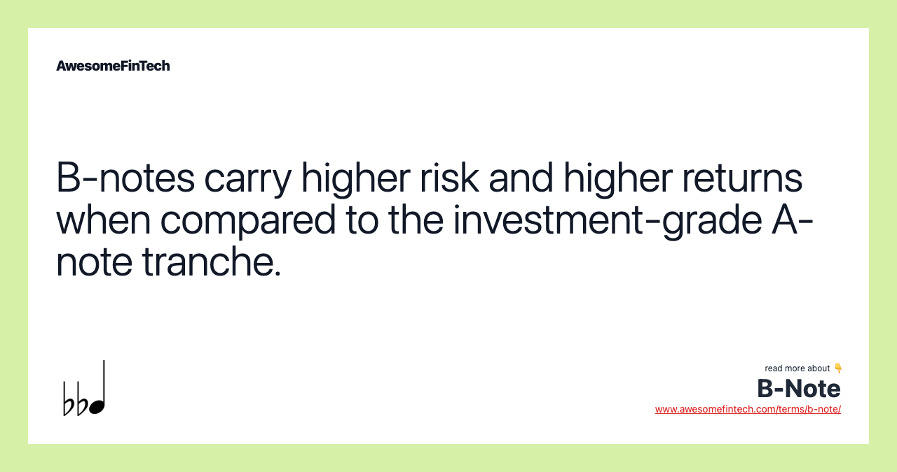

## Table of Contents

## What is a B-Note?

A B-Note is a type of loan that comes after the main loan, called the A-Note, in a commercial real estate deal. When someone wants to borrow money to buy a big building or property, they might get money from different lenders. The A-Note is the first loan they get, and it's the most important one. The B-Note is like a backup loan that comes second. If the borrower can't pay back the A-Note, the lender of the A-Note gets paid first from any money made by selling the property.

The B-Note usually has a higher interest rate than the A-Note because it's riskier. Since the B-Note lender gets paid after the A-Note lender, there's a bigger chance they might not get all their money back if the property doesn't do well. B-Notes can be a good way for investors to make more money if they are willing to take on more risk. They are often used in big real estate deals to help borrowers get the total amount of money they need.

## How does a B-Note differ from an A-Note?

An A-Note and a B-Note are both loans used in big real estate deals, but they are different in some important ways. The A-Note is the main loan that gets paid back first if the borrower can't pay. It's less risky for the lender because they get their money before anyone else. Because it's safer, the A-Note usually has a lower interest rate. The borrower gets the A-Note first when they need money to buy a big building or property.

The B-Note, on the other hand, is a secondary loan that comes after the A-Note. If the borrower can't pay back the loans, the B-Note lender only gets paid after the A-Note lender has been paid in full. This makes the B-Note riskier, so it usually has a higher [interest rate](/wiki/interest-rate-trading-strategies) to make up for that risk. B-Notes help borrowers get the extra money they need, but they are more of a gamble for the lender because they might not get all their money back if things go wrong with the property.

## What are the typical features of a B-Note?

A B-Note is a type of loan that comes after the A-Note in a big real estate deal. It's like a backup loan that helps the borrower get more money to buy a building or property. The B-Note is riskier for the lender because if the borrower can't pay back the loans, the B-Note lender only gets paid after the A-Note lender gets all their money back. Because it's riskier, the B-Note usually has a higher interest rate than the A-Note.

B-Notes can be a good way for investors to make more money if they're willing to take on more risk. They help borrowers get the total amount of money they need for big projects. But if the property doesn't do well, the B-Note lender might not get all their money back. This makes B-Notes an important part of real estate financing, but they come with more uncertainty than A-Notes.

## Who are the primary investors in B-Notes?

The primary investors in B-Notes are often big investors who know a lot about real estate. These investors might be banks, insurance companies, or special funds that focus on real estate investments. They like B-Notes because they can make more money from the higher interest rates, even though it's riskier.

Sometimes, other investors like private equity firms or wealthy people also invest in B-Notes. They are looking for ways to make their money grow faster than with safer investments. They understand that B-Notes are riskier, but they think the chance to make more money is worth it.

## How is the interest rate determined for a B-Note?

The interest rate for a B-Note is usually higher than the rate for an A-Note. This is because B-Notes are riskier for lenders. If the borrower can't pay back the loans, the B-Note lender only gets their money after the A-Note lender gets paid first. To make up for this extra risk, the B-Note lender charges a higher interest rate.

The exact interest rate for a B-Note depends on a few things. These include how risky the real estate project is, how well the borrower can pay back the loan, and what's happening in the overall economy. Lenders look at these factors to decide what rate is fair for the risk they are taking. If the project is very risky or the borrower's finances are not strong, the interest rate will be higher to make the loan more attractive to investors.

## What are the risks associated with investing in B-Notes?

Investing in B-Notes can be risky because they are second in line to get paid back. If the borrower can't pay back the loans, the B-Note lender only gets money after the A-Note lender gets all their money first. This means there's a bigger chance that the B-Note lender might not get all their money back if the property doesn't do well. The higher interest rate on B-Notes is there to make up for this risk, but it doesn't guarantee that the lender will get paid in full.

Another risk with B-Notes is that they depend a lot on how well the real estate market is doing. If the market goes down, the value of the property might drop, and it could be harder to sell it for enough money to pay back both the A-Note and the B-Note. Also, if the borrower's financial situation gets worse, they might not be able to keep up with the payments on the B-Note. This makes B-Notes a good choice for investors who are willing to take on more risk for the chance to make more money, but it's important to understand these risks before investing.

## How does the subordination structure work in B-Notes?

In big real estate deals, loans are often split into different parts, like A-Notes and B-Notes. The A-Note is the main loan that gets paid back first if the borrower can't pay. The B-Note is a second loan that only gets paid after the A-Note is paid off completely. This way of organizing the loans is called subordination, and it means the B-Note is below the A-Note in line to get paid.

Because the B-Note is paid back after the A-Note, it's riskier for the B-Note lender. If the borrower can't pay and the property has to be sold, the money from the sale goes to the A-Note lender first. Only if there's money left over does it go to the B-Note lender. This is why B-Notes usually have a higher interest rate, to make up for the extra risk.

## What are the common terms and conditions of a B-Note?

B-Notes are loans that come after the main loan, called the A-Note, in a big real estate deal. They help the borrower get more money to buy a building or property. The B-Note has to be paid back after the A-Note, which means it's riskier for the lender. Because of this, B-Notes usually have a higher interest rate than A-Notes. The exact interest rate depends on how risky the project is, how well the borrower can pay back the loan, and what's happening in the economy.

The terms and conditions of a B-Note can also include things like how long the borrower has to pay back the loan, called the term, and what happens if they can't pay. If the borrower doesn't pay, the B-Note lender might be able to take over the property, but only after the A-Note lender gets their money first. The B-Note might also have rules about what the borrower can do with the property, like not being able to sell it without the lender's okay. These terms help protect the lender, but they also make B-Notes a riskier investment than A-Notes.

## How are B-Notes regulated under current financial laws?

B-Notes are part of big real estate deals and are regulated by laws that control how loans work. In the United States, the main laws that affect B-Notes are the Dodd-Frank Act and the rules set by the Securities and Exchange Commission (SEC). These laws make sure that lenders and investors follow certain rules to protect everyone involved. For example, they have to be clear about how risky the B-Note is and make sure the borrower can pay it back.

Another important set of rules comes from the state where the property is located. Each state has its own laws about real estate and loans, so the rules for B-Notes can be different depending on where the property is. These state laws might say things like how much interest can be charged or what happens if the borrower can't pay. It's important for lenders and investors to know these rules to make sure they are doing everything the right way.

## What role do B-Notes play in commercial real estate financing?

B-Notes are important in big real estate deals because they help borrowers get more money to buy a building or property. When someone wants to buy a big piece of real estate, they might not get all the money they need from just one loan. So, they get an A-Note first, which is the main loan. Then, they get a B-Note, which is like a backup loan that comes after the A-Note. This way, the borrower can put together enough money to make the deal happen.

The B-Note is riskier for the lender because if the borrower can't pay back the loans, the B-Note lender only gets their money after the A-Note lender gets all their money first. Because it's riskier, the B-Note usually has a higher interest rate. This higher interest rate makes B-Notes attractive to investors who are willing to take on more risk for the chance to make more money. B-Notes are a key part of how big real estate deals are financed, helping to bridge the gap between what the borrower needs and what the main loan can provide.

## How can an investor assess the performance of a B-Note?

An investor can assess the performance of a B-Note by looking at how well the borrower is paying back the loan. If the borrower is making all their payments on time, that's a good sign that the B-Note is doing well. The investor should also check the value of the property that the loan is for. If the property's value is going up, it means there's a better chance the B-Note will be paid back in full if the property has to be sold.

Another way to assess the performance of a B-Note is by looking at the interest rate and how it compares to other investments. Since B-Notes have a higher interest rate because they're riskier, the investor should see if the rate is high enough to make up for the risk. The investor should also keep an eye on the real estate market and the economy. If things are going well, the B-Note is likely to perform better. But if the market or economy is struggling, the B-Note might be riskier.

## What are the advanced strategies for managing a portfolio of B-Notes?

Managing a portfolio of B-Notes involves looking at how well each B-Note is doing and making smart choices about what to do with them. One advanced strategy is to spread out the risk by investing in B-Notes for different kinds of properties in different places. This way, if one property doesn't do well, the other B-Notes might still be okay. Another strategy is to keep an eye on the real estate market and the economy. If things start to look bad, the investor might decide to sell some B-Notes before they lose too much value. Also, it's important to check how well the borrowers are paying back the loans. If a borrower is having trouble, the investor might need to work with them to find a solution or think about selling the B-Note to someone else.

Another strategy is to use what's called a "trading strategy." This means buying and selling B-Notes to make money from changes in their value. For example, if the investor thinks a B-Note's value will go up, they might buy it and then sell it later for more money. Or, if they think the value will go down, they might sell it before it loses too much value. This can be tricky because it involves guessing what will happen in the future, but it can be a way to make money if done right. Keeping a close eye on the interest rates and how they compare to other investments is also important. If the interest rates on B-Notes go up, it might be a good time to buy more of them. If they go down, it might be better to sell some and invest in something else.

## References & Further Reading

[1]: ["The Dodd-Frank Act: Key Provisions and Implications"](https://www.investopedia.com/terms/d/dodd-frank-financial-regulatory-reform-bill.asp) by Council on Foreign Relations

[2]: ["Algorithmic and High-Frequency Trading"](https://assets.cambridge.org/97811070/91146/frontmatter/9781107091146_frontmatter.pdf) by Álvaro Cartea, Sebastian Jaimungal, and José Penalva

[3]: ["Advances in Financial Machine Learning"](https://www.amazon.com/Advances-Financial-Machine-Learning-Marcos/dp/1119482089) by Marcos Lopez de Prado

[4]: ["High-Frequency Trading: A Practical Guide to Algorithmic Strategies and Trading Systems"](https://www.ahmetbeyefendi.com/wp-content/uploads/2020/07/High-Frequency-Trading-Irene-Aldridge.pdf) by Irene Aldridge

[5]: ["Understanding the Securitization of Subprime Mortgage Credit"](https://www.newyorkfed.org/research/staff_reports/sr318.html) by Adam B. Ashcraft and Til Schuermann, National Bureau of Economic Research

[6]: ["U.S. Risk Retention Rules: An Overview"](https://www.morganlewis.com/pubs/2024/07/a-guide-to-the-credit-risk-retention-rules) by Securities and Exchange Commission

[7]: ["Quantitative Trading: How to Build Your Own Algorithmic Trading Business"](https://www.amazon.com/Quantitative-Trading-Build-Algorithmic-Business/dp/1119800064) by Ernest P. Chan