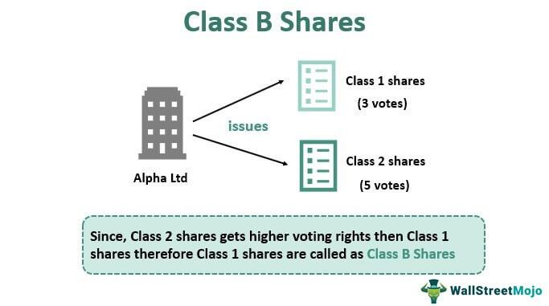

## Table of Contents

## What is a B-Share?

A B-Share is a type of mutual fund share that usually has different fees and expenses compared to other share classes, like A-Shares or C-Shares. B-Shares often do not charge a front-end sales load, which means you don't pay a fee when you buy them. However, they might have a back-end load, also known as a contingent deferred sales charge (CDSC), which you pay if you sell the shares within a certain period after buying them.

These shares can also have higher ongoing expenses, like 12b-1 fees, which are used for marketing and distribution costs. Over time, these fees can add up and affect your overall returns. Because of these differences, B-Shares might be suitable for investors who plan to hold their investments for a longer period and want to avoid upfront costs. It's important to understand the specific fee structure of B-Shares before investing, as it can impact your investment's performance.

## How do B-Shares differ from A-Shares and C-Shares?

B-Shares, A-Shares, and C-Shares are different types of mutual fund shares, each with its own fee structure. B-Shares usually don't charge a front-end sales load, which means you don't pay a fee when you buy them. Instead, they might have a back-end load, called a contingent deferred sales charge (CDSC), which you pay if you sell the shares soon after buying them. B-Shares can also have higher ongoing expenses, like 12b-1 fees, which are used for marketing and distribution. These fees can add up over time and affect your returns. B-Shares might be good for people who want to avoid upfront costs and plan to keep their investment for a longer time.

A-Shares, on the other hand, often have a front-end sales load, which means you pay a fee when you buy them. This fee can be a percentage of your investment. A-Shares might have lower ongoing expenses compared to B-Shares, making them potentially more cost-effective for long-term investors. They can also offer breakpoints, which means the more you invest, the lower the sales load might be. A-Shares could be a good choice if you're planning to invest a large amount and hold onto it for a long time.

C-Shares typically don't have a front-end sales load like A-Shares, but they might have a small back-end load if you sell them within a short period, similar to B-Shares. However, C-Shares often have higher ongoing expenses, including 12b-1 fees, compared to A-Shares. Unlike B-Shares, C-Shares usually don't convert to a lower-cost share class over time. C-Shares might be suitable for people who want flexibility and plan to hold their investment for a shorter period, as the back-end load decreases over time and eventually disappears.

## What is the typical fee structure for B-Shares?

B-Shares usually don't have a front-end sales load. This means you don't pay a fee when you buy them. Instead, they might have a back-end load, which is called a contingent deferred sales charge (CDSC). You pay this fee if you sell your B-Shares within a certain time after buying them. The fee can go down the longer you hold onto your shares, and it might disappear completely after a few years.

B-Shares also have higher ongoing expenses compared to other share classes. These expenses can include 12b-1 fees, which are used for marketing and distribution costs. These fees can add up over time and affect how much money you make from your investment. Because of this, B-Shares might be a good choice if you plan to keep your investment for a long time and want to avoid paying fees upfront.

## How does the mechanism of B-Shares work in mutual funds?

B-Shares in mutual funds work by not charging you a fee when you buy them. This is different from A-Shares, which do charge a fee when you buy them. Instead, B-Shares might charge you a fee if you sell them soon after buying them. This fee is called a back-end load or a contingent deferred sales charge (CDSC). The longer you keep your B-Shares, the less this fee becomes, and after a few years, it might go away completely.

B-Shares also have ongoing costs that you pay as long as you own them. These costs can include 12b-1 fees, which are used to pay for marketing and selling the mutual fund. These ongoing costs are usually higher for B-Shares than for other types of shares. Because of this, B-Shares might be a good choice if you plan to keep your investment for a long time and want to avoid paying fees when you buy the shares.

## What are the advantages of investing in B-Shares?

One advantage of investing in B-Shares is that you don't have to pay a fee when you buy them. This means you can start investing without any upfront costs, which can be helpful if you want to put all your money into the investment right away. B-Shares are good for people who plan to keep their money invested for a long time because the fees you might have to pay if you sell them go down the longer you hold onto them.

Another advantage is that B-Shares can be a good choice if you want to avoid the ongoing costs that come with other types of shares, like A-Shares. While B-Shares do have higher ongoing expenses, these costs might be worth it if you're planning to hold your investment for many years. Over time, the benefits of not paying a fee upfront and having lower or no back-end fees can outweigh the higher ongoing costs.

## What are the potential drawbacks of B-Shares?

One potential drawback of B-Shares is that they have higher ongoing costs compared to other types of shares. These costs, like 12b-1 fees, can add up over time and reduce the amount of money you make from your investment. If you don't plan to keep your investment for a long time, these higher fees might not be worth it.

Another issue with B-Shares is that they might charge you a fee if you sell them soon after buying them. This fee, called a back-end load or contingent deferred sales charge (CDSC), can make it expensive to change your mind about your investment. If you need to take your money out early, this fee could be a big problem.

## How do back-end loads affect B-Share investments?

Back-end loads, also called contingent deferred sales charges (CDSC), can affect B-Share investments by making it costly to sell them soon after you buy them. If you need to take your money out early, you might have to pay a fee. This fee can be a percentage of the money you invested, and it can go down the longer you keep your B-Shares. If you sell your B-Shares within the first year, the fee might be high, but it gets smaller each year until it goes away completely after a few years.

Because of these back-end loads, B-Shares might not be the best choice if you think you might need to get your money out quickly. The fees can eat into your investment returns if you don't keep your money in for a long time. However, if you plan to hold onto your B-Shares for many years, the back-end load will eventually disappear, and you can avoid the upfront costs that come with other types of shares.

## Can B-Share fees change over time, and if so, how?

Yes, B-Share fees can change over time. One way they can change is with the back-end load, which is a fee you might have to pay if you sell your B-Shares soon after buying them. This fee, called a contingent deferred sales charge (CDSC), usually goes down the longer you keep your B-Shares. If you sell them within the first year, the fee might be high, but it gets smaller each year until it disappears completely after a few years.

Another way B-Share fees can change is through the ongoing expenses, like 12b-1 fees. These fees are used for marketing and selling the mutual fund, and they are charged as a percentage of your investment each year. While these fees might stay the same, the impact they have on your investment can change. If the value of your investment goes up, you'll pay more in fees, but if it goes down, you'll pay less. Over time, these fees can add up and affect how much money you make from your investment.

## What should investors consider before choosing B-Shares?

Before choosing B-Shares, investors should think about how long they plan to keep their money invested. B-Shares don't charge a fee when you buy them, which can be good if you want to avoid upfront costs. But if you might need to take your money out early, you should know about the back-end load. This is a fee you pay if you sell your B-Shares soon after buying them. The longer you keep your B-Shares, the less this fee becomes, and it might go away completely after a few years. So, if you plan to hold onto your investment for a long time, B-Shares might be a good choice.

Investors should also consider the ongoing costs of B-Shares, like 12b-1 fees. These fees are higher for B-Shares than for other types of shares, and they can add up over time. If you keep your money in B-Shares for many years, these higher ongoing costs might be worth it because you don't have to pay a fee upfront. But if you think you might need to take your money out before the back-end load goes away, the higher ongoing costs and the back-end load could make B-Shares less attractive. It's important to understand all the fees and how they might affect your investment before deciding if B-Shares are right for you.

## How does the conversion feature of B-Shares to A-Shares work?

B-Shares can sometimes turn into A-Shares after you've kept them for a certain amount of time. This is called a conversion feature. When this happens, you don't have to do anything; it just happens automatically. The reason for this change is to help you save money on fees. A-Shares usually have lower ongoing costs than B-Shares, so converting can be good for you in the long run.

The exact time when B-Shares convert to A-Shares can be different for each mutual fund. It might take a few years, like six or eight years, before the conversion happens. Once your B-Shares turn into A-Shares, you won't have to worry about the back-end load anymore, and your ongoing expenses will be lower. This can make your investment more profitable over time.

## What impact do B-Share regulations have on investors?

B-Share regulations can affect investors by making sure they know what fees they might have to pay. The rules say that mutual fund companies have to tell investors about the back-end load, which is a fee you pay if you sell your B-Shares soon after buying them. They also have to explain the ongoing costs, like 12b-1 fees, which are used for marketing and selling the mutual fund. Knowing about these fees helps investors decide if B-Shares are right for them.

These regulations also help protect investors by making sure B-Shares can turn into A-Shares after a certain time. This change, called conversion, can save investors money because A-Shares usually have lower ongoing costs. By having these rules, investors can feel more confident that they understand how B-Shares work and how they might affect their investments over time.

## How can an investor strategically use B-Shares within a diversified portfolio?

An investor can use B-Shares in a diversified portfolio to avoid paying fees upfront. If you plan to keep your money in the investment for a long time, B-Shares can be a good choice because they don't charge you when you buy them. This means you can put all your money into the investment right away, which can help your money grow more over time. B-Shares might also turn into A-Shares after a few years, which can lower your ongoing costs and make your investment even more profitable.

It's important to think about how B-Shares fit with other investments in your portfolio. If you have other investments that you might need to take money out of quickly, B-Shares might not be the best choice because of the back-end load. This is a fee you pay if you sell your B-Shares soon after buying them. But if you have a mix of investments and you're sure you can keep your B-Shares for a long time, they can help you save on fees and grow your money without worrying about upfront costs.

## References & Further Reading

[1]: Bergstra, J., Bardenet, R., Bengio, Y., & Kégl, B. (2011). ["Algorithms for Hyper-Parameter Optimization."](https://dl.acm.org/doi/10.5555/2986459.2986743) Advances in Neural Information Processing Systems 24.

[2]: ["Advances in Financial Machine Learning"](https://www.amazon.com/Advances-Financial-Machine-Learning-Marcos/dp/1119482089) by Marcos Lopez de Prado

[3]: ["Evidence-Based Technical Analysis: Applying the Scientific Method and Statistical Inference to Trading Signals"](https://www.amazon.com/Evidence-Based-Technical-Analysis-Scientific-Statistical/dp/0470008741) by David Aronson

[4]: ["Machine Learning for Algorithmic Trading"](https://github.com/stefan-jansen/machine-learning-for-trading) by Stefan Jansen

[5]: ["Quantitative Trading: How to Build Your Own Algorithmic Trading Business"](https://www.amazon.com/Quantitative-Trading-Build-Algorithmic-Business/dp/1119800064) by Ernest P. Chan